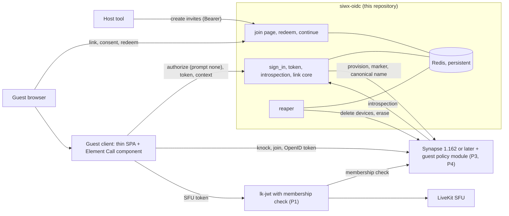

# Guest portal 00: overview

**Status:** DRAFT design set for maintainer review. Design only: no code is written or changed by it, and nothing in it deploys or touches a running system.
**Baseline:** written against siwx-oidc `origin/main` at `3547bd2` (2026-09-30). Every `path:line` citation in the set is against that commit. Upstream facts were read
from Synapse v1.161.0, lk-jwt-service 0.7.0 and Element Call v0.26.1 (documents 02 and 03 name the exact pins).

## 1. What this is

The set designs how an anonymous guest (a customer or a visitor) joins a Matrix video call by link on a Synapse homeserver whose authentication is delegated to
siwx-oidc: the flow, what Synapse can and cannot enforce, the guest client, the security limits, the claim of the account, the onboarding screens, and a plan of small
flag-off milestones. It exists because the maintainers asked for it, as the basis for a decision before any code is written. It is a draft: every position in it is a
recommendation, and section 7 of this file lists the ones that settle contradictions between the documents, so that the maintainers can overrule any of them. "Element Meet" is the
maintainers' working name for the guest client; no upstream product of that name exists (03 section 1).

## 2. Reading order

| Document | Read it for |
|---|---|
| [01 flow model](01-flow-model.md) | The journey end to end in twelve lines, trust zones, the happy path step by step, the mapping onto existing code, state machines, teardown, the configuration surface, prerequisites P1 to P9, `GP-FLOW-nn` |
| [02 Synapse validation](02-synapse-validation.md) | What Synapse and lk-jwt-service can and cannot do under delegated authentication, the restrictions a policy module must enforce, the room model, key delivery for a new device, erase semantics, open upstream topics, `GP-SYN-nn`, `GP-E2EE-nn` |
| [03 guest client](03-element-meet-client.md) | What upstream "Element Meet" is (nothing of that name), candidate client architectures, the OIDC hand-off, Element Call specifics, the recommendation and its first spike, `GP-CLI-nn` |
| [04 security and limits](04-security-and-limits.md) | Assets, adversaries, abuse cases, the controls catalogue, custodial key custody, privacy, the limits v1 must enforce, non-goals, residual risks, the test plan, `GP-SEC-nn`, `ST-nn` |
| [05 claim flow](05-claim-flow.md) | How a guest keeps the account by linking a passkey through the existing logic, what a claim changes and does not change, claim screens, `GP-CLM-nn` |
| [06 wireframes](06-wireframes.md) | Low-fidelity screens, copy, states and errors of the host and guest journeys, `GP-UX-nn` |
| [07 implementation plan](07-implementation-plan.md) | Workstreams, seven spikes, milestones M0a to M10, the traceability matrix, rollout and rollback, risks, the test environment, the decisions register |
| [wireframes/index.html](wireframes/index.html) | The same screens as a clickable gallery. One self-contained file (inline CSS and script, no network request): open it from disk in any browser, for example by double-clicking it or with `xdg-open wireframes/index.html` from this folder. GitHub shows it as source, so check the branch out or download the file to see it rendered |

To decide whether to proceed, read this file, then 07 sections 1 and 9. To review the security model, read 01 section 5, then 04. To build, read 07, then the IDs it names.
Every document ends with `## Validation status` (claim, evidence, Verified or Unverified or Contradicted) and `## Open decisions` (numbered, each with a recommendation).

## 3. Architecture

1. The host's own client creates an encrypted `knock` room and asks siwx-oidc for single-use invite links (hosting is deny by default).
2. The link targets the issuer, with the secret in the URL fragment; the guest types two names, an optional or enforced e-mail, and consents.
3. Redeem writes Redis and no Synapse state: a guest record with a hard deadline and a cookie on the issuer origin. Its one Synapse access is a best-effort read of the host's display name, for the check that refuses a guest name imitating the host (GP-SEC-18).
4. The guest client runs a stock OIDC code flow with PKCE and `prompt=none`, completed by that cookie; `sign_in` stays the only code-issuing site.
5. `sign_in` creates the Synapse account, writes the `user_type` marker and the canonical name (failing closed), and only then issues the first token.
6. The policy module confines marked users; lk-jwt checks room membership; the host admits the knock; the client mounts the call only at membership `join`.
7. The guest's custodial key is derived on demand and never stored (only a per-guest random value is, and destroying it destroys the key); it signs nothing in v1 and is destroyed at reap and at claim.
8. One in-process reaper ends the session by deadline, host or guest, in a fixed order, and erases the account.
9. A guest who links a passkey makes the account permanent in one compare-and-set, but it stays confined until an operator promotes it.
10. Everything ships dark behind `guest_enabled`, dev first, and production needs the maintainers' explicit go.

## 4. Requirements R1 to R9

| R | Requirement | Documents | Requirement IDs |
|---|---|---|---|
| R1 | A guest joins by link, anonymously (no account, wallet or passkey) | 01 sections 4 and 8; 03; 04 section 3.2; 06 screens G1, G2, G7 | GP-FLOW-01 to GP-FLOW-05, GP-FLOW-32, GP-SEC-09 to GP-SEC-15, GP-CLI-04, GP-CLI-10, GP-UX-01 to GP-UX-03 |
| R2 | First and second name (the account alias) and an e-mail, optional by default and operator-enforceable | 01 sections 4 and 10; 04 sections 3.3, 3.4 and 5; 06 screen G1 | GP-FLOW-09, GP-FLOW-19, GP-SEC-16 to GP-SEC-26, GP-SYN-08 |
| R3 | The operator holds the guest's key (custodial); the guest never handles a key | 01 section 11; 04 section 4; 05 section 5 | GP-FLOW-31, GP-SEC-52 to GP-SEC-59, GP-CLM-10, GP-CLI-01 |
| R4 | The guest can claim the account by linking a passkey, reusing the existing linking logic | 05; 01 section 5.4; 06 section 7 | GP-CLM-01 to GP-CLM-26, GP-FLOW-16, GP-FLOW-30, GP-SYN-10, GP-SEC-35 to GP-SEC-38 |
| R5 | The account is ephemeral: deactivated after the call unless claimed | 01 sections 6 and 7; 02 section 6; 04 section 3.6 | GP-FLOW-11 to GP-FLOW-18, GP-SYN-09, GP-SEC-32, GP-SEC-33, GP-SEC-48, GP-SEC-49, GP-SEC-65, GP-CLI-05, GP-CLM-25 |
| R6 | Work order: flow model first, then security and the limits to enforce | The order of the set: 04 attacks the flow of 01 and the validation of 02 | none (a property of the set) |
| R7 | Validate every claim against siwx-oidc code and upstream sources | `## Validation status` of every document; upstream in 02 and 03; what cannot be read becomes spikes SP-1 to SP-7 (07 section 3) | none |
| R8 | Low-fidelity wireframes of the onboarding screens | 06 and the gallery | GP-UX-01 to GP-UX-14 |
| R9 | Establish what upstream "Element Meet" is, and what to reuse or build | 03 sections 0 to 2 and 5 | GP-CLI-11, DR-41 to DR-44 |

## 5. Hard prerequisites P1 to P4

These four are outside this repository and are hard dependencies named in every relevant document (D11); the wording below is that of D11. The server cannot verify them; enabling guest mode asserts them and
the deployment check reads what it can. P5 to P9 are operator assertions (P7 is superseded), authoritative in [01 section 2](01-flow-model.md#2-requirements-recap-and-hard-prerequisites).

| Id | Prerequisite |
|---|---|
| P1 | lk-jwt membership enforcement (Synapse `msc4502_enabled` plus a small lk-jwt patch that calls the existing membership check on the routes Element Call actually uses). Hard dependency before any guest exists, on dev too. |
| P2 | SFU eviction and a short SFU token lifetime before production (lk-jwt kick PR or equivalent). The OpenID token lifetime is a Synapse constant (`synapse/rest/client/openid.py:72`) and is not configurable; P1 covers confidentiality for that half. |
| P3 | Synapse 1.162.0 or later before the module goes live, then re-read 02 against that version. Federation off for a guest deployment (a remote knock reaches no hook). |
| P4 | the guest policy module (separate repository, licence path decided by the maintainers with counsel). |

## 6. Acceptance criterion

The program is done for v1 when, on a dev stack that meets P1, P3 to P6, P8 and P9, all of A1 to A8 hold in one recorded run and are repeatable. [07 section 1.4](07-implementation-plan.md#14-acceptance-criterion)
is authoritative; in short:

| # | In short |
|---|---|
| A1 | A guest joins an encrypted call from a single-use link with two names and consent and no account, wallet or passkey; a second redemption is refused |
| A2 | The guest reaches nothing else: no room creation, direct message, invite, directory search, foreign knock, message, rename, upload or invite mint |
| A3 | After the call no live state remains: no record, handle, token, device or joined room, and the account is erased (the stale call entry is the accepted residue) |
| A4 | A guest who links a passkey keeps the same DID and MXID, signs in on a fresh device and stays restricted, and the pre-claim refresh token is refused |
| A5 | The kill switch drill and the written rollback have been run on dev and recorded |
| A6 | Every named abuse test of 04 section 6.3 passes at its level, with no test skipped |
| A7 | The three e-mail policies behave as configured, and the address is gone after the reap (and after a claim unless kept) |
| A8 | The custodial key is derived, never stored, refused by every signature path and destroyed at reap and at claim |

## 7. Decisions log

Each decision settles a contradiction between documents or fixes a shared constant. **Every row has the status "recommendation adopted, open for the maintainers"**: the set is written as if
the recommendation holds, and the maintainers may overrule any row. The last column names the register rows of [07 section 9](07-implementation-plan.md#9-decisions-register) that carry the cost of deciding late.

| D | Position | Rationale | Status | Register |
|---|---|---|---|---|
| D1 | One guest marker: the Synapse `user_type` value `io.inblock.guest`, written by siwx-oidc before the first token; a failed write fails the mint closed. It means "confined identity", not "unclaimed" | Two markers that can disagree are a defect, and only an admin call can write this one | recommendation adopted, open for the maintainers | DR-06 |
| D2 | Teardown order: mark ended, revoke siwx-oidc tokens, delete the Synapse devices, erase the user, destroy key material and personal fields. No active call-state cleanup in v1 | Acting as the guest to leave the call would add a privileged primitive for a cosmetic residue (a stale `m.call.member` entry) | recommendation adopted, open for the maintainers | DR-34 |
| D3 | A claim does not lift confinement: marker, module policy and mint-time limits stay, deadline and reaper eligibility go; promotion is an operator act | A claim must never become an open registration path into a full account | recommendation adopted, open for the maintainers | DR-25 |
| D4 | Cookie `__Host-guest_session` (Secure, HttpOnly, SameSite=Lax, Path=/); hand-off by a stock OIDC code flow with PKCE and `prompt=none`; the link targets the issuer | Strict is not sent on the cross-site redirect the silent hand-off needs, and consent belongs at the data controller | recommendation adopted, open for the maintainers | DR-01, DR-02, DR-04 |
| D5 | Hosting is deny by default: an allow-list plus the invite-power check at mint | siwx-oidc opens an account to any valid proof, so "any account may host" means anyone | recommendation adopted, open for the maintainers | DR-12 |
| D6 | Links are single use by default; a reusable link is a capped opt-in with mandatory knock admission | Link-preview bots and forwarding make a reusable default unsafe | recommendation adopted, open for the maintainers | DR-13 |
| D7 | The call room is created by the host's client, encrypted (mandatory), `knock`, restrictive power levels including `events_default`, audited at mint; a host-visible notice announces each knock | lk-jwt checks no membership, so confidentiality rests on E2EE, and Matrix sends no push for a knock | recommendation adopted, open for the maintainers | DR-14 to DR-16 |
| D8 | The canonical name is written by admin call at mint and the module denies profile changes by marked users; the mechanism is proven by spike SP-6, with stated fallbacks | Synapse has no hook that vetoes a profile change, so a rename before the first knock bypasses any rule kept in siwx-oidc | recommendation adopted, open for the maintainers | DR-05 |
| D9 | The custodial key is derived from a server secret and a per-guest random value, signs nothing in v1, is refused by every signature path for guest DIDs and is destroyed at reap and at claim | A stored key that nothing needs is pure liability, and a guest DID is low assurance, so downstream systems key on the marker, never on DID method | recommendation adopted, open for the maintainers | DR-29, DR-30 |
| D10 | The client is a thin custom SPA on js-sdk plus the Element Call component, gated by spikes SP-2 to SP-4; "Element Meet" is a working name only | Stock Element Web cannot hide its shell and redirects phones, and no upstream product of that name exists | recommendation adopted, open for the maintainers | DR-41 to DR-43 |
| D11 | P1 to P4 are hard gates, named in every relevant document | They sit outside this repository, the server cannot verify them, and each closes a gap that would make the design unsafe | recommendation adopted, open for the maintainers | DR-20, DR-38, DR-57 |
| D12 | Eight incidental findings are surfaced separately from the design (section 8) | They are real defects that do not belong to the guest design and land as their own small changes | recommendation adopted, open for the maintainers | DR-22, 07 section 10 |
| D13 | The optional e-mail is kept after a claim only on explicit opt-in (default remove); no answer, abandonment or reap means deletion | It is the only way both data minimisation and a useful permanent account hold | recommendation adopted, open for the maintainers | DR-11 |
| D14 | The host admits through the Matrix knock; the client's own lobby screen owns the waiting room and mounts the call only at membership `join` | `skipLobby` must never be a way into the call without an accepted knock | recommendation adopted, open for the maintainers | DR-47 |
| D15 | Synapse accepts knock from room version 7; any stricter minimum is this design's audit policy, named once (01 section 4.3) | It keeps what Synapse enforces apart from what this design chooses | recommendation adopted, open for the maintainers | DR-14 |
| D16 | Three AGENTS.md invariants are bent for guest sessions (fail-safe direction LEGACY, publication never fails sign-in, alias written once), plus the read-only `resolve_identity` rule; the AGENTS.md text changes ride with the milestones that bend them (M1, M4, M5, M7b) | A rule bent in code but not in AGENTS.md misleads the next contributor, and each bend serves fail-closed provisioning | recommendation adopted, open for the maintainers | DR-67 |
| D17 | `guest_hosts_any` is deleted from v1; hosting is the allow-list only | It restores the state D5 was written to remove | recommendation adopted, open for the maintainers | DR-12 |
| D18 | `POST /guest/end` accepts the guest Bearer token or the `__Host-guest_session` cookie (Origin and `Sec-Fetch-Site` check, 409 for a claimed account); the claim page says "Delete everything now", the client end screen says "End session" | The claim page lives on the issuer origin and holds no Bearer token | recommendation adopted, open for the maintainers | DR-68 |
| D19 | The default topology is same-site (`guest_client_topology`: `same-site` or `cross-site`); the marker branch of `/authorize` refuses a `cross-site` navigation when `Sec-Fetch-Site` is present | It removes third-party-page device burning instead of only bounding it, and `SameSite=Lax` stays the cookie attribute | recommendation adopted, open for the maintainers | DR-69 |
| D20 | A dedicated guest homeserver that delegates to the same siwx-oidc is evaluated (03 section 2) and not adopted | A remote knock reaches no hook, the claim needs the account on the main homeserver, and two deployments have to be run | recommendation adopted, open for the maintainers | DR-70 |
| D21 | `POST /guest/peek` returns no host-controlled text; the meeting name comes from `GET /guest/context` after redeem, and the invite record holds no host display text | Nothing host-controlled or URL-controlled may appear before redeem | recommendation adopted, open for the maintainers | DR-45, DR-59 |

## 8. Incidental findings (D12)

Found while reading the code. None belongs to the guest design; each lands as its own small change, and the owning document keeps its mention ([07 section 10](07-implementation-plan.md#10-incidental-findings-d12) holds the evidence and five smaller findings).

| # | Finding | Suggested home |
|---|---|---|
| 1 | Code exchange consults no tombstone, for any user (GP-FLOW-14) | small `fix(oidc)` pull request (M0a) |
| 2 | `docs/api/openapi.yaml:170-171` says `/authorize` issues the `siwx` cookie; the code sets `session` | one `docs(api)` commit (M0c) |
| 3 | The comment at `src/admin_token.rs:57-63` says Synapse may accept a token two minutes past its expiry; it enforces expiry per request and the cache delays only revocation | the same commit (M0c) |
| 4 | siwx-oidc sets no security headers on any page | an issue first (the login SPA may need inline-script allowances), then a pull request for the existing pages |
| 5 | The link-passkey ceremony has no end-to-end test | test-only pull request (M0d) |
| 6 | `limit_profile_requests_to_users_who_share_rooms` is inert without `require_auth_for_profile_requests`, and enabling both breaks the shipped DID verifier | a note in `docs/matrix-integration.md` and in the deployment documentation |
| 7 | `block_non_admin_invites` also blocks a host from admitting a knock, because admitting is an invite | the same documentation, plus a line in the deployment check (M10) |
| 8 | Element Call's default rooms let a joined guest rewrite join rules | the room audit (M2a) and the host tool carry the defence; an upstream issue for the maintainers to file |

## 9. Identifier families

Identifiers are stable and are never renumbered. Some short letters serve more than one family (`A`, `C`, `E`, `F`, `G`, `K` and `R` each appear in several rows), so a bare `C3` or `G6` is read in the document that uses it; the last column names where each family is defined.

| Family | Meaning | Defined in |
|---|---|---|
| `R1` to `R9` | The maintainers' requirements (section 4) | here, 01 section 2 (restates R1 to R5) |
| `P1` to `P9` | Prerequisites: P1 to P4 hard gates, P5 to P9 operator assertions, P7 superseded | 01 section 2; 07 section 1.3 |
| `D1` to `D21` | Decisions of the log (section 7) | here |
| `GP-FLOW-nn` | Flow requirements | 01 section 12 |
| `GP-SYN-nn`, `GP-E2EE-nn` | Synapse-side requirements; call key delivery requirements | 02 sections 9 and 5 |
| `GP-CLI-nn` | Guest client requirements | 03 section 5.4 |
| `GP-SEC-nn` | Security controls | 04 section 3 |
| `GP-CLM-nn` | Claim requirements | 05 section 8 |
| `GP-UX-nn` | Screen and copy rules | 06 section 2 |
| `ST-nn` | Security test plan entries | 04 section 6.3 |
| `ADV-n`, `AC-nn`, `CDF-nn`, `NG-nn`, `L-nn`, `RR-nn` | Adversaries, abuse cases, cross-document consistency items, non-goals, limitations v1 enforces, residual risks | 04 sections 1.2, 2, 8, 6.1 (non-goals and limitations) and 6.2 |
| `A1` to `A8` (assets) | Assets of the security model | 04 section 1.1 |
| `F1` to `F8` (security results) | The results of 04 section 0 | 04 section 0 |
| `HK-n` | Hand-off points of the custodial key | 01 section 11 |
| `A1` to `A6`, `B1` to `B4`, `C1` to `C10`, `W1` to `W5`, `E1` to `E5` | Steps of the happy path, lettered by phase: A host creates the invites, B guest redeems, C OIDC hand-off, W waiting room and call, E end and teardown (cited as "01 step W2") | 01 section 4 |
| `C1` to `C9` (client contract) | What the Meet client must do, from the side of the identity provider | 01 section 4.5 |
| `T1`, `T2` | Client architectures: thin client with the Element Call component, or with the widget in an iframe | 03 section 2 |
| `S1` to `S8` | Client spikes | 03 section 5.6 |
| `SY-1` to `SY-4`, `F-0`, `F-a`, `F-b`, `C1` to `C14` (unexpected behaviours) | Synapse dev spikes; fallbacks of the canonical-name mechanism (`M1` there is a mechanism, not a milestone); behaviours that differ from what a reader might expect | 02 sections 11, 3.4 and 1.1 |
| `CP-nn`, `CL-nn`, `CL-En` | Claim preconditions, claim page states, terminal claim errors | 05 sections 3.3 and 6.2 |
| `E1` to `E6`, `K1` to `K4`, `G1` to `G8`, `R-A` to `R-C`, `F1` to `F15` (failure rows) | Claim entry points (E5 and E6 are recorded as not offered); steps of the claim sequence; gaps of the existing link logic; options for what a claim does; failure rows of the claim protocol | 05 sections 6.1, 4.1, 2.6, 5.3 and 4.4 |
| `H0` to `H5`, `G1` to `G7`, `K1`, `K2`, `F1` to `F13` (consequences) | Screens: host, guest, claim pages; consequences for the other documents. 07 writes "screen G3" for a screen because G1 to G3 are also gates | 06 sections 3, 5 to 7 and 9 |
| `SP-1` to `SP-7`, `G1` to `G3` | Spikes and gates of the plan | 07 section 3 |
| `M0a` to `M10` | Milestones in this repository | 07 section 4 |
| `Y0` to `Y3`, `L1`, `L2`, `C0` to `C4`, `O1` to `O7`, `X1`, `X2` | Workstreams outside this repository (module, lk-jwt, client, operations) and items out of v1 scope | 07 section 4.7 |
| `A1` to `A8` (acceptance) | Acceptance criterion rows (not the phase steps of 01, not the assets of 04) | 07 section 1.4 |
| `DR-nn`, `PD-n` | Decisions register rows; plan-level decisions | 07 section 9 and its `## Open decisions` |
| `R-nn`, `I-n`, `R0` to `R3` | Runbook entries; incidental findings; rollout stages (written "stage R1", unrelated to requirement R1) | 07 sections 7.7, 10, 7.2 |

## 10. Glossary

| Term | Meaning |
|---|---|
| Guest | An account created because an invite was redeemed. Identified server-side by the guest record and the Synapse marker, never by key type or name |
| Confined identity | An account that the policy module restricts to knocking on and joining flagged rooms and to call membership state. Unmarked accounts are untouched. A claimed guest stays confined |
| Marker | The Synapse `user_type` value `io.inblock.guest`, the only thing the module keys on (D1). The word "claim" is never used for it |
| Claim, claimed | The passkey-link ceremony only. A claimed guest keeps its DID and MXID, loses the deadline and reaper eligibility, and stays confined until an operator promotes it (D3) |
| Promotion | The operator act that removes the marker and sets `promoted_at` so a claimed account becomes an ordinary one. Never a side effect of a claim |
| Invite | A single-use link, `/guest/join/<invite_id>#<secret>`, on the issuer origin. Only a hash of the secret is stored |
| Peek | A non-burning `POST` that tells the join page the e-mail policy and session length once the secret verified. It returns no host-controlled text (D21) |
| Redeem | The only minting event: one atomic Redis script that writes the guest record and sets the guest cookie. It writes no Synapse state |
| Reaper | The in-process loop that tears ended or overdue guests down in the order of D2. It runs whenever guest records exist, even with the feature flag off |
| Knock | The Matrix request to join a `knock` room. The host admits the guest by inviting them |
| Host | A listed account that creates the call room and mints invites. Hosting is deny by default |
| Issuer, Meet client | The origin of siwx-oidc's `base_url`, and the guest-facing web application on its own origin |
| GP | Prefix of the requirement IDs of this design set ("guest portal"); the family suffix says which document owns the requirement (section 9) |
| SFU, LiveKit | The selective forwarding unit that relays call media between participants; LiveKit is the implementation this design assumes |
| lk-jwt-service | The small service that turns a Matrix OpenID token into a LiveKit access token for a call. It checks no room membership today, which is why prerequisite P1 exists |
| Element Call | The Matrix call application, used here as a component or widget inside the guest client |
| `msc4502_enabled` | The Synapse experimental flag that turns on a room-membership lookup (MSC4502) that lk-jwt can call to check who is in a room (P1) |
| Kill switch | Three Redis values that disable guest mode at once, without a restart and without Synapse, and let the operator reap every guest now (04 GP-SEC-48) |
| Brake | The limit that makes redeem answer 503 when too many guests are stuck in teardown (04 GP-SEC-03), so a broken erase cannot let guests pile up |
| Invariant | A rule in `AGENTS.md` marked "do not simplify": a change must keep it or amend it explicitly (D16) |

## 11. What this change does not do, and feedback

- It adds documentation under `docs/design/guest-portal/` and nothing else: no code, no route, no configuration default, no test, no dependency, no deployment. No existing behaviour changes.
- It does not verify who a guest is, protect guests from the operator, prevent recording, federate guest rooms, add chat, admit agent guests, hard-stop a connected media participant, add a
  second passkey for a claimed account, or add an account-admission policy for the homeserver. These non-goals are NG-01 to NG-12 in 04 section 6.1.
- It does not choose the things it lists as open: the module licence path, the public product name, the client repository, the retention numbers, and the production go.

The project's rule for anything larger than a small fix is to open an issue first (`CONTRIBUTING.md:19`). This design is that larger change, put in front of the maintainers because they asked for it. Comment on
the draft pull request or open an issue per decision, naming its D number or DR row; a changed decision edits its row here and in the register of 07. Report vulnerabilities as `SECURITY.md` describes, never in a public issue.

## Validation status

This file restates positions that the other documents validate in detail (each ends with its own table). The table lists only what this file asserts itself. Verified means read in the worktree at the baseline commit or in the named upstream clone.

| Claim | Evidence | Status |
|---|---|---|
| Every `path:line` citation of the set is against siwx-oidc `origin/main` at `3547bd2` | the worktree head is the merge of pull request 27 | Verified |
| The OpenID token lifetime is a Synapse constant and not configurable (P2) | `synapse/rest/client/openid.py:72` (`EXPIRES_MS = 3600 * 1000`, Synapse v1.161.0) | Verified |
| The project asks for an issue before anything larger than a small fix, and reports vulnerabilities through `SECURITY.md` | `CONTRIBUTING.md:19`, `SECURITY.md` | Verified |
| No upstream product named "Element Meet" exists | searches dated 2026-09-30, recorded in 03 section 1 and its validation table | Unverified (an absence claim) |
| The eight incidental findings of section 8 are as described | the owning rows (01 section 5.6; 02 section 1.1; 04 section 8; 07 section 10) | Verified in the owning documents (code read at the baseline commit) |
| The requirement families, milestone and register identifiers of section 9 are defined where the table says | the tables of 01 to 07 | Verified by script (every referenced identifier has a defining row) |
| Prerequisites P1 to P4 hold on the target deployment | nothing run, the server cannot verify them | Unverified (spikes SP-1 to SP-7 of 07 section 3 and the deployment check of 01 GP-FLOW-21) |

## Open decisions

Every row of the decisions log (section 7) is a recommendation that the maintainers may overrule; the full list with the consequence of deciding late is the register in [07 section 9](07-implementation-plan.md#9-decisions-register). The ones section 11 names as open:

1. **Policy module licence path (P4).** Recommendation: a separate repository written against the Synapse module documentation, the licence decided by the maintainers with counsel, because copied upstream code would make the files AGPL (DR-35).
2. **Public product name.** Recommendation: use "guest portal" in public text and treat "Element Meet" as a working name only, until the maintainers pick a trademark-neutral name (DR-42, D10).
3. **Client repository and licence.** Recommendation: one new static-app repository for the guest client and the host tool, AGPL-3.0 because it links an AGPL component, with a legal read before any closed distribution (DR-44, PD-2 of 07).
4. **Retention numbers.** Recommendation: proxy logs 7 days, application logs 14 days, `user_ips_max_age` 7 days where guests exist, backups rotated within 7 days (DR-52).
5. **The production go.** Recommendation: nothing ships to production before the maintainers record an explicit go against the entry checks of 07 section 7.3 (PD-11 of 07); dev first, everything dark behind `guest_enabled`.
