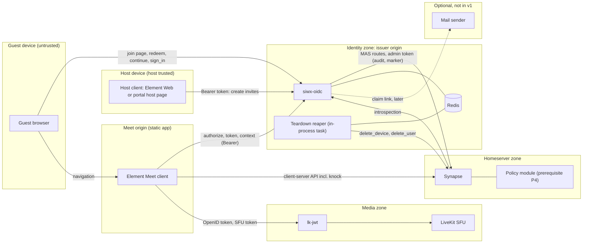
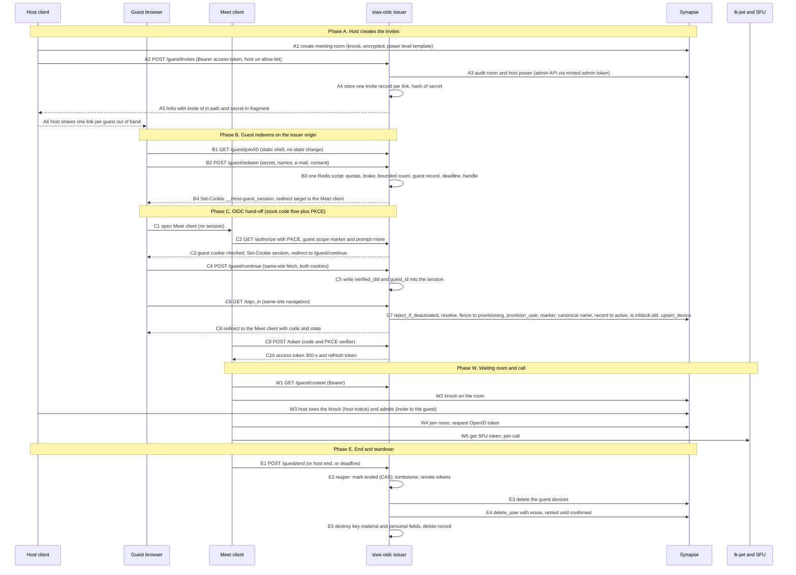
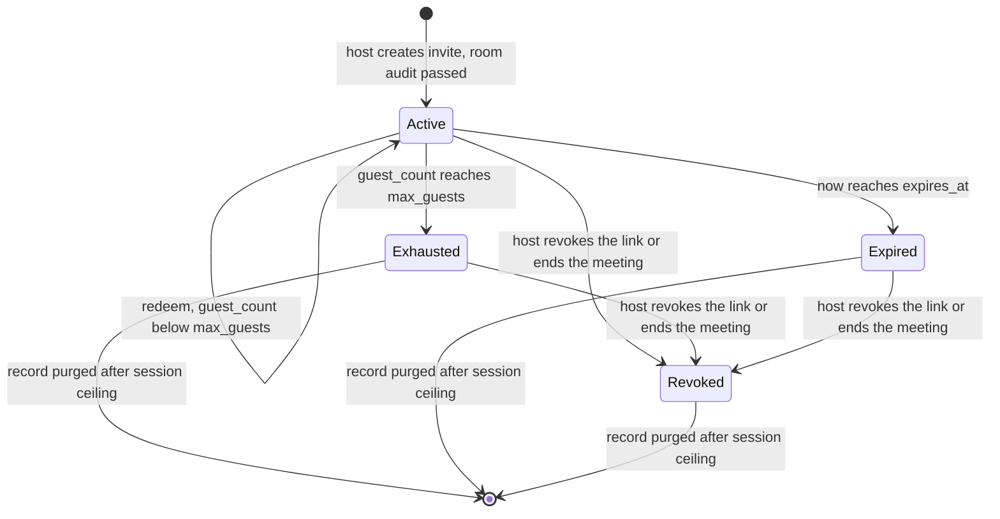
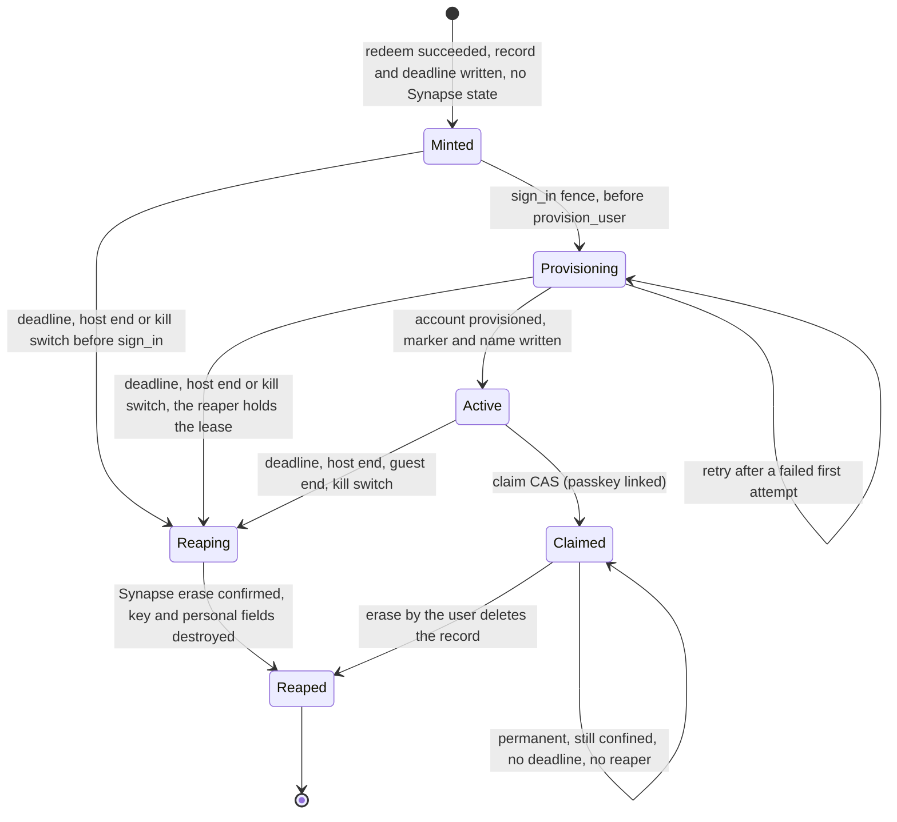
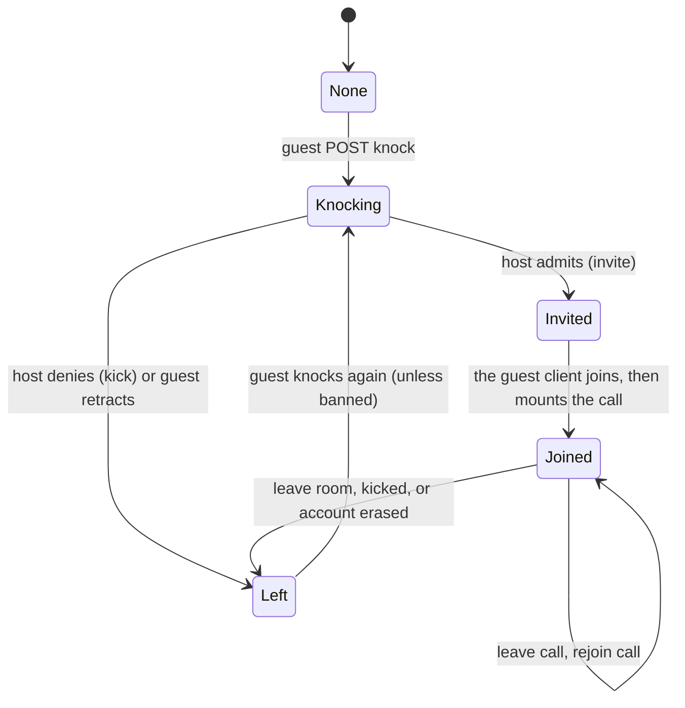
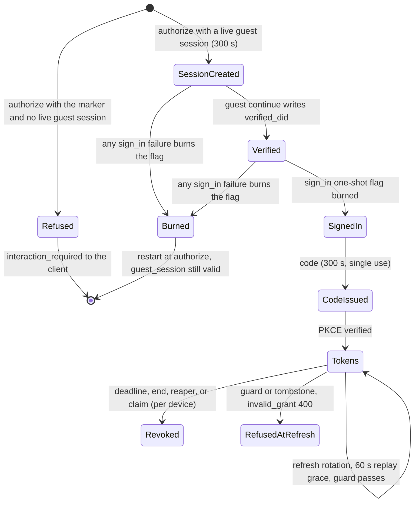
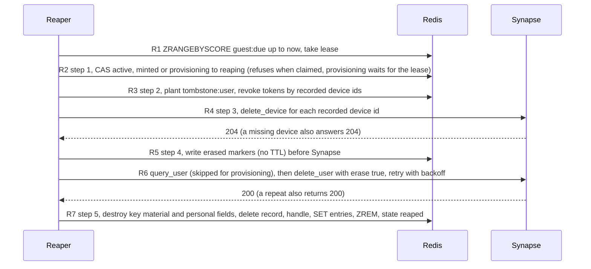

# Guest portal: flow model

**Status:** DRAFT design document. Nothing here is implemented, and nothing in this document changes code.
**Scope:** the end-to-end journey of an anonymous guest who joins a Matrix video call by link on a Synapse
homeserver that delegates authentication to siwx-oidc. It is the first document of the set: the security model,
the wireframes and the implementation plan build on the flow, the requirement IDs (`GP-FLOW-nn`) and the hand-off
points defined here.
**Baseline:** siwx-oidc `origin/main` at `3547bd2` (2026-09-30). Every `path:line` citation is against that commit.
Upstream facts were read from source: Synapse v1.161.0, lk-jwt-service 0.7.0, Element Call v0.26.1
(paths prefixed `synapse/`, `lk-jwt/`, `ec/`), and matrix-js-sdk (`develop` branch at the time of reading).

Naming used below: the **issuer** is the origin of siwx-oidc's `base_url` (example `https://id.example.org`). The
**Meet client** is the guest-facing web application on its own origin (example `https://meet.example.org`),
the maintainers' working name being "Element Meet". A **guest** is an account created because an invite was redeemed.
It is identified server-side by the guest record and by the Synapse `user_type` marker `io.inblock.guest`, never by key
type or name. An **unclaimed** guest is deactivated after the call. A **claimed** guest is permanent and stays confined.
The word "claim" means only the passkey-link ceremony (claim document); the marker is never called a claim. Labels of
the form `D<n>` refer to the cross-document decisions listed in the [decisions log of the overview](00-overview.md#7-decisions-log);
each stays an open decision for the maintainers.

## 1. The flow in twelve lines

1. The host's own client creates a dedicated meeting room (join rule `knock`, encrypted, restrictive power levels) and
   calls `POST /guest/invites` on the issuer with a normal access token. Only hosts on the operator's allow-list may mint
   (D5). The issuer audits the room, stores one single-use invite per requested guest (D6) and returns the links.
2. The link targets the **issuer**, not the client: `https://id.example.org/guest/join/<invite_id>#<secret>`.
   The secret lives only in the URL fragment, so it reaches no log, no `Referer` header and no link scanner.
3. The guest opens the page, reads the notice, types first name, second name and (optional or enforced) e-mail,
   ticks consent and submits. `POST /guest/redeem` is the only minting event; it writes Redis and **no Synapse state**.
4. Redeeming writes a guest record (with a hard deadline and a due-queue entry), allocates the custodial key reference
   (the key itself is derived on demand and never stored, D9), and sets the opaque `__Host-guest_session` cookie on the
   issuer origin (Secure, HttpOnly, SameSite=Lax, D4). Nothing is created at Synapse: the only Synapse access of redeem is
   one best-effort read of the host's display name for the lookalike rule of the name check (step B3).
5. The browser goes to the Meet client, which starts a **stock OIDC authorization-code flow with PKCE** and adds the
   routing marker scope and `prompt=none`. The client knows no invite, no secret and no e-mail.
6. `/authorize` runs unchanged except for its landing and the topology gate (D19): with the marker and a live guest session it lands on
   `/guest/continue` instead of the login page; without a live guest session it answers `interaction_required` to the
   client and never renders the login page.
7. `/guest/continue` is the new ceremony. It checks the guest cookie and the OIDC `session` cookie and writes
   `verified_did` into the session (existing "Path A" of `sign_in`). It issues no code and no token.
8. `sign_in` then runs in its existing order and creates the Synapse account (first sign-in, behind a `provisioning` fence
   that keeps the reaper from erasing under it, GP-FLOW-26), seeded with the guest's typed name, writes the `user_type` marker and the canonical name (failing closed), publishes `io.inblock.did`,
   provisions a device, and issues the code.
9. The client redeems the code, fetches the room from `GET /guest/context`, and **knocks**. The host is shown the knock
   through a host-visible notice (Matrix sends no push for a knock), admits the guest from the waiting room (an invite
   from the host), and the client joins the room and, once its own membership is `join`, mounts the call (D14).
10. The guest's lifetime is bounded by a deadline (default 2 h). A refresh guard and the reaper enforce it.
11. The call ends by deadline, by the host ("end meeting", or one link) or by the guest ("end session"). The reaper marks
    the record ended, revokes tokens, deletes the Synapse devices, erases the account, then destroys the key material
    and personal fields (D2).
12. A guest who claims the account (adds a passkey through the existing link logic) is moved to `claimed` by a single
    compare-and-set that the reaper respects, so claim and teardown can never both win. A claimed account is permanent
    but stays confined: it keeps the marker and the module policy, loses the deadline, and its pre-claim tokens are
    revoked per device (D3).

## 2. Requirements recap and hard prerequisites

| Id | Requirement (product level) |
|---|---|
| R1 | A guest joins by link, anonymously: no account, wallet or passkey needed to join. |
| R2 | The join flow asks for first and second name (the account alias) and an e-mail address, optional by default, operator-enforceable. |
| R3 | The operator manages the guest account's cryptographic key (custodial). The guest never handles a key. |
| R4 | Later the guest can claim the account by linking a passkey, reusing the existing linking logic. The claimed account is permanent and stays confined until an operator promotes it (D3). |
| R5 | The guest account is ephemeral: deactivated after the call unless claimed. |

The flow is only safe to enable when these conditions hold. They are outside this repository and are
hard dependencies, not recommendations (D11). P1 to P4 are the hard gates named in every document of the set, in
the same words (the wording of D11). P5 to P9 are operator assertions that only this document lists (P7 is superseded).

| Id | Prerequisite | Why the flow needs it | Owner |
|---|---|---|---|
| P1 | lk-jwt membership enforcement (Synapse `msc4502_enabled` plus a small lk-jwt patch that calls the existing membership check on the routes Element Call actually uses). Hard dependency before any guest exists, on dev too. | Today neither route (`/get_token`, legacy `/sfu/get`) checks: both take any local account. Without P1 any guest can publish into any room id it learns, and the confidentiality of the call rests on E2EE alone. | Synapse and lk-jwt owner |
| P2 | SFU eviction and a short SFU token lifetime before production (lk-jwt kick PR or equivalent). The OpenID token lifetime is a Synapse constant (`synapse/rest/client/openid.py:72`) and is not configurable; P1 covers confidentiality for that half. | Closes the tail of a connected participant and of a LiveKit token after teardown (section 7.5). It does not shorten the Synapse OpenID token (1 h): P1 is what makes an old OpenID token useless once the account has left the room. Dev may run without P2 and accepts the tail. | lk-jwt owner |
| P3 | Synapse 1.162.0 or later before the module goes live, then re-read 02 against that version. Federation off for a guest deployment (a remote knock reaches no hook). | 1.162.0 carries the room version 12 fix that `check_event_allowed` needs: the crash hits rooms created as version 12, and 1.162 is where the default flips to 12 (the 1.161 default is 11, `synapse/config/server.py:179`), so the module is tested on version 12 first. A remote knock reaches no module hook (02 section 3.6). | Synapse owner |
| P4 | the guest policy module (separate repository, licence path decided by the maintainers with counsel). | Under delegated auth `is_guest` is never true and registration is closed, so a guest is a normal user and every restriction is server-side policy. The module confines users that carry the marker and leaves unmarked users untouched. It is loaded together with `user_types.extra_user_types: ["io.inblock.guest"]` (`synapse/config/user_types.py:30, 34`) and an empty `auto_join_rooms`. | Synapse owner |
| P5 | Redis used for guests is persistent (AOF or equivalent), runs `maxmemory-policy noeviction`, is version 5 or later and is a single node (GP-FLOW-23). | The guest record is the only pointer to a live Synapse account, and the `erased:*` markers are what keep an erased account from being reactivated. A flushed Redis orphans the record (docs/architecture.md:168), and an evicting one silently drops records and markers just the same. The scripts read `TIME` and then write, which needs effects replication (the default from Redis 5), and they touch several keys, which only a single node guarantees. | Operator |
| P6 | The reverse proxy rate-limits `POST /guest/redeem`, `GET /guest/join/*` (and `POST /guest/peek`, which shares its limit), `POST /guest/continue`, `GET /guest/resume` (and `GET /guest/ended`, which shares its limit) and the claim routes per address, and limits `POST /register`. Numbers: 04 section 3.1. | siwx-oidc has no in-process per-address limiter by convention (AGENTS.md: rate limiting belongs in the reverse proxy), and knock itself is not covered by `rc_joins` or `rc_invites` (section 4.4). Quotas that are invariants live in the application (04 GP-SEC-02). | Operator |
| P7 | ~~`io.inblock.guest` is added to the homeserver profile-field denylist.~~ SUPERSEDED (D1): the marker is the Synapse `user_type`, which only an admin call can write, so no denylist entry exists. | none | none |
| P8 | `block_non_admin_invites` stays off. | Admitting a knock is an invite (`synapse/handlers/room_member.py:894-925`); the global knob also blocks hosts. Per-user invite policy belongs in the module (`user_may_invite`). | Synapse owner |
| P9 | Element Web has `feature_ask_to_join` enabled by default in the operator's config. | It is the only host-side knock accept UI (`RoomKnocksBar`); Element Call only implements the guest side. | Operator, client owner |

## 3. Actors, trust zones and secrets

| Actor | Zone | Holds | Must never hold |
|---|---|---|---|
| Guest browser | untrusted device | invite secret (page memory only), `session` cookie (HttpOnly, SameSite=Strict, 300 s), `__Host-guest_session` cookie (HttpOnly, SameSite=Lax) | any private key (R3) |
| Host client | host device | the host's own tokens, the invite links it shares | guest secrets beyond the links |
| siwx-oidc | identity zone | MAS shared secret, ES256 provider key, `guest_key_secret`, invite secret hashes, guest records (name, e-mail, consent, `key_ref`) | LiveKit API key, SMTP credential (neither exists in v1), any derived private key at rest |
| Redis | identity zone | all of the above state, plus tokens, sessions, codes | nothing else by design; it must be persistent (P5) |
| Teardown reaper | inside siwx-oidc | same secrets as siwx-oidc (needs the MAS secret and Redis) | a second Synapse credential |
| Synapse | homeserver zone | accounts, rooms, the MAS shared secret (verifier side), the `user_type` marker | invite secrets, e-mails, custodial keys |
| Policy module | inside Synapse | the guest restriction policy | authority to mint guests |
| Meet client | its own origin | client id, PKCE verifier, tokens in its storage | invite secret, e-mail, any key |
| lk-jwt | media zone | LiveKit API key and secret; sees the guest's Synapse OpenID token | siwx-oidc tokens |
| LiveKit SFU | media zone | media, participant identities | Matrix credentials |
| Mail sender | optional | SMTP credential, recipient addresses | anything but claim-link mail; absent in v1 |

| Secret | Created by | Travels through | Lifetime |
|---|---|---|---|
| Invite secret (`gi_` plus 32 base62 characters, about 190 bits, same generator as opaque tokens, `src/introspect.rs:35-41`) | siwx-oidc at mint | link fragment, then the body of `POST /guest/redeem` over TLS | invite TTL (default 24 h) |
| Invite secret hash (SHA-256) | siwx-oidc | stays in Redis | invite record |
| `session` cookie id | `authorize` (`src/oidc.rs:1681-1689`) | guest browser to issuer | 300 s |
| `guest_session` handle (opaque random; Redis holds its SHA-256 and maps it to the guest localpart) | `/guest/redeem` | guest browser to issuer, in the `__Host-guest_session` cookie | until the guest deadline (removed at claim) |
| Guest key | derived in memory from `guest_key_secret` and the record's random `key_ref`, only for an operation a requirement permits (none in v1) | never leaves siwx-oidc, never stored | until reap or the claim commit (section 11) |
| Authorization code | `sign_in` | redirect to the Meet client | 300 s, single use (`src/db/mod.rs:47`) |
| PKCE verifier | Meet client | never leaves it | one flow |
| Access and refresh tokens (opaque `mat_`, `mcr_`) | `token` | Meet client storage, Synapse introspection | 300 s and sliding 90 d storage TTL, capped by the guest deadline (section 6.4) |
| Synapse OpenID token | Synapse | Meet client to lk-jwt | 1 h (`synapse/rest/client/openid.py:70-72`) |
| LiveKit JWT | lk-jwt | client to SFU | 1 h (`lk-jwt/src/handler.rs:70`) |

## 4. The happy path

| Step | Actor | What happens | Code |
|---|---|---|---|
| A1 | Host client | Creates one dedicated room per meeting with the room template of section 4.3. siwx-oidc never creates rooms. | client side |
| A2 | Host client | `POST /guest/invites` with `Authorization: Bearer <access token>` and `{room_id, count, labels, kind, max_guests, expires_in, session_secs, recording_expected}`. `kind` defaults to `single`; `count` single-use links are created in one call (D6). Same Bearer pattern as `userinfo`. A dedicated scope is not possible: user tokens always get the fixed scope `openid urn:matrix:client:api:* urn:matrix:client:device:<id>` (`src/oidc.rs:1464-1475`). | new; pattern `src/oidc.rs:3007-3040` |
| A3 | siwx-oidc | Looks the token up in Redis and refuses: expired, minted admin tokens (`did` is `urn:siwx:service:admin`, `src/admin_token.rs:116`), and tokens of any account that has a guest record, claimed included, unless the record carries `promoted_at` (lookup by `TokenMetadata.username`; 04 GP-SEC-06, 05 GP-CLM-20). Then checks that the caller is on the `guest_hosts` allow-list (D5), that the host is joined to `room_id` with power level at least `invite`, and audits the room template of section 4.3, through the existing `admin_request` machinery (`src/synapse_client.rs:445`) against `GET /_synapse/admin/v1/rooms/{id}/members` and `.../state` (`synapse/rest/admin/rooms.py:487-511` members, `:513-555` state). "Joined with power level at least `invite`" is computed with the room-version rule of section 4.3, not read from the `users` map alone. Quotas of 04 GP-SEC-02 are checked here. | new |
| A4 | siwx-oidc | Writes one `guest:invite/<invite_id>` per link (fields in section 4.1) and adds each id to `guest:by_host/<host_localpart>`. | new |
| A5 | siwx-oidc | Returns one `https://id.example.org/guest/join/<invite_id>#<secret>` per link. A secret is shown once and never stored. | new |
| A6 | Host | Shares each link with its intended guest. Forwarding is possible and bounded (section 8). | out of band |
| B1 | Guest | `GET /guest/join/<invite_id>` returns the same static shell for any id (no oracle, no state change, so prefetchers and mail scanners cannot burn a single-use link). `Referrer-Policy: no-referrer`. JS reads the fragment, then calls `POST /guest/peek` with the invite id and the secret (section 4.2): it changes no state (so a prefetcher cannot burn the link) and answers only after the secret verified, with what the form needs (state, e-mail policy, session length, consent version, recording flag) and no host-controlled text (04 GP-SEC-15). If a valid guest cookie exists for this invite the page offers "Continue as `<name>`" (section 8). | new |
| B2 | Guest | The page shows the notice and consent text (links from the existing `op_tos_uri`, `op_policy_uri`, `src/config.rs:213-218`; a recording line when the invite carries `recording_expected`), fields first name and second name, e-mail (marked optional, or required when the operator enforces it) and a consent checkbox. Submit calls `POST /guest/redeem`. | new |
| B3 | siwx-oidc | Checks in this order: secret (constant time) first, then invite state, then input validation (name, e-mail policy, consent). The name check reads the inviting host's current display name once, through `read_profile`, for the lookalike rule of 04 GP-SEC-18: best effort, a failed read skips that one rule and never blocks the redeem, and nothing is written at Synapse. Only after the secret verified are state-specific messages returned (section 9). Then allocates the key reference (section 11), derives the DID and computes the localpart with `mxid::localpart_for`, redrawing the key id in the roughly 5e-9 case that the result is all digits (`src/localpart.rs:196-209`, the guest-reserved all-numeric rule), and runs **one Redis script**: quota and brake checks, bounded increment of `guest_count` against `max_guests`, write of `guest:acct/<localpart>` (state `minted`, deadline `now + session_secs` by Redis `TIME`), `ZADD guest:due`, `SADD guest:by_invite/<id>`, write of the handle entry. A single-use invite burns here. | new |
| B4 | siwx-oidc | Sets `__Host-guest_session` (Secure, HttpOnly, SameSite=Lax, Path=/, no Domain, `Max-Age` to the deadline; the unprefixed `guest_session` on plain-HTTP development only) and answers with `guest_client_url`. | new |
| C1 | Meet client | With no session it starts OIDC. The client is a public client (PKCE, `token_endpoint_auth_method` none) and a static `default_clients` entry named by `guest_client_id` (`docs/configuration.md` "Clients", open decision 13). Static entries carry the 30 d TTL from the last start today (`src/axum_lib.rs:1305-1312`, `src/db/redis.rs:686-691`, `src/db/mod.rs:49`), so the entry must be made non-expiring by a code change (M0b, 03 GP-CLI-02). | client owner |
| C2 | Meet client | Top-level navigation to `GET /authorize` with S256 PKCE (mandatory, `src/oidc.rs:1740-1744`), `prompt=none` and the scope marker `urn:io.inblock:guest` (provisional, not advertised in discovery) next to the usual `openid` and `urn:matrix:client:*` scopes. `authorize` stores the requested scope verbatim in the session (`src/oidc.rs:1677`), and the granted token scope stays fixed regardless (`src/oidc.rs:1464-1475`). | `src/oidc.rs:1569` |
| C3 | siwx-oidc | Client id, redirect URI and `state` are validated first, exactly as today. For a marker request the client id must also equal `guest_client_id`, and with `guest_client_topology = same-site` a navigation whose `Sec-Fetch-Site` is `cross-site` is refused here (GP-FLOW-06). With the marker and a live guest session (the Lax cookie accompanies the client's navigation, and resolves to a record in `minted`, `provisioning` or `active` before its deadline, with the kill switch off) `authorize` creates `sessions/<id>` (300 s) and the `session` cookie, then redirects to `/guest/continue?...` (same query as today's `/?...`, `src/oidc.rs:1750-1763`) instead of `/`. With the marker and no live guest session it answers `interaction_required` on the client's registered redirect URI, the shape `prompt=none` gets today (`src/oidc.rs:1631-1639`), and never renders the login page. | changed |
| C4 | Guest browser | `/guest/continue` is a static page whose script immediately calls `POST /guest/continue` with the OIDC params it received. This is a same-site, script-initiated request, so the Strict `session` cookie is sent together with the guest cookie (section 5.2). The server checks GP-FLOW-06 and writes the session. | new |
| C5 | siwx-oidc | Writes `verified_did = <guest DID>` and `guest_id = <localpart>` into `sessions/<id>` with the TTL reset to 300 s, exactly like `webauthn::authenticate_finish` (`src/webauthn.rs:843-859`). | new |
| C6 | Guest browser | `location.replace("/sign_in?...")`, the same hop the login page makes (`js/ui/src/App.svelte:186-188`). | `src/axum_lib.rs:270` |
| C7 | siwx-oidc | `sign_in` in its unchanged order: one-shot flag (`src/oidc.rs:2513-2520`), Path A (`:2526-2551`), `reject_if_deactivated` (`:2673`), redirect re-validation (`:2682`), `resolve_identity_or_legacy` (`:2706`), `provision_synapse_device` (`:2707`). Guest additions sit around these calls, never reorder them (section 5.5). Before `provision_synapse_device` the guest branch moves the record `minted -> provisioning` by compare-and-set; a refused move answers 401 before any Synapse call (GP-FLOW-26). Inside `provision_synapse_device` a guest parameter carries the canonical name and the marker duty. First sign-in creates the account through `provision_user`, seeded with the canonical name instead of `alias_for(did)` (`src/oidc.rs:2218, 2239`); a failure is fatal for a guest, not best effort (today it only logs, `:2239-2245`). Then the admin `PUT` of `user_type`, then the admin `PUT` of the canonical name (GP-FLOW-26, D1, D8). Then the record moves `provisioning -> active`; a refused move here means the reaper won, and `sign_in` erases the account it just made (GP-FLOW-26). Only then is the device id appended to the record before `upsert_device` (write-ahead), and that id is resolved before the append and handed to `provision_synapse_device` as `proposed_device_id` (GP-FLOW-22). The append is a script that requires the state `active` (05 GP-CLM-23): the record stays a superset of the devices that exist, its count enforces `guest_max_devices`, and a hand-off that loses the race to a claim or a reap is refused and mints no token that the claim's per-device revocation could miss. | changed |
| C8 | siwx-oidc | Mints the `CodeEntry` (`:2718-2731`), redirects to the Meet client with `code` and `state` (fragment for `response_mode=fragment`, `:2733-2748`). The handler sets the `siwx_user` cookie as for any sign-in, except for a guest session, where it is skipped (section 5.2). | changed |
| C9, C10 | Meet client | Code exchange with the PKCE verifier (`token_authorization_code`, `src/oidc.rs:1331-1543`). Access token 300 s, refresh token as for every user. For a guest the exchange also asserts that the token carries the device scope of a device in the guest record, and refuses a code minted before a teardown (GP-FLOW-22, GP-FLOW-14). | changed |
| W1 | Meet client | `GET /guest/context` with the guest Bearer token returns `{room_id, deadline, invite_id, meeting_name}`. The room id never appears in a URL. | new |
| W2 | Meet client | `POST /_matrix/client/v3/knock/<room_id>` (`synapse/rest/client/knock.py:49-100`). Allowed for any normal user when the join rule is `knock` (`synapse/event_auth.py:801-818`), and the module confines a marked user to flagged rooms (P4). The knock event carries the canonical displayname. | Synapse |
| W3 | Host | The host must be told about the knock: Matrix sends no push for one (section 4.4, GP-FLOW-29). Element Web `RoomKnocksBar` then lists the knocker with approve (an invite) and deny (a kick), behind `feature_ask_to_join`. | P9 |
| W4 | Meet client | The client itself joins the room when the invite arrives, and mounts the call component only when its own membership is `join` (D14, 03 GP-CLI-14). Element Call's auto-join on invite belongs to its standalone page (`ec/src/room/useLoadGroupCall.ts:199-235, 290-315`), not to the component the client mounts (`ec/component/index.tsx:291-343`), and Synapse has no auto-join on an accepted knock (02 section 4). | client |
| W5 | Meet client | Synapse OpenID token, then lk-jwt, then the SFU. Gated by P1. | media zone |
| E1 | Guest, host, clock or operator | Triggers (section 7.1). | new |
| E2 to E5 | Reaper | Teardown sequence (section 7.2, D2). | new |

### 4.1 What the invite and the guest record hold

`guest:invite/<invite_id>` (Redis JSON, one per link). Physical TTL is `expires_at + guest_session_max_secs + slack`, so the host can still end a meeting after the link expired; the logical check is the `expires_at` field.

| Field | Meaning |
|---|---|
| `secret_hash` | SHA-256 of the secret. High entropy, so no KDF is needed. |
| `room_id` | Immutable. |
| `host_localpart`, `host_did` | From the host's `TokenMetadata` (`src/db/mod.rs:366-395`). The DID is stored byte for byte (AGENTS.md "DID keeps its exact case"). |
| `kind` | `single` (one redemption, the default) or `open` (reusable). `open` exists only when `guest_allow_open_links` is on (D6). |
| `max_guests`, `guest_count` | `single` implies 1. For `open`, `max_guests` is the hard use cap, capped by `guest_max_guests`. The counter never decrements, so reaping a guest frees no slot. |
| `label` | Host-chosen recipient label, at most 40 characters, shown only to the creating host (04 GP-SEC-10). |
| `created_at`, `expires_at` | Link validity. Default 24 h, ceiling 72 h; `open` links 24 h at most (04 GP-SEC-11). |
| `session_secs` | Per-guest lifetime after mint. Default 2 h, at least 600 s, never above `guest_session_max_secs`. |
| `email_policy` | `optional`, `required` or `off`, frozen from operator config at mint so a later config change cannot reinterpret an open link. |
| `recording_expected` | Host flag frozen at mint; selects the recording line of the consent notice (04 GP-SEC-61). |
| `meeting_name` | Text copied at mint (the audited neutral room name) so that `GET /guest/context` needs no Synapse call. Served only after redeem and shown only as text, never as HTML; `POST /guest/peek` never returns it (04 GP-SEC-15; 06 open decision 7). |
| `state` | `active`, `revoked` (set by host end), or derived `expired` and `exhausted`. |

`guest:acct/<localpart>` (the guest record, keyed by localpart like all revocation, `AGENTS.md` "Revocation keys on `TokenMetadata.username`"). The field list is closed (04 GP-SEC-60): nothing else personal or network-related is ever added.

| Field | Meaning |
|---|---|
| `state` | `minted`, `provisioning`, `active`, `reaping`, `claimed` (section 6.2). `provisioning` is the fence of GP-FLOW-26: the account may exist. `claimed` is a record state; the Synapse marker is a separate fact (GP-FLOW-04). |
| `did` | The guest DID, byte exact. |
| `invite_id`, `minted_at`, `deadline` | Deadline is `minted_at + session_secs` and can only move earlier. Removed at claim. |
| `first_name`, `second_name`, `email` | Personal data. Never written to Synapse 3PIDs, never logged. The e-mail is deleted at reap and, at claim, unless the guest explicitly chose to keep it (default remove, D13). |
| `consent {version, variant, at}` | Recorded at redeem. `variant` names the notice text shown (recording line or not). |
| `device_ids` | Appended by `sign_in` before each device upsert (write-ahead), only while the state is `active` (05 GP-CLM-23), so the reaper can revoke and delete without a keyspace scan and the count can be capped. |
| `pre_claim_devices` | Holds the `device_ids` of the claim (05 GP-CLM-26: renamed once the claim's token revocation has run), so the list of devices that existed before the claim outlives the claim. At most `guest_max_devices` ids, no personal data. `sign_in` refuses a client-proposed device id found here (GP-FLOW-22). |
| `key_ref` | `{v, id}`: a random 128-bit key id and a version (section 11). No key material. Removed at claim and at reap. |
| `claimed_at`, credential id, derived `did:key` | Written by the claim compare-and-set (05 section 5.6). |

New keys, in the style of `docs/architecture.md` "Redis keyspace":

| Key | TTL | Holds |
|---|---|---|
| `guest:invite/<id>` | logical link TTL plus session ceiling | invite record |
| `guest:acct/<localpart>` | until reaped; for the life of a claimed account | guest record |
| `guest:handle/<sha256(handle)>` | until the deadline | SHA-256 of the opaque handle (the `__Host-guest_session` cookie value) to localpart, so key listings and monitors never show a handle |
| `guest:claimed_handle/<sha256(handle)>` | 10 minutes | written by the claim commit when it deletes the handle entry; holds the localpart and no personal data. Read only by `GET /guest/resume` and the claim routes, so a reload or retry shortly after a claim still answers `claimed` (05 section 4.3); never read by the hand-off. The other claim keys are listed in 05 section 4.3 |
| `guest:by_invite/<id>` | as the invite | SET of localparts, so "end" needs no scan |
| `guest:by_host/<host_localpart>` | as the longest invite | SET of invite ids, for "end meeting", the host's list and per-host quotas |
| `guest:due` | none | ZSET scored by deadline |
| `guest:lease/<localpart>` | 120 s | reaper lease (`SET NX EX`), also taken by the `sign_in` fence while a first sign-in is in flight (GP-FLOW-26); the value names the holder |
| `guest:quota/<scope>/<window>` | window length | counters behind the quota keys of section 10 |
| `guest:control`, `guest:banned_hosts` | none | kill switch values read by the reaper tick and the refresh guard (04 GP-SEC-48) |

Deadline arithmetic and comparison use Redis `TIME` inside the scripts, never an instance clock (04 GP-SEC-08).

### 4.2 Endpoints (names only, all need `docs/api/openapi.yaml` entries)

`tests/openapi_covers_every_route.rs` fails without them (AGENTS.md "Route documentation is enforced").

| Route | Auth | Purpose |
|---|---|---|
| `POST /guest/invites` | host Bearer | create one link, or `count` single-use links |
| `GET /guest/invites` | host Bearer | list the caller's own invites with labels, counts and states (the host-side view of who has signed in and who has ended). For an account that is not on the host allow-list it answers 403 with the fixed reason class `not_a_host`, so the host tool can show its refusal state on load instead of after a failed create (D5, 06 H1) |
| `POST /guest/invites/{invite_id}/end` | host Bearer | revoke one link and end its guest |
| `POST /guest/meetings/end` | host Bearer | end the meeting: body `{room_id}`; revoke every invite the caller made for that room and set every guest deadline to now |
| `GET /guest/join/{invite_id}` | none | static join shell (same response for any id) |
| `POST /guest/peek` | invite id and secret in body | non-burning lookup for the join page: changes no state, answers only after the secret verified (GP-FLOW-24), returns state, e-mail policy, session length, consent version and the recording flag, and no host-controlled text (04 GP-SEC-15; 06 G1). Proxy limit shared with `GET /guest/join/*` (P6, 04 section 3.1) |
| `POST /guest/redeem` | invite secret in body | mint |
| `GET /guest/resume` | guest cookie | what the join page needs to offer "continue" (names only, no secrets); the claim document adds `state`, `seconds_left`, `claim_allowed` and `email_present` (05 section 4.2). It still answers `state: claimed` after the claim deleted the handle: for 10 minutes the `guest:claimed_handle` marker of section 4.1 maps the cookie to the claimed record, and only after that does the cookie map to nothing and the answer becomes `no_session` |
| `GET /guest/continue` | none | static landing page for the ceremony |
| `POST /guest/continue` | `session` and guest cookies | the ceremony |
| `GET /guest/context` | guest Bearer | room id, deadline, invite id and meeting name |
| `GET /guest/ended` | none | static shell for the two `closed` screens of 06 G6: its script reads `GET /guest/resume` with the cookie and draws the copy for an ended session or the copy for a kept account. Changes no state. Proxy limit shared with `GET /guest/resume` (P6) |
| `POST /guest/end` | guest Bearer or the `__Host-guest_session` cookie (D18) | end my own session. The cookie path, used by the claim page ("Delete everything now", 05 CL-07), needs the `Origin` and `Sec-Fetch-Site` check of GP-FLOW-25 like every cookie-authorised POST. Answers 409 for a claimed account (05). The client end screen calls it "End session" with the Bearer token (06 G5) |

The end verbs are `POST`, not `DELETE`: the global CORS layer allows only `GET`, `POST` and `OPTIONS` (`src/axum_lib.rs:1568-1577`), so a `DELETE` from a portal on another origin would fail its preflight. State-changing guest routes take `application/json` only (GP-FLOW-25). The origin check covers every route authorised by a cookie or by no credential (redeem, continue, the claim routes, and `POST /guest/end` on its cookie path), and so `POST /guest/peek` although it changes nothing (the secret is in its body): at least one of `Origin` and `Sec-Fetch-Site` must be present and every one that is present must match (`Origin` equal to the issuer origin, `Sec-Fetch-Site` equal to `same-origin`); a request with neither is refused (04 GP-SEC-40). A route authorised by a Bearer token is not ambient and is called from another origin by design (the host tool, and `POST /guest/end` and `GET /guest/context` from the Meet client), so it needs JSON only and the origin check does not apply to it. No `GET` route changes guest state. Claim routes belong to the claim document.

### 4.3 Room template audited at mint

Refused at mint when violated (`guest_room_audit`, open decision 9). The template is the union of this document, of 02 section 4 and of 04 GP-SEC-28. Upstream defaults are unsafe for guests: Element Call's own `createRoom` uses the public-chat preset with `state_default: 0` and `events_default: 0` and no entry for `m.room.join_rules` (`ec/src/utils/matrix.ts:227-260`), so a joined guest could rewrite join rules and post, and the Synapse private presets set `invite: 0` (`synapse/handlers/room.py:150-163`).

| Setting | Required |
|---|---|
| `m.room.join_rules` | `knock` |
| room version (`m.room.create`) | 10 or later. This is our audit policy, not a Synapse constraint: Synapse accepts a knock from room version 7 (`synapse/event_auth.py:801-819`, `rust/src/room_versions.rs:225-226`). Version 10 is the first to enforce integer power levels (`rust/src/room_versions.rs:243-245`), so the power-level rules below compare numbers and cannot be bent with numeric strings. The audit has a power rule for versions 10, 11 and 12 (the rows below) and refuses a version it has no rule for, so a later version needs a reviewed rule first. The 1.161 default is 11 and 1.162 flips it to 12 (02 section 1.2): both must pass. This row is the single statement of the minimum: 02, 04 and the plan refer to it instead of restating it. |
| `m.room.encryption` | present, mandatory (D7): lk-jwt checks no membership today, and even with P1 the SFU token tail makes E2EE the confidentiality control |
| `m.room.history_visibility` | `joined`, never `world_readable` |
| `m.room.guest_access` | `forbidden` |
| creation content | `m.federate: false` |
| power levels | `invite` 50 or 100; `kick`, `ban` and `redact` 50 or more; `state_default` 50; `events_default` 50 (restrictive, so a joined guest cannot post); `users_default` 0; call-member event types (stable and unstable names) at 0; no entry that lowers `m.room.join_rules` or any other state type below 50. Every comparison uses the effective power of the next row |
| creator power (`m.room.create`) | Effective power is computed with the room-version rule and is never read from the `users` map alone. In versions 10 and 11 the `users` map and `users_default` decide. In version 12 the `m.room.create` sender and every `additional_creators` entry hold unlimited power, and Synapse refuses a `users` entry for them (`synapse/event_auth.py:982-992, 1133-1135`, `rust/src/room_versions.rs:300-308`, `synapse/events/__init__.py:167-181`), so a missing entry means maximal power and not `users_default`. `additional_creators` must be empty or a subset of `guest_hosts`, because a creator can rewrite any state and kick any guest. "The caller is joined with power at least `invite`" (step A3) uses this computation, so a version 12 creator passes and an absent `users` entry is not read as power 0 |
| room id | The `room_id` of the request matches the room id grammar defined once in 04 GP-SEC-07 (`!` plus an opaque part, an optional `:server` part, a length cap, a character set). Version 12 room ids are `!<hash>` with no server part (`msc4291_room_ids_as_hashes`, `synapse/handlers/room_member.py:1198-1199`), so the grammar must not demand one |
| `io.inblock.guest_room` state event | present, sent by a sender that is on `guest_hosts`, so one list governs both sides (02 GP-SYN-05, GP-SYN-14; 04 GP-SEC-28) |
| name, topic, avatar | neutral name, no topic, no avatar: the summary and knock state of a knock room are readable without authentication (02 section 3.6) |

The audit is a snapshot at mint. The module re-checks the template when the host admits a knocker (04 GP-SEC-29), because that is the moment that matters.

### 4.4 Knock facts the flow relies on

| Fact | Evidence |
|---|---|
| Any normal user may knock on a `knock` room; no prior membership needed. | `synapse/event_auth.py:801-818` |
| Knock is **not** limited by `rc_joins` or `rc_invites`, only by the generic message limiter. | `synapse/handlers/room_member.py:637-654` |
| A host admits by inviting the knocker; deny is a kick; the knocker may retract. | `synapse/event_auth.py:675-716, 781-792` |
| Deactivation rejects the account's pending knocks and invites, then parts it from all rooms. | `synapse/handlers/deactivate_account.py:184-186, 297-328` |
| Synapse's default push rules give a knock no notification: `.m.rule.member_event` has empty actions. The host is not alerted by Matrix itself. | `rust/src/push/base_rules.rs:120-132` |
| A remote knock reaches no module hook, so guest deployments are unfederated (P3). | 02 section 3.6 |

### 4.5 Contract with the Meet client

The wireframe and client documents detail these; the flow only fixes what the IdP side relies on.

| Id | The Meet client must |
|---|---|
| C1 | Start OIDC when it has no session, as a public PKCE client, adding the guest scope marker and `prompt=none` and no other custom parameter. |
| C2 | Call `GET /guest/context` right after the token exchange, and never put the room id into a URL. |
| C3 | Knock with the canonical display name already set (the IdP seeded it), show a waiting state, and offer "leave" (retract the knock). No server-side knock timeout exists, so "still waiting" is a client interval. Asking again is capped (GP-FLOW-33): the client shows the wait line, the module enforces the cap. |
| C4 | "Leave call" must not leave the room. "End session" calls `POST /guest/end` with the Bearer token, from the lobby (every state) and from the end screen. Closing the tab does neither. |
| C5 | On `interaction_required` at the hand-off or a 4xx refresh failure, the SDK signs the session out and the client hands the browser to the issuer page `GET /guest/ended`. Only the issuer origin can read `GET /guest/resume` with the cookie, so that page decides between the copy for an ended session and the copy for a kept account, which offers passkey sign-in (06 G6). On any other hand-off error (`access_denied`, `temporarily_unavailable`, a failed token exchange) the client shows the callback-error screen with "Try again" (06 G2). |
| C6 | Offer claim before "End session" (claim document). A claim revokes the pre-claim tokens (GP-FLOW-30), so it belongs on the end screen (open decision 18). |
| C7 | Never handle the invite secret. It never reaches the client by design. |
| C8 | Do not use Element Web's secretless guest link (`CallGuestLinkButton`): anyone with the room id could knock, and it bypasses account minting control. |
| C9 | Own the waiting room (D14): send the knock on arrival, show the client's own lobby, join the room when the invite arrives, and mount the call component only when the client's own membership in the room is `join`. Element Call's `skipLobby` skips only its own device lobby and is never a way past the knock (03 GP-CLI-14). |

## 5. Mapping onto existing code

### 5.1 Which ceremony the guest enters through

`sign_in` has two ways to learn the DID. **Path A** trusts `session.verified_did`, written earlier by a server-side
ceremony (`src/oidc.rs:2526-2551`); the only writer today is `webauthn::authenticate_finish`, which rewrites the raw
`sessions/<id>` JSON (`src/webauthn.rs:834-862`). **Path B** verifies a CAIP-122 `siwx` cookie (`src/oidc.rs:2552-2628`).
Path A wins when both exist. Nothing in `sign_in` cares which ceremony wrote `verified_did`, so the guest ceremony is one more
writer of it. This confirms the intended design, with two facts that shape it:

1. **Sessions exist only after `/authorize`.** `set_session` has one production caller (`src/oidc.rs:1669`), and `SessionEntry`
   holds no client, redirect URI or PKCE data (`src/db/mod.rs:329-341`; those travel as query parameters through the login page
   and return on `/sign_in`, `src/oidc.rs:2028-2040`). So the ceremony must run **after** the client's `/authorize`, in the same
   browser, on the issuer origin. The invite therefore cannot ride on the session from the start, which is why the invite is
   redeemed first (phase B) and only a cookie handle connects it to the later session.
2. **`/authorize` lands on the login page**, which offers only passkey and wallet (`src/oidc.rs:1750-1763`), and a visitor who
   reaches it can create an ordinary account (04 F1). A guest needs a different landing, selected by a scope marker.
   The marker is routing only; the security boundary is the guest cookie, which a non-guest browser cannot have. Because
   that cookie is SameSite=Lax it accompanies the client's navigation to `/authorize` even when the client runs on another
   site (D4, D19), so `authorize` can check it there: with the marker and a live guest session the landing is `/guest/continue`; with the marker and no live
   guest session the answer is `interaction_required` on the client's registered redirect URI, and the login page is never
   rendered for a marker request. `prompt=none` without the marker is refused as today (`src/oidc.rs:1631-1639`), so
   stock clients see no change.

The alternative considered and rejected as default: putting an invite parameter on `/authorize`. `AuthorizeParams` has no
extension point and drops unknown keys (`src/oidc.rs:1548-1567`), the secret would sit in a URL the client controls and the
issuer logs (`src/axum_lib.rs:1545` logs every request path), and every OIDC client would learn invites.

A second variant completes the authorization inside `/authorize` itself, with no landing hop (03 section 3.3). It removes the
script hop and the `session` cookie from the guest path, but it adds a second code-issuing site next to `sign_in`, which
AGENTS.md reserves as the only one, and it reorders code around the pinned gate order. The ceremony hop above reuses the
pattern the login page already runs in production (`js/ui/src/App.svelte:186-188`). Open decision 17.

### 5.2 The cookie-origin problem

| Cookie | Set by | Attributes | Used by the guest flow |
|---|---|---|---|
| `session` | `authorize`, `src/oidc.rs:1681-1689` | HttpOnly, SameSite=Strict, host-only, 300 s, `Secure` only when the request `redirect_uri` is https | read by `/guest/continue` and `sign_in` (the one that matters for `/authorize`) |
| `siwx` | browser JavaScript, `js/ui/src/App.svelte:176-180` | **not HttpOnly** (JavaScript cannot set that flag), SameSite=Strict, `secure` by page protocol | not used; no key-backed proof may ever be put in a script-set cookie |
| `siwx_user` | `sign_in` handler, `src/axum_lib.rs:309-317`, attributes `:942-952` | Path=/, HttpOnly, Strict, 30 d | minted for every ordinary sign-in. Skipped for a guest session and minted at the claim commit instead (05 GP-CLM-14): an unclaimed guest's mapping would outlive the account by 30 days and the login page would announce a dead MXID (`src/axum_lib.rs:758-775`) |
| `acct_session` | account re-auth, `src/axum_lib.rs:903-916` | Path=/account, HttpOnly, Strict, 600 s | unreachable by an unclaimed guest (re-auth needs a signature by the DID key, which every signature path refuses for a guest DID, GP-FLOW-31) |
| `__Host-guest_session` (new) | `/guest/redeem` | Secure, HttpOnly, **SameSite=Lax**, Path=/, no Domain, `Max-Age` to the deadline; unprefixed `guest_session` on plain-HTTP development only (GP-FLOW-32) | read by `authorize` (marker requests only), `/guest/continue`, `/guest/resume` (and through it the `/guest/ended` page), `POST /guest/end` on its cookie path (D18) and the claim routes; connects the redeemed guest to a later OIDC session |

What a page on another origin can and cannot do: CORS is `Access-Control-Allow-Origin: *` with no credentials
(`src/axum_lib.rs:1568-1577`), every cookie is host-only, so a Meet-origin page **cannot read, write or send** any of them
with `fetch` and cannot run the cookie-authenticated ceremonies. It can navigate the browser to the issuer, call the public
and Bearer routes without credentials, and receive a code at its registered redirect URI. A cross-site top-level `GET`
carries a Lax cookie and not a Strict one. That is why the guest cookie is Lax (`authorize` reads it on the client's
navigation; `Path=/guest` could not cover `/authorize` and a `__Host-` prefix forbids a path) and why the existing login page
is a script hop: `/authorize` redirects to a static page, and the page calls `location.replace("/sign_in?...")`
(`js/ui/src/App.svelte:186-188`), because Strict cookies are not sent on a redirect chain that began cross-site.
`/guest/continue` copies that shape on purpose. The browser-side claims (Lax sent on a cross-site top-level `GET`, Strict
withheld on the chain) are relied on by the existing design but are not re-tested in a browser here (spike SP-1).

**Site, not origin (D19).** "Cross-site" in this document means a different registrable domain, not a different origin.
The default topology is same-site: the issuer (`id.example.org`) and the Meet client (`meet.example.org`) are two origins
but one site (`example.org`), so every navigation of the hand-off is same-site and carries `Sec-Fetch-Site: same-site`,
while a navigation started by a third-party page carries `cross-site`. The marker branch of `authorize` therefore refuses
a navigation whose `Sec-Fetch-Site` is `cross-site` when the header is present (config `guest_client_topology`, default
`same-site`, GP-FLOW-06). That removes the device burning of a hostile page (04 GP-SEC-67) instead of only bounding it, for
every browser that sends the header. SameSite=Lax stays the cookie attribute: it is the only thing an operator relies on
who runs the client on another site (`guest_client_topology = cross-site`, where the gate is off and the bound of
GP-SEC-67 is what limits device burning). The reasoning of this section about a cross-site top-level `GET` applies to that
second topology; in the default one the Strict `session` cookie would also be sent, so nothing depends on the script hop,
which stays because it is the pattern already in production (spike SP-1 tests both, unverified in a browser).

Consequences: the landing, name form, consent, continue ceremony and sign-in all run on the issuer origin, reached by
top-level navigation. The Meet client is an ordinary relying party. CSRF for state-changing routes is covered in layers
(D4): Lax does not send the guest cookie on a cross-site `POST`, the `session` cookie is Strict, the routes take
`application/json` only (which forces a preflight that `ACAO: *` cannot satisfy for credentials), and on every route
authorised by a cookie the server checks `Origin` and `Sec-Fetch-Site` (at least one present, each one present matching, none
present refused; 04 GP-SEC-40), which covers `POST /guest/end` on its cookie path (D18) and never a Bearer-authorised route, and the
CORS posture stays same-origin only (guest routes add no CORS headers of their own and the global layer allows no credentials). Because Lax cookies ride on cross-site `GET`s, no `GET` route changes guest state. The
`__Host-` prefix stops a sibling subdomain from planting the cookie (cookie tossing), which was the residual risk left
open before; a sibling-origin test confirms it (04 ST-29). Login CSRF (planting an attacker's guest session in a victim)
remains possible only with the attacker's own link and is accepted (04 RR-12).

### 5.3 Reused as it is

| Component | Where | Role for guests |
|---|---|---|
| `reject_if_deactivated` | `src/webauthn.rs:374-425`, call `src/oidc.rs:2673` | Fails closed (401 deactivated, 503 cannot tell). Belt and braces after teardown. |
| `resolve_identity_or_legacy` | `src/localpart.rs:352`, call `src/oidc.rs:2706` | Unchanged. A guest DID is new, so it yields the modern localpart. |
| `provision_synapse_device` core | `src/oidc.rs:2203-2480` | Account creation, `io.inblock.did`, device upsert, cross-signing window. Extended by the guest parameter (section 5.4). |
| `TokenMetadata`, `CodeEntry` | `src/db/mod.rs:289-324, 366-395` | No new field: the guest is found by `TokenMetadata.username`. |
| Session and code stores, one-shot flag | `src/oidc.rs:2513-2520` | Unchanged. |
| Token endpoint, PKCE, client binding | `src/oidc.rs:1331-1543` | Unchanged except the tombstone check (GP-FLOW-14). |
| Introspection | `src/introspect.rs:108-160` | `active` is true while the token key exists, so teardown must delete token keys. |
| Revocation and erase primitives | `mark_user_deactivated`, `revoke_device_tokens`, `mark_account_erased` in `src/db/redis.rs`; `delete_device`, `deactivate_user`, `query_user` in `src/synapse_client.rs` | Reaper calls them in the order of section 7.2 (the order of `src/account.rs:691-750` with the device deletion added). `revoke_all_user_tokens` is never used by the claim (GP-FLOW-30). |
| Link logic | `wa::link_start`, `wa::link_finish`, `src/webauthn.rs:866-983` | Claim. The core takes an already authenticated DID and is reused with one added rule: `link_finish` refuses an id that already has a credential or link entry (section 5.4, 05 GP-CLM-02). |
| Link override | `credential_identity::resolve_credential_identity`, `src/credential_identity.rs:60-86` | After a link the passkey signs in as the guest DID: same DID, same MXID. |
| Device and account pages | `/device`, `/account` | Work for a claimed guest through the passkey paths. |

### 5.4 New and changed

| Item | Kind | Smallest change |
|---|---|---|
| `src/guest.rs` (binary-only, like `webauthn.rs`) | new | invite API, redeem, resume, continue, context, end, reaper, claim handlers (05) |
| Redis prefixes | new | next to the others in `src/db/mod.rs` |
| `authorize` landing target | changed | one branch on the scope marker (`src/oidc.rs:1750-1763`): guest cookie check, landing or `interaction_required`. `authorize` takes only the parsed params and the DB client (`src/oidc.rs:1569-1572`), so the handler must pass the cookie in. |
| `SessionEntry.guest_id` | changed | one `#[serde(default)]` field (`src/db/mod.rs:329-341`), so the raw-JSON writer in `webauthn.rs` still round-trips |
| `sign_in` guest branch | changed | record load, localpart assertion, the `minted -> provisioning` fence before `provision_user`, `client_id == guest_client_id`, state move to `active` (a refused move erases what `sign_in` made, GP-FLOW-26), device id resolved before the write-ahead append, append only while `active` (05 GP-CLM-23), rejection of a proposed pre-claim device id (GP-FLOW-22), the device-scope assertion before the code is minted (GP-FLOW-22), `siwx_user` skip; calls stay in order |
| `provision_synapse_device` guest parameter | changed | typed name instead of `alias_for(did)` at `src/oidc.rs:2218`, fatal `provision_user`, marker write, canonical-name write, all before `upsert_device`. The function has seven parameters already, so a struct is needed to stay under clippy's limit (CI runs `-Dwarnings`), and it must report a failure instead of returning only an `Option`. |
| `SynapseClient` admin writes | new | `user_type` and displayname `PUT` and the room-state read, through `admin_request` (private, retries once, safe for idempotent calls only); the Synapse mock follows in the same change (AGENTS.md) |
| Refresh guard | changed | at both refresh entry points (`src/oidc.rs:976-986`, `src/compat.rs` tombstone probe); a refusal is `invalid_grant` 400, a guard read that errors is 5xx and never passes (GP-FLOW-13); the guard also refuses a guest token without the device scope of a recorded device (GP-FLOW-22) |
| Code-exchange tombstone check | changed | `token_authorization_code` consults no tombstone today; a code minted before teardown yields tokens after it. `probe_revocation` with the code's device id, a recheck after the mint with rollback, and a timestamped user tombstone (GP-FLOW-14) |
| `link_finish` core | changed | one rule for the claim and for the wallet link route alike: write the credential and the link entry set-if-absent, refuse an id that already has either before anything is written, and remove the credential it wrote if its own link write then fails (05 GP-CLM-02, open decision 17). Everything else in the core, and `link_start`, stay as they are |
| Shared teardown function | changed | extract the sequence of `src/account.rs:662-750` so the reaper and the user action share it, with the device deletion added |
| Index-only token revoke | new | `revoke_device_tokens` and `revoke_all_user_tokens` both finish with a `KEYS token/*` scan (`src/db/redis.rs:115-126, 247-251, 653-674`). The index-only variant is for the reaper only: one call per recorded device and at most one sweep per tick for all guests in `reaping`. The claim keeps `revoke_device_tokens` with its `KEYS token/*` scan (one claim per guest, at most `guest_max_claimed` of them). The token index is advisory: `set_token` issues SET, SADD and EXPIRE as separate commands (`src/db/redis.rs:925-953`), so an index-only revoke misses a token whose SADD had not run yet, which is exactly a refresh rotation racing the claim. The reaper has a second net (the user tombstone and the device deletion of step 3); the claim has none, so it pays for the scan. |
| Quotas, brake, kill-switch reads | new | counters inside the redeem and invite scripts (04 GP-SEC-02, GP-SEC-03, GP-SEC-48) |
| Guest route layer | new | security headers, JSON-only, `Origin` and `Sec-Fetch-Site` checks on guest routes (04 GP-SEC-39, GP-SEC-40) |
| Guest client entry | changed | `default_clients` entries carry the 30 d TTL from the last restart (`src/axum_lib.rs:1305-1312`, `src/db/redis.rs:686-691`); the guest entry, named by `guest_client_id`, must not expire (03 GP-CLI-02) |
| Reaper task and shutdown | new | the first background task in the binary; must stop on the graceful-shutdown signal (`shutdown_signal`, `src/axum_lib.rs:1602`) |
| Config keys, routes, OpenAPI, Synapse mock | new | `config::figment()` only, `docs/configuration.md`, `e2e/synapse_mock.py` in the same change |

### 5.5 Invariants of AGENTS.md: kept, and the ones the design bends

Three invariants of AGENTS.md are bent for guest sessions (the fail-safe direction LEGACY, "publication never fails sign-in",
"the alias is written once"), and the read-only rule "lookups use the fallible `resolve_identity`" is departed from for the
guest record lookup. This is an explicit decision row for the maintainers (D16, the decision row in 07 section 9), not a side
effect. The plan schedules the AGENTS.md text changes (invariant wording, pins, code-map rows for `src/guest.rs` and
`src/guest_input.rs`) inside the milestones that bend them (M1, M4, M5, M7b).

| Invariant | Status | How |
|---|---|---|
| New accounts only through `/sign_in` | kept | Redeem writes no Synapse state. `provision_user` stays in `provision_synapse_device`. Pre-provisioning the name before `/sign_in` was rejected for this reason. |
| Ceremonies never issue codes or tokens | kept | `/guest/continue` only writes the session. |
| `reject_if_deactivated` before `resolve_identity_or_legacy` | kept | Order untouched. Guest checks go after both. |
| Fail-safe direction is LEGACY | **bent, guest sessions only (D16)** | A guest DID is new by construction, so a legacy guess would provision a wrong account the reaper would never find. For a guest session `sign_in` requires `resolved.localpart == record.localpart` and `!resolved.degraded`, else 503 before provisioning (GP-FLOW-08). |
| Alias is user-owned, written once, never a DID | **bent for a marked guest (D8, D16)** | The seed is the typed name with the operator suffix and is written at first provision only, never re-asserted on resume. While the marker stands the module freezes it, so the guest cannot rename. Validation rejects DID and MXID shapes (GP-FLOW-09). |
| Publication is best-effort and never fails sign-in | **bent, guest sessions only (D1, D16)** | The marker is the enforcing signal, so its write and the canonical-name write fail closed: no device and no code without them (GP-FLOW-26). `io.inblock.did` publication stays best-effort. |
| Read-only lookups use the fallible `resolve_identity` | **departed from for the guest record lookup and the redeem derivation, guest DIDs only (D16)** | Redeem computes the localpart with `mxid::localpart_for` directly (step B3), although `src/mxid.rs:143-146` says not to from a provisioning path, and the guest read helper (04 GP-SEC-56) keys on the same derivation. Reason: a guest DID is new by construction (derived from a fresh random `key_ref`), so it was never grandfathered onto a legacy `did-pkh-` localpart, and a legacy DID cannot hold a guest record: the modern localpart is the only key a record can have. `sign_in` still calls `resolve_identity_or_legacy` and asserts `resolved.localpart == record.localpart` (GP-FLOW-08), so the grandfathering rule still decides at the only place an account is created. Test vector: a grandfathered legacy account looked up through the guest helper finds no record and is never treated as a guest. |
| One device per sign-in, no recycling | kept | Every resume creates a fresh `SIWX_` device, counted against `guest_max_devices`; a proposed id that the record lists in `pre_claim_devices` is refused (GP-FLOW-22). |
| `logout_all` never deactivates; `/oauth2/revoke` never deletes a device | kept | Teardown is reachable only from the reaper, never from logout or revoke (`src/compat.rs:272-284`). |
| Revocation keys on `TokenMetadata.username` | kept | Record keyed by localpart. |
| Introspection is the authority, never Synapse | kept | Teardown revokes token keys first, then deletes the devices. |
| `purge_identity` deletes links and credentials | respected | The reaper never calls it (it scans with `KEYS`, 05 GP-CLM-07) and never reaps a claimed account (GP-FLOW-16). |
| Two credentials, two route families | kept | The room audit, the marker and the canonical name use the minted admin token through `admin_request`; device deletion and erase use the MAS secret. |
| `synapse_client` stays out of `lib.rs` | kept | The reaper lives in the binary crate. |
| Standalone deployments degrade, never 500 | kept | `guest_enabled` requires a Synapse client; otherwise guest routes answer 503. |
| Config only through `config::figment()`, new names documented | kept | Section 10. |
| SIGTERM graceful shutdown | kept by requirement | The reaper stops on the shutdown signal (GP-FLOW-17). |
| `/resolve` answers four fields | unchanged | A guest DID is resolvable like any other. |

### 5.6 Incidental findings outside the guest design (D12)

Found while reading the code for this design. They are not part of the guest design and each lands as its own small
change; the [incidental findings of the overview](00-overview.md#8-incidental-findings-d12) list them and each owning document keeps its mention.

| Finding | Evidence | Owner |
|---|---|---|
| Code exchange consults no tombstone, for any user. `probe_revocation` (`src/db/mod.rs:454`) checks both axes when it is given the code's device id, so a pre-claim code is refused for 900 s while a code lives 300 s, but only if the fix passes that id; the refresh paths also recheck after the mint and roll back (`src/oidc.rs:1029-1047`), which a pre-mint check alone does not. The fix changes ordinary flow: `logout_all` ends in `revoke_all_user_tokens` (`src/compat.rs:322-324`), which plants the 900 s user tombstone, so a user who signs out everywhere and signs in again within 15 minutes would fail at `/token` (the code is consumed) instead of at the first refresh. A tombstone that carries its planting time, refusing only codes whose `CodeEntry.auth_time` (`src/db/mod.rs:295`) precedes it, removes that effect | `src/oidc.rs:1331-1543` holds no revocation probe; the probes are in refresh (`src/oidc.rs:976-986, 1040`, `src/compat.rs:525, 633`) | this document (GP-FLOW-14) |
| The comment on the introspection cache says Synapse may accept a token about 2 minutes past its own expiry; Synapse enforces expiry on every request and the cache delays only revocation | `src/admin_token.rs:57-63` against `synapse/api/auth/mas.py:90-101, 134-147` | this document (section 7.3 uses the corrected bound) |
| The OpenAPI text for `/authorize` says it issues the `siwx` cookie; the code sets `session` | `docs/api/openapi.yaml:170-171`, `src/oidc.rs:1681` | client document |
| siwx-oidc sets no security headers at all | no hit in `src/` or `static/` | 04 (guest routes, GP-SEC-39); existing pages separately |
| The link ceremony has no end-to-end test | 05 gap G6 | 05 |
| `limit_profile_requests_to_users_who_share_rooms` is inert without `require_auth_for_profile_requests`, and enabling both breaks the shipped DID verifier | 02 C4 | 02 |
| `block_non_admin_invites` also blocks admitting a knock | P8, `synapse/handlers/room_member.py:894-925` | this document (P8) |
| Element Call default rooms let a joined guest rewrite join rules | section 4.3 | this document (section 4.3) |

## 6. State machines

### 6.1 Invite

`Exhausted` and `Expired` stop new redemptions only; guests already minted keep their own deadlines. `Revoked` also moves
every unclaimed guest of the invite to `reaping` (GP-FLOW-11). A single-use invite is `Exhausted` from the first successful
redeem, even if that guest never reaches the call. A redeem refused by a quota, the cleanup brake or the kill switch changes
no invite state (04 GP-SEC-02, GP-SEC-03). There is no auto-revoke on failed secret attempts: with a 190-bit secret
guessing is moot, and the invite id is public in the link, so auto-revoke would hand any link holder a denial-of-service switch.

### 6.2 Guest account

| State | Meaning | Synapse | Redis |
|---|---|---|---|
| `minted` | redeemed, `sign_in` never reached the fence | no account, because no `provision_user` was ever attempted | record, handle, due entry |
| `provisioning` | first `sign_in` passed the fence (GP-FLOW-26): the account may exist, or may be half made (no marker yet, or no canonical name) | none, an unmarked account, or a marked one before its first device; never a token | plus `guest:lease/<localpart>` held by the sign-in for 120 s |
| `active` | account provisioned and marked, tokens may exist | active, marker set | plus tokens, device ids |
| `reaping` | teardown in progress, durable, resumable | devices deleted, then being erased | tombstone, markers |
| `claimed` | passkey linked, exempt from the reaper, permanent, **still confined** (D3) | active, marker and module policy unchanged | record loses deadline, due entry, invite membership, handle and `key_ref`, keeps names, consent and the claim fields, and the e-mail only when the guest chose to keep it (default remove, D13); the 10 minute `guest:claimed_handle` marker appears (section 4.1) |
| `reaped` | terminal | deactivated, erased, localpart consumed | only `erased:*` markers |

`active` to `claimed` and `active` to `reaping` are each one Lua compare-and-set, so exactly one wins (GP-FLOW-16).
`minted` to `provisioning` and `provisioning` to `active` are compare-and-set moves too: a reaper that won leaves the
first `sign_in` with a refused move, and with the duty to erase whatever it created (GP-FLOW-26). The reaper never reads
`provisioning` as "no account": it waits at most one lease (120 s) after the last fence for a sign-in in flight, and then always erases.
The marker and the state are different facts. The Synapse marker means "confined identity": it is written before the first
token and no transition clears it. `claimed` is a record state that removes the deadline and the reaper path only.
Promotion to an ordinary account is an operator act (or an attested claim), never a side effect of claiming and never based
on key structure. It clears the marker with the Synapse admin API and sets `promoted_at` on the record; the record stays,
because it is what makes every signature path refuse the guest DID (GP-FLOW-31).
The IdP cannot observe "in call": the call is Matrix and LiveKit traffic it never sees. "Knocking", "admitted" and
"in call" are host-visible Matrix states (next diagram), not IdP states. Modelling them in the IdP would need a heartbeat
or webhook that v1 deliberately does not build.

### 6.3 Matrix-side membership (host-visible, for reference)

"Leave call" must not leave the room, or every re-join needs a fresh admission (client contract C4 in section 4.5).

`Left --> Knocking` is unbounded by Synapse: a knock is limited only by the generic message limiter (section 4.4), so a
denied guest could knock as fast as that limiter allows. The repeat is therefore bounded by design (GP-FLOW-33): at most 3
knocks per guest and room in any 10 minutes, enforced by the policy module (P4) on the knock event of a marked user. The
client mirrors the cap with a wait line, but a client cap alone is advisory because a modified client skips it. The
host's ban is the permanent stop, and the deadline bounds everything else.

### 6.4 OIDC session and token lifecycle

| Item | Value | Source |
|---|---|---|
| OIDC session | 300 s, one sign-in | `src/db/mod.rs:48`, `src/oidc.rs:2513-2520` |
| Authorization code | 300 s, single use | `src/db/mod.rs:47` |
| Access token | 300 s | `src/db/mod.rs:90` |
| Refresh token (storage) | 90 d constant, rotation re-mints with the full constant | `src/db/mod.rs:92`, `src/oidc.rs:1018`, `src/compat.rs:594-604` |
| Rotation replay grace | 60 s | `src/db/mod.rs:106` |
| User and device tombstones | 900 s. `revoke_device_tokens` plants a device tombstone only; `revoke_all_user_tokens` plants the user tombstone that refresh reads as "deactivated" | `src/db/mod.rs:118`, `src/db/redis.rs:230-241, 281-295`, `src/oidc.rs:976-982` |
| Synapse introspection cache | 2 min. It delays only revocation: expiry is enforced on every request, and each request also checks that the token's device still exists, so deleting the device is immediate | `synapse/api/auth/mas.py:90-101, 134-147, 396-406` |
| Guest cookie handle | until the guest deadline, removed at claim | new |
| Guest lease | 120 s, held by the reaper or by an in-flight first `sign_in` (the value names the holder) | new |

**Guest refresh policy (GP-FLOW-13).** A guest gets a refresh token exactly like every user, and the effective cap is the
guest **deadline**, enforced by a guard plus the reaper. Why not access-only: matrix-js-sdk treats a missing refresh token
as logout (`TokenManager.doTokenRefresh` returns `Logout` when there is no refresh token,
`matrix-org/matrix-js-sdk src/http-api/refresh.ts` line 147), so an access-only guest would be signed out after about 5
minutes. Why not a short stored TTL: rotation re-mints with the full 90 d constant, so a short TTL would silently reset at the
first refresh, and fixing that needs a guest marker on every `TokenMetadata` construction site. The guard is cheaper: at both
refresh entry points, when the token's username has a guest record, refuse when the record is `reaping`, when it is `minted`,
`provisioning` or `active` and `now >= deadline`, or when the kill switch says so (04 GP-SEC-48). A refusal answers
`invalid_grant` with status 400, because a 4xx OAuth error is what makes the SDK sign out cleanly, while a 5xx is retried.
A guard whose Redis read errors does the opposite on purpose: it answers 5xx, so the client retries and stays signed in,
and it never passes. The post-mint probe of the refresh paths fails open on an indeterminate answer
(`src/oidc.rs:1029-1047`); the deadline layer must not copy that shape, or a Redis outage would make the deadline
silently optional. One Redis read per guest per 5 minutes. A `claimed` record has no deadline and passes, so a claimed account refreshes normally; the tokens it had
before the claim were revoked per device at the claim (GP-FLOW-30).

## 7. Teardown

### 7.1 Triggers

| Trigger | Source | Effect | In v1 |
|---|---|---|---|
| Deadline (`minted_at + session_secs`) | `guest:due` | record to `reaping` | yes |
| Host ends one link or the meeting | `POST /guest/invites/{invite_id}/end`, `POST /guest/meetings/end` | invite `revoked`, every unclaimed guest deadline set to now | yes |
| Guest ends the session | `POST /guest/end` (Bearer or cookie, D18) | own deadline set to now | yes |
| Operator kill switch | `guest:control` and `guest:banned_hosts` (04 GP-SEC-48) | `reap_before`: every unclaimed guest minted at or before the epoch is due now; a banned host's live guests are due now | yes |
| Link never redeemed | Redis TTL on the invite | nothing was minted, nothing to tear down | yes |
| Redeemed but never signed in | the same deadline | the record is `minted`, so no account was ever attempted: the reaper finds none (`query_user` returns none) and skips the device and erase calls. A record in `provisioning` is always erased, never skipped (GP-FLOW-26) | yes |
| Last participant leaves | not observable by the IdP | needs a LiveKit webhook (new public route, LiveKit key in siwx-oidc) or a call-membership poll that misses sticky events | **no**, deferred |
| Account claimed | claim CAS | reaper never touches it | yes |

Only the reaper deactivates. Today nothing deactivates on its own initiative: `execute_action` is private and reachable only
through a user-signed action (`src/account.rs:483`, call sites `:923, 988, 1041`; `:673` and `:717` are the `deactivate_user` calls inside it), and `/_synapse/mas/*` is an internal route
that siwx-oidc already calls with the MAS shared secret (`src/synapse_client.rs:1145`). A server-initiated teardown is therefore
one new caller of existing primitives, not a new privilege.

### 7.2 Sequence

Order is the requirement (GP-FLOW-15, D2):

1. **Mark the guest record ended** under compare-and-set (`reaping`). This is also the claim gate: a claimed record refuses it.
   A record in `provisioning` moves only once the reaper holds `guest:lease/<localpart>`, which a first `sign_in` in flight
   holds for 120 s: until then the reaper leaves the due entry and tries again on the next tick, so it waits at most one
   lease (120 s) after the last fence and does not erase under a sign-in that is making progress; a sign-in that hangs
   longer than the lease is fenced out by its refused move and erases what it made (GP-FLOW-26).
2. **Revoke siwx-oidc access and refresh tokens.** The user tombstone is planted (and re-planted on every retry) and the tokens
   of each recorded device are revoked. This stops any new introspection success and any refresh, even if Synapse is down.
3. **Delete the guest's Synapse devices** (`delete_device`, one call per recorded device id). Synapse checks the device on
   every request and drops its cached introspection entry when the device is gone (`synapse/api/auth/mas.py:396-406`), so
   revocation at Synapse is immediate and needs no 2 minute wait. The MAS route answers 204 for a missing device and 404 only
   when the user row is missing (`synapse/rest/synapse/mas/devices.py:80-117`, `synapse/handlers/device.py:304-323`).
4. **Erase.** The erasure markers are written first, for the reason `AccountErase` writes them first (`src/account.rs:694-707`):
   Synapse's `reactivate_user` would otherwise bring the account back. Then `delete_user` with erase.
5. **Destroy the custodial key material and the record's personal fields**, then delete the record, handle entry, SET entries
   and due entry. Last, because it is the only step that cannot be undone and the record is what lets a crashed teardown resume.

Tokens are revoked before Synapse is called, so a guest loses access even if Synapse is down. There is no second token sweep: the
tombstone makes refresh (and, after GP-FLOW-14, code exchange) refuse for 900 s and is re-planted on every retry, and a token
minted in that race belongs to a device that step 3 deletes.

No step acts as the guest. v1 performs no active call-state cleanup (no minting of a token for the guest to clear its
`m.call.member` entry or leave the call): it would make the reaper act as a chosen user, a new privileged primitive for a
cosmetic gain. The residue is in section 7.5. `revoke_device_tokens` and `revoke_all_user_tokens` both end with a
`KEYS token/*` scan (`src/db/redis.rs:115-126, 653-674`), so the reaper uses an index-only revoke per recorded device and at
most one keyspace sweep per tick for all guests in `reaping` (section 5.4).

### 7.3 Synapse down, Redis down, partial failure

| Failure | Outcome |
|---|---|
| Synapse unreachable at steps 3 or 4 | The guest already has no siwx-oidc tokens (step 2) and cannot refresh (tombstone). When Synapse returns, an introspection it cached earlier may still be served for up to the 2 minute cache and never past the token's own expiry (`synapse/api/auth/mas.py:90-101, 134-147`); the retried device deletion ends it at once. The reaper retries with backoff (1 s doubling to a 300 s cap) and keeps state `reaping`. An `error` log event fires when the oldest `reaping` record is older than 15 minutes (04 GP-SEC-46), which is also the threshold of the cleanup brake (section 9). **Never `reaped` until Synapse confirms or `query_user` says there is no account.** Fail closed on access, retry on cleanup. |
| Redis unreachable | Nothing runs; introspection returns 500, not `active:false` (`src/introspect.rs:135-137`); Synapse answers 503 for the guest. No fail-open. The deadline is a stored score and is processed on recovery. |
| Crash between steps | The next tick resumes from `reaping`. Every step is repeatable. |
| Two instances | Lease prevents duplicate work, the CAS and idempotent steps make a duplicate harmless. |
| Redis flushed or restored from an old snapshot | The guest record is lost while the Synapse account survives: a live orphan. It carries the `io.inblock.guest` `user_type` marker, so it stays confined, and it is findable through the admin user list (each row carries `user_type`, and `not_user_type=` with an empty value selects typed users). The scan is report-only; it never erases, because after a Redis loss a claimed account looks like an orphan (04 GP-SEC-50). Mitigated by P5. |
| Marker write fails at first sign-in | `sign_in` answers 503 before any device or code exists. The record stays `provisioning` and the next resume retries every step (`provisioning -> provisioning`); if the guest never returns, the reaper erases the half-created account at the deadline and never takes the `query_user` shortcut for it (D1, GP-FLOW-26). |
| Reaper tick while a first `sign_in` is between `provision_user` and the marker write | The fence makes the two exclusive. While the sign-in holds the lease the reaper leaves the due entry for the next tick. If the sign-in hung past the lease and the reaper won (`provisioning -> reaping`), the sign-in's move to `active` is refused and it calls `deactivate_user` with erase itself, answering 401 before any device or code. A repeat erase clears a display name the sign-in wrote after the reaper's erase: the admin `PUT` modify branch accepts a deactivated user (`synapse/rest/admin/users.py:372-379`), and `src/oidc.rs:2272-2281` already records that provisioning an erased account resurrects a profile row. No live, unmarked or named account remains either way (GP-FLOW-18, GP-FLOW-26). |

Idempotency evidence: `delete_user` answers 404 only when the `users` row never existed (`synapse/rest/synapse/mas/users.py:291-310`),
and the lookup has no deactivated filter, so a second call returns 200 and a repeat with `erase: true` upgrades an earlier
non-erase deactivation. The client returns one generic error for any non-2xx and does not distinguish 404 (`src/synapse_client.rs:1145-1169`),
which is why the reaper asks `query_user` first (404 is a value there, `src/synapse_client.rs:843-873`) rather than guessing
from `deactivate_user`.

### 7.4 What erase does, the tombstones, and the consumed localpart

Synapse `deactivate_account` removes devices and tokens, pushers, the directory entry and 3PIDs; with erase it also clears the
profile and marks the user erased; it rejects pending knocks and invites; it then parts the user from every room through a durable
queue, expiring the user's membership events first when erasing (`synapse/handlers/deactivate_account.py:139-202, 297-328`).
It does **not** redact messages, and does not touch `m.call.member` state, pending delayed events or OpenID tokens. Erase is
chosen over plain deactivation because the display name is the guest's real name.

Three different "tombstones" exist, and the word must not be conflated:

| Record | Where | Lifetime | Purpose |
|---|---|---|---|
| Synapse `users` row, deactivated and erased | Synapse | forever | The localpart can never be registered again: `is_localpart_available` reports a deactivated account as taken (`src/webauthn.rs` doc, lines 313-323). One row per guest, forever. |
| `erased:user/<localpart>` and `erased:did/<sha256>` | Redis | forever, about 100 bytes each | Makes erasure final, refuses reactivation (`src/account.rs:787-803`). The DID is stored only as a hash. |
| `tombstone:user/<localpart>` | Redis | 900 s, re-planted on every retry | Race guard: refresh and (after GP-FLOW-14) code exchange refuse while the sweep runs. The value carries the planting time (Redis `TIME`), so code exchange refuses only a code whose `auth_time` precedes it. |

Because each guest draws a fresh random key id (section 11), localparts never collide with a future guest (16 base36 characters holding an 80-bit digest prefix, so 2^80 possible values; the string could hold 2^82.7, `src/mxid.rs:131-137, 147-156`).
The forever cost is one Synapse row and two small keys per guest; operators should budget for it.

### 7.5 Seams teardown cannot close

| Seam | Fact | Closure |
|---|---|---|
| OpenID and LiveKit token tail | Deactivation does not revoke Synapse OpenID tokens (1 h) and lk-jwt mints 1 h LiveKit JWTs (`lk-jwt/src/handler.rs:70`). Without the membership check a guest holding an OpenID token can keep minting SFU tokens. | P1 (membership check; deactivation parts the user from the room, so the check then refuses). P2 before production (SFU eviction and a short SFU token lifetime). Mandatory E2EE (section 4.3): a removed guest is denied the next key rotation. |
| Already connected participant | lk-jwt 0.7.0 only creates rooms and looks participants up (`lk-jwt/src/helper.rs:275-277`); it never removes one. That LiveKit validates a token only at connect time is **unverified**. | Media should end before the account is erased (host ends the call). SFU eviction is the production gate P2 (open decision 12). |
| Stale call membership | Deactivation does not clear `m.call.member` or cancel delegated delayed events (`lk-jwt/src/delayed_event_manager.rs`); a leave fired after parting probably fails (unverified). | **Accepted for v1 as a cosmetic residue** (D2): a stale `m.call.member` entry for a deactivated user. Mitigation: the host-side display shows the guest as left when the invite list reports its record ended (`GET /guest/invites`), so a stale tile does not mislead. Active cleanup (act as the guest to clear the entry before erase) is a recorded v1.1 option, not a v1 requirement. |

## 8. Re-join, multiple devices, forwarded links

| Situation | Behaviour | Why |
|---|---|---|
| Network drop, tab alive | Client keeps its tokens, Element Call reconnects. No flow step. | Refresh works until the deadline. |
| Tab closed or browser storage lost, same browser | Re-opening the link: `GET /guest/resume` sees a valid guest cookie for this invite, the page offers "Continue as `<name>`", skipping the form. It navigates to the Meet client, a new OIDC session and a fresh device follow (bounded by `guest_max_devices`). The guest is still a joined room member (if the client only left the call), so no new knock. | One cookie replaces a separate resume token. Every continue creates a new device (no recycling invariant). |
| Resume while the record is `reaping` or past its deadline | Refused: `/guest/continue` reads the record, not Synapse, because `reject_if_deactivated` only sees Synapse state, which lags until the erase succeeds (GP-FLOW-06). | Closes the race. |
| Second device (phone plus laptop) | **Not supported for one guest account.** A single-use link cannot be redeemed twice; a second link mints a second, independent guest with its own name. | There is no device hand-over secret in v1. Adding one is machinery with its own theft surface. |
| Link forwarded, single-use | The first successful redeemer wins. The intended guest gets "already used" and the host re-issues. | Burn at redeem is simple and deterministic (D6). Per-recipient labels give the host attribution. |
| Link forwarded, open (only when the operator enabled `open`) | Each holder can mint up to `max_guests`, which is hard-capped, before the expiry. Each still only gets to **knock**: admission is always the host's decision on the canonical name. | The link is the right to knock, not the right to enter. The host must verify identity out of band. |
| Flow split across browser contexts (in-app browser, then an external browser) | The continue step finds no guest cookie and says to open the link again in this browser. A single-use link is already burned, so the host re-issues. | Cookies do not cross browser contexts. |
| Reload of the call tab after a claim | The claim deleted the handle, so the silent authorize answers `interaction_required`; the client hands the browser to the issuer page `/guest/ended`, which reads `GET /guest/resume`. For 10 minutes the resume answer is still `claimed` (the `guest:claimed_handle` marker), and the page offers passkey sign-in as the kept-account copy (06 G6 `closed-kept`, 05 section 6.3). After the marker expired the cookie maps to nothing, the answer is `no_session`, and the page shows the ended copy, whose text link still offers passkey sign-in (06 G6 `closed`). | One entrance, no special case in `/guest/continue`, and no state in which a kept account is told its data is being deleted without a way back in. |
| Claimed guest returns later | Signs in with the passkey as the guest DID and MXID and stays confined; it cannot host or create rooms until an operator promotes it. A claimed guest re-enters only through a new invite that redeems onto the same account; there is no directory lookup. The host cannot search for the account (the directory is hidden, 02 GP-SYN-11, and the localpart is opaque), and `GET /guest/context` answers from the record's own invite, so a claimed guest cannot learn a new room id by itself. The redeem-onto-the-same-account step (a claimed guest signed in with the passkey opens the new link, and redeem only makes `GET /guest/context` answer for the new room, minting no second account) is not designed in v1, and the permanent account's v1 value is the passkey sign-in and the rooms it already belongs to (open decision 20). | D3, D6. |
| Stolen refresh token | Grants the guest account until its deadline or host end. | Bounded by the deadline; accepted. |

## 9. Failure modes

All state-specific messages are returned only after the secret verified (GP-FLOW-24); a wrong or unknown secret always gets one generic answer.

| Failure | Where | Result | Recovery |
|---|---|---|---|
| Unknown invite id or wrong secret | redeem | generic "this link is not valid", same response and timing class | none |
| Link expired | redeem | "this link has expired" | host creates a new invite |
| Link exhausted or single-use already used | redeem | "already used". If a valid guest cookie exists the page offers continue instead. | host re-issues, or resume in the same browser |
| Invite revoked or meeting ended | redeem, continue, refresh | "this meeting has ended" | none |
| Host not on the allow-list (deny by default, D5), or an `open` link requested while disabled | create, list | 403 with a fixed reason class (`not_a_host` for the first), nothing written; the host tool shows a refusal state, not a form | operator adds the host or enables the switch |
| Quota or daily ceiling reached | create, redeem | refused with a fixed reason class (429), nothing written (04 GP-SEC-02) | wait, end other meetings, or the operator raises the ceiling |
| Cleanup backlog brake | redeem | 503 while `guest_brake_reaping_count` (default 50, twice `guest_host_max_live_guests`) or more records are stuck in teardown, meaning their last attempt failed or they have sat in `reaping` for more than one reaper tick, or while the oldest has sat in `reaping` over 15 minutes (04 GP-SEC-03). An ordinary end of a full meeting moves at most `guest_host_max_live_guests` records to `reaping` at once, and that does not trip it. | recovery of Synapse clears it |
| Kill switch on | redeem, continue, resume, guest refresh | refused within one reaper tick (04 GP-SEC-48) | operator clears the value |
| Name rejected | redeem | 422 with a reason class (length, characters, script, reserved, looks like an identifier; 04 GP-SEC-16 to 18) | edit and resubmit |
| E-mail required but missing or malformed | redeem | 422 `email_required` or `email_invalid`. Syntax only: there is no verification, so the address is self-asserted. | edit and resubmit |
| Consent not given | redeem | 422 | tick and resubmit |
| Redis down at redeem | redeem | 503, no partial state (one atomic script) | retry |
| Redeem succeeded but the response was lost (the network dropped after the script ran, before `Set-Cookie` arrived) | redeem | The single-use link is spent and the guest holds no cookie: the next attempt reads "already used", and the record lives until its deadline. **Accepted for v1 (D6), documented here on purpose:** the host re-issues a link, which costs one more quota slot (04 GP-SEC-02). An idempotent redeem (a client-generated nonce stored with the record, answering with the same handle) is not built: it would store a guest-chosen value and need the plain handle kept at rest for the window, where Redis holds only its SHA-256 (section 4.1). | host re-issues |
| All-digit localpart (about 5e-9) | redeem | key id redrawn before the script | invisible |
| Marker scope without a live guest session | `authorize` | `interaction_required` on the client's redirect URI; never the login page | re-open the link |
| Synapse unreachable at sign-in | `reject_if_deactivated`, `src/webauthn.rs:388-397` | 503 "required account check could not complete"; the OIDC session is burned (`src/oidc.rs:2513-2520`) | re-open the link, the guest cookie offers continue, no re-entry of the form |
| `provision_user` or the marker or name write fails at first sign-in | `src/oidc.rs:2239-2245`, guest branch | For a guest: 503 before any device or code (GP-FLOW-26); the record stays `provisioning`. Ordinary users keep the best-effort behaviour. | re-open the link, the guest cookie offers continue |
| Fence refused: the record is `reaping`, `claimed` or gone, or the reaper holds the lease | guest branch of `sign_in`, before any Synapse call | 401, nothing written at Synapse (GP-FLOW-26); the hand-off ends at the client's callback-error screen, and a record that is over shows the session-ended screen of 06 G6 (`time-up` or `closed`) | none, or re-open the link |
| Refresh guard cannot read Redis | both refresh entry points | 5xx, never a token and never a pass; the SDK retries and stays signed in (GP-FLOW-13) | automatic |
| Hand-off refused: `Sec-Fetch-Site` is `cross-site` under the same-site topology, a hand-off rate limit, or a failed token exchange | `authorize`, `sign_in`, `token` | `access_denied` or `temporarily_unavailable` on the client's exact redirect URI, or an OAuth error at `/token`; the client shows the callback-error screen with "Try again" (06 G2) | Try again from the same browser |
| Guest localpart mismatch or degraded resolution | guest branch of `sign_in` | 503 before provisioning (GP-FLOW-08) | retry |
| Redirect URI not in the guest allow-list | continue, `sign_in` | 400, nothing written | none (a foreign client) |
| Guest client entry expired (server up more than 30 d since its start) | `authorize` | `Unrecognised client id`; every guest flow fails (`src/axum_lib.rs:1305-1312`, `src/db/redis.rs:686-691`) | the entry must not expire (03 GP-CLI-02) |
| Host never admits | Matrix | the guest waits. Synapse has no knock timeout; the Meet client shows "still waiting" after a client-side interval and lets the guest retract (leave). The deadline is the hard stop. | host admits, or the guest leaves |
| Host never sees the knock | Matrix | no push exists for a knock (section 4.4); the host sees it only with the room open or through the host notice (GP-FLOW-29) | host notice; the host list shows a guest in `active` |
| Host denies | Matrix | kick; Element Call shows an error screen. The guest may knock again unless banned, within the cap of GP-FLOW-33 (3 knocks per room in 10 minutes, enforced by the module, 02 GP-SYN-21); the lobby then shows a wait line. | host bans to stop repeats |
| Guest closes the tab mid-call | Matrix and LiveKit | the call tile lingers until its membership event expires; the account lives to its deadline | resume in the same browser |
| Deadline reached mid-call | reaper, refresh guard | refresh answers `invalid_grant`, the SDK signs out, Synapse stops accepting at once (device deleted, step 3); an SFU-connected guest may stay until disconnected (section 7.5) | media should end first |
| Claim made during a call | claim commit | pre-claim tokens are revoked per device, so the call tab signs out at its next refresh or request; the claimant signs in with the passkey on a fresh device (GP-FLOW-30) | offer claim on the end screen (open decision 18) |
| Synapse down at teardown | reaper | retries, tokens already revoked (section 7.3) | automatic |
| Room rules changed after mint | Matrix | the audit is a snapshot at mint; the module re-checks the template when the host admits (04 GP-SEC-29), and the room's later state otherwise governs. | host discipline, module |

## 10. Configuration surface

Names and defaults in the style of `docs/configuration.md`; flat keys, `SIWXOIDC_` prefix (each also works as `SIWEOIDC_...`),
read only through `config::figment()`. No code is specified here. Quota numbers, rationale and abuse tests are owned by 04.

| Key | Environment | Default | Meaning |
|---|---|---|---|
| `guest_enabled` | `SIWXOIDC_GUEST_ENABLED` | `false` | Master switch for minting, continue, resume and guest refresh. Startup refuses to enable it without `mas_shared_secret`, `synapse_endpoint`, `matrix_server_name`, `guest_client_url`, a `guest_client_id`, a non-empty `guest_client_redirect_uris`, a non-empty `guest_hosts`, a `guest_key_secret`, `did:key` in `supported_did_methods` (the derived guest DID needs it, HK-1), and https for `base_url` and every guest redirect URI (a localhost development `base_url` excepted; 04 GP-SEC-42, GP-SEC-51). Enabling it asserts P1, P3 to P6, P8 and P9, and P2 before production; the server cannot verify them. It never stops cleanup: the reaper runs whenever guest records exist (GP-FLOW-17). |
| `guest_client_url` | `SIWXOIDC_GUEST_CLIENT_URL` | none | Where redeem sends the browser (the Meet client start URL). |
| `guest_client_id` | `SIWXOIDC_GUEST_CLIENT_ID` | none | The one static public client that may complete a guest session (03 GP-CLI-02). The marker branch of `authorize`, `/guest/continue` and `sign_in` require `client_id == guest_client_id` as well as an exact redirect URI from `guest_client_redirect_uris` (GP-FLOW-06). Without it a dynamically registered client could share the guest client's redirect URI (`POST /register` accepts any redirect URI without a fragment) and drive the hand-off with its own PKCE challenge, forcing device creation (04 GP-SEC-34, GP-SEC-67). |
| `guest_client_topology` | `SIWXOIDC_GUEST_CLIENT_TOPOLOGY` | `same-site` | `same-site` or `cross-site` (D19). `same-site` means the Meet client and the issuer share a registrable domain (for example `meet.example.org` and `id.example.org`, section 5.2): the marker branch of `authorize` then refuses a navigation whose `Sec-Fetch-Site` is `cross-site` when the header is present. `cross-site` turns that gate off for operators who host the client on another site, and they rely on the Lax cookie and the bound of 04 GP-SEC-67 alone. The server cannot verify the topology (no public-suffix list), so the operator asserts it. |
| `guest_client_redirect_uris` | `SIWXOIDC_GUEST_CLIENT_REDIRECT_URIS` | `[]` | Exact redirect URIs allowed to complete a guest session. Checked at `authorize`, at `/guest/continue` and again in `sign_in`, together with `guest_client_id`, because the session never pins a client. The guest client is a static `default_clients` entry that must be made non-expiring by a code change (M0b, 03 GP-CLI-02). |
| `guest_hosts` | `SIWXOIDC_GUEST_HOSTS` | `[]` | The hosts allowed to mint (D5): localparts (matched against `TokenMetadata.username`) or DIDs (matched byte for byte against `TokenMetadata.did`), never a key-structure rule. **Deny by default, no opt-out (D17):** an empty list refuses startup, and no key switches the allow-list off. An attested host claim is a reserved extension point; no such claim exists in this repository today (`attested` from `/resolve` only reports a profile binding and authorizes nothing, `src/resolve.rs:20-23`). |
| `guest_key_secret` | `SIWXOIDC_GUEST_KEY_SECRET` | none | At least 32 random bytes, supplied the way `mas_shared_secret` is; refused when short, equal to the MAS secret, or derived from the provider signing key. Input to the derived guest key (section 11) and used for nothing else. |
| `guest_allow_open_links` | `SIWXOIDC_GUEST_ALLOW_OPEN_LINKS` | `false` | Enables `kind: open`, the reusable link (D6), always with a hard `max_guests` cap (at most `guest_open_link_max_uses`), an expiry of at most `guest_open_link_max_ttl_secs` and knock admission. Whether v1 ships it at all is the maintainers' call (open decision 15). |
| `guest_invite_ttl_secs` | `SIWXOIDC_GUEST_INVITE_TTL_SECS` | `86400` | Default link validity. Ceiling 259200 (72 h). |
| `guest_session_default_secs` | `SIWXOIDC_GUEST_SESSION_DEFAULT_SECS` | `7200` | Default per-guest lifetime after mint. Floor 600. |
| `guest_session_max_secs` | `SIWXOIDC_GUEST_SESSION_MAX_SECS` | `14400` | Ceiling a host may request. A host may choose any value between the floor (600 s) and this ceiling; the default when it chooses nothing is `guest_session_default_secs`. A deadline can only move earlier after mint, never later. |
| `guest_max_guests` | `SIWXOIDC_GUEST_MAX_GUESTS` | `10` | Ceiling of `max_guests` for an `open` invite and of `count` in one batch create. |
| `guest_host_max_invites`, `guest_host_max_live_guests`, `guest_host_invites_per_hour`, `guest_global_max_active`, `guest_daily_mint_max`, `guest_max_claimed`, `guest_max_devices` | `SIWXOIDC_` plus the key in upper case | `5`, `25`, `20`, `50`, `500`, `200`, `8` | Quotas counted inside the Redis scripts, so a refused call writes nothing and concurrent calls never pass a ceiling (04 GP-SEC-02, GP-SEC-05). They bound the permanent cost of one Synapse row per guest. |
| `guest_open_link_max_uses`, `guest_open_link_max_ttl_secs`, `guest_host_max_open_invites` | `SIWXOIDC_` plus the key in upper case | `10`, `86400`, `1` | Limits of the reusable `open` link, which exists only behind `guest_allow_open_links` (04 GP-SEC-10, GP-SEC-02). |
| `guest_handoff_per_minute` | `SIWXOIDC_GUEST_HANDOFF_PER_MINUTE` | `3` | Silent hand-off completions per guest record per minute, counted in the script that appends the device id (04 GP-SEC-67). |
| `guest_brake_reaping_count`, `guest_brake_reaping_secs` | `SIWXOIDC_` plus the key in upper case | `50`, `900` | Redeem answers 503 while that many records are stuck in teardown (their last attempt failed, or they have sat in `reaping` for more than one reaper tick) or the oldest has sat in `reaping` longer than the second value (04 GP-SEC-03). The count default is twice `guest_host_max_live_guests`, so one host ending a full meeting cannot trip the brake. |
| `guest_email` | `SIWXOIDC_GUEST_EMAIL` | `optional` | `off`, `optional` or `required`. Frozen onto each invite at mint. |
| `guest_email_retention_secs` | `SIWXOIDC_GUEST_EMAIL_RETENTION_SECS` | `0` | The unclaimed case only: how long the e-mail outlives the reap. `0` deletes it at reap. A claimed account is not governed by it: at claim the guest is asked once, keep the e-mail on the account for notices or remove it, and the default is remove (D13). No answer, abandonment or reap means deletion. |
| `guest_consent_version` | `SIWXOIDC_GUEST_CONSENT_VERSION` | `1` | Recorded with each consent. The text is served with the notice links `op_tos_uri` and `op_policy_uri`. |
| `guest_consent_log_retention_secs` | `SIWXOIDC_GUEST_CONSENT_LOG_RETENTION_SECS` | `0` | How long a consent record `{version, variant, at}` outlives the reap of its guest (04 section 5.1; 04 open decision 16). A claimed record keeps it. |
| `guest_room_audit` | `SIWXOIDC_GUEST_ROOM_AUDIT` | `enforce` | `enforce` refuses rooms that miss the template of section 4.3; `warn` logs only and exists for tests. |
| `guest_reserved_names`, `guest_name_suffix` | `SIWXOIDC_` plus the key in upper case | built-in list, ` (Guest)` | Operator additions to the reserved-name list and the display-name suffix (04 GP-SEC-18, GP-SEC-19). The module's suffix setting must match. |
| `guest_claim_enabled` | `SIWXOIDC_GUEST_CLAIM_ENABLED` | `true` | Switches the claim routes (05). No key lifts confinement at claim (D3). |
| `guest_reaper_interval_secs` | `SIWXOIDC_GUEST_REAPER_INTERVAL_SECS` | `15` | Tick of the reaper loop. Overshoot of a deadline is bounded by this plus retry backoff. |
| `guest_reaper_retry_cap_secs` | `SIWXOIDC_GUEST_REAPER_RETRY_CAP_SECS` | `300` | Backoff ceiling for a failing Synapse call. |
| `guest_orphan_report_secs` | `SIWXOIDC_GUEST_ORPHAN_REPORT_SECS` | `604800` | Interval of the report-only scan for marked Synapse users without a record (04 GP-SEC-50). It never erases. |

The kill switch has no configuration key: it is the Redis values `guest:control` and `guest:banned_hosts`, effective
without a restart and without Synapse (04 GP-SEC-48).

Not configurable on purpose: name length (1 to 40 characters per part), the invite secret size, the teardown order, the
marker write before any token, the JSON-only and origin checks, the security headers.
Reverse-proxy rate limits (P6) are documented for operators, not configured here.

## 11. Custodial key custody: flow-level placement and hand-off points

Custody itself is decided (R3) and analysed in the security document (04 section 4). This section only places it in the flow
(D9): the key is derived from a server secret and a per-guest random value stored in the record, is used for nothing in v1, and
is destroyed.

| Point | Where in the flow | What happens | Hand-off |
|---|---|---|---|
| HK-1 | B3, redeem | A random 128-bit key id from the operating system CSPRNG is stored as `key_ref = {v, id}`. The guest key is derived from `guest_key_secret` and that id (HKDF, 04 section 4.1), so destroying `key_ref` destroys the key. The derived `did:key` must pass the `sign_in` allow-lists (`supported_did_methods`, `src/oidc.rs:2530-2538`); policy never keys on the method or the curve. | security |
| HK-2 | B3, guest record | The private key lives **nowhere at rest**. It is re-derived in memory only for an operation a requirement permits, and zeroized. `key_ref` is the only field the record holds. | security |
| HK-3 | C5 to C7, Path A | **The key signs nothing in the standard flow.** `verified_did` is asserted by the server after the guest cookie check, so the login flow requires no signature and the permitted signing set is empty in v1 (04 GP-SEC-54). The DID assertion in the profile field is signed by the provider key, not the guest key (`src/oidc.rs:2409-2417`). | security |
| HK-4 | claim | `link_start` proves DID ownership with a `siwx` cookie, a signature by the DID key (`src/axum_lib.rs:863-869`, `src/oidc.rs:1956-2025`), which a custodial guest's browser cannot produce. Options are named as in 05 section 3: `claim-authorised` (recommended): a server-authorised claim handler, gated by the guest cookie, that calls the `wa::link_start` and `wa::link_finish` core, changed only by the refuse-overwrite rule in `link_finish` (an existing credential or link id is refused before anything is written; 05 GP-CLM-02, open decision 17); the key is unused. `claim-signed` (rejected): the server signing a CAIP-122 challenge with the custodial key, which is a signing oracle and a fabricated session for no added evidence (05 section 3.1). A third option, `claim-bound` (passkey first, then bind), is also rejected there. Do not relax `verify_siwx_cookie` for normal users. | claim and security |
| HK-5 | reap and claim | At reap the key material is destroyed with the record. At the claim commit `key_ref` is removed inside the compare-and-set, so nothing can re-derive the key (except from a backup still holding it, a stated residue, 04 GP-SEC-63), while the DID stays (maintainer ruling: a DID never changes). Every signature-based path refuses a guest DID for the whole life of the record, claimed included: deny by record, never by key structure (04 GP-SEC-56). **Known limitation:** after a claim the only existing link route requires a signature by the DID key, which nobody can produce, so a claimed account cannot add a second passkey until the key-lifecycle roadmap (signed links, rotation) provides a route. The claim must not preclude one (05 section 7.2). | security, SDK roadmap |
| HK-6 | constraint | The custodial key may sign nothing on the guest's behalf outside the login flow, which needs none: no attestations, no published evidence. A guest DID is a low-assurance identity; downstream systems key on the explicit guest marker, never on DID method or key structure (04 section 4.3). | security |
| HK-7 | host accept | The custodial DID key is not a Matrix crypto key and decrypts nothing. What the operator can do as the token issuer (add a device to the guest account and receive call keys) is stated in 04 section 4.4; E2EE protects against the SFU and the network, not against the operator. | security |

## 12. Requirements

Each line: statement, rationale, enforcement point, test. `(revised, see D<n>)` marks a requirement changed by a
cross-document decision of the [decisions log](00-overview.md#7-decisions-log); `(revised, see 04 ...)` marks one changed by a requirement of the security document.

| ID | Requirement | Rationale | Enforcement point | Test |
|---|---|---|---|---|
| GP-FLOW-01 | The invite is a public id in the path and a secret in the URL fragment; only the SHA-256 of the secret is stored; `GET /guest/join/*` never changes state and answers the same for every id, and `POST /guest/peek` changes no state either. | Logs, `Referer` and link scanners must not see or burn the secret. | `src/guest.rs` join and redeem | prefetch leaves `guest_count` unchanged; secret absent from logs |
| GP-FLOW-02 | Redeem is the only minting event, atomic in one Redis script: quota and brake checks, bounded `guest_count`, guest record, due entry, handle. (revised, see 04 GP-SEC-02, GP-SEC-03) | No double mint under concurrency, no half-state, no unbounded permanent cost. | redeem | N concurrent redeems against `max_guests` and each quota ceiling |
| GP-FLOW-03 | Redeem writes no Synapse state and needs no Synapse call to succeed. Accounts are created only in `sign_in`. The one Synapse access of redeem is the best-effort read of the host's display name for the lookalike rule (04 GP-SEC-18): a failed read skips that one rule. | AGENTS.md account-creation invariant; redeem survives a Synapse outage. | redeem | redeem with Synapse mock down succeeds (the lookalike rule is skipped); the mock records no write and no `provision_user` |
| GP-FLOW-04 | A guest is identified by three server-side facts, never by key type, name or alias: the record `guest:acct/<localpart>` (present from mint to reap, and for the life of a claimed account), its `state` (`claimed` or not), and the Synapse `user_type` marker `io.inblock.guest`. The marker means "confined identity", not "unclaimed": it is written before the first token and is not cleared by claim. Unclaimed means a state other than `claimed`, the only state with a deadline and reaper eligibility. (revised, see D1, D3) | Maintainer ruling on method-independent policy. Two markers that can disagree are a defect, and claim must not widen what an account may do. | guest record, `provision_synapse_device`, module | unit: did:key and did:pkh behave identically; after claim the marker is unchanged and the record is `claimed` |
| GP-FLOW-05 | The guest record and its due entry are written before any Synapse call for that guest. | A crash must leave something the reaper can reap. | redeem | crash injection after redeem, before sign-in |
| GP-FLOW-06 | A marker request reaches `/guest/continue` only with a live guest session: `authorize` checks the `__Host-guest_session` cookie and otherwise answers `interaction_required`, never rendering the login page. With `guest_client_topology = same-site` (the default, D19) `authorize` first refuses a marker navigation whose `Sec-Fetch-Site` header is present and `cross-site`, answering `access_denied` on the client's registered redirect URI and writing nothing; an absent header passes, and the cookie and record conditions still decide. `POST /guest/continue` and `sign_in` proceed only when: the session exists and is unverified; its scope contains the marker; `client_id` equals `guest_client_id` and `redirect_uri` is in `guest_client_redirect_uris`; the handle resolves to a record in `minted`, `provisioning` or `active` with `now < deadline` (Redis `TIME`); the kill switch is off. The device-id append that follows in `sign_in` is a separate script that requires the state `active` (05 GP-CLM-23), so a continue that passed just before a claim or a reap cannot leave a token behind. (revised, see D4, D19) | The marker only routes. The cookie and the record are the boundary; the login page would let a link-less visitor create an ordinary account. | `authorize`, continue, `sign_in` | each condition failing separately; marker request with no cookie gets `interaction_required`; a hand-off raced against a claim N times leaves no token outside a revoked device; a dynamic client that shares the redirect URI is refused; a hand-off with `Sec-Fetch-Site: cross-site` is refused under `same-site` and accepted under `cross-site` |
| GP-FLOW-07 | `/guest/continue` writes only `verified_did` and `guest_id` into the session. It issues no code or token. | Ceremonies never issue; one issuance point. | continue | session after the call; no `codes/*` key |
| GP-FLOW-08 | In a guest session `sign_in` requires `resolved.localpart == record.localpart` and `!resolved.degraded`, else 503 before provisioning. | No legacy guess for a brand-new identity. | `sign_in` | Synapse fault between the two probes |
| GP-FLOW-09 | The typed name is the canonical display name, written at first provision and frozen by the module while the marker stands. Each part is NFC-normalised, trimmed and 1 to 40 characters; the character, script and reserved-name policy is 04 GP-SEC-16 to GP-SEC-18, which also keep DID and MXID shapes out. The operator suffix follows 04 GP-SEC-19. The replacement member event of a marked user keeps only an allow-list of content keys, `membership` and the canonical `displayname`, and drops `reason`, `avatar_url` and every unknown key (02 GP-SYN-08). (revised, see D8) | Alias invariants: never a DID, never a key for anything. A Matrix-side rename before the first knock would bypass every rule at redeem, and no Synapse hook vetoes a profile change. | redeem, `provision_synapse_device`, module | `an_alias_never_contains_a_did` style vectors; a rename before knocking leaves the room-visible name canonical; a member event sent with a `reason`, an `avatar_url` or an unknown content key is stored with only `membership` and the canonical `displayname` |
| GP-FLOW-10 | Minting requires a live Bearer token that is not a minted admin token and not the token of any account with a guest record (claimed included, a promoted account with `promoted_at` excepted), a host on the configured allow-list (`guest_hosts`, deny by default), joined to the room with invite power, and (when `enforce`) the room template. An empty allow-list refuses startup, and there is no opt-out (`guest_hosts_any` was deleted, D17; section 13). (revised, see D5, D17) | siwx-oidc opens an account for any valid proof, so "any account with invite power" means anyone (04 F1). The room check proves the room is safe, not that the host may open it to strangers. | `POST /guest/invites` | unlisted host, wrong room, weak room, guest token, empty list at startup (no key turns the allow-list off) |
| GP-FLOW-11 | The creating host can revoke one link and end the meeting (every invite it made for the room). Either sets the invites revoked and every affected unclaimed guest's deadline to now; a deadline only moves earlier; a `claimed` account is skipped. (revised, see D3, D6) | "Host ends" must be deterministic and final, per link and per meeting. | end routes, `guest:by_invite`, `guest:by_host` | end then redeem refused; guests reaped; claimed account survives |
| GP-FLOW-12 | A guest's deadline is `minted_at + session_secs`, computed and compared with Redis `TIME`, at least 600 s and at most the configured ceiling, never extended. | R5. Instance clock skew must not move a deadline. | redeem | deadline arithmetic, ceiling, skewed clocks |
| GP-FLOW-13 | Refresh is refused for a guest whose record is `reaping`, or is `minted`, `provisioning` or `active` past its deadline, or when the kill switch says so, as `invalid_grant` 400. A `claimed` record passes. A guard whose Redis read errors answers 5xx (the client retries and stays signed in) and never passes. | A hard stop independent of reaper health; 4xx signs the SDK out cleanly. The post-mint probe of the refresh paths fails open on an indeterminate answer (`src/oidc.rs:1029-1047`); copying that shape would make the deadline layer silently optional during an outage. | both refresh entry points | refresh after deadline; a refusal is never 5xx; Redis fault injected into the guard read: 5xx and no token; claimed account refreshes |
| GP-FLOW-14 | Code exchange probes BOTH revocation tombstones with the code's device id through `probe_revocation` (`src/db/mod.rs:454`) and refuses when either is set, then rechecks after the tokens are minted and rolls them back on a definite tombstone, as the refresh paths do (`src/oidc.rs:1029-1047`; an indeterminate probe commits, bounded by the tombstone TTL). The user tombstone carries its planting time and a code is refused only when its `auth_time` precedes it, which is exactly "a code minted before teardown". The plain probe is the fallback, at the price of one ordinary-flow change: `logout_all` ends in `revoke_all_user_tokens` (`src/compat.rs:322-324`), which plants the user tombstone, so a user who signs out everywhere and signs in again within 15 minutes would fail at `/token` (the code is consumed) instead of at the first refresh. A pre-existing gap for all users, landed as its own small change. (see D12) | Today a code minted before teardown yields tokens after it (`src/oidc.rs:1331-1543` reads no tombstone). The claim plants only device tombstones (D3), so the device id of the code must reach the probe, or a pre-claim code is exchanged after the claim; the code lives 300 s and the tombstone 900 s. A check without the recheck leaves a token when a claim or reap lands between check and mint. | `token_authorization_code` | code, teardown, exchange refused; code, claim, exchange refused, and a refresh 901 s later refused; claim or reap landing between check and mint leaves no token; `logout_all` then a fresh sign-in within 900 s still completes |
| GP-FLOW-15 | Teardown order: (1) mark the record ended (CAS to `reaping`), (2) plant the tombstone and revoke siwx-oidc access and refresh tokens, (3) delete the guest's Synapse devices, (4) write the erasure markers, then `delete_user` with erase, with retry, (5) destroy the key material and personal fields and delete the record. No step acts as the guest: v1 performs no active call-state cleanup. (revised, see D2) | Access is lost even if Synapse is down, revocation at Synapse is immediate, erasure stays final, and the reaper mints no token as a chosen user. | reaper | Synapse mock down: refresh refused, introspection inactive; devices deleted before `delete_user` |
| GP-FLOW-16 | Claim and reap are mutually exclusive through one Lua compare-and-set. The reaper never touches `claimed`, and never calls `purge_identity`. The claim revokes the tokens of each device id in the record per device and never calls `revoke_all_user_tokens`. (revised, see D3) | Erasing a just-claimed account would destroy the passkey link; the user tombstone would lock the claimant out for 15 minutes. | claim, reaper | concurrent claim and reap; passkey sign-in straight after a claim works |
| GP-FLOW-17 | The reaper is one in-process loop with durable Redis state (`guest:due`, lease), safe with several instances, stopping on the graceful-shutdown signal, and running whenever guest records exist, regardless of `guest_enabled`. (revised, see 04 GP-SEC-49) | R5 is a safety property and must not depend on an external timer or on a feature flag: switching the flag off must not orphan live guests. | `src/guest.rs`, `main` | two reapers; SIGTERM test; flag off with an overdue record |
| GP-FLOW-18 | A record becomes `reaped` only after Synapse confirms the erase, or, for a record that was `minted` when the reaper took it, after `query_user` reports no account. A record that was `provisioning` always gets the erase call, never the `query_user` shortcut, and is moved to `reaping` only once the reaper holds the lease, which it waits for at most one lease (GP-FLOW-26). | A failed erase must not be forgotten, and a first sign-in in flight may have created an account that `query_user` has not seen yet. | reaper | Synapse returns 503; reaper tick between `provision_user` and the marker write: the account is erased and no live account remains |
| GP-FLOW-19 | The e-mail is stored only in the guest record, never in Synapse, never logged; policy comes from the frozen invite; deleted at reap (`guest_email_retention_secs`, default 0) and, at claim, deleted unless the guest explicitly chooses to keep it (default remove; no answer or abandonment means deletion). (revised, see D13) | Data minimisation; enforcement must be server side; a permanent account must not carry an unverified address the guest did not choose to keep. | redeem, reaper, claim | policy `required` with empty e-mail refused; reap leaves no e-mail; a claim without the keep choice leaves no e-mail, a claim with it keeps exactly that address |
| GP-FLOW-20 | Redeem refuses without consent and records the consent version, variant and time. | The notice is shown at the point of collection. | redeem | 422 without consent |
| GP-FLOW-21 | `guest_enabled` is a deployment decision that asserts P1, P3 to P6, P8 and P9, and P2 before production. (revised, see D11) | The membership gap makes guests dangerous otherwise. | operator docs | checklist in the deployment guide |
| GP-FLOW-22 | Resume works only from the same browser through the guest cookie, only while the record is `minted`, `provisioning` or `active`. Each resume creates a fresh device, bounded by `guest_max_devices`; the device-id append that counts it requires the state `active` (05 GP-CLM-23), so a record that became `claimed` or `reaping` accepts no further device. A second device is a second guest. The device id is resolved before the write-ahead append and handed to `provision_synapse_device` as `proposed_device_id` (M4 pre-resolves it: `resolve_device_id` runs inside that function today, `src/oidc.rs:2058-2063, 2214`, and the append needs the id first). `sign_in` refuses a client-proposed device id that the record lists in `pre_claim_devices` (the claim writes it there, section 4.1), with the error the flow uses for an invalid scope and before any Synapse call (05 GP-CLM-26): after the 900 s device tombstone such a login would otherwise reuse a revoked device row, so the rule is a server rule and not client behaviour. The Meet client proposes a fresh id after a claim and never meets it. Every guest token carries the device scope of a device in the guest record: `sign_in` when it mints the code, the code exchange and every refresh assert it and issue no token without it (02 GP-SYN-09). (revised, see 04 GP-SEC-05) | No hand-over secret, no device recycling, no unbounded device growth inside the deadline, no token minted after a claim or a reap committed, and no token that deleting the devices could not revoke: Synapse reads the device row only for a token that names a device (`synapse/api/auth/mas.py:385-406`). | continue, `sign_in`, code exchange, refresh | resume after reap refused; two resumes, two device ids; the ninth refused; resume racing a claim: refused or revoked; after a claim, a passkey login that proposes a pre-claim id is refused before any Synapse call, and one that proposes none or a fresh id signs in and refreshes normally; a guest code or refresh token whose device scope is missing or names a device not in the record is refused and no token is issued |
| GP-FLOW-23 | Redis for guest deployments is persistent, runs `maxmemory-policy noeviction`, is version 5 or later and is a single node. A `volatile-*` policy is not acceptable: invites, handles and leases carry TTLs and would be evicted first. | The record is the only pointer to the Synapse account, and the `erased:*` markers keep an erased account from being reactivated: an evicting or flushed Redis orphans live accounts and loses markers. The scripts read `TIME` and then write, which needs effects replication (the default from Redis 5), and they touch several keys, which a cluster does not keep in one slot. | operator docs, startup check (reads `INFO`: `aof_enabled`, `maxmemory_policy`, `redis_version`, `cluster_enabled`) | startup warning for each of: persistence off, policy not `noeviction`, version below 5, cluster mode |
| GP-FLOW-24 | State-specific error messages appear only after the secret verified, in `peek` as in `redeem`. | No invite-state oracle for someone with only an id. | redeem, peek | wrong secret on each state gives one response |
| GP-FLOW-25 | Guest routes that change state use `POST` with `application/json` only. The origin check covers every route authorised by a cookie or by no credential (redeem, peek, continue, the claim routes, and `POST /guest/end` on its cookie path, D18): at least one of `Origin` and `Sec-Fetch-Site` must be present and every one present must match (`Origin` equal to the issuer origin, `Sec-Fetch-Site` equal to `same-origin`), and a request with neither is refused (04 GP-SEC-40). A route authorised by a Bearer token (the host routes, and `POST /guest/end` and `GET /guest/context` from the Meet client, which are cross-origin by design) carries no ambient credential, needs JSON only and is not subject to the origin check. No `GET` route changes guest state. (revised, see D4, D18) | The CORS layer allows GET, POST and OPTIONS only; Lax cookies ride on cross-site top-level GETs; JSON forces a preflight. | router | preflight test; cross-site and sibling-origin attempts have no effect; `POST /guest/end` with the cookie and a foreign `Origin`: refused; with the cookie and neither header: refused; with the cookie from the claim page: accepted, 409 for a claimed account; with a Bearer token from the client origin: accepted |
| GP-FLOW-26 | In the guest branch of `sign_in`, after `reject_if_deactivated`, `resolve_identity_or_legacy` and the localpart assertion (GP-FLOW-08) and BEFORE `provision_user`, the record is moved `minted -> provisioning` by one compare-and-set script (a retry after a failed first attempt moves `provisioning -> provisioning`); the same script takes `guest:lease/<localpart>` for 120 s with the sign-in as holder, and is refused while the reaper holds it. A refused move answers 401 before any Synapse call. After `provision_user` created or confirmed the account (`query_user` returns it) and before `upsert_device` and any code, siwx-oidc writes `user_type = io.inblock.guest` with an admin `PUT`, then the canonical display name with a second `PUT`. A failure of `provision_user` or of either write answers 503 with no device and no code; the record stays `provisioning` and the next resume retries every step. The record moves `provisioning -> active` only after both writes; a refused move (the reaper won) makes `sign_in` call `deactivate_user` with erase itself, which is idempotent, and answer 401 before any device or code. The reaper treats `provisioning` as "the account may exist": it moves the record to `reaping` only once it holds the lease (until then it leaves the due entry for the next tick, so it waits at most one lease, 120 s, after the last fence) and then always erases, with no `query_user` shortcut. (D1, D8) | The marker is the only enforcing signal, so its absence must be impossible once a token exists. The admin `PUT` creates an absent user on Synapse 1.161 (`synapse/rest/admin/users.py:481-500`), so the account is confirmed first and never created by the marker write. `user_type` is applied last within one request (`:470-471`), so the name needs its own request for the module to see a marked user. Without the fence the reaper could mark a never-signed-in record `reaping`, see no account, mark it `reaped` and delete the record while the first sign-in was still inside `provision_user`: a live Synapse row with no record, possibly unmarked, possibly with a typed display name written after the erase (the modify branch of the admin `PUT` accepts a deactivated user, `synapse/rest/admin/users.py:372-379`). | `provision_synapse_device` guest parameter, the reaper | Synapse mock refusing the marker write: no code, no device, recovery on retry; mock without the account: no marker write attempted; **race test:** a reaper tick between `provision_user` and the marker write, once with the lease held (the reaper waits) and once with the lease lapsed (the sign-in erases what it made): no live, unmarked or named account remains |
| GP-FLOW-27 | Single-use is the default link kind. `kind: open` exists only when `guest_allow_open_links` is on (default off), with a hard `max_guests` cap, an expiry ceiling of 24 h and knock admission. A host issues a batch of single-use links in one call. (D6) | Link-preview bots and forwarding burn or spread a reusable link; per-recipient links give attribution and per-person revocation. | `POST /guest/invites` | default refuses `open`; batch of N gives N invites; cap and expiry clamp |
| GP-FLOW-28 | The room template of section 4.3 is required at mint in `enforce` mode, including `m.room.encryption`, the `knock` join rule, `m.federate: false`, the flag set by a sender on `guest_hosts`, and a restrictive `events_default`; it is re-checked when the host admits (04 GP-SEC-29). (D7) | lk-jwt checks no membership and Element Call's own rooms let a joined guest rewrite join rules and post. Room version 12 changes who holds power, so the audit computes it with the room-version rule. | `POST /guest/invites`, module | mint into a room missing each item in turn; weaken the room, then admit: refused; rooms of versions 10, 11 and 12 (creator listed in `users` for 10 and 11 only, `additional_creators` set or empty, a room id with no server part, an unknown version refused) |
| GP-FLOW-29 | Every knock is made visible to the host outside Matrix push: the host's own client (the page that created the invites) or an operator bot shows a waiting-guest notice, and `GET /guest/invites` reports which guests have signed in. siwx-oidc posts nothing into Matrix. (D7) | Matrix gives a knock no notification (`rust/src/push/base_rules.rs:120-132`), so a guest would wait unseen. | host client or bot, `GET /guest/invites` | knock, then the notice appears without the room being open |
| GP-FLOW-30 | A claimed guest is permanent but confined: the record moves to `claimed` (an explicit state), the marker and the module policy stay, the deadline, due entry, invite membership, handle and `key_ref` are removed, `device_ids` is kept as `pre_claim_devices` (GP-FLOW-22), and promotion is an operator act or an attested claim, never a side effect of claim and never based on key structure. Pre-claim tokens are revoked per device (GP-FLOW-16). (D3) | A claim that lifted confinement would turn every invite into an open registration link; `revoke_all_user_tokens` plants a user tombstone that would lock the claimant out (`src/db/redis.rs:281-295`, read by refresh at `src/oidc.rs:980`). | claim handler, module | after claim: marker unchanged, room creation refused; old refresh token refused; passkey sign-in works and refreshes |
| GP-FLOW-31 | The guest key is derived from `guest_key_secret` and the record's random `key_ref`, never stored, used for nothing in v1, and destroyed at reap and at the claim commit. Every signature-based path refuses a guest DID for the life of the record, by record and not by key structure (04 GP-SEC-52 to GP-SEC-57). (D9) | A retained or usable key outlives its purpose and makes an operator or a thief able to sign as a claimed account. | guest record, sign-in paths | signature with a guest key refused on each path, before and after claim; no `key_ref` after reap or claim |
| GP-FLOW-32 | The guest cookie is `__Host-guest_session`: Secure, HttpOnly, SameSite=Lax, Path=/, no Domain, `Max-Age` to the deadline; the unprefixed name only on plain-HTTP development. Redis keys the handle by its SHA-256. (D4, 04 GP-SEC-41) | `Path=/guest` cannot cover `/authorize` and a `__Host-` prefix forbids a path; Strict is not sent on the client's cross-site navigation; the prefix stops cookie tossing. | redeem | Set-Cookie attributes asserted; sibling-planted cookie ignored; no handle in Redis key names |
| GP-FLOW-33 | A guest's knocks are rate-limited by design: at most 3 knocks per guest and room in any 10 minutes (a knock after a deny, a kick or a cancel included). The enforcement point is the policy module (P4, 02 GP-SYN-21), which refuses the knock event of a marked user over the cap; the Meet client mirrors the cap with a wait line and is not the control. The host's ban is the permanent stop. | Synapse limits a knock only by the generic message limiter (section 4.4), so `Left -> Knocking` would otherwise be unbounded: a denied guest could ask again as fast as that limiter allows. A client cap alone is advisory, because a modified client skips it. The deadline bounds the total (at most 3 knocks per 10 minutes over at most `guest_session_max_secs`). | policy module, Meet client (mirror) | 4 knocks in 10 minutes: the fourth is refused by the module with a modified client that ignores the cap; the lobby shows the wait line; after the window a knock passes; a banned guest's knock is refused |

## 13. What was deleted, and why

| Deleted | Reason |
|---|---|
| A dedicated OAuth scope for hosts | Token scope is fixed at issuance (`src/oidc.rs:1464-1475`); authorisation is decided by the endpoint from the token's identity plus the room check. |
| A separate hand-off ticket and a separate resume token | One opaque guest handle does both. |
| Per-token guest TTL and a guest flag on `TokenMetadata` | Rotation resets the TTL; the guard plus reaper give the cap with one Redis read. |
| Pre-provisioning the typed name before `/sign_in` | Would add a second account-creation point. |
| A sweeper endpoint driven by an external timer | Privacy cleanup must not depend on an operator's cron. The in-process reaper is one loop. |
| Auto-revoke on failed secret attempts | Denial-of-service switch for any link holder, no benefit at 190-bit secrets. |
| An "in call" state in the IdP | Not observable without a heartbeat or webhook. |
| "Last participant leaves" as a v1 trigger | Needs a LiveKit webhook receiver or a poll that misses sticky events. |
| Outbound mail in v1 | No mailer exists; the e-mail is collected for host contact, and it stays on a claimed account only if the guest chooses to keep it (D13). It is never a claim or recovery factor (04 GP-SEC-23). |
| Host-chosen e-mail policy | R2 makes enforcement an operator setting. |
| `DELETE` verbs | CORS. |
| Invite parameter on `/authorize` | No extension point, secret would enter logs and client-visible URLs. |
| Room creation by siwx-oidc, `auto_join_rooms`, admin force-join | Larger blast radius, cannot express a per-meeting guest, or bypass the waiting room. |
| The advisory profile field `io.inblock.guest` and its denylist entry (P7) | Two markers that can disagree are a defect; `user_type` is admin-write only by construction and orphans are findable by it (D1). |
| Active call-state cleanup as the guest in v1 | It makes the reaper act as a chosen user, a new privileged primitive, for a cosmetic residue. A recorded v1.1 option (D2). |
| A second token sweep after teardown | The tombstone at refresh and code exchange plus the device deletion of step 3 already close the race it covered. |
| Lifting the marker or confinement at claim, and any flag that promotes at claim | It would make every invite an open registration link. Promotion is an operator act (D3). |
| `revoke_all_user_tokens` in the claim | Its 900 s user tombstone would lock the claimant out; per-device revocation is used (D3). |
| Storing the custodial key, and the server signing a CAIP-122 challenge for the claim | Nothing signs in v1, so a stored key is pure liability, and a server-held signing oracle adds no evidence (D9, 05 section 3.1). |
| `Path=/guest` and SameSite=Strict for the guest cookie | `authorize` could not read it, and a `__Host-` prefix forbids a path (D4). |
| "Any non-guest account with invite power may host" as the default | siwx-oidc opens an account for any valid proof; hosting is deny by default (D5). |
| `guest_hosts_any`, an explicit opt-out of the host allow-list (rejected option, D17) | It is the state D5 removed, one flag away: siwx-oidc opens an account for any valid proof, so "any account that can sign in may host" means anyone (04 F1). The allow-list is the only control, it has no off switch, and a closed deployment simply lists its hosts. Deleted from v1 rather than deferred. |
| Idempotent redeem (a client-generated nonce stored with the record, answering with the same handle) | It would store a guest-chosen value and keep the plain handle at rest for the window, where Redis holds only its SHA-256. The failure it fixes (the response is lost after the script ran) costs the host one re-issued link. Documented as accepted in section 9, a recorded v1.1 option (D6). |
| Reusable links as the default | Forwarding and link-preview bots; single-use is the default and `open` is a capped opt-in (D6). |
| A per-guest device cap as a proxy matter | The deadline bounds time, not count, and the server cannot verify the proxy; it is one integer on the record (04 GP-SEC-05). |

## Validation status

| Claim | Evidence | Status |
|---|---|---|
| `sign_in` Path A trusts `session.verified_did`; Path B verifies the `siwx` cookie; Path A wins | `src/oidc.rs:2526-2628` | Verified |
| `sign_in` gate order: one-shot flag, DID, `reject_if_deactivated`, redirect check, resolve, provision, code | `src/oidc.rs:2499-2752` | Verified |
| The one-shot flag is burned before verification, so any later failure burns the session | `src/oidc.rs:2513-2520`, `src/db/redis.rs:842-862` | Verified |
| Only writer of `verified_did` today is the WebAuthn ceremony, rewriting raw session JSON | `src/webauthn.rs:834-862` | Verified |
| `set_session` has one production caller (`authorize`); `SessionEntry` holds no client or redirect | `src/oidc.rs:1669`, `src/db/mod.rs:329-341` | Verified |
| `authorize` validates client and redirect URI, then `state`, then answers `prompt=none` with `interaction_required` on the client's redirect URI before any session exists | `src/oidc.rs:1569-1639` | Verified |
| `authorize` takes only the parsed params and the DB client, so a cookie check needs the handler to pass the cookie in | `src/oidc.rs:1569-1572` | Verified |
| `authorize` redirects to the login page with client, redirect and PKCE as query | `src/oidc.rs:1750-1763` | Verified |
| `AuthorizeParams` has no extension point and drops unknown keys | `src/oidc.rs:1548-1567` | Verified |
| PKCE S256 is mandatory for the code flow | `src/oidc.rs:1740-1744` | Verified |
| The `session` cookie is HttpOnly, SameSite=Strict, host-only, 300 s, `Secure` by `redirect_uri` scheme | `src/oidc.rs:1681-1689` | Verified |
| The `siwx` cookie is set by JavaScript, so it is not HttpOnly (SameSite=Strict, `secure` by page protocol) | `js/ui/src/App.svelte:176-180` | Verified |
| The `siwx_user` cookie is Path=/, HttpOnly, Strict, 30 d; the login page shows "signing in as" only when a valid cookie scopes the picker | `src/axum_lib.rs:942-952, 758-775` | Verified |
| The login page hops through a script navigation to `/sign_in` | `js/ui/src/App.svelte:186-188` | Verified |
| A cross-site redirect chain withholds Strict cookies, so the script hop is required | browser semantics; the existing design relies on it | Unverified (not tested in a browser) |
| A Lax cookie is sent on a cross-site top-level `GET` and not on a cross-site `POST` | browser semantics | Unverified (04 ST-28, 03 GP-CLI-04 browser matrix) |
| A `__Host-` cookie cannot be planted from a sibling subdomain | cookie prefix semantics | Unverified (04 ST-29) |
| CORS allows any origin, GET, POST, OPTIONS, no credentials | `src/axum_lib.rs:1568-1577` | Verified |
| siwx-oidc logs every request path | `src/axum_lib.rs:1545` | Verified |
| siwx-oidc sets no security headers | no hit for the usual header names in `src/` or `static/` | Verified (absence) |
| A token's granted scope is fixed, the requested scope is ignored | `src/oidc.rs:1464-1475` | Verified |
| `provision_user` is called at first sign-in with `alias_for(did)`; a failure only logs; the typed name cannot reach it today | `src/oidc.rs:2218, 2239-2245` | Verified |
| `SynapseClient` has `delete_device` (MAS route, scoped to the localpart, deletion invalidates Synapse's cached token) and `query_user`; `admin_request` is private and retries once | `src/synapse_client.rs:1075-1113, 843-873, 445` | Verified |
| `delete_device` is idempotent: 204, 404 only when the user row is missing, a missing device is swallowed | `synapse/rest/synapse/mas/devices.py:80-117`, `synapse/handlers/device.py:304-323` | Verified (by reading) |
| Synapse checks the device on every request and drops the cached introspection entry when it is gone | `synapse/api/auth/mas.py:396-406` | Verified |
| Synapse enforces token expiry on every request; the 2 minute cache delays only revocation | `synapse/api/auth/mas.py:90-101, 134-147` | Verified |
| The comment that Synapse may accept a token about 2 minutes past its own expiry is wrong | `src/admin_token.rs:57-63` against `synapse/api/auth/mas.py:90-101` | Contradicted |
| The admin `PUT` creates an absent user on 1.161 and applies `user_type` last in the modify branch; values must be in `user_types` | `synapse/rest/admin/users.py:308-310, 371, 470-471, 481-500`, `synapse/config/user_types.py:30, 34` | Verified (by reading) |
| The admin user list rows carry `user_type`, and `not_user_type=` with an empty value selects typed users, so orphans are findable by marker | `synapse/storage/databases/main/__init__.py:264-267, 319, 332` | Verified (by reading) |
| The admin room members and state endpoints serve the members and the full state, the latter with an optional `type` filter | `synapse/rest/admin/rooms.py:487-511` (members), `:513-555` (state) | Verified |
| `revoke_device_tokens` plants a device tombstone only; `revoke_all_user_tokens` plants the 900 s user tombstone, which refresh reads as deactivated | `src/db/redis.rs:212-262, 281-295, 307-310`, `src/oidc.rs:976-982` | Verified |
| Both revoke primitives finish with a `KEYS token/*` scan; the per-device token index is advisory (two commands, not atomic) | `src/db/redis.rs:115-126, 247-251, 653-674, 930-953` | Verified |
| Code exchange consults no revocation state; refresh does | `src/oidc.rs:1331-1543` (no probe), `src/oidc.rs:976-986, 1040`, `src/compat.rs:525, 633` | Verified |
| `probe_revocation` checks both the device and the user tombstone when given a device id, and `Revoked` dominates; the refresh paths recheck after the mint and roll back, failing open on an indeterminate probe | `src/db/mod.rs:440-462`, `src/oidc.rs:1029-1047` | Verified |
| `logout_all` ends in `revoke_all_user_tokens`, which plants the user tombstone | `src/compat.rs:322-324` | Verified |
| `CodeEntry` carries `auth_time` | `src/db/mod.rs:289-296` | Verified |
| `resolve_device_id` accepts any client-proposed id and runs inside `provision_synapse_device`, so the id is not known before the call | `src/oidc.rs:2058-2063, 2214` | Verified |
| A repeated erase clears a profile; provisioning an erased account resurrects a profile row, and the admin `PUT` modify branch does not check deactivation | `src/oidc.rs:2272-2281`, `synapse/rest/admin/users.py:372-379` | Verified (by reading) |
| Room version 12: the creator and `additional_creators` hold unlimited power, must not appear in `users`, and room ids carry no server part; the 1.161 default room version is 11 | `synapse/event_auth.py:982-992, 1133-1135`, `rust/src/room_versions.rs:300-308`, `synapse/events/__init__.py:167-181`, `synapse/handlers/room_member.py:1198-1199`, `synapse/config/server.py:179` | Verified |
| Redis scripts that read `TIME` and then write need effects replication, the default from Redis 5 | Redis documentation (scripts replication) | Unverified (not run against a replica here) |
| Static `default_clients` are written through `set_client` with the 30 d TTL on every start | `src/axum_lib.rs:1305-1312`, `src/db/redis.rs:686-691`, `src/db/mod.rs:49` | Verified (contradicts the assumption that static entries do not expire) |
| The OpenAPI text for `/authorize` names the `siwx` cookie; the code sets `session` | `docs/api/openapi.yaml:170-171`, `src/oidc.rs:1681` | Verified |
| `link_start` handler proves DID ownership with the `siwx` cookie; the core takes an authenticated DID | `src/axum_lib.rs:850-898`, `src/webauthn.rs:866-983` | Verified |
| `link_finish` writes the credential and the link entry unconditionally and never checks that the id is new, so the claim needs the refuse-overwrite rule in the core | `src/webauthn.rs:877, 930-949` | Verified (05 G3) |
| `read_profile` exists for the host's display name read of redeem (best effort); redeem itself writes nothing at Synapse | `src/synapse_client.rs:938` | Verified (the lookalike rule is design, 04 GP-SEC-18) |
| Synapse reads the device row only for a token that names a device and never reads `is_deactivated` | `synapse/api/auth/mas.py:385-406` | Verified |
| After a link, a passkey resolves to the primary DID | `src/credential_identity.rs:60-86`, `src/webauthn.rs:780-786` | Verified |
| `purge_identity` deletes links and credentials | `src/account.rs:736-742` | Verified |
| Erase order in the user action: marker, tombstone, Synapse, token sweep, purge | `src/account.rs:691-750` | Verified |
| `execute_action` is private; nothing deactivates on its own initiative | `src/account.rs:483`; its call sites are `:923, 988, 1041` (`:673` and `:717` are the `deactivate_user` calls inside it) | Verified |
| `logout_all` must never deactivate | `src/compat.rs:272-284` | Verified |
| Introspection reports active while the key exists and is unexpired; never asks Synapse | `src/introspect.rs:108-160` | Verified |
| Refresh rotation re-mints with the full 90 d constant | `src/oidc.rs:1018`, `src/compat.rs:594-604` | Verified |
| No background task exists in non-test code; `shutdown_signal` exists | every `tokio::spawn` hit in `src/` lies after the `#[cfg(test)]` marker of its file; `src/axum_lib.rs:1602` | Verified |
| `resolve_identity` is fallible; the legacy fallback is infallible and guesses legacy | `src/localpart.rs:215, 352` | Verified |
| `attested` from `/resolve` reports a profile binding only and authorizes nothing, so no attested host claim exists here | `src/resolve.rs:20-23` | Verified |
| `delete_user`: 404 only when no row; a repeat returns 200 | `synapse/rest/synapse/mas/users.py:291-310`; `synapse/storage/databases/main/registration.py:381-403` | Verified (by reading, not executed) |
| Deactivation parts rooms through a durable queue, expires membership events on erase, rejects knocks | `synapse/handlers/deactivate_account.py:184-186, 297-328` | Verified |
| Deactivation does not touch `m.call.member`, delayed events or OpenID tokens | full read of `deactivate_account.py` | Verified (absence) |
| Synapse OpenID token lasts 1 h | `synapse/rest/client/openid.py:70-72` | Verified |
| lk-jwt mints 1 h LiveKit JWTs; only creates rooms and looks up participants | `lk-jwt/src/handler.rs:70`, `lk-jwt/src/helper.rs:275-277` | Verified |
| A connected LiveKit participant survives token expiry | LiveKit behaviour | Unverified |
| Knock needs only a normal user and a `knock` join rule | `synapse/rest/client/knock.py:49-100`, `synapse/event_auth.py:801-818` | Verified |
| Knock is outside `rc_joins` and `rc_invites` | `synapse/handlers/room_member.py:637-654` | Verified (code reading) |
| Synapse's default push rules give a knock no notification | `rust/src/push/base_rules.rs:120-132` | Verified |
| Accepting a knock is an invite; `block_non_admin_invites` blocks it | `synapse/handlers/room_member.py:894-925` | Verified |
| Element Call `createRoom` uses the public-chat preset with `state_default: 0` and `events_default: 0` and no join-rules entry | `ec/src/utils/matrix.ts:227-260` | Verified |
| Synapse private presets set `invite: 0` | `synapse/handlers/room.py:150-163` | Verified |
| In its standalone page Element Call implements only the guest side of knock and auto-joins on invite; the component has none of it, so the guest client does knock, join and waiting itself | `ec/src/room/useLoadGroupCall.ts:199-235, 290-315`; `ec/component/index.tsx:291-343` (no knock, invite or membership handling) | Verified |
| Synapse accepts a knock from room version 7; room version 10 is the first to enforce integer power levels | `synapse/event_auth.py:801-819`, `rust/src/room_versions.rs:225-226, 243-245` | Verified |
| `skipLobby` skips only Element Call's device lobby: with no `preload` the component enters the RTC session as soon as it mounts, and with no vouching host it starts muted | `ec/src/room/CallView.tsx:344-362`, `ec/src/state/initialMuteState.ts:31-39` (03 section 4.1) | Verified (code), Unverified (run, spike S1) |
| Element Web's knock accept UI is behind `feature_ask_to_join` | `RoomKnocksBar.tsx`, `RoomHeader.tsx:517` in the Element Web tree | Verified (source read) |
| matrix-js-sdk treats a missing refresh token as logout | `matrix-org/matrix-js-sdk src/http-api/refresh.ts:146-149` | Verified |
| A 4xx refresh error signs the SDK out, a 5xx is retried | `tokenRefresher` behaviour in the SDK | Unverified (Element Web layer not re-opened) |
| Claimed-account flows on `/account` and `/device` work through the passkey paths | `src/account.rs:947-1007` | Unverified (code reading only) |
| A derived Ed25519 guest key passes the `sign_in` allow-lists as a `did:key` | design (04 section 4.1); no code exists | Unverified |
| The canonical-name mechanism (admin write recorded by the module, module rewrite of member events and profile) works as designed | design (02 section 3.4; 04 GP-SEC-20); no module exists | Unverified (dev spike, open decision 3) |

## Open decisions

1. **Link target.** Recommendation adopted (D4): the issuer (`/guest/join/<invite_id>#<secret>`), so the secret never reaches the client, the
   consent notice is at the data controller, and the client needs no invite awareness. Alternative: the client origin with
   fragment forwarding through `/authorize`, which needs client changes and is fragile.
2. **Routing marker.** Recommendation adopted (D4): a provisional scope `urn:io.inblock:guest` that only selects the landing
   and never reaches the login page, sent with `prompt=none`, not advertised in discovery. Alternatives: `login_hint`, or a
   separate guest authorize route (both harder for stock clients).
3. **Alias seed and canonical name.** Recommendation adopted (D8): carry the typed name into `provision_synapse_device` as the seed
   (single provisioning path), write the marker and then the canonical name by admin `PUT`, and have the module freeze the name.
   Rejected alternative: pre-provisioning before `/sign_in`, which adds a second account-creation point. The exact mechanism
   (an admin write that the module records as canonical, plus a rewrite of member events and the profile as far as the module API
   allows) is a dev spike (an S-gate) that must pass before the module or the flow depends on it. Fallback if it fails: the Matrix-visible name
   is neutral (`Guest` plus a short code shown to both sides) and the typed name reaches the host only through
   `GET /guest/invites`.
4. **Reaper placement.** Recommendation: in-process single loop with durable Redis state (GP-FLOW-17). Alternative: an
   operator-timer endpoint, which has fewer moving parts in the binary but makes R5 depend on a cron.
5. **Guest marker on the homeserver.** Recommendation adopted (D1): the Synapse `user_type` value `io.inblock.guest`, written by an
   admin `PUT` right after `provision_user` and before the first token, failing closed (GP-FLOW-26). It means "confined identity",
   is not cleared by claim, and the advisory profile field is deleted. The module denies by default for marked users and leaves
   unmarked users untouched; the mint path is the only writer.
6. **Post-call claim by e-mail.** Recommendation: not in v1. Claim is possible while the account is `active`, including the end
   screen after the call. A post-call grace needs two-phase teardown (reversible deactivate, erase later) plus a mailer.
7. **E-mail purpose and retention.** Recommendation adopted (D13): purpose is host contact (shown to the host only if the consent
   text says so). Unclaimed: deleted at reap by default (`guest_email_retention_secs` 0), and the operator owns any longer
   retention. At claim the guest is asked once, keep the address on the account for notices or remove it, default remove; no
   answer, abandonment or reap means deletion (05 CL-02, 04 GP-SEC-26).
8. **Who may host.** Recommendation adopted (D5): deny by default. A configured allow-list (`guest_hosts`: localparts or DIDs,
   later an attested host claim, never a key-structure rule) plus the room invite-power check at mint; operators opt in explicitly.
   **Narrowed by D17:** the opt-out `guest_hosts_any` is deleted from v1 and listed under rejected options (section 13), because
   it is the state D5 removed, one flag away. A closed deployment lists its hosts. The maintainers may still overrule D17.
9. **Room audit strictness and who creates the room.** Recommendation adopted (D7): `enforce`; the host's own client creates the
   room with the template of section 4.3 (encrypted, `knock`, restrictive `events_default`); siwx-oidc never creates rooms.
10. **Last-participant auto-end.** Recommendation: not in v1; add a LiveKit webhook receiver later if operators ask. Guest and
    host "end" plus the deadline cover v1.
11. **Refresh hard stop.** Recommendation: add the guard at both refresh entry points (about ten lines), so the deadline holds
    even while the reaper is down.
12. **SFU eject.** Nothing in lk-jwt 0.7.0 removes a participant, and siwx-oidc must not hold a LiveKit key by default.
    Recommendation adopted (D11): SFU eviction and a short SFU token lifetime are the production gate P2; dev accepts the tail and
    relies on P1 plus ending media before erase.
13. **Guest client registration.** Recommendation: a static `default_clients` entry named by `guest_client_id`, so the redirect
    allow-list and the client identity line up, a dynamic client cannot share the redirect URI, and guests never call `/register`. Static entries carry the same 30 d TTL from the last start as dynamic
    ones (`src/axum_lib.rs:1305-1312`), so the guest entry must additionally be written without a TTL or have it refreshed on
    use (03 GP-CLI-02).
14. **Code-exchange tombstone check.** Recommendation adopted (D12): land GP-FLOW-14 as its own small change, since it closes a
    gap for all users. It probes both tombstones with the code's device id, rechecks after the mint, and prefers a user
    tombstone that carries its planting time so that only codes minted before it are refused; the plain probe is the
    fallback and changes the `logout_all` flow (section 5.6).
15. **Single-use burn point.** Recommendation adopted (D6): burn at redeem (simple, deterministic), with same-browser resume
    covering a failed hand-off. A host whose guest lost the browser context re-issues. Single-use is the default link kind;
    whether v1 ships the capped reusable `open` variant at all is the maintainers' call, and single-use first is recommended.
16. **Redis persistence check.** Recommendation: a startup warning when the configured Redis reports persistence off, plus the
    deployment checklist.
17. **Hand-off shape.** Recommendation: the ceremony hop of sections 4 and 5.1 (marker request, static landing,
    `POST /guest/continue`, `sign_in` unchanged), because it keeps `sign_in` as the only code-issuing site and its pinned gate
    order, and reuses a pattern already in production. Alternative: complete inside `/authorize` with `sign_in`'s tail factored
    out (03 section 3.3), which removes the hop and the `session` cookie at the price of a second issuing site and the riskiest
    change of the plan. Decide with the client owner.
18. **Claim during a call.** Per-device revocation at claim (D3) ends the call tab's session, which the claim document's in-call
    entry does not expect. Recommendation: offer claim on the end screen and treat an in-call claim as "your session ends, sign in
    with the passkey". Alternative: keep the pre-claim tokens alive until the next refresh, which leaves a stolen pre-claim
    refresh token valid for up to 90 days (04 F2). Decide with the siwx-oidc maintainers, using 04 F2.
19. **Knock notice channel.** Recommendation: a client notice in the host page that created the invites, together with the host list
    from `GET /guest/invites`, first; a bot message into the room only if operators ask, since the room is encrypted and the bot
    would need room keys. Decide with the client owner.
20. **Claimed guest re-entry.** A claimed guest re-enters only through a new invite that redeems onto the same account; there is
    no directory lookup (section 8). The redeem-onto-the-same-account step is not designed in v1. Recommendation: record it as a
    v1 limit, ship the claim as "permanent but restricted" (D3) with the passkey sign-in and its existing rooms as its v1 value,
    and design the step together with the key-lifecycle roadmap. Alternative: specify it now (a claimed guest signed in with the
    passkey opens the new link, and redeem mints no second account), which adds a signed-in branch to the redeem script.
21. **Hand-off topology (D19).** Recommendation adopted: same-site by default (client and issuer share a registrable domain), with
    the `Sec-Fetch-Site` gate on the marker branch of `authorize` (`guest_client_topology`). Alternative: a cross-site client,
    which relies on the Lax cookie and the per-record bound of 04 GP-SEC-67 alone. Spike SP-1 tests both in browsers.
22. **AGENTS.md invariants bent for guest sessions (D16).** Recommendation adopted as a decision row in 07 section 9: the fail-safe
    direction LEGACY, "publication never fails sign-in" and "the alias is written once" are bent for guest sessions, and the
    read-only `resolve_identity` rule is departed from for the guest record lookup (section 5.5). The plan schedules the AGENTS.md
    text changes inside M1, M4, M5 and M7b. The maintainers decide.
23. **Re-knock cap (GP-FLOW-33).** Recommendation: 3 knocks per guest and room in any 10 minutes, enforced by the policy module (02 GP-SYN-21),
    mirrored by the client. Alternative: a client-only cap, which a modified client skips.
