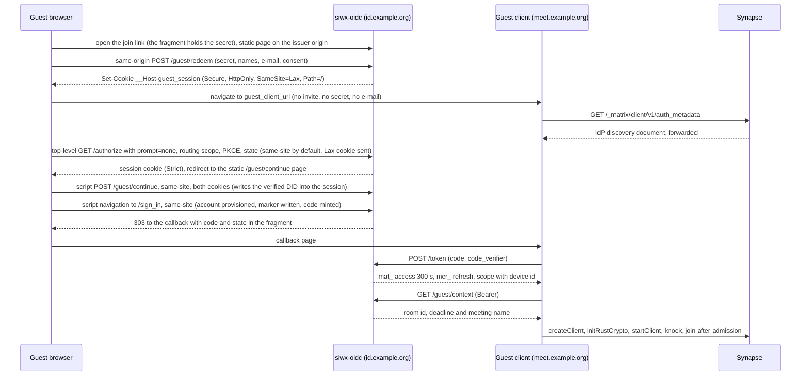

# 03. The guest client ("Element Meet")

Status: DRAFT design, part of the guest portal document set. Design only, nothing here is implemented. "Element Meet" is
a working name only: no upstream product of that name exists, and the public name is an open decision (open decision 9).

Scope: what the guest runs in the browser, and how that client is authenticated by siwx-oidc without the guest ever
seeing a login screen. Account minting, invite handling, security limits and the claim flow belong to the other
documents in this set and are referenced, not repeated.

Sizes used below: S is up to 2 days, M is up to 2 weeks, L is more than 2 weeks, for one engineer who knows the code.
They are planning sizes, not commitments.

The marker `(revised, see D<n>)` on a requirement points to decision `n` of the [decisions log of the overview](00-overview.md#7-decisions-log).
Those decisions settle contradictions between the documents of this set, and each stays open for the maintainers. The word
"claim" is reserved for the passkey-link ceremony (05); the server-side fact that an account is a guest is called the guest marker.

## Sources and citation conventions

| Prefix | Source | Version | Commit |
|---|---|---|---|
| (none) | this repository, `path:line` | origin/main on 2026-09-30 | `3547bd2` |
| `ew:` | element-web, `apps/web/src/` | v1.12.30 | `f19cfd9` |
| `ew-root:` | element-web, repository root (`apps/`, `packages/`, `modules/`) | v1.12.30 | `f19cfd9` |
| `sdk:` | matrix-js-sdk, `src/` | v43.0.0 (the version `ew:` pins, `ew-root:apps/web/package.json:84`). The one js-sdk reference of this set: 02 cites the same version. Element Call's own lockfile pins an older develop commit (`24929be`, 50 commits earlier), which no reference uses | `5723f58` |
| `ec:` | Element Call, repository root | v0.26.1 (released 2026-09-28) | `9f7c35c` |
| `lk:` | lk-jwt-service, `src/` | v0.7.0 | `6c76125` |
| `syn:` | Synapse | v1.161.0 | `a33b01f` |

Upstream facts were read from shallow clones of those tags. Anything that could only be established by running a
browser or a call is marked Unverified in the validation table at the end.

## 0. Summary

1. **There is no upstream product called "Element Meet".** It is the maintainers' working name only (D10). Section 1 lists
   what was searched and the four real upstream pieces that come closest. A name that suggests no upstream product or
   endorsement is the maintainers' decision.
2. **Recommended client: a thin, purpose-built browser client** (a static single-page app) that uses matrix-js-sdk for
   sign-in, sync and crypto, and mounts the experimental Element Call React component for the call. Stock Element Web
   cannot be reduced to "one room, one call" by configuration, forces or prompts key setup, and on phones redirects to an
   app-download page before it loads (section 2). Because the Element Call embedding is experimental, the
   recommendation is gated by spike S1, an explicit go/no-go with a stated fallback (section 5.6, D10).
3. **Hand-off: standard OAuth 2.0 authorization code with PKCE against a dedicated, statically registered public client,
   with `prompt=none` and the routing scope of 01, completed without any screen by the guest session cookie that siwx-oidc
   holds on its own origin and the issuer-side ceremony of 01 (D4).** The invite link targets the issuer and the onboarding
   form lives on the issuer origin, so the invite secret never reaches the client. No login UI, no consent UI, no dynamic
   registration by guests. It needs one new branch in `/authorize` (section 3).
4. **The client can end a session, it cannot be the thing that enforces it.** A revoked guest is noticed by the client
   within about 2.5 minutes, but already-minted OpenID tokens keep working for up to an hour (verified) and LiveKit media
   probably does too (unverified, test S3). Server-side eviction from the SFU and a room-membership check in
   lk-jwt-service are hard prerequisites (P1 and P2, GP-CLI-07).
5. **The call room is encrypted (D7).** Per-participant media keys are the only confidentiality control while P1 and P2
   are open, and the client refuses to join an unencrypted room (GP-CLI-12).
6. **Element Call 0.26.1 gives no user feedback when camera or microphone access fails.** The client must run its own
   device check before mounting the call (GP-CLI-09).

### Prerequisites outside this repository (hard gates, D11)

| Gate | Prerequisite | Where it bites in this document |
|---|---|---|
| P1 | lk-jwt membership enforcement (Synapse `msc4502_enabled` plus a small lk-jwt patch that calls the existing membership check on the routes Element Call actually uses). Hard dependency before any guest exists, on dev too. | [4.3](#43-what-lk-jwt-service-needs-from-the-client), GP-CLI-07 |
| P2 | SFU eviction and a short SFU token lifetime before production (lk-jwt kick PR or equivalent). The OpenID token lifetime is a Synapse constant (`synapse/rest/client/openid.py:72`) and is not configurable; P1 covers confidentiality for that half. | [3.6](#36-revocation-mid-call-teardown-and-logout), GP-CLI-07 |
| P3 | Synapse 1.162.0 or later before the module goes live, then re-read 02 against that version. Federation off for a guest deployment (a remote knock reaches no hook). | [4.3](#43-what-lk-jwt-service-needs-from-the-client) |
| P4 | the guest policy module (separate repository, licence path decided by the maintainers with counsel). | [4.3](#43-what-lk-jwt-service-needs-from-the-client), spike S1 |

## 1. What upstream "Element Meet" is

**Answer: nothing of that name exists upstream as of 2026-09-30.** No product, repository, release, feature or
documentation page. Searches run (2026-09-30):

| Search | Result |
|---|---|
| All repositories of the `element-hq` GitHub organisation, sorted by push date | none named meet or element-meet. Nearest: `element-call`, `lk-jwt-service`, `element-modules`, `ess-helm` |
| GitHub repository, issue and code search for "Element Meet", "element-meet", "meet.element.io" in `element-hq` and `matrix-org` | no exact hit. Fuzzy hits concern Jitsi only |
| element.io pricing page and sitemap | products: Element Server Suite Community and Pro, Synapse Pro, Element Pro. No meet, call or guest feature |
| Element Server Suite Pro introduction on docs.element.io | components: Synapse Pro, MAS, Element Admin, Element Web, Element Call, Advanced IAM and others. No guest feature |
| Element blog, four web search phrasings (incl. "guest", "self-host") | no product page or announcement |

Name collisions to keep apart: `meet.element.io` is Element's Jitsi Meet server (a legacy widget integration, not
Matrix-native); Meedio is a third-party vendor building on Element Server Suite Pro (announced by Element on
2026-03-26, https://element.io/blog/meedio-partners-with-element-to-deliver-sovereign-communications-across-europe/),
whose public pages say nothing about guest join or authentication.

**Consequence.** In this document "Element Meet" names a client profile: the smallest browser client that signs in as a
server-minted guest and joins the MatrixRTC call of exactly one room. The name is a working name only, and the maintainers
may want a different, trademark-neutral public name, since the working name invites confusion with Jitsi Meet and Meedio
(open decision 9, D10).

The four real upstream things that come closest, and what each tells us:

| Upstream piece | What it is | Guest join and auth | Licence, release state | Use here |
|---|---|---|---|---|
| Element Call standalone "link calls" (`ec:docs/url_params.md`, `ec:docs/self_hosting.md:263-277`) | The full Element Call app as a web page. Element Web shows a "share guest link" button when `element_call.guest_spa_url` is set and the room is public or knock (`ew:components/views/rooms/RoomHeader/CallGuestLinkButton.tsx`, `ew:hooks/room/useGuestAccessInformation.ts`) | Password login only (`ec:src/auth/useInteractiveLogin.ts:44`). A "guest" is a passwordless real account created by `POST /register` (`ec:src/auth/useRegisterPasswordlessUser.ts`). Shared-key E2EE through a `password` URL parameter. No OIDC code anywhere in `ec:src/auth` | AGPL-3.0 or Element Commercial. Self-hostable. v0.26.1 | Not usable: `/register` is refused under delegated auth (element-call issues #940, #4055 and #4220 track guest access) |
| `restricted-guests` module pair (Synapse module `module/restricted-guests/v1.0.3`, 2026-09-02, in `element-hq/element-modules`; Element Web module v1.1.0 in `ew-root:modules/restricted-guests`) | "Join as guest" button in Element Web. The web half POSTs a display name to `/_synapse/client/register_guest` and logs in with the module API call `overwriteAccountAuth` (`ew:modules/Auth.ts:16-37`) | Unauthenticated, un-rate-limited endpoint. Under MAS it mints a user and a 24 h personal session (no refresh) through the MAS admin API. No OAuth flow for the guest | AGPL-3.0 or Element Commercial. Self-hostable | Reuse its per-user restrictions idea (other documents). Its minting half is coupled to the MAS admin API, which siwx-oidc does not have, so it cannot be pointed at siwx-oidc by configuration |
| Element Call as a React component (`ec:README.md:224-309`, `ec:component/index.tsx`) | Experimental. The host supplies an already-synced `MatrixClient` and a room id; Element Call does no authentication and keeps no session | Entirely the host's | AGPL-3.0 or Element Commercial. Not published to npm, consumed as a git dependency built by a `prepare` script. Marked EXPERIMENTAL | The call UI of the recommended client |
| Element Server Suite guest recipe (docs.element.io, ESS "Setting up Element Call") | Two homeservers: the main one with closed registration, and a federation-restricted guest homeserver with open registration whose Element Call uses the main SFU | Ordinary open-registration Synapse, not delegated auth | ESS documentation, not a product feature | Not usable as documented: open registration. A variant whose guest homeserver delegates to the same siwx-oidc is evaluated in [2.4](#24-alternative-a-dedicated-guest-homeserver-that-delegates-to-the-same-siwx-oidc-d20) and is not adopted |

## 2. Candidate client architectures

### 2.1 What the Element configuration keys really do (element-web v1.12.30)

| Key | Real semantics | Evidence |
|---|---|---|
| `force_verification` | Default false. Only applies to a fresh login of a non-guest on a device where cross-signing is not ready (`must_verify_device` flag). Then the app is blocked behind `COMPLETE_SECURITY` and the skip button is hidden. Existing sessions are never forced. The existing Element deployment used with siwx-oidc sets it true, so guests need their own instance or config | `ew:SdkConfig.ts:32`, `ew:Lifecycle.ts:903-906`, `ew:components/structures/MatrixChat.tsx:1369-1380`, `docs/audits/2026-07-25-verify-with-other-device-gap-evaluation.md:181-182` |
| First login without the above | A brand-new account (no cross-signing keys) silently bootstraps cross-signing and key backup in an `E2E_SETUP` view, no prompt. An account that already has cross-signing keys gets the verify screen. No configuration flag suppresses either. `io.element.e2ee.force_disable` only helps if the user is in no encrypted room | `ew:MatrixChat.tsx:401-446`, `ew:stores/InitialCryptoSetupStore.ts:92-123`, `ew:utils/crypto/shouldSkipSetupEncryption.ts:20-29` |
| `disable_guests` | Default false. When false and there is no stored session, the app calls `registerGuest` (`POST /register?kind=guest`), which delegated auth refuses, then falls back to the welcome page. Set true to avoid the failing call and the legacy guest code paths | `ew:vector/app.tsx:153`, `ew:Lifecycle.ts:177-215` |
| `sso_redirect_options.immediate` | Redirects straight to the OAuth issuer when there is no stored session and the page is not an OAuth return. It does apply to native OAuth login, and restores the original `#/room/...` hash afterwards. Without a static client id it first POSTs `/register`, so every guest page load would mint a client | `ew:vector/app.tsx:61-74,107-141`, `ew:vector/routing.ts:98-107` |
| `element_call` | Only four subkeys exist: `use_exclusively`, `disable`, `brand`, `guest_spa_url`. There is no `url` or `participant_limit`. Element Web serves its own bundled Element Call 0.26.0 from `./widgets/element-call/` on its own origin | `ew-root:packages/shared-types/lib/config.json.d.ts:123-128`, `ew:models/Call.ts:750-754`, `ew-root:apps/web/package.json:125` |
| `UIFeature.*` | 18 flags, config level only. None hides the room list, the composer, the timeline or the settings dialog. `UIComponent` hiding needs a module and still leaves room list and composer | `ew:settings/UIFeature.ts:10-29`, `ew-root:packages/module-api/src/api/customisations.ts:12-52` |
| `oidc_static_clients` | `{ "<issuer with trailing slash>": { "client_id": "..." } }`. Skips dynamic registration for that issuer. Only `client_id` is read, never a secret | `ew:utils/oauth/registerClient.ts:21-28`, `ew-root:packages/shared-types/lib/config.json.d.ts:201` |
| Mobile redirect | On iOS and Android user agents the page redirects to `mobile_guide/` after the config is loaded, unless the URL has a deep-link location or `sessionStorage.skip_mobile_redirect` is `"true"`. No config key controls it. The OAuth return URL (`/?...#code=...&state=...`) parses to an empty location, so on a phone the return leg is redirected too | `ew:vector/index.ts:140-157`, `ew:vector/url_utils.ts:23-29` |

There is no kiosk, single-room or guest mode in Element Web (no hits for `hide_ui`, `mx_guest` or similar in
`apps/web/src`). A non-member who follows `#/room/!id:example.org?via=example.org` lands in the full Element shell with a
room preview bar and a Join button (`ew:components/structures/RoomView.tsx:880-925,1696-1725`,
`ew:components/views/rooms/RoomPreviewBar.tsx:373-486`).

### 2.2 Comparison

Column B stands for an upstream "Element Meet": it does not exist (section 1), so the column shows the
nearest real implementation, the `restricted-guests` pair. T1 and T2 are the two ways a thin custom client can host
Element Call.

| Criterion | A. Element Web, guest config (+ runtime module) | B. `restricted-guests` pair (nearest upstream) | C. Element Call standalone | T1. Thin client + Element Call component | T2. Thin client + Element Call widget in an iframe |
|---|---|---|---|---|---|
| Delegated auth, custom issuer | Yes, native OAuth2 code flow. The issuer is found only through `GET /_matrix/client/v1/auth_metadata`, not through `.well-known` (`sdk:client.ts:9028-9039`), and Synapse can serve it only if the IdP discovery document carries `account_management_uri` (`syn:synapse/api/auth/mas.py:67-71`) | No OAuth flow. Tokens come from a Synapse module via the MAS admin API. Cannot target siwx-oidc by configuration | No. Password login, guests via `POST /register` (refused) | Host owns auth. Uses the js-sdk v43 `OAuth2` class and built-in token refresh | Same as T1 |
| Guest lands in one room and call | No. Element shell, preview bar, Join button, then start the call | No. Same shell plus a "join as guest" button | Yes (`/room/#/<alias>?roomId=...`), then lobby | Yes, by construction. Room comes from the invite, never from the URL | Yes |
| No room list, chat, settings | Not by configuration (2.1) | Partial (hides six components for `@guest-` accounts; the predicate looks inverted at `ew-root:modules/restricted-guests/src/index.tsx:78-85`, unverified) | Yes | Yes, nothing else is built | Yes |
| No forced verification or cross-signing prompts | `force_verification` must be false. New account still runs the silent cross-signing and backup bootstrap. Second device of a claimed account gets the verify screen | Same as A | No crypto UI | Yes. Only device keys are uploaded. No cross-signing, no backup | Same as T1 |
| E2EE media keys, fresh device | Per-participant if the room is encrypted. Needs Olm and device keys, supplied by Element Web's client | Same as A | Shared key from a `password` link secret, or per-participant if the room is encrypted | Per-participant only: component mode has no `password` (`ec:src/UrlParams.ts:458-474`). Needs the host's rust crypto | Per-participant, to-device messages forwarded by the widget driver |
| Deep link to a room | `#/room/!id:example.org?via=example.org`, hash restored after login | Same as A | `/room/#/<alias>?roomId=...&password=...` | Own route, for example `/j/<invite>` | Same as T1 |
| Branding | `brand`, theme, `embedded_pages` | Same as A | `config.json` | Full control | Full control |
| Hosting footprint | Element Web bundle (with bundled Element Call 0.26.0) and `config.json` | A plus a Synapse module and MAS admin client credentials | Static Element Call app. Upstream wants a homeserver with open registration | One static app: js-sdk, rust-crypto WASM, livekit-client, Element Call component | T1 minus the component, plus the Element Call embedded package and a widget driver |
| Mobile browser | Hard redirect to `mobile_guide/` (2.1). Workaround needs a same-origin pre-landing page that sets `skip_mobile_redirect` | Same as A | Runs in mobile browsers, iOS audio-output handling exists (`ec:src/state/MediaDevices.ts:119,261-278`). Device test needed | Same call UI, container-query layout (`ec:README.md:249-253`). No Element Web redirect. Device test needed | Same, plus iframe `allow` permissions for camera and microphone |
| Maintenance across upgrades | Config plus a runtime module (Module API). Element Web releases often. The existing deployment already carries vendored patches (`docs/audits/2026-07-25-verify-with-other-device-gap-evaluation.md:466`) | Module pair and MAS coupling | A fork would be needed to add OIDC | One experimental, unpublished git dependency. Element Call builds against js-sdk `develop` (`ec:package.json:106`) while the component declares the peer as `*` (`ec:component/package.json:38`): pin js-sdk v43.0.0 and test | Re-implement a widget driver of about 850 lines (`ew:stores/widgets/ElementWidgetDriver.ts`) and follow its capability list |
| Licence | AGPL-3.0 or Element Commercial (Element Web core files also GPL-3.0) | AGPL-3.0 or Element Commercial | AGPL-3.0 or Element Commercial | Client links an AGPL component, so the client is AGPL-covered. js-sdk and matrix-widget-api are Apache-2.0 | Same as T1 |
| Verdict | Poor fit | Not applicable (no OAuth, MAS coupled) | Not possible without a fork | **Recommended, gated by spike S1 (D10)** | Fallback shell if the component proves unstable |

### 2.3 Reading of the table

The decisive rows are three. Stock Element Web cannot hide its shell (A), a guest on a phone is redirected away before
sign-in completes (A, B), and upstream Element Call has no delegated-auth path at all (C). The remaining choice is how to
host the call. Both T1 and T2 depend on the experimental Element Call embedding, so the recommendation holds only if spike S1
passes (section 5.6). T1 is the smaller build because the `MatrixClient` the component needs is about 60 lines in upstream's own
reference host (`ec:component/dev/session.ts:30-70`: create client with tokens, `initRustCrypto`, `startClient`, wait for
sync, `joinRoom`). T2 would add a widget driver for no user-visible gain, but keeps the shell, OAuth, crypto and teardown
code identical, so it is a cheap fallback if the experimental component breaks.

### 2.4 Alternative: a dedicated guest homeserver that delegates to the same siwx-oidc (D20)

The Element Server Suite recipe of section 1 uses two homeservers: a main one and a federation-restricted guest homeserver
that shares the main SFU. The variant evaluated here keeps that topology but makes the guest homeserver delegate authentication
to the same siwx-oidc issuer, so guests keep the custodial key, the silent hand-off and the claim flow of this set. It is a
different option from the open-registration recipe that section 1 rules out.

| Aspect | Result |
|---|---|
| What it would remove | On a homeserver that serves guests alone, the global knobs of 02 become acceptable (`enable_set_displayname`, `allow_per_room_profiles` and `enable_set_avatar_url` off, a low global `max_upload_size`, presence off, a directory that holds only guests and their hosts): fallback F-a of 02 3.4 becomes the default. The directory, profile and storage confinement work of the module (02 GP-SYN-08, GP-SYN-11, GP-SYN-13 and the residual rows of 02 3.6) largely disappears, and a module defect can no longer reach ordinary accounts. |
| A remote knock reaches no hook | Hosts and their rooms live on the main homeserver, so a guest on the guest homeserver would knock over federation. A remote knock reaches no module hook on the receiving homeserver (02 section 2 row 5a, `syn:synapse/handlers/federation.py:880`), and P3 (no federation for a guest deployment) could no longer hold. If the call rooms live on the guest homeserver instead, hosts need accounts there and the room sits outside the host's ordinary Element account. |
| Claim needs the account on the main homeserver | R4 makes a claimed guest a permanent account. An MXID carries its homeserver name and the DID binding is fixed at creation (an account's DID never changes), so an account created on the guest homeserver stays there. A claim would leave a permanent account on a guest-only server, or need a re-homing that the binding rule forbids. |
| siwx-oidc serves one homeserver | The configuration holds one `synapse_endpoint`, one `matrix_server_name` and one `mas_shared_secret` (`src/config.rs:193-206`), and introspection answers by token value with that one secret (`src/introspect.rs:82-100`). Two homeservers need multi-homeserver support in every provisioning path, or a second siwx-oidc instance, which is no longer the same issuer. |
| Two deployments to run | A second Synapse with its database, media store, secrets and upgrade train (P3 twice). The SFU and lk-jwt would serve both names: the binding rule of 02 GP-SYN-01 names one homeserver, so it would have to change. |

**Decision row (D20, stays open for the maintainers).** Not adopted in v1. The design stays on one homeserver with the module of
02. If the maintainers prefer this option, fallback F-a of 02 becomes the default, the confinement work listed above shrinks,
and the claim of 05 needs a separate design (no claim, or a permanent account that stays on the guest homeserver).

## 3. The OIDC hand-off

### 3.1 What the reference client sends

Element Web 1.12.30 on matrix-js-sdk 43.0.0 is the reference for what any Matrix web client does. The thin client reuses
the same SDK calls, so these are also its requests.

| Step | Client behaviour | Evidence |
|---|---|---|
| Discovery | Only `GET {homeserver}/_matrix/client/v1/auth_metadata`. The `.well-known` key `org.matrix.msc2965.authentication` is not read. Required fields: `issuer`, `authorization_endpoint`, `token_endpoint`, `revocation_endpoint`, `registration_endpoint`; `response_modes_supported` with both `query` and `fragment`; `grant_types_supported` with `authorization_code` and `refresh_token`; `code_challenge_methods_supported` with `S256`. Otherwise the client silently falls back to legacy login, which returns 404 under delegated auth | `ew:utils/AutoDiscoveryUtils.tsx:292-303`, `sdk:oauth/discover.ts:83-101` |
| Client id | `oidc_static_clients` if configured, else dynamic registration on every login attempt (no cache). Registration body: `client_name`, `client_uri`, `redirect_uris`, `logo_uri`, `tos_uri`, `policy_uri`, `application_type: web`, `response_types: [code]`, `grant_types: [authorization_code, refresh_token]`, `token_endpoint_auth_method: none`. The id is stored after a successful login under one global localStorage key `mx_oidc_client_id` | `ew:BasePlatform.ts:443-454`, `sdk:oauth/index.ts:73-133`, `ew:utils/oauth/persistOAuthSettings.ts:13-23` |
| Authorize request | `response_type=code`, `response_mode=fragment`, `client_id`, `redirect_uri`, `scope=urn:matrix:client:api:* urn:matrix:client:device:<10 random chars>`, `state`, S256 `code_challenge`. `prompt=create` only from the Register screen. **Never sent:** `login_hint`, `nonce`, `id_token_hint`, `action`. No ID token is validated. The SDK method takes `prompt` and `scope` as caller parameters (`generateAuthorizationCodeGrantUrl(state, redirectUri, responseMode, prompt, scope)`), so a custom client can send `prompt=none` and append a routing scope to the generated Matrix scope | `sdk:oauth/index.ts:167-191`, `sdk:oauth/authorize.ts:83-86`, `ew:utils/oauth/authorize.ts:17-57` |
| Redirect URI | `<origin><pathname>?no_universal_links=true` in Element Web. A custom client passes whatever string it likes to `generateAuthorizationCodeGrantUrl` | `ew:BasePlatform.ts:467-474` |
| Code exchange | `POST token` with `grant_type, client_id, code_verifier, redirect_uri, code`. Needs `token_type: Bearer` and `access_token`; `expires_in`, `refresh_token`, `scope` optional. No secret | `sdk:oauth/index.ts:204-218`, `sdk:oauth/authorize.ts:64-77` |
| Refresh | Eager refresh when the token is within 500 ms of expiry. Body `grant_type=refresh_token, client_id, refresh_token`. One in-flight refresh per tab | `sdk:http-api/refresh.ts:34,88-99`, `sdk:oauth/index.ts:224-236` |
| Refresh failure | Any 4xx with an OAuth error body or any Matrix error means logout (`SessionLoggedOut`). Network errors and 5xx are transient, retried with backoff up to 32 s. A 4xx without a JSON `error` field is treated as transient, so the client retries instead of signing out | `sdk:oauth/tokenRefresher.ts:47-76`, `sdk:http-api/refresh.ts:152-182` |
| Dead token on an API call | `M_UNKNOWN_TOKEN` is refreshed only if the token is within 60 s of its known expiry. Otherwise `SessionLoggedOut` at once. Synapse in delegated mode never sets `soft_logout: true`, so the client takes the hard path: storage and crypto store wiped, "Session removed" dialog | `sdk:http-api/fetch.ts:184-199`, `syn:synapse/api/auth/mas.py:333,343,406`, `ew:components/structures/MatrixChat.tsx:1659-1676`, `ew:Lifecycle.ts:1095-1101` |
| Logout | `client.logout(true)` POSTs both tokens to `revocation_endpoint`. There is no RP-initiated logout: `end_session_endpoint` is not used anywhere | `sdk:client.ts:6900-6912`, `sdk:http-api/refresh.ts:191-203` |

The js-sdk can own the whole token lifecycle for a custom client: `createClient` accepts `accessToken`, `refreshToken`,
`onTokenRefresh`, `oauth2ClientConfig: { clientId, deviceId }` and `authMetadataCallback`
(`sdk:http-api/interface.ts:64-95`). The thin client therefore needs no OAuth library of its own.

### 3.2 What siwx-oidc does today, and why a guest cannot use it unchanged

| Step | Behaviour | Evidence |
|---|---|---|
| Discovery document | Advertises S256 only, `response_modes_supported [query, fragment]`, `grant_types_supported [authorization_code, refresh_token, device_code]`, `revocation_endpoint`, `registration_endpoint`, `prompt_values_supported [login, create]`, and `account_management_uri` when Matrix is configured. It already satisfies every client rule in 3.1 | `src/oidc.rs:680-735` (S256 at 689, response modes at 694, grants at 707, prompts at 711) |
| `POST /register` | Unauthenticated, and the service applies no rate limit (none in `src/oidc.rs:2762-2811`), so a proxy rule is the only place to add one. Returns `client_id`, `client_secret`, registration access token. Rejects redirect URIs with a fragment. The entry lives 30 days from registration and reads do not extend it | `src/oidc.rs:2762-2811`, `:2776-2780`, `src/db/mod.rs:49`, `src/db/redis.rs:679-713`, `docs/api/openapi.yaml:277-298` |
| Static clients | `default_clients` are written at process start through the same `set_client`, so they carry the same 30 day TTL counted from the last restart | `src/axum_lib.rs:1305-1312`, `docs/configuration.md:114,263` |
| `GET /authorize` | Validates client id and redirect URI (query ignored), requires S256 PKCE and `state`, refuses `prompt=none` with `interaction_required`, stores a 5 minute session, sets the HttpOnly `session` cookie (SameSite=Strict) and **always redirects to the login SPA** | `src/oidc.rs:1569-1764`, `:1589-1602`, `:1631-1639`, `:1682-1690`, `:1739-1744`, `src/axum_lib.rs:257-268` |
| Login SPA | The passkey ceremony writes `verified_did` into the session (Path A). The wallet path sets the `siwx` cookie from JavaScript (Path B) | `src/webauthn.rs:834-858`, `js/ui/src/App.svelte:176-180` |
| `GET /sign_in` | Takes the DID from `session.verified_did` or a verified CAIP-122 `siwx` cookie, runs `reject_if_deactivated`, re-validates the redirect URI, provisions the Synapse device (honouring a client-proposed `urn:matrix:client:device:<id>`), mints a 5 minute single-use code, redirects with `code` and `state` (in the fragment for `response_mode=fragment`) | `src/oidc.rs:2488-2753`, `:2523-2525`, `:2673`, `:2683`, `:2688-2692`, `:2727-2745` |
| `POST /token`, code grant | Single-use code, PKCE verified, no secret needed when the client registered `token_endpoint_auth_method: none` | `src/oidc.rs:1331-1543`, `:1395` |
| Tokens | Opaque `mat_` access (300 s) and `mcr_` refresh (90 d); scope `openid urn:matrix:client:api:* urn:matrix:client:device:<id>` | `src/db/mod.rs:90-92`, `src/oidc.rs:1465-1471` |
| `POST /token`, refresh grant | Looks up the refresh token only. It does not authenticate the client and does not check that the client entry still exists. Rotates both tokens with a 60 s replay grace. Refuses a revoked device or a user tombstone with `invalid_grant` | `src/oidc.rs:926-1085`, `:976-988`, `src/db/mod.rs:106` |
| Revocation | `/oauth2/revoke` revokes tokens and never deletes the device. Introspection answers `active:false` for an absent token, and Synapse caches answers for two minutes | `src/compat.rs:228-236`, `src/introspect.rs:82-165` (invariant at `:113-126`) |
| Consent | There is no consent screen anywhere in `/authorize` or `/sign_in` | `src/oidc.rs:1569-1764`, `:2488-2753` |

What follows for a guest:

1. **No code path completes `/authorize` without a DID proof produced inside the authorize session.** The proofs are a
   passkey assertion (Path A) and a client-held key signature (Path B). The guest holds neither (R1, R3). The hand-off needs
   exactly one new proof source: a server-verified guest session (3.3).
2. **`prompt=none` is refused today** (`src/oidc.rs:1631-1639`) with the correct OIDC answer for "no session". It becomes the
   natural switch for silent completion.
3. **Both client-id options expire.** Dynamic ids die 30 days after registration. Static ids die 30 days after the last
   siwx-oidc restart. Because refresh does not look at the client entry, sessions that are already signed in survive, but the
   next authorize or code exchange fails with `Unrecognised client id`. A guest portal client must not rely on either: the
   static client must be made non-expiring by a code change (GP-CLI-02), because siwx-oidc writes `default_clients` with the
   30 day TTL at every start.
4. **Cookie facts (D4).** The `siwx` cookie is set by JavaScript and is not HttpOnly; the `session` cookie is the one that matters for `/authorize`.

   | Cookie | Set by | Attributes | Role |
   |---|---|---|---|
   | `session` | `authorize`, `src/oidc.rs:1681-1689` | HttpOnly, SameSite=Strict, `Secure` only when the request `redirect_uri` is https, 300 s | The cookie that matters for `/authorize` today: it carries the OIDC session id to `/sign_in`. Strict is not sent on a redirect chain that started cross-site (Unverified, test S4), which is why the login page hops by script |
   | `siwx` | JavaScript of the login SPA, `js/ui/src/App.svelte:176-180` | **not HttpOnly**, `sameSite: 'Strict'`, `secure` by page scheme | Wallet proof for Path B. A page on another origin cannot set it (host-only, SameSite=Strict), and Path B verifies a signature, so nothing changes for the design |
   | `siwx_user` | `sign_in` handler, `src/axum_lib.rs:270-320` | identity hint only, never an authenticator (`src/axum_lib.rs:495-534,937`) | Scopes the passkey picker |
   | `__Host-guest_session` (new) | guest redeem on the issuer (01) | Secure, HttpOnly, SameSite=Lax, Path=/ | The guest session, section 3.3 |

   The OpenAPI text for `/authorize` ("issues the `siwx` session cookie", `docs/api/openapi.yaml:170-171`) is stale: the
   code sets the `session` cookie.

### 3.3 The guest hand-off (revised, see D4)

The default topology is same-site (D19): the client and the issuer share a registrable domain, for example `meet.example.org` and
`id.example.org`, so the hand-off navigation is same-site. The design speaks of site, not origin (01 section 5.2); the
`cross-site` topology is an option that an operator selects with `guest_client_topology`.

The invite link targets the issuer, not the client: `https://id.example.org/guest/join/<invite_id>#<secret>` (01). The join page,
the onboarding form (first and second name, optional or enforced e-mail, consent) and the redeem POST are all on the issuer
origin. Consent is given at the data controller, the invite secret is read only by issuer scripts, and the client needs no
invite awareness. The same-origin redeem POST sets the guest session cookie directly.



The routes `/guest/join`, `/guest/redeem`, `/guest/continue` and `/guest/context` are fixed by 01, and so is the ceremony
between `/authorize` and the code. The guest sees no screen between the join page and the client: the two hops on the
issuer origin render nothing. What this document fixes is what the client sends and what it must handle.

**What the client sends.** `generateAuthorizationCodeGrantUrl(state, redirectUri, "fragment", "none", scope)` with `scope`
set to the generated Matrix scope plus the routing scope (`sdk:oauth/index.ts:167-191`, `sdk:oauth/authorize.ts:83-86`).
The routing scope is the provisional `urn:io.inblock:guest` of 01. It only selects the guest branch of `/authorize`, it is
not advertised in discovery, and it is never the security boundary. The granted token scope stays the fixed
`openid urn:matrix:client:api:* urn:matrix:client:device:<id>` whatever was requested (`src/oidc.rs:1464-1475`).

**What `/authorize` does for a marker request (owned by 01, stated here as the client contract; siwx-oidc change, M):**

1. The client id, redirect URI and `state` are validated first, exactly as today. Then three cases. The routing scope with
   `prompt=none`, a live `__Host-guest_session` cookie (a guest record that may still sign in, state and deadline as in 01)
   and the guest client with an exact redirect URI from `guest_client_redirect_uris`: `authorize` creates the session and
   redirects to `/guest/continue` (01 GP-FLOW-06). With `guest_client_topology` at its default `same-site` (D19) the marker
   branch also refuses a navigation whose `Sec-Fetch-Site` is `cross-site` when the header is present: a legitimate hand-off
   from the client is `same-site`, so this stops a third-party page from driving the silent hand-off. The routing scope without a live cookie: `interaction_required` on the
   registered redirect URI, and the login page is never rendered. `prompt=none` without the routing scope: refused as today
   (`src/oidc.rs:1631-1639`). The guest client never sees the login SPA; with no guest session it hands the browser to the issuer page `GET /guest/ended`
   (GP-CLI-13, 01 C5), and a hand-off that fails for any other reason ends at the callback-error screen of 06 G2.
2. The guest session authenticates guest accounts only. It is a separate store and cookie, not the existing `siwx_user`
   cookie, which is deliberately only an identity hint for passkey picker scoping and never an authenticator
   (`src/axum_lib.rs:495-534,937`). The DID comes from the server-side guest record bound to the cookie and is written into
   the session by `/guest/continue`. The request carries no identity, and the routing scope carries none. It must never
   yield a code for a DID that the record does not name, nor for a client other than the guest client (GP-CLI-03).
3. `sign_in` stays the only code-issuing site. The ceremony reaches it by the hop the login page already uses
   (`js/ui/src/App.svelte:186-188`): `authorize` and `/guest/continue` are same-origin pages, and the script `POST` and
   `location.replace("/sign_in")` are same-site requests that carry the Strict `session` cookie together with the Lax guest
   cookie, which a redirect chain that started cross-site would not (Unverified, test S4). The alternative considered in 01
   (its open decision 17) completes inside `/authorize` with the tail of `sign_in` factored out. The client cannot tell the two
   apart, since both end in one redirect with `code` and `state`. The price is a second code-issuing site and a reordering
   around the pinned gate order, so this document follows 01's recommendation.
4. Keep the pinned order: `reject_if_deactivated` before `resolve_identity_or_legacy` (`AGENTS.md`, "Sign-in gates";
   pinned by `sign_in_deactivation_order_tests`). The guest additions of 01 (localpart assertion, and the marker write of
   02 GP-SYN-07 between `provision_user` and `upsert_device`) sit around those calls. Keep PKCE, `state`,
   registered-redirect-URI and fragment-mode handling as they are (`src/oidc.rs:1589-1602,1739-1744,2683,2733-2745`).
5. Advertising `none` in `prompt_values_supported` (`src/oidc.rs:711`) is optional: the js-sdk does not read that field.
6. The guest session does not set `siwx_user` (`src/axum_lib.rs:270-320`). The claim commit does (05 GP-CLM-14).
7. `interaction_required` is delivered in the query of the redirect URI even in fragment mode (`src/oidc.rs:1631-1639`),
   while a code arrives in the fragment. The client callback reads the error from both places.
8. New routes need OpenAPI entries in the same change (`tests/openapi_covers_every_route.rs`) and `e2e/synapse_mock.py`
   must follow any new Synapse call (`AGENTS.md`, "Build and test").

**Cookie attributes.** `__Host-guest_session`: `Secure`, `HttpOnly`, `SameSite=Lax`, `Path=/`, no `Domain`. The `__Host-`
prefix means a sibling subdomain cannot plant it. It carries an opaque id with the DID only in Redis (same pattern as
`create_user_session`), and its lifetime equals the guest deadline. `Lax` and not `Strict` because the silent hand-off must also
work in the `cross-site` topology, where it is a top-level GET from the client origin to `/authorize` across registrable
domains: Lax cookies are sent on it, Strict cookies are not. In the default same-site topology (D19) the navigation is
same-site and Strict would be sent too, so Lax is what a `cross-site` operator alone relies on. `Path=/guest` could not cover
`/authorize`. The Strict `session`
cookie that `/authorize` sets is unchanged and carries the ceremony hops. On plain-HTTP
development the existing cookies relax `Secure` (`src/oidc.rs:1683`), so dev uses an unprefixed name, because `__Host-`
requires `Secure`.

**CSRF.** Lax is not sent on cross-site POSTs. State-changing guest routes are `POST` (01 GP-FLOW-25), check `Origin` and
`Sec-Fetch-Site` and refuse a cross-site request, and keep a same-origin-only CORS posture: the global
`Access-Control-Allow-Origin: *` layer carries no credentials (`src/axum_lib.rs:1568-1577`), so a credentialed cross-origin
fetch fails. The marker request to `/authorize` is a GET
that only starts a session bound to the registered redirect URI and the client's PKCE challenge, and any code goes to that
redirect URI, so a cross-site GET to it gives an attacker nothing. In the same-site topology the marker branch refuses a
`cross-site` navigation outright, which removes the burning of devices by a third-party page (04 GP-SEC-67) instead of only
bounding it.

**Why the onboarding form is on the issuer origin.** A form on the client origin would need a cross-origin credentialed
`fetch` to the issuer, which is a third-party-cookie request that Safari and Chrome restrict, or an extra grant hop by
navigation. On the issuer origin the same-origin POST sets the cookie, the consent is shown by the data controller, and
the invite secret in the URL fragment reaches no client code and no server log.

**A guest link is a bearer capability by design.** Planting someone else's cookie (login CSRF) needs a cross-site POST that
the `Origin` check refuses. Even if it succeeded, it only makes a victim join the call of the link's owner, which any invite
link already does. It grants no capability beyond the invite.

### 3.4 Client id, redirect URI, device scope

| Item | Decision | Reason and evidence |
|---|---|---|
| Client id | One static, public client per deployment (`token_endpoint_auth_method: none`), created through `default_clients`. Guest browsers never call `/register` | `/register` is open and unauthenticated (`src/oidc.rs:2762`). Without a static id the reference client registers on every attempt. The js-sdk sends no secret, and siwx-oidc with `require_secret` true answers "Secret required" for a client whose metadata names no auth method (`src/oidc.rs:1394-1398`, `docs/configuration.md:115`) |
| Client TTL | Static client must not expire. This needs a code change, because `default_clients` are written with the 30 day TTL at every start: write them without TTL, or refresh the TTL on use (S) | `src/axum_lib.rs:1305-1312` with `src/db/redis.rs:686-691` gives a 30 day cliff from the last restart |
| `client_name` | A neutral product name such as "Video call" | It becomes the Synapse device display name of every guest device (`src/oidc.rs:2082-2100`) |
| Redirect URI | One exact URI, `https://meet.example.org/oauth/callback`, no query, no fragment, also listed in the siwx-oidc guest redirect allow-list of 01 | `register` rejects fragments (`src/oidc.rs:2776-2780`). `authorize` and `sign_in` compare with the query stripped (`:1589-1602`, `:1925-1951`), which also tolerates the reference client's `?no_universal_links=true`. The js-sdk returns the code in the fragment (`response_mode=fragment`), which siwx-oidc supports (`:2733-2745`) |
| Device scope | The client proposes `urn:matrix:client:device:<id>` (js-sdk: 10 random characters). siwx-oidc reads it from the session scope and upserts that Synapse device | `sdk:oauth/authorize.ts:83-86`, `src/oidc.rs:2043-2055`, `:2688-2692`. Synapse checks the device row on introspection only for a token that names a device (`if device_id is not None`) and never reads `is_deactivated` (`syn:synapse/api/auth/mas.py:385-406`). siwx-oidc therefore asserts at mint, at the code exchange and at every refresh, that a guest token carries the device scope of a device in the guest record, and issues none without it (02 GP-SYN-09): a deviceless guest token would survive device deletion until introspection turns inactive |
| Routing scope | The client appends `urn:io.inblock:guest` (provisional, 01) to the generated Matrix scope. It selects the guest branch only, is not advertised in discovery and is not a boundary | `sdk:oauth/index.ts:181`, `src/oidc.rs:1677` (the requested scope is stored verbatim), `src/oidc.rs:1464-1475` (the granted scope is fixed) |
| Device lifetime | With an in-memory crypto store a page reload runs the silent authorize again and creates a new device. Acceptable for ephemeral accounts: devices disappear with the account | Open decision 6 |

### 3.5 Token refresh in a short session

1. Access tokens live 300 s and refresh tokens 90 d (`src/db/mod.rs:90-92`). A one hour call means about twelve
   refreshes. The js-sdk does them itself once `refreshToken` and `oauth2ClientConfig` are supplied.
2. Do not lengthen access tokens for guests. The session cap is enforced on the server by refusing refresh and revoking
   (`revoke_all_user_tokens` plus the user tombstone, `src/db/redis.rs:281-307`; the refresh handler already reads the
   tombstone at `src/oidc.rs:976-988`). Teardown uses it and a claim never does: the tombstone would lock the claimant out,
   so a claim revokes per device (D3, 05). This matches siwx-oidc's model and keeps guests on the same code paths as users.
3. A refresh refused with `invalid_grant` is a 400 JSON OAuth error, so the js-sdk signs out (3.1). If the IdP is merely
   unreachable the client retries with backoff and the call continues until the access token dies.

### 3.6 Revocation mid-call, teardown and logout

| Event | First client signal | Latency bound | Evidence |
|---|---|---|---|
| Guest tokens revoked at the IdP | Synapse answers 401 `M_UNKNOWN_TOKEN` on the next request, the SDK emits `SessionLoggedOut`, the client tears down | Synapse caches introspection for 2 minutes, plus one sync long-poll. A refresh attempt fails at the latest one access lifetime (5 minutes) after | `src/introspect.rs:113-126`, `sdk:http-api/fetch.ts:184-199` |
| Account deactivated and refresh refused | Next refresh gets `invalid_grant`, the SDK signs out | at most 300 s | `src/oidc.rs:976-988` |
| Media in LiveKit | **None.** The LiveKit join token is valid 1 hour and is checked when joining (Unverified for the already-connected case, test S3). P2 closes this before production | up to 1 hour | `lk:src/handler.rs:70` |
| Already-minted OpenID token | **None.** It stays valid for 1 hour, is not removed on deactivation, and lk-jwt accepts it without a membership check until P1 lands, so a revoked guest can still obtain a new LiveKit token | up to 1 hour, then the new LiveKit token adds another hour | `syn:synapse/rest/client/openid.py:72`, `syn:synapse/storage/databases/main/openid.py:41-56`, `lk:src/handler.rs:674-698,901-976` |

Client teardown on `SessionLoggedOut`, on hang-up, or when the guest presses Leave: unmount the call, stop the Matrix
client, clear IndexedDB and storage. After hang-up or Leave the client then shows its own end screen (06 G5). After
`SessionLoggedOut` it hands the browser to the issuer page `GET /guest/ended` (01 C5), because only the issuer origin can read
`GET /guest/resume` with the guest cookie, and that state decides between the copy for an ended session and the copy for a kept
account (06 G6 `closed`, `closed-kept`). The client draws the two states it can tell for itself, `time-up` (its own clock against
the deadline of `GET /guest/context`) and `removed` (a leave event by another sender), as 06 G6 shows. The client cannot send its own `m.call.member` leave once its
token is dead, and the server does no call-state cleanup in v1 (D2). Membership then relies on the delayed leave event the
call registered earlier (js-sdk default delay 8 s, restarted every 5 s, `sdk:matrixrtc/MembershipManager.ts:440-444`)
firing after restarts stop (Unverified, needs Synapse delayed events, test S3). Where it does not fire, a stale entry
remains in room state: a cosmetic residue with a host-side mitigation (02 section 6.1). The SDK drops the entry of a user who
is no longer joined to the room from the participant list (`sdk:matrixrtc/MatrixRTCSession.ts:1020,1052-1074`), so a stale
entry does not show as a participant once the account has left the room.

Logout UX. "Leave call" calls `hangUp()` on the call handle and keeps the session: the guest is still a room member and the
same browser can resume (01 section 8). "End session" calls `POST /guest/end` with the Bearer token (01; the endpoint also accepts
the `__Host-guest_session` cookie, with the Origin and Sec-Fetch-Site check and a 409 for a claimed account, which is how the
claim page of 05 offers "Delete everything now", D18; the two labels name the same endpoint), then `client.logout(true)`, which revokes both tokens at `/oauth2/revoke` (tokens only, the device stays,
`src/compat.rs:228-236`), then the client navigates the whole tab to the issuer page that clears the guest cookie (the
js-sdk has no RP-initiated logout), then shows the end screen. The claim offer of R4 lives on the end screen after "Leave
call" (05). After a claim the account is permanent but keeps its marker and its confinement (D3). It signs in with its
passkey through the normal login page, which the client may start without `prompt=none` (GP-CLI-13).

## 4. Call specifics

### 4.1 Element Call build and parameters

Build: the Element Call component from tag v0.26.1, installed as a git dependency and built by its `prepare` script with
pnpm (memory-hungry, `ec:README.md:292-309`). The host provides `react` 19, `react-dom`, `matrix-js-sdk` and
`livekit-client ^2.18.1` (`ec:component/package.json:37-39`). Pin js-sdk to v43.0.0 (what Element Web 1.12.30 pins), because
Element Call's own tree builds against js-sdk `develop` (`ec:package.json:106`).

Mount sequence (`ec:component/index.tsx:125-232`): `await initializeElementCall(config)` once (deployment-wide
`config.json`-style options, where `livekit.livekit_service_url` can name lk-jwt-service, `ec:src/config/ConfigOptions.ts:101-105`),
then render `ElementCall` with `client`, `roomId`, `intent`, `config`, `hostBridge`, `ref`, `theme`, `language`. The room
must already be known to the client (`client.getRoom(roomId)`), otherwise Element Call logs an error and renders nothing. That is
the only precondition it checks: the component has no knock, invite or membership handling (`ec:component/index.tsx:291-343`).
Those belong to Element Call's standalone page (`ec:src/room/RoomPage.tsx`, `ec:src/room/useLoadGroupCall.ts:54-59, 306-312`), so the
guest client does the knock, the waiting, the join and the membership check itself (D14, GP-CLI-14).

| Parameter | Value for guests | Why |
|---|---|---|
| `intent` | `UserIntent.JoinExistingCall` (the default) | Does not ring. Its preset has `skipLobby` false (`ec:src/UrlParams.ts:394-398`), which the next row overrides |
| `config.skipLobby` | true (D14) | The client's own lobby (06 G3: waiting room, knock, device check) replaces Element Call's device lobby, so the guest never meets two. Verified meaning: it skips only Element Call's device-preview lobby (`LobbyView`), not admission. With `preload` false the component enters the RTC session as soon as it mounts (`ec:src/room/CallView.tsx:344-362`), so the client mounts it only when its own membership is `join` (GP-CLI-14). The default is false for this intent (`ec:src/UrlParams.ts:394-398`); the option is marked deprecated in favour of `intent` (`ec:docs/url_params.md:68`) and the standalone page ignores it outside widget mode (`ec:src/UrlParams.ts:560`), which is not this client's mode |
| `hostBridge.allowJoinUnmutedViaIntent` | true, only for a guest who chose devices in the client's lobby | With the lobby skipped and no vouching host, audio and video start muted (`ec:src/state/initialMuteState.ts:31-39`; default false, `ec:component/host.ts:69-74, 174-175`). The guest checked and chose devices in the client's lobby, so the client vouches and applies anything the guest switched off with `handle.setDeviceMute` after the mount (`ec:component/host.ts:95`). Effect unverified, spike S1 |
| `config.header` | `HeaderStyle.None` | The client draws its own minimal header |
| `config.confineToRoom` | true | No navigation away from the call |
| `config.autoLeaveWhenOthersLeft` | true | "Host ended the call" arrives as all others having left (4.4) |
| `config.hideScreensharing` | product choice, default true for guests | Fewer surfaces, fewer permission prompts |
| `config.perParticipantE2EE` | left to Element Call. It is not the selector: the preset default is true (`ec:src/UrlParams.ts:381`) and encryption follows the room state, so an unencrypted room gets no media E2EE whatever the flag says (`ec:src/e2ee/sharedKeyManagement.ts:100-113`) | 4.2, GP-CLI-12 |
| `hostBridge.close` | supplied | With `close()` present Element Call asks the host to unmount instead of showing its own post-call screen (`ec:component/host.ts:40-90`) |
| `hostBridge.notifyJoined`, `notifyHungUp` | supplied | Drive the client's own state and teardown |

Widget and standalone URL parameters (`perParticipantE2EE`, `password`, `skipLobby`, `header`, `userId`, `deviceId`,
`baseUrl`, `intent`) matter only for T2 and C. Component mode fixes `e2eEnabled: true` and `password: null`
(`ec:src/UrlParams.ts:458-474`). Element Call reads URL parameters from the fragment first, so secrets placed there do not
reach a server (`ec:src/UrlParams.ts`, parser).

### 4.2 E2EE media keys for a fresh device

Mode selection (`ec:src/e2ee/sharedKeyManagement.ts:85-115`): a `password` parameter gives a shared key; otherwise an
`m.room.encryption` event in the room gives per-participant keys; otherwise no media E2EE. In component mode only the
last two exist.

- **Encrypted call room (mandatory, D7).** Per-participant keys travel as `io.element.call.encryption_keys` to-device
  messages, Olm-encrypted by the host client (`sdk:matrixrtc/ToDeviceKeyTransport.ts:102`). The guest device therefore needs
  working rust crypto and uploaded device keys. It does not need cross-signing, key backup or verification: the thin client
  simply never starts them, which removes the prompts of 2.1 by construction (GP-CLI-09). Whether an unverified guest device
  receives keys from a stock Element Web host without a warning or block is not established by source reading (test S1).
- **Unencrypted call room: not permitted.** It has no per-participant E2EE, media is protected by DTLS-SRTP to the SFU only,
  and Olm is not needed for the call. The room template refuses it at mint (01, 04 GP-SEC-28), the module refuses to invite a
  marked user into it (02 GP-SYN-19), and the client refuses to join it and checks again when it mounts the call (GP-CLI-12): the knocker sees the room's
  `m.room.encryption` event in its stripped knock state (`syn:synapse/config/api.py:91-101`).
- **Limit of the benefit.** The operator serves the client code, runs the SFU and holds the custodial key, so media E2EE
  removes the SFU and the network from the trusted set, not the operator. The security document states this rather than
  over-claiming it (open decision 5).

### 4.3 What lk-jwt-service needs from the client

`POST {service}/get_token` (`ec:src/livekit/openIDSFU.ts:196-300`; falls back to legacy `/sfu/get` on 404) with
`{ room_id, slot_id: "m.call#ROOM", openid_token: { access_token, token_type, matrix_server_name, expires_in },
member: { id, claimed_user_id, claimed_device_id } }`, plus `delay_id` and `delay_timeout` when delayed-event delegation
applies (`lk:src/requests.rs:26-33,71-91`). `member.id` and `member.claimed_device_id` are mandatory.

The client therefore needs: a valid Synapse access token (to call `POST /user/{id}/openid/request_token`, which
Element Call does through `client.getOpenIdToken()`, `ec:src/livekit/openIDSFU.ts:108`; the token is valid for 1 hour,
`syn:synapse/rest/client/openid.py:72`), its device id, and its own `m.call.member` state. lk-jwt-service validates the
OpenID token with Synapse and compares the subject to `claimed_user_id` (`lk:src/handler.rs:674-698`). **It performs no
room-membership check and grants publish rights to any local account** (`lk:src/handler.rs:901-976`, `get_join_token` at
`:49-72`). Any Synapse module that restricts guests (P4) must leave `openid/request_token` and the MatrixRTC state and
to-device traffic alone. The module of 02 refuses room events other than membership and call-member state (02 GP-SYN-18),
and spike SY-2 of 02 checks that Element Call needs no more. Closing the membership gap is a hard dependency outside this
repository (P1, GP-CLI-07). The patch must also bind the request to the homeserver: it refuses a `matrix_server_name` other than
the configured name and a `sub` whose server part differs (02 GP-SYN-01, item 5). Otherwise lk-jwt takes the subject from
whichever server the request names (`lk:src/helper.rs:610-642`, `lk:src/handler.rs:661-698`), and a caller could pass the
membership check under a joined host's identity. The deployment runs Synapse 1.162.0 or later and no federation (P3).

### 4.4 When the call ends: signals for teardown

There is no "end call for everyone" in Element Call 0.26.1 (the only end control is the local hang-up,
`ec:src/components/CallFooter.tsx:271`). "The host ended the call" means the host left, so the guest's client sees every
other member gone.

| Signal | Side | Meaning | Can a modified client suppress it |
|---|---|---|---|
| `autoLeaveWhenOthersLeft`: emits `allOthersLeft` when the member list goes from "someone else present" to "only me", then `notifyHungUp` and `close` | client | all others left. It does not fire for a guest who joined first and is still alone | yes |
| js-sdk MatrixRTC session membership list becomes empty | client | same | yes |
| `SessionLoggedOut` from a 401 or a refused refresh | client | tokens revoked or account deactivated | yes |
| LiveKit webhook (`participant_left`, `room_finished`) to a server-side consumer. lk-jwt-service already receives `/sfu_webhook` for delayed-event jobs (`lk:src/handler.rs:1277,1811-1849`) | server | authoritative media end | no |
| A server-side reader of the room's `m.call.member` state | server | authoritative membership end | no |
| LiveKit room service `RemoveParticipant` or `DeleteRoom` | server action | forcibly ends media | not applicable, it is the enforcement |

Client-side signals are for user experience. Only the server-side rows can be relied on for deactivation timing and for
cutting media, and they are the flow and security documents' responsibility (GP-CLI-07).

### 4.5 Camera and microphone failures, device check

Element Call 0.26.1 gives no feedback. In the lobby, a failed preview-track request mutes both devices and only logs
(`ec:src/room/LobbyView.tsx:162-168`). In the call, a media-device error is logged with an upstream comment "XXX We might
want to give some user feedback here" (`ec:src/state/CallViewModel/localMember/LocalMember.ts:363-383`). A guest who
denies permission or has no camera therefore gets a silent, muted call.

The client runs its own device check before mounting the component (GP-CLI-09): require a secure context (HTTPS);
request audio and video in one `getUserMedia` call on a user gesture with a sentence of explanation, then stop the
tracks; map `NotAllowedError` to browser-specific instructions, `NotFoundError` to "join without camera" (retry with
audio only), `NotReadableError` to "another application is using it"; always allow joining muted. Because `skipLobby` is true (4.1),
the camera preview, device selection and the mute choice belong to the client's own lobby (06 G3), and Element Call keeps only
its in-call device controls.

### 4.6 Mobile browsers

A guest on a phone joins in the browser (Element X is out of scope). Stock Element Web cannot serve that flow (2.1). The
thin client is not Element Web, so the `mobile_guide/` redirect does not apply. Element Call contains Safari handling
(no output-device switching, iPhone earpiece option, `ec:src/state/MediaDevices.ts:119,261-278`) and no user-agent gate,
and the component lays itself out for the size of its container. Whether calls survive tab backgrounding, screen lock and
rotation on iOS Safari and Android Chrome cannot be shown from source and needs device tests (test S6).

## 5. Recommendation

### 5.1 Architecture

```
Guest browser
  |-- static thin client (TypeScript app)
  |     start and waiting-room screens          device check
  |     js-sdk: OAuth2 + createClient(refresh) + rust crypto + sync + join
  |     Element Call component (call and E2EE keys, lobby skipped)  teardown + end screen
  |
  |-- siwx-oidc      join page and form (issuer origin), guest session, silent /authorize, /token, /oauth2/revoke
  |-- Synapse        auth_metadata (forwarded), client API, openid/request_token
  |-- lk-jwt-service /get_token  -->  LiveKit SFU
  '-- guest service (flow document): invites, accounts, end of call, deactivation, SFU eviction
```

One thin client, one hand-off (silent authorize for a guest session), one call component. If the experimental component
proves unstable, only the call mount changes (T2): OAuth, crypto, teardown and end screen are shared.

### 5.2 What must be built or patched

| # | Item | Where | Size | Notes |
|---|---|---|---|---|
| 1 | Thin guest client: routes, OAuth2 via js-sdk with `prompt=none` and the routing scope, `createClient` with refresh, rust crypto, sync, knock and join of one room, device check, encryption check, Element Call mount and host bridge, teardown and end screens, i18n, branding. No onboarding form: it lives on the issuer origin (01) | new static app (repository to be chosen by the maintainers) | M | Reference host for the call part is `ec:component/dev/session.ts:30-70` |
| 2 | Guest branch of `/authorize`: the routing scope selects `/guest/continue` or `interaction_required` (3.3, 01) | `src/oidc.rs`, `src/axum_lib.rs`, `src/db/`, `docs/api/openapi.yaml`, `e2e/` | M | Touches the sign-in gates through the guest additions of 01. The pinned deactivation-order tests must stay green. The in-request alternative (tail of `sign_in` factored out) is riskier, 01 open decision 17 |
| 3 | Guest session store and the `__Host-guest_session` cookie, join page and form, redemption and exit endpoints | siwx-oidc | S to M | Owned jointly with the flow and claim documents (01, 05) |
| 4 | Non-expiring static client, by a code change (no TTL for `default_clients`, or extend TTL on use) | `src/axum_lib.rs:1305-1312`, `src/db/redis.rs:679-695` | S | Also removes the 30 day hard logout for every Element Web deployment that uses dynamic registration |
| 5 | Mark a client as guest-capable (`guest_client_redirect_uris`, 01). Advertising `none` in `prompt_values_supported` is optional, the routing scope is not advertised | siwx-oidc config and discovery | S | |
| 6 | Hard cap of the guest session: refresh refused at the cap, deactivation revokes everything | existing `revoke_all_user_tokens` and tombstone wiring | S | Security and flow documents own the trigger |
| 7 | lk-jwt-service room-membership check (appservice mode, MSC4502) and server-side SFU participant eviction on deactivation | outside this repository | L | Hard prerequisites P1 and P2, GP-CLI-07 |

### 5.3 Configuration only

- Synapse: `.well-known` and `auth_metadata` reachable from the client origin (already how Element Web works); MatrixRTC
  prerequisites Element Call needs (delayed events, LiveKit transport) are the same as for normal users.
- CORS: siwx-oidc sends `Access-Control-Allow-Origin: *` itself, so the proxy must strip upstream CORS headers
  (`docs/configuration.md:265-296`).
- Content Security Policy for the client: rust crypto needs `'wasm-unsafe-eval'`; connect-src to the homeserver, the IdP and
  the LiveKit and lk-jwt hosts.
- LiveKit webhook to a server-side consumer (4.4), in addition to lk-jwt-service's own.
- If stock Element Web is also exposed to claimed users: `disable_guests: true`, `force_verification` as decided for real
  users, and an `oidc_static_clients` entry. The guest client does not need any Element Web configuration.

### 5.4 Requirements this design imposes

| ID | Requirement | Rationale | Enforcement point | Test |
|---|---|---|---|---|
| GP-CLI-01 | The guest client never sees, stores or derives a signing key. It holds OAuth tokens only | R3: the operator manages the key | client, guest service | Inspect bundle, storage and network of a full session for key material: none |
| GP-CLI-02 | Guests never call `/register`. One static public client, which must be made non-expiring by a code change (today `default_clients` are written with the 30 day TTL at every start) | `/register` is open and unauthenticated; dynamic ids expire at 30 days | siwx-oidc config and `default_clients`; proxy blocks `/register` from the guest origin | 1000 guest sessions add zero `clients/*` keys; the client entry still exists 31 days after the last restart |
| GP-CLI-03 (revised, see D1, D4, D19) | The guest branch of `/authorize` leads to a code only for the routing scope with `prompt=none`, a valid guest session cookie whose guest record names the DID, the guest client (`client_id` equal to `guest_client_id`, 01) and an exact redirect URI from the allow-list; with `guest_client_topology` at `same-site` also only when `Sec-Fetch-Site` is not `cross-site`. Never for any other DID, client or cookie-less request, and never through the login page. Otherwise unchanged behaviour | Policy must never infer "guest" from key structure: the guest marker is server-side, the guest record here and `user_type` on the homeserver (02 GP-SYN-07). The guest session must not become a second login for real users | siwx-oidc `/authorize` | A guest cookie cannot produce a code for a non-guest DID or for a non-guest client; the routing scope without a cookie, or `prompt=none` without the scope, behaves as today; `prompt=none` without a cookie returns `interaction_required`; a navigation with `Sec-Fetch-Site: cross-site` into the marker branch is refused in the same-site topology; the deactivation-order tests stay green |
| GP-CLI-04 (revised, see D4) | The guest cookie is `__Host-guest_session`, `Secure`, `HttpOnly`, `SameSite=Lax`, `Path=/`, opaque, server-side, capped, cleared on exit and on deactivation. State-changing guest routes are `POST`, check `Origin` and `Sec-Fetch-Site`, and stay same-origin only | In the `cross-site` topology the top-level navigation into `/authorize` must carry it: Strict is not sent there, and `Path=/guest` cannot cover `/authorize` in any topology. Nothing else may read or plant it. Lax not sending on cross-site POSTs, plus the origin checks, covers CSRF | siwx-oidc | Browser matrix: Chrome, Firefox, Safari with the client on the same registrable domain (the default) and, for the `cross-site` option, on a different one; a cross-site POST to a guest route is refused |
| GP-CLI-05 | Access tokens stay at 300 s. The session cap is enforced by refusing refresh and revoking | Same code paths as users; no long-lived bearer tokens in browsers | siwx-oidc | Session older than the cap: refresh returns `invalid_grant`; a tombstoned user cannot refresh |
| GP-CLI-06 | On `SessionLoggedOut`, hang-up or Leave the client unmounts the call, stops the client and clears storage; it then shows its end screen (06 G5) after hang-up or Leave and hands the browser to the issuer page `GET /guest/ended` after `SessionLoggedOut` (GP-CLI-13). This is UX, never the security boundary | The client can be modified or closed by the guest | client | Revoke mid-call: the browser reaches the `/guest/ended` page within 150 s, storage empty; Leave: the end screen, storage empty |
| GP-CLI-07 | **Hard dependency (P1 and P2):** lk-jwt-service checks room membership, and a server-side component removes a deactivated guest's participant from the SFU | LiveKit tokens and OpenID tokens outlive the account by up to an hour each and lk-jwt-service checks no membership | outside this repository (lk-jwt-service, guest service, LiveKit) | Deactivate mid-call: participant gone from the SFU within seconds; a fresh `get_token` with the old OpenID token is refused |
| GP-CLI-08 | The room id comes from the server-side invite, never from the URL or user input. The client exposes no room list, search, composer or settings | A guest must reach one room only | client, guest service | Edit the URL and storage by hand: the client still joins only the invited room |
| GP-CLI-09 | The client runs a device check before the call and never starts cross-signing, key backup or verification | Element Call gives no failure feedback; verification prompts are pointless for a custodial ephemeral device | client | Deny camera, deny both, unplug devices, on desktop and phone: a readable message and a muted join; no setup screen ever appears |
| GP-CLI-10 (revised, see D4) | The client never sees the invite secret. The link targets the issuer, the form and the redeem POST are on the issuer origin, the fragment is removed from history after redemption, and the secret is never sent to third parties | Fragments do not reach servers, proxies or `Referer`, and consent is shown by the data controller | siwx-oidc join page (01), client | Search the client bundle, its storage and its network traffic for the secret: none. Inspect server access logs and `Referer` of outgoing requests: none |
| GP-CLI-11 (revised, see D10) | Pin the Element Call component commit, js-sdk v43.0.0 and livekit-client; publish the client source under its licence. Adopt the thin client only after spikes S1 and S8 pass | Unpublished experimental dependency; AGPL source offer; the embedding may not work | client build | Reproducible build from the lock file; licence file and source link present; S1 and S8 recorded |
| GP-CLI-12 (D7) | The client refuses to join a room whose knock state or room state lacks `m.room.encryption` and shows an error instead of a call: the lobby state `room-not-secure` (06 G3), which retracts the knock if it was sent, mounts nothing and leaves End session as the exit. The check is repeated at mount time on the live `Room`: before it mounts the Element Call component the client asserts `room.hasEncryptionStateEvent()` (`sdk:models/room.ts:4022-4026`), and it unmounts with an error if the assertion stops holding while the call is mounted | Per-participant media keys are the confidentiality control while P1 and P2 are open. The server audit is primary, this check is a second layer. Element Call chooses its E2EE system from its own local room state and degrades silently: with no room, or a room without an encryption state event, it runs with no media E2EE and raises no error (`ec:src/e2ee/sharedKeyManagement.ts:100-113`, `ec:src/state/CallViewModel/CallViewModel.ts:1937-1939`), so a check made only when the knock is sent does not protect the call | client | Point the client at an unencrypted room: no join, no call, G3 `room-not-secure` with a readable message. Fixture: a joined room whose encryption state event is absent from the live `Room` at mount (a local state loss or an incomplete fixture): the component is not mounted and the error is shown; the same loss while mounted: it unmounts with the error |
| GP-CLI-13 (D4) | On `error=interaction_required` from the silent authorize, and on a refresh that fails with a 4xx, the client never shows a login page: it signs the session out and hands the browser to the static issuer page `GET /guest/ended` (01 C5, 06 G6). It reads the error from the query and the fragment. That page reads `GET /guest/resume` with the guest cookie, which the client cannot do, and draws the copy for an ended session or, for a kept account, the copy that offers "sign in with your passkey", which starts a normal `/authorize` without `prompt=none`. On any other hand-off error (`access_denied`, `temporarily_unavailable`, `server_error`, or a failed token exchange) the client shows the callback-error screen with "Try again", which re-enters through the guest cookie (06 G2 `callback-error`) | A claim deletes the guest session handle (05), so a reload after a claim reaches `interaction_required` legitimately, and the client cannot tell that case from a host end. siwx-oidc delivers that error in the query (`src/oidc.rs:1631-1639`). The resume answer stays `claimed` for 10 minutes after the claim (01 section 4.2), and the ended copy keeps a passkey link for the time after that | client, issuer page | Clear the cookie: the ended copy on the issuer page. Claim, then reload: the page offers passkey sign-in and it lands on the same DID. Answer `access_denied` at the callback: the callback-error screen with Try again, and no login page |
| GP-CLI-14 (D14) | The client mounts the Element Call component only when its own membership in the room, read from the js-sdk room state, is `join`. It never mounts it on the strength of `skipLobby`, a sent knock, an invite, a cached or optimistic state. A knock is sent on arrival and the client's own waiting room (06 G3) is shown until the membership is `invite`; the client then joins the room and waits for `join` before it mounts the call. A membership that falls back to `leave`, `knock` or `ban` unmounts it | `skipLobby` true makes the component enter the RTC session as soon as it mounts (`ec:src/room/CallView.tsx:344-362`), and the component itself checks no membership (`ec:component/index.tsx:291-343`). The client is therefore the only gate between a knock and a call, and `skipLobby` must never become a way to enter without the knock being accepted | client | Mount attempts with membership `knock`, `invite`, `leave` and `ban` (and with the room unknown): the component is not mounted and no `m.call.member` is sent; after the host admits and the client joined, it mounts once; the host kicks the guest mid-call: it unmounts |

### 5.5 What was deleted

| Deleted | Why it is not needed |
|---|---|
| A consent screen | First-party client, siwx-oidc has none, nothing to show |
| Dynamic registration by guests | Replaced by one static client |
| Cross-signing, recovery key, key backup, verification for guests | The thin client never starts them; the account is ephemeral |
| Room list, search, settings, account UI in the guest shell | Not built |
| Shared-key `password` links | Per-participant keys instead; component mode has no `password` |
| Long-lived guest access tokens | Refresh plus a server-side cap instead |
| `login_hint` or invite data on the authorize request | The reference client cannot send them; the IdP-side guest session carries the context |
| A "guest" flag in the client | The client does not know it is a guest; the marker lives server-side (D1) |
| Stock Element Web as the guest client | Cannot be stripped, redirects phones, forces key setup |
| An onboarding form on the client origin, and the cross-origin grant hop it needed (D4) | The form lives on the issuer origin: the same-origin POST sets the cookie, consent is at the data controller, the secret never reaches the client |
| A Strict guest cookie with `Path=/guest` (D4) | `Path=/guest` cannot cover `/authorize`, and Strict is not sent on the cross-site navigation that the `cross-site` option needs, so the guest cookie is Lax with `Path=/` |
| An unencrypted call room as a client option (D7) | Mandatory encryption: the client refuses such a room (GP-CLI-12) |

### 5.6 First dev spike: the go/no-go gate (D10)

Spikes S1 and S8 are the go/no-go for the thin client, because the Element Call embedding is experimental. S1 needs no
siwx-oidc change and proves the client half. S4 proves the IdP half. Do S1 and S8 first, then the rest in order. The
Synapse-side spikes SY-1 to SY-4 live in 02.

| Test | Setup | Pass | Fail means |
|---|---|---|---|
| S1 call, E2EE | Throwaway guest from the existing headless sign-in (`siwx-oidc-auth`), tokens fed to a 100 line host as in `ec:component/dev/session.ts`, join an encrypted room call (room built to the template of 02 section 4) with a stock Element Web user | Two-way audio and video; encryption-key to-device messages exchanged; no cross-signing, no setup screen; host shows no block for the unverified guest device | See the gate outcomes below |
| S2 refresh | Keep the call for more than 15 minutes (three refresh cycles) | No `SessionLoggedOut`, no media gap | Refresh wiring or client-id handling is wrong |
| S3 revocation | Revoke at the IdP mid-call (revoke plus tombstone) and, separately, deactivate in Synapse | Client end screen within 150 s. Record whether the LiveKit participant stays, whether `m.call.member` disappears within about 15 s, and whether a new `get_token` still succeeds with the old OpenID token | If media stays and `get_token` succeeds, GP-CLI-07 is confirmed as mandatory; if the participant is dropped, the gap is smaller than assumed |
| S4 silent authorize | Prototype rules 1 to 4 of 3.3 (the ceremony hop of 01). Guest cookie present versus absent versus a non-guest client; client on the same registrable domain (the default, D19) and, for the `cross-site` option, on a different one; Chrome, Firefox, Safari | Code in the fragment with zero UI when allowed; `interaction_required` (in the query) otherwise; in the same-site topology a navigation with `Sec-Fetch-Site: cross-site` into the marker branch is refused; in the `cross-site` option the Lax cookie is sent on the cross-site top-level GET to `/authorize`; the Strict `session` cookie is sent on the same-site script hops and withheld on a cross-site 303 variant | If Lax is not sent on Safari in the `cross-site` option, that option is not offered on Safari and the default same-site topology is required, where the cookie is same-site on every browser |
| S5 permissions | Deny camera, deny both, no devices, device busy, desktop and phone | Element Call gives no message (expected), the client check does | Element Call changed upstream: drop the check |
| S6 mobile | iPhone Safari and Android Chrome: join, rotate, background 60 s, lock screen, return | Call survives or rejoins cleanly | Decide whether a "keep screen on" hint or an app fallback is needed |
| S7 reload | Reload the tab mid-call with an in-memory crypto store | New device, clean rejoin, no key-mismatch error (upstream's harness warns that reusing a device id with a fresh crypto store conflicts on key upload) | Persist the crypto store in IndexedDB or never reuse the device id |
| S8 build | Build the component from git with js-sdk v43.0.0, record size and memory | Reproducible, size acceptable on mobile | Switch to T2 |

Gate outcomes and stated fallbacks:

| Outcome | Decision |
|---|---|
| S1 and S8 pass | Go: build the thin client with the Element Call component (T1 of section 2.2) |
| S1 or S8 fails because of the component (build, mount, or holding a call) | Fallback 1: T2, the Element Call widget in an iframe inside the same shell. OAuth, crypto, teardown and end screens are shared, so only the call mount changes. Re-run S1 against T2 |
| T2 also fails | Fallback 2: stock Element Web as the guest surface (option A of 2.2) behind the same silent hand-off, with its documented costs: the full shell, a same-origin pre-landing page against the phone redirect, and the silent cross-signing bootstrap |
| S1 fails because a host or an unverified guest device blocks key delivery | No client variant helps. The room stays encrypted (D7), so the plan stops at this gate until the key policy is understood. There is no unencrypted fallback |

### 5.7 Upstream changes that would simplify this

1. Publish the Element Call component to npm with a stable API and semver, and pin its js-sdk range. Today it is an
   unpublished git dependency whose tree builds against js-sdk `develop`.
2. Report camera and microphone failures to the host through the host bridge (today only logged, `LocalMember.ts:382`).
3. A guest or ephemeral-session mode in MAS (matrix-authentication-service issue 1445) or an MSC: siwx-oidc could then mirror a standard instead of
   defining its own guest session. Independently, a room-membership check in lk-jwt-service outside appservice mode.

## Validation status

| Claim | Evidence | Status |
|---|---|---|
| No upstream product, repo or docs page named "Element Meet" | searches in section 1, 2026-09-30 | Verified (absence) |
| Meedio is third-party and publishes nothing about guest join or auth | https://element.io/blog/meedio-partners-with-element-to-deliver-sovereign-communications-across-europe/ and its vendor site, 2026-09-30 | Verified (absence) |
| Element Call standalone has password login only and registers guests through `/register` | `ec:src/auth/useInteractiveLogin.ts:44`, `ec:src/auth/useRegisterPasswordlessUser.ts`, `ec:docs/self_hosting.md:263-277` | Verified |
| Element Call 0.26.1 ships an experimental React component taking a host `MatrixClient` | `ec:README.md:224-309`, `ec:component/index.tsx:125-232` | Verified (read), Unverified (not run) |
| Component mode has no shared-key `password` | `ec:src/UrlParams.ts:458-474` | Verified |
| `restricted-guests` bypasses OAuth and is coupled to the MAS admin API | `ew:modules/Auth.ts:16-37`, module sources in `ew-root:modules/restricted-guests` | Verified |
| The client discovers the issuer only through `/_matrix/client/v1/auth_metadata`, not `.well-known` | `sdk:client.ts:9028-9039`, `ew:utils/AutoDiscoveryUtils.tsx:292-303` | Verified (the assumption that clients use `.well-known` discovery is Contradicted) |
| Synapse serves `auth_metadata` only when the IdP document has `account_management_uri` | `syn:synapse/api/auth/mas.py:67-71` | Verified |
| siwx-oidc discovery satisfies every client requirement | `src/oidc.rs:680-735` against `sdk:oauth/discover.ts:83-101` | Verified |
| Reference client sends no `login_hint` or `nonce`, `response_mode=fragment` always, device id in scope | `sdk:oauth/index.ts:167-191`, `sdk:oauth/authorize.ts:83-86` | Verified |
| Reference client registers on every login attempt without a static client; `oidc_static_clients` needs a trailing slash | `ew:Login.ts:109-122`, `ew:utils/oauth/registerClient.ts:21-28` | Verified |
| Client-id TTL is 30 days, not extended on read; static clients carry the same TTL from the last start | `src/db/mod.rs:49`, `src/db/redis.rs:679-713`, `src/axum_lib.rs:1305-1312` | Verified |
| Refresh does not check the client entry and refuses revoked devices and tombstoned users | `src/oidc.rs:926-1085`, `:976-988` | Verified |
| `/authorize` refuses `prompt=none` and always redirects to the login SPA, so the guest branch is a change | `src/oidc.rs:1631-1639`, `:1762` | Verified |
| There is no consent step in siwx-oidc | `src/oidc.rs:1569-1764`, `:2488-2753` | Verified (absence) |
| The `siwx` cookie is set by JavaScript and is not HttpOnly | `js/ui/src/App.svelte:176-180` | Verified |
| OpenAPI `/authorize` text says it issues the `siwx` cookie | `docs/api/openapi.yaml:170-171` against `src/oidc.rs:1682` | Contradicted (stale documentation) |
| `force_verification` applies only to fresh non-guest logins; new accounts bootstrap cross-signing silently | `ew:Lifecycle.ts:903-906`, `ew:MatrixChat.tsx:401-446,1369-1380` | Verified |
| `disable_guests` controls the failing `registerGuest` call | `ew:vector/app.tsx:153`, `ew:Lifecycle.ts:177-215` | Verified (the js-sdk side `POST /register?kind=guest` was not read, Unverified) |
| `sso_redirect_options.immediate` applies to OAuth login | `ew:vector/app.tsx:61-74,107-141` | Verified |
| `element_call.url`, `participant_limit`, `UIFeature.Flair` do not exist; `welcome_user_id` is unused | `ew-root:packages/shared-types/lib/config.json.d.ts:123-128`, `ew:settings/UIFeature.ts:10-29`, source search | Contradicted (these keys were assumed to exist) |
| No `UIFeature` or config key hides room list, composer or settings | `ew:settings/UIFeature.ts:10-29` | Verified |
| Phones are redirected to `mobile_guide/` and the OAuth return leg is redirected too | `ew:vector/index.ts:140-157`, `ew:vector/url_utils.ts:23-29` | Verified (code), Unverified (device) |
| Element Call gives no feedback on media permission failure in 0.26.1 | `ec:src/room/LobbyView.tsx:162-168`, `ec:src/state/CallViewModel/localMember/LocalMember.ts:363-383` | Verified (code) |
| `skipLobby` skips only Element Call's device lobby: with no `preload` the component enters the RTC session as soon as it mounts | `ec:src/room/CallView.tsx:344-362` | Verified (code), Unverified (run, spike S1) |
| The component checks no membership and has no knock or invite handling; the standalone page has | `ec:component/index.tsx:291-343`, `ec:src/room/RoomPage.tsx`, `ec:src/room/useLoadGroupCall.ts:54-59, 306-312` | Verified |
| With the lobby skipped and no vouching host, audio and video start muted; the component host bridge does not vouch by default | `ec:src/state/initialMuteState.ts:31-39`, `ec:component/host.ts:69-74, 174-175` | Verified (code), Unverified (that `allowJoinUnmutedViaIntent` plus `setDeviceMute` reproduce the lobby choices, spike S1) |
| `skipLobby` is false for `JoinExistingCall`, marked deprecated in favour of `intent`, and ignored outside widget mode on the standalone page | `ec:src/UrlParams.ts:394-398, 560`, `ec:docs/url_params.md:68` | Verified |
| No "end call for everyone" in Element Call 0.26.1 | grep of `ec:src` and locales; only the local control `ec:src/components/CallFooter.tsx:271` | Verified (absence) |
| `autoLeaveWhenOthersLeft` fires only after another member was present | `ec:src/state/CallViewModel/CallNotificationLifecycle.ts:175-189` | Verified |
| `/get_token` body and mandatory `member` fields | `ec:src/livekit/openIDSFU.ts:196-300`, `lk:src/requests.rs:26-33,71-91` | Verified |
| lk-jwt-service checks no room membership and grants publish to local accounts | `lk:src/handler.rs:674-698,901-976` | Verified |
| LiveKit join token TTL is 1 hour | `lk:src/handler.rs:49-72` | Verified |
| OpenID token lasts 1 hour and is not revoked on deactivation | `syn:synapse/rest/client/openid.py:72`, `syn:synapse/storage/databases/main/openid.py:41-56` | Verified (no open-id cleanup found on deactivation by search) |
| LiveKit does not disconnect a connected participant when its join token expires or the account is revoked | no LiveKit source read | Unverified (test S3) |
| Revoked token gives a hard logout ("Session removed"), never a soft logout | `syn:synapse/api/auth/mas.py:333,343,406`, `ew:MatrixChat.tsx:1659-1676` | Verified (code), Unverified (run) |
| Guest `m.call.member` cleanup after revocation relies on the delayed leave event, because the server does no call-state cleanup in v1 (D2) | `sdk:matrixrtc/MembershipManager.ts:440-444`, 02 section 6.1 | Unverified (inference from code) |
| The SDK drops the call membership of a user who is not joined to the room, so a stale entry does not show as a participant | `sdk:matrixrtc/MatrixRTCSession.ts:1020,1052-1074` | Verified (code), Unverified (run, 02 spike SY-3) |
| Synapse checks the device row only for a token that names a device and never reads `is_deactivated` | `syn:synapse/api/auth/mas.py:385-406` | Verified |
| lk-jwt takes the subject from the server named in the request and sends a server-side request to that name | `lk:src/helper.rs:610-642`, `lk:src/handler.rs:661-698,901-930` | Verified (source) |
| Element Call chooses its E2EE system from the local room state and runs with no media E2EE, raising no error, when the room is unknown or has no encryption state event | `ec:src/e2ee/sharedKeyManagement.ts:100-113`, `ec:src/state/CallViewModel/CallViewModel.ts:1937-1939` | Verified (code), Unverified (run) |
| `Room.hasEncryptionStateEvent()` reads the live timeline state for `m.room.encryption` | `sdk:models/room.ts:4022-4026` | Verified |
| The `perParticipantE2EE` preset default is true and the flag is not the selector of the E2EE system | `ec:src/UrlParams.ts:381`, `ec:src/e2ee/sharedKeyManagement.ts:100-113` | Verified |
| siwx-oidc is configured for one homeserver: one `synapse_endpoint`, one `matrix_server_name`, one `mas_shared_secret` | `src/config.rs:193-206` | Verified |
| Per-participant keys need Olm and device keys, not cross-signing | `sdk:matrixrtc/ToDeviceKeyTransport.ts:102`, `ec:src/e2ee/sharedKeyManagement.ts:85-115` | Verified (code), Unverified (run, test S1) |
| An unverified guest device receives media keys from a stock Element Web host | none | Unverified (test S1) |
| `SameSite=Strict` `session` cookie is not sent on a redirect chain started cross-site | none in this repository | Unverified (test S4) |
| A custom client can send `prompt=none` and an extra scope through the SDK method | `sdk:oauth/index.ts:167-191` | Verified |
| siwx-oidc returns `interaction_required` for `prompt=none` in the query of the redirect URI, also in fragment mode | `src/oidc.rs:1631-1639` | Verified |
| siwx-oidc stores the requested scope verbatim and grants a fixed scope | `src/oidc.rs:1677`, `src/oidc.rs:1464-1475` | Verified |
| The `session` cookie is HttpOnly, SameSite=Strict, `Secure` only for an https `redirect_uri`, 300 s | `src/oidc.rs:1681-1689` | Verified |
| A knocker sees the room's `m.room.encryption` event in its stripped knock state | `syn:synapse/config/api.py:91-101` | Verified (default config) |
| The Lax cookie `__Host-guest_session` is sent on the cross-site top-level GET to `/authorize` in Chrome, Firefox and Safari (the `cross-site` option only) | browser semantics | Unverified (test S4) |
| In the same-site topology a hand-off from the client carries `Sec-Fetch-Site: same-site`, and a navigation from a third-party page carries `cross-site` (D19) | browser semantics | Unverified (test S4) |
| Only the issuer origin can read `GET /guest/resume` with the guest cookie (host-only cookie, CORS without credentials), so the client hands the browser to the issuer page `GET /guest/ended` | `src/axum_lib.rs:1568-1577`; 01 section 5.2 and C5 | Verified (by reading), Unverified (browser run, test S4) |
| A cross-site POST to a guest route is refused by the `Origin` and `Sec-Fetch-Site` check | none, the route does not exist yet | Unverified (01 and 04 tests) |
| The thin client with the Element Call component holds an encrypted call with an unverified guest device | none | Unverified (spikes S1 and S8, the go/no-go gate) |
| Element Call works on iOS Safari and Android Chrome | no gating code found | Unverified (test S6) |
| Licences: Element Call, Element Web, `restricted-guests` AGPL-3.0 or commercial; js-sdk and matrix-widget-api Apache-2.0 | SPDX headers in `ec:component/index.tsx`, `lk:src/requests.rs:3`, repository licence files | Verified |

## Open decisions

1. **Client: thin client with the Element Call component (recommended) or stock Element Web with a runtime module.**
   Recommendation adopted (D10): thin client, gated by spike S1 as an explicit go/no-go with the fallbacks of 5.6 (T2, the
   widget in an iframe, then stock Element Web). Stock Element Web cannot hide its shell, redirects phones, and forces key
   setup (2.1, 2.2).
2. **Hand-off: silent `/authorize` from an IdP-side guest session (recommended) or tokens minted server-side and injected
   into the client** (the upstream module pattern, which would follow `src/admin_token.rs`). Recommendation adopted (D4):
   silent authorize with `prompt=none` and the routing scope of 01, completed by `__Host-guest_session` (Secure, HttpOnly,
   SameSite=Lax, Path=/) and the issuer-side ceremony hop of 01. It keeps tokens out of the guest service and keeps PKCE
   binding the code to the browser, and the guest session is also what the claim page on the issuer origin needs. Whether
   the ceremony hop or completion inside `/authorize` is used is 01's open decision 17: the client behaves the same.
3. **Where the onboarding form lives (issuer origin or client origin).** Recommendation adopted (D4): the issuer origin,
   reached from a link that targets the issuer. Consent is at the data controller, the same-origin POST sets the cookie, and
   the invite secret never reaches the client.
4. **Static guest client with a non-expiring entry.** Recommendation: yes, made non-expiring by a code change to the
   `default_clients` TTL (S). Block `/register` from the guest origin at the proxy.
5. **Encrypt the call room (per-participant E2EE)?** Recommendation adopted (D7): yes, mandatory. The room template refuses
   an unencrypted room, the module refuses to invite into one, and the client refuses to join one (GP-CLI-12). State plainly
   that the operator is not excluded.
6. **Reload behaviour: in-memory crypto (new device per load) or IndexedDB.** Recommendation: in-memory for the first
   spike, decide after test S7.
7. **`autoLeaveWhenOthersLeft` true for guests.** Recommendation: yes, with a server-side waiting-room timeout owned by the
   flow document.
8. **Licence posture of the client.** Recommendation: publish it under AGPL-3.0, since it links an AGPL component, and get a
   legal read before any closed distribution or commercial licence discussion.
9. **Public name.** Recommendation adopted (D10): "Element Meet" is a working name only, because no upstream product of that
   name exists. Use "guest portal" in user-facing and public text. A trademark-neutral product name is the maintainers'
   decision.
10. **Pin strategy and fallback.** Recommendation adopted (D10): pin the component commit and js-sdk v43.0.0, and follow the
    gate of 5.6: T2 (widget in an iframe inside the same shell) if S1 or S8 fails because of the component.
11. **Extend the client TTL on use for all registered clients.** Recommendation: yes (S). It removes the 30 day hard logout
    that dynamically registered Element Web sessions hit today, independent of the guest work.
12. **Who owns the lobby.** Recommendation adopted (D14): the client's own lobby owns admission and the device check, `skipLobby` is
    true, the knock is mandatory and GP-CLI-14 gates the mount of the call on the client's own membership being `join`. Alternative:
    keep Element Call's lobby (`skipLobby` false) and reduce the client's screen to a permission primer; admission would still be the
    Matrix knock, but the guest would meet two preview screens.
13. **Dedicated guest homeserver that delegates to the same siwx-oidc (D20).** Recommendation: not adopted in v1 (2.4). A remote
    knock would reach no hook, the claim needs the account on the main homeserver, siwx-oidc is configured for one homeserver, and
    it means two deployments. It would remove the directory, profile and storage confinement work of 02 if the maintainers
    prefer it.
14. **Client topology (D19).** Recommendation adopted: same-site by default (`meet.example.org` with `id.example.org`), with the
    `Sec-Fetch-Site` refusal in the marker branch of `/authorize`; `cross-site` is an operator option (`guest_client_topology`)
    that relies on the Lax cookie alone and is tested by spike S4.
