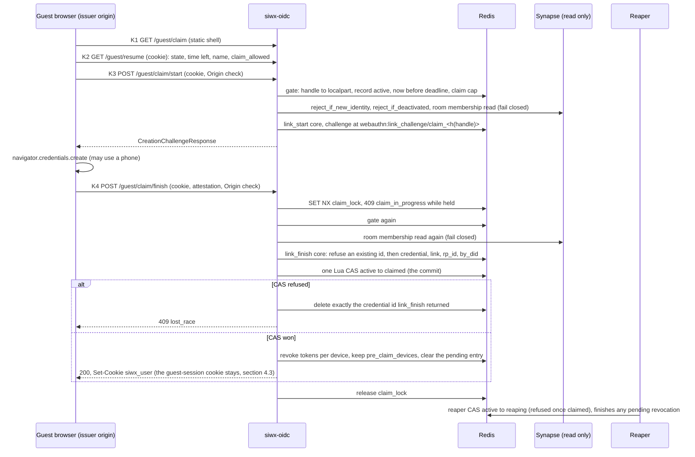

# Guest portal 05: claim flow

**Status:** DRAFT design document. Nothing here is implemented, and nothing in this document changes code.
**Scope:** requirement R4. A guest whose account has a custodial, server-managed key makes the account permanent by
adding their own passkey ("link passkey"), reusing the linking logic siwx-oidc already has. The flow model
([01](01-flow-model.md), ids `GP-FLOW-nn`), the Synapse validation ([02](02-synapse-validation.md), `GP-SYN-nn`) and the
client document ([03](03-element-meet-client.md), `GP-CLI-nn`) are the contracts this document builds on. This document's
ids are `GP-CLM-nn`. The security document ([04](04-security-and-limits.md), `GP-SEC-nn`) owns the confinement, token and cookie
rules the claim depends on and states them in the same words. `D<n>` names a decision of the
[decisions log in the overview](00-overview.md#7-decisions-log); each stays listed there as an open decision for the maintainers,
so a requirement that follows one is marked `(revised, see D<n>)` and keeps its ID.
**Baseline:** siwx-oidc `origin/main` at `3547bd2` (2026-09-30). Every `path:line` is against that commit. The draft
shared-RP-ID branch (draft pull request 18) was read without checking it out, at `367d187`, and is cited as
`rp-branch:<path>:<line>`. It is not merged and its line numbers may move.

Terms used below. The word "claim" means the R4 act only (D1).

| Term | Meaning |
|---|---|
| guest | An account that carries the marker and has a guest record (`guest:acct/<localpart>`, 01 section 4.1). The record state is `minted`, `provisioning`, `active`, `reaping` or `claimed` (01 section 6.2). |
| unclaimed guest | A guest whose record is `minted`, `provisioning` or `active`: it has a deadline and the reaper owns it. |
| claimed-restricted | A guest whose record is `claimed`: no deadline, no reaper, the marker still set, so the module policy still applies (D3). |
| promoted | A claimed account whose marker an operator has cleared and whose record carries `promoted_at`. An ordinary account; its record is kept. |
| marker | The Synapse `user_type` value `io.inblock.guest` (GP-SEC-66, GP-SYN-07). It means "confined identity", not "unclaimed", and a claim never clears it (D1, D3). |
| custodial key | The private key behind the guest DID: derived by siwx-oidc from a server secret and a per-guest random value, never stored (R3, D9), and destroyed at the claim commit. |

The marker and the record are the only server-side facts that identify a guest, and neither is ever called a claim (D1).

Prerequisites outside this repository (hard gates). The same four statements appear in every document of the set (D11). The
operator assertions P5 to P9 (P7 is superseded) are authoritative in 01 section 2 (07 repeats some of them for planning); the
claim adds none of its own.

| Id | Prerequisite | Note |
|---|---|---|
| P1 | lk-jwt membership enforcement (Synapse `msc4502_enabled` plus a small lk-jwt patch that calls the existing membership check on the routes Element Call actually uses). Hard dependency before any guest exists, on dev too. | Both routes take any local account today. |
| P2 | SFU eviction and a short SFU token lifetime before production (lk-jwt kick PR or equivalent). The OpenID token lifetime is a Synapse constant (`synapse/rest/client/openid.py:72`) and is not configurable; P1 covers confidentiality for that half. | Does not shorten the Synapse OpenID token, a 1 h Synapse constant that P1 makes harmless. |
| P3 | Synapse 1.162.0 or later before the module goes live, then re-read 02 against that version. Federation off for a guest deployment (a remote knock reaches no hook). | 1.162 makes room version 12 the default (1.161: 11) and fixes `check_event_allowed` for rooms created as v12. |
| P4 | the guest policy module (separate repository, licence path decided by the maintainers with counsel). | Before any guest exists: without it a guest is an unconfined account. |

## 1. Result in one page

| # | Result or decision |
|---|---|
| 1 | The observation of 01 is **confirmed**: `link_start` proves DID ownership with a `siwx` cookie, a signature by the DID key bound to an OIDC session nonce (`src/axum_lib.rs:863-869`, `src/oidc.rs:1956-2025`), which a custodial guest's browser cannot produce. Two corrections sharpen it (section 2.5): the authorization lives only in the `link_start` handler, the `link_finish` core and its handler check nothing about identity; and the route also needs an OIDC `session`, which a claim page does not have. |
| 2 | **Recommended ceremony (`claim-authorised`):** a guest-session-gated claim ceremony that calls the `wa::link_start` and `wa::link_finish` core under its own challenge key; the core gains one rule, refuse to overwrite an existing credential or link entry (GP-CLM-02). The custodial key is not used. Rejected: `claim-signed` (the server signs a CAIP-122 challenge with the custodial key: a signing oracle and a fabricated session for no added evidence), and `claim-bound` (passkey first, then bind: two ceremonies, a second writer of the link namespace, and an account-merge hazard). |
| 3 | **Commit point:** one Lua compare-and-set `active -> claimed` (the proposal of 01 is sufficient). The credential write precedes it. Finishes of one guest are single-flight (`claim_lock`), and the write is compensated only for a credential this call verified and wrote, by the id `link_finish` returned, when the compare-and-set is refused. So claim and reaper can never both win, a repeated finish cannot delete the credential of the first, and a lost race leaves nothing behind (GP-CLM-06). |
| 4 | **Claim keeps the confinement (D3).** If it lifted it, every invite link would be an open registration link for full accounts. A claimed account is permanent but restricted: it keeps the marker and the module policy, loses the deadline and reaper eligibility, and is promoted only by an operator. 01 and 02 follow this. |
| 5 | **The custodial key is destroyed at the claim commit (D9):** the per-guest random value that the derived key needs is deleted inside the compare-and-set, so nothing can re-derive it. Four code paths accept a signature by the DID key (section 2.5); all keep refusing the guest DID for ever (GP-SEC-56), so even a key re-derived from an older backup signs nothing. |
| 6 | **A claimed guest can never add a second passkey through today's code:** the only link route needs a signature by the DID key. One credential, no recovery. This is a known limitation (D9), stated instead of hidden, and the fix belongs to the key-lifecycle roadmap. |
| 7 | **Shared RP ID:** the claim must go through the shared core. A credential stored by any other writer has no `webauthn:rp_id` record, is treated as legacy, and would never authenticate (`rp-branch:src/webauthn.rs:731-735`). |
| 8 | The claim is **same browser, while the account is live**. No claim by e-mail, no claim code for another device, no grace after teardown in v1. The passkey itself can live on another device through the browser's own cross-device prompt. |
| 9 | **The claim revokes every pre-claim token, device by device (D3),** never with `revoke_all_user_tokens`, which plants a 900 s user tombstone that would lock the claimant out. The revocation survives a crash (section 4.3), and the record keeps the revoked device ids as `pre_claim_devices`, which `sign_in` refuses to reuse (GP-CLM-26). A live call is not preserved: the claim entry inside the call warns the guest first (GP-CLM-11, GP-CLM-19). |
| 10 | **The claim is authorised by the `__Host-guest_session` cookie (D4):** Secure, HttpOnly, SameSite=Lax, `Path=/`. Every state-changing claim route is a JSON `POST` that passes the `Origin` and `Sec-Fetch-Site` check (GP-SEC-40), and the claim is gated on admission, the claim cap and a live Synapse account (GP-CLM-04). The same cookie, with the same check, also authorises `POST /guest/end`, which is what the claim page's "Delete everything now" (CL-07) calls (GP-CLM-25, D18). |

## 2. The existing linking logic, mapped

### 2.1 The ceremony, step by step

| Step | Code | What happens |
|---|---|---|
| 1 | `js/ui/src/App.svelte:147-184` | The wallet signs a CAIP-122 message carrying the session nonce. The page sets the `siwx` cookie from JavaScript (not HttpOnly) and only then shows the link option (`showLinkOption`, line 182). |
| 2 | `src/axum_lib.rs:850-880` (`webauthn_link_start`) | Needs the `session` cookie and the Redis session (`get_session`), then calls `oidc::verify_siwx_cookie`. |
| 3 | `src/oidc.rs:1956-2025` (`verify_siwx_cookie`) | Decodes the cookie, requires the DID method (and for `did:pkh` the namespace) to be enabled, runs `did_method.verify(did, message, signature)` (line 2007), requires the message nonce to equal `session.siwe_nonce` (line 2017), enforces the expiration time when present (line 2022). Does not consume the session. |
| 4 | `src/webauthn.rs:866-903` (`wa::link_start`) | Contains no identity logic. Starts a passkey registration (random user handle, name `linked-passkey` unless a display name is passed), requires a resident key (`:500-507`), stores `LinkChallengeState { reg_state_json, primary_did }` at `webauthn:link_challenge/{session_id}` for 120 s (`:35`). `session_id` is only a key string. |
| 5 | `App.svelte:216` | `navigator.credentials.create`. |
| 6 | `src/axum_lib.rs:882-898` (`webauthn_link_finish`) | Needs only the `session` cookie. **No DID check.** Calls `wa::link_finish`. |
| 7 | `src/webauthn.rs:905-983` (`wa::link_finish`) | Takes and deletes the challenge **before** verifying (`:912-917`), verifies the attestation (`:924-926`), writes the credential (`:930-938`), writes the link entry `{primary_did, label: "linked"}` (`:941-949`), adds the credential to `webauthn:by_did/{primary_did}` (`:954-959`, best effort), mirrors into the aqua-auth store when enabled (`:967-973`, best effort, the link entry itself is never mirrored). |

Routes: `src/axum_lib.rs:1467-1468`. OpenAPI: `docs/api/openapi.yaml:614-630`.

### 2.2 Storage

| Key | Writer | Meaning |
|---|---|---|
| `webauthn:credential/{cred_id}` | `register_finish`, `link_finish` | The passkey blob, including the counter (`src/db/mod.rs:64`). |
| `webauthn:link/{cred_id}` | `link_finish` only (`src/db/mod.rs:66-75`, AGENTS.md "A link overrides the derived DID") | `{primary_did, label}`. |
| `webauthn:by_did/{did}` | `register_finish`, `link_finish` | Advisory SET of credential ids (`src/db/redis.rs:488-494`). `get_passkeys_for_did` self-heals from a scan (`:530-601`). |
| `webauthn:link_challenge/{session_id}` | `link_start` | 120 s. |
| `user:session/{token}` | `create_user_session` (`src/db/redis.rs:615-628`) | Opaque token to DID, 30 days, the `siwx_user` cookie scopes the picker. |
| `webauthn:rp_id/{cred_id}` | rp-branch `record_rp_id` (`rp-branch:src/webauthn.rs:733`) | The RP ID the credential was registered under. Absent for every older credential. |

### 2.3 How a later login resolves a linked passkey to the existing DID

1. `POST /webauthn/authenticate/start` scopes `allowCredentials` to the DID behind a valid `siwx_user` cookie, else it is
   usernameless (`src/webauthn.rs:635-703`). An empty credential set for a scoped DID falls back to usernameless (`:659-689`).
2. `verify_credential` looks the credential up by raw id (`:730-740`), verifies the assertion and the user-verification
   flag (`:751-770`), then calls `credential_identity::resolve_credential_identity` (`:780-786`): a
   `webauthn:link/{cred_id}` entry **overrides** the DID derived from the passkey (`src/credential_identity.rs:60-86`).
3. `authenticate_finish` writes the resulting DID into the session as `verified_did` (`:843-859`). The page reports
   `new_user` from `resolve_identity_or_legacy` (`src/axum_lib.rs:826-838`), which is false because the account exists.
4. `/sign_in` Path A trusts `verified_did` (`src/oidc.rs:2526-2551`), runs `reject_if_deactivated` (`:2673`), resolves the
   localpart (`:2706`), which is the existing modern localpart, and calls `provision_synapse_device` (`:2707`). The same
   MXID results, `io.inblock.did` is re-asserted, and the alias is not rewritten (AGENTS.md "The alias is written once").

So a claimed passkey signs in as the guest DID and MXID with no new code on the login side.

### 2.4 Scoping, gates and re-auth that touch the claim

| Mechanism | Where | Effect on claim |
|---|---|---|
| `siwx_user` picker scope | set by every successful `sign_in` (`src/axum_lib.rs:303-322`) | For an unclaimed guest the scope holds a DID with zero passkeys, so the picker stays usernameless. After a claim it scopes to the claimed passkey, which is what a returning user wants. Section 5.4 decides when it is set. |
| New-user gate | passkey login only, enforced by the frontend (docs/passkeys.md "New-account creation policy"); account re-auth and device approval call `reject_if_new_identity` (`src/account.rs:910, 975`) | A claimed guest is an existing account, so no gate fires at later logins. |
| Deactivation gate | `sign_in` (`src/oidc.rs:2673`), re-auth (`src/account.rs:919-921, 984-986`) | Fails closed. Also protects against a credential linked to a reaped guest (section 4.4). |
| Re-auth for account actions | a wallet signature with a single-use action-bound nonce (`src/account.rs:876-904`) or a passkey assertion (`:962`) | A claimed guest can re-authenticate with the passkey only. |
| Enumeration safety | AGENTS.md "Passkeys" | The claim must not introduce a client-supplied DID or identifier as a scope. The claim routes take no identifier at all. |

### 2.5 The DID-key signature: confirmed, with four corrections

**Confirmed.** `link_start` cannot be satisfied by a browser that holds no key. The `siwx` cookie must carry a signature
by the DID key over a message whose nonce equals the OIDC session's `siwe_nonce`. The custodial guest's browser holds
neither the key (R3) nor, at claim time, the session (the `session` cookie lasts 300 s from `/authorize`,
`src/db/mod.rs:48`).

**Corrections and additions.**

1. "Cannot produce" is about the browser. The **server** can sign if it holds or can derive the key, and `verify_siwx_cookie`
   cannot tell who signed. That is `claim-signed` below.
2. The signature is not the only precondition. `link_start` needs an OIDC `session` whose nonce is inside the signed
   message. Sessions come from `/authorize` only (`set_session` has one production caller, `src/oidc.rs:1669`; 01 section 5.1). A claim page would
   have to fabricate one.
3. **All authorization is in the `link_start` handler.** `wa::link_finish` and its handler take the challenge state planted
   by `link_start` under the `session` id and check nothing else (`src/axum_lib.rs:882-898`). The core "takes an
   already authenticated DID", as 01 section 5.3 says, and that is precisely what makes it reusable: a claim replaces
   the gate, not the ceremony.
4. The link route is not wallet-specific. Any `supported_did_methods` DID that signs the nonce may link (a headless
   agent's `did:key` too). Only the login page offers it after a wallet signature.

**Four code paths accept a signature by the DID key**, which matters for what the custodial key can still do after a claim
(section 5.2):

| Path | Code | What a signature by the DID key gets |
|---|---|---|
| Sign-in Path B | `src/oidc.rs:2599` | A session for the account. |
| Account re-auth | `src/account.rs:868` | `device_delete`, `account_deactivate`, `account_erase` (`:691-737`). |
| Device approval | `src/device_auth.rs:985` | A device-code login. |
| Link start | `src/oidc.rs:2007` | Adding a passkey. |

### 2.6 Gaps in the existing link logic that a claim inherits

| # | Gap | Evidence | Consequence for the claim | Handling |
|---|---|---|---|---|
| G1 | The link handlers run neither `reject_if_new_identity` nor `reject_if_deactivated`, unlike account re-auth. | `src/axum_lib.rs:850-898` against `src/account.rs:910-921` | A link can be written for a dead or never-created account. | The claim start runs both gates (GP-CLM-04). |
| G2 | Credential, link, index and mirror writes are sequential, not atomic, credential first. | `src/webauthn.rs:930-973` | A failure between credential and link leaves a standalone credential, which is a `did:key` identity that can create a **new** account at its next passkey login. | The core removes its own credential when its link write fails, and the claim compensates only a credential it verified and wrote (GP-CLM-02, GP-CLM-06). |
| G3 | `link_finish` never checks that the credential id is new: it writes `webauthn:credential/<id>` and `webauthn:link/<id>` with unconditional `set_raw`, `link_start` passes no exclude list, and the registration library does not check uniqueness either. | `src/webauthn.rs:877, 930-949`; webauthn-rs-core `register_credential` (its existence check is commented out upstream, version pinned in `Cargo.lock`) | Reachable by the forged-authenticator class of section 3.2: a client that registers a known credential id overwrites that id's credential and link entries. The overwrite also turns a compensation by id into a deletion of the entry that was there before. | Handled: the core writes both keys set-if-absent and refuses an existing id before it writes anything; the claim answers the uniform `verify_failed` (GP-CLM-02, GP-CLM-06). |
| G4 | Constant names: passkey user name `linked-passkey`, label `linked`. | `src/webauthn.rs:874, 943` | Two passkeys for one site look identical in the picker. | Pass `display_name` (the parameter exists) (GP-CLM-15). |
| G5 | No route adds a passkey without a DID-key signature. `SUPPORTED_ACTIONS` has no link action. | `src/account.rs:283-295`, `src/axum_lib.rs:1467` | A claimed guest with a destroyed key has exactly one credential until the key-lifecycle roadmap lands (D9). | Stated as a v1 limit (section 7.2). |
| G6 | The link ceremony has no end-to-end test. | `tests/account_linking_dual_write.rs:18-24`; no spec under `e2e/browser/` drives `/link/webauthn` | The ceremony we reuse is unexercised. | GP-CLM-22 requires one, using the existing CDP virtual authenticator (`e2e/browser/webauthn-helper.mjs`). |
| G7 | `purge_identity` scans the keyspace with `KEYS`. | `src/db/redis.rs:369, 428` | Blocks Redis in proportion to its size, so it must not be the reaper's per-guest cleanup. | Use `webauthn:by_did` (GP-CLM-07). |
| G8 | A second `finish` for one ceremony (double click, client retry with the same body) consumes nothing and errors at the challenge step: the challenge is taken and deleted before verification. | `src/webauthn.rs:912-917` | If the second call compensated on any error it would delete the credential the first call just wrote, and the first call's compare-and-set would then commit a `claimed` account with no credential. | A per-handle single-flight lock, and compensation only after the core returned an id (GP-CLM-06). |

## 3. Design options for the claim ceremony

Naming. The options are named by what authorises the claim: `claim-signed` (the server signs a CAIP-122 challenge with the
custodial key), `claim-authorised` (a guest-session-gated claim ceremony over the link core, the recommended one) and
`claim-bound` (passkey first, then bind). 01 HK-4 and 04 GP-SEC-38 and GP-SEC-54 use the same names.

### 3.1 Comparison

| Aspect | `claim-signed`: server signs with the custodial key | `claim-authorised`: guest-session claim ceremony over the core | `claim-bound`: passkey first, then bind |
|---|---|---|---|
| What is new | A server-side signer, a fabricated OIDC session and nonce, a `Set-Cookie` of a `siwx` cookie, then the `/link/webauthn/*` routes | Two POST routes, a static shell, a gate, one compare-and-set, a single-flight lock. The core gains one rule (refuse to overwrite), nothing else. | A bind primitive that writes the link namespace, and a proof-of-possession assertion |
| Custodial key needed before claim | Yes, re-derived and usable | No | No |
| Reuses link core | Yes, and the handlers too (the overwrite defect G3 applies to it as well) | Core yes (plus the refuse-overwrite rule), handlers no | No: `register_finish`, then a second writer of `webauthn:link/*`, against the AGENTS.md ownership rule |
| Ceremonies | 1 | 1 | 2 (register, then an assertion to prove possession) |
| Nature of the authorization | A signature by a key the operator holds, checked by the same operator. No independent evidence: a server decision dressed as a proof. | An explicit server decision under a documented gate | The same gate at bind, but registration is open to anyone |
| Takeover surface (who can claim) | Holder of the guest-session cookie. A bug in the gate yields a general signing oracle for **any** guest key. | Holder of the guest-session cookie. A bug in the gate yields a claim of one record. | Holder of the cookie at bind. Plus: anyone can register passkeys first (orphan credentials), and binding an existing passkey **moves** it: if it already belongs to a real account `X`, the link override silently locks the guest out of `X`. `claim-signed` and `claim-authorised` register a fresh credential, and with the refuse-overwrite rule they cannot replace an existing one. |
| Session continuity needed | The claim page needs an OIDC session for the nonce | The guest-session cookie only | The guest-session cookie only |
| Race with the reaper | One compare-and-set | One compare-and-set | One compare-and-set at bind, and a standalone credential (identity `X`) survives a lost race |
| Partial failure | Signed cookie lingers, then as `claim-authorised` | See section 4.4 | A standalone credential with no link is a working identity that creates a different account |
| Idempotency | Re-sign each attempt | Start re-issues the challenge, finish is single-flight and terminal | Bind is idempotent for one pair |
| Verdict | **Reject** | **Recommend** | **Reject** |

### 3.2 Who can claim (takeover surface of `claim-signed` and `claim-authorised`, which share one gate)

| Holder | Can claim | Why, and what remains |
|---|---|---|
| The `__Host-guest_session` cookie (HttpOnly, Lax, issuer origin) | **Yes, this is the gate** | Residual: someone else at a shared browser before "End session" or the deadline, or local malware. The claim turns that bounded window into a permanent but **restricted** account (section 5.3), which is why restriction after claim carries weight. |
| A Bearer access or refresh token alone | No | The claim routes reject requests that carry only `Authorization`. The token lives in JavaScript of the Meet origin (Element Call, the SDK, extensions); a leak there must not make an account permanent. |
| The invite link and secret | No | The secret selects no record. It only mints a new guest. |
| The host | No | Hosts never see the cookie. |
| Another browser or device without the cookie | No | There is no hand-over secret in v1 (GP-FLOW-22). The authenticator can still be on another device through the browser's cross-device prompt. |
| A page on another origin | No | Cookies are host-only and CORS allows any origin without credentials (`src/axum_lib.rs:1569-1577`). A Lax cookie is withheld from a cross-site `POST` or fetch, every state-changing claim route needs an `Origin` equal to the issuer origin (GP-SEC-40), and the claim `GET` routes change no state and return nothing a script can read. |
| An attacker with their own software authenticator | Only with the cookie | WebAuthn origin checks protect honest browsers, they are not a defence against a forged client. The cookie is the authorization. |
| A sibling subdomain that plants a cookie | No | The `__Host-` prefix (Secure, `Path=/`, no `Domain`) cannot be planted by a sibling subdomain (GP-SEC-41, D4). A credentialed request from a sibling origin fails the `Origin` and `Sec-Fetch-Site` check. Unverified in a browser. |
| The operator | Yes | Not a threat this design can address (section 5.2). |

### 3.3 Preconditions

Claim preconditions are named `CP-nn`, so they cannot be mistaken for the prerequisites P1 to P4 above.

| # | Precondition | Why | Check | On failure |
|---|---|---|---|---|
| CP-01 | A valid `__Host-guest_session` cookie that resolves to a guest localpart | The gate | Handle lookup in Redis | `no_session` |
| CP-02 | Record state `active` (not `minted`, `provisioning`, `reaping`, `claimed`) | A `minted` record has no account yet and a `provisioning` one has a half-made account. `reaping` is teardown. | Read, and again inside the compare-and-set | `ended` or `already_claimed` |
| CP-03 | `now < deadline`, by Redis `TIME` | R5: the deadline is a hard stop even while the reaper lags | Inside the compare-and-set, never by the web node's clock | `ended` |
| CP-04 | Invite not revoked | Host "end meeting" moves every guest to `reaping` (GP-FLOW-11), so CP-02 covers it | none extra | `ended` |
| CP-05 | `guest_claim_enabled` | Operators may switch claim off | Config | `claim_unavailable` |
| CP-06 | The Synapse account exists and is active | A live record over a dead account (an operator deactivated an abusive guest by hand) must not become permanent | The existing pair `reject_if_new_identity` then `reject_if_deactivated`, exactly as account re-auth orders them (`src/account.rs:910-921`), fail closed (503) | `ended` or 503 |
| CP-07 | Same browser as the join | No hand-over secret | Cookie | `no_session` |
| CP-08 | Optional e-mail verification | There is no mailer, the address is self-asserted (01 section 9) | Not required, never a login or recovery factor | none |
| CP-09 | Host notification | The host admitted a knock into a call, not an account | Not required beyond the admission of CP-11. One audit event (GP-CLM-21). | none |
| CP-10 | The page runs on the issuer origin within the RP ID | WebAuthn registers for one RP ID and origin (section 7.1) | Static shell on the issuer | `verify_failed` |
| CP-11 | Admission: the account is currently joined to its invite's room | A claim turns a bounded account into a permanent one, so it is limited to people a host actually admitted (GP-SEC-35) | One read of the room's joined members through the admin API, fail closed (503), at start and again at finish before the credential is written | `ended` (removed or never admitted) or 503 |
| CP-12 | Fewer than `guest_max_claimed` records in state `claimed` | A claim creates a permanent Synapse row and a permanent confined account (GP-SEC-35) | Counted inside the compare-and-set script | `claim_unavailable` |
| CP-13 | No other `finish` of this guest is in flight (finish only) | A repeated finish must not race the first one (G8) | `SET NX claim_lock/<h(handle)> EX 30`, the first step of finish, released when the call ends (GP-CLM-06) | 409 `claim_in_progress` |

`claim_allowed` in `GET /guest/resume` is advisory: the server computes CP-02, CP-03, CP-05, CP-12 and the admission read of CP-11
(false when the read fails), so the page offers the claim only to a guest who can use it. Start and finish check again.

### 3.4 Race with the reaper, partial failure, idempotency

The reaper and the claim both begin with a compare-and-set out of `active` (GP-FLOW-16), so exactly one wins. The only
subtlety is that the claim has a write the reaper knows nothing about, the credential, and that write cannot be part of
the compare-and-set because `link_finish` is the only writer of the link namespace (AGENTS.md) and it is Rust, not Lua.
Two orders are possible:

| Order | Failure if the other side wins | Verdict |
|---|---|---|
| CAS first, then `link_finish` | The account is `claimed`, exempt from the reaper, with **no credential**: a permanent ghost account that nobody can enter. Reverting the CAS races the reaper again. | Reject |
| `link_finish` first, then CAS | The reaper won: a credential linked to an account being erased. Delete exactly the credential id `link_finish` returned, which this call verified and wrote, and answer 409. Crash before the delete: an orphan credential, swept at reap (GP-CLM-07), and useless because `reject_if_deactivated` rejects the erased account (`src/oidc.rs:2673`). | **Recommend** |

An intermediate `claiming` record state was considered and deleted (section 9): the refresh guard and the reaper would have to
honour it, and compensation costs less. What replaces it is a per-handle single-flight lock that only `claim/finish` takes and
nothing else reads (`SET NX claim_lock/<h(handle)> EX 30`, CP-13). It exists because compensation is only safe when one call
owns the credential: a repeated finish (a double click, a client retry of the same body) consumes nothing, since the challenge
is taken and deleted before verification (`src/webauthn.rs:912-917`), and fails at the challenge step. If that failure
compensated, it would delete the credential the first call had just written, and the first call's compare-and-set would then
commit a `claimed` account with no credential, the ghost account this section rejects (G8). The lock keeps the two finishes apart, and compensation is limited to a
credential this call verified and wrote: the id comes from `LinkFinishResponse.credential_id` (never from the request body),
`webauthn:link/<id>` must carry the guest DID before anything is deleted, and an error before the credential write
(challenge not found, deserialisation, verification) compensates nothing. The lock is released when the call ends and expires
after 30 s if the process dies, so a crash costs at most 30 s of `claim_in_progress`.

Per option, idempotency and partial failure are in the table of section 3.1. For the recommended option the full matrix is
section 4.4.

### 3.5 Recommendation

`claim-authorised`. It is the only option where the custodial key is unnecessary before and after the claim, where the existing
handlers and their test-free trust assumptions are not stretched, where a bug in the gate exposes one record rather than
a signer, and where the link namespace keeps its single writer.

## 4. The recommended protocol

### 4.1 Sequence

### 4.2 Routes and configuration (names only)

Each needs an `docs/api/openapi.yaml` entry (`tests/openapi_covers_every_route.rs`, AGENTS.md "Route documentation is
enforced"). The Synapse mock needs one call beyond those the guest flow already adds: the admission read of CP-11 is the same
room-members read the host audit of 01 uses.

| Route | Auth | Purpose |
|---|---|---|
| `GET /guest/claim` | none | Static shell, identical for every caller, changes no state and needs no cookie. The Meet client reaches it by top-level navigation; the Lax cookie travels on it and the shell ignores it. |
| `GET /guest/resume` (extends 01 section 4.2) | `__Host-guest_session` cookie | Adds `state`, `seconds_left`, `claim_allowed` (advisory, section 3.3) and `email_present` (a boolean, never the address; it decides whether CL-02 shows the e-mail choice). Names only, no secrets, and nothing a script on another origin can read. After a claim it still answers `state: claimed`, and nothing else, for the 10 minutes of the `guest:claimed_handle` marker; after that the cookie maps to nothing and the answer is `no_session` (section 4.3). |
| `POST /guest/claim/start` | `__Host-guest_session` cookie, **not** Bearer; JSON, `Origin` and `Sec-Fetch-Site` checked (GP-SEC-40) | Gate, then the `link_start` core. Idempotent. |
| `POST /guest/claim/finish` | `__Host-guest_session` cookie, **not** Bearer; JSON, `Origin` and `Sec-Fetch-Site` checked (GP-SEC-40) | Single-flight lock, `link_finish` core, compare-and-set, per-device revocation, compensation. The body carries the attestation and one boolean, `keep_email`, which defaults to false when absent (D13); it is meaningful only when the record holds an e-mail. Its own body cap is 16 KiB (GP-SEC-04), not the 4 KiB of the other guest routes. |
| `POST /guest/end` (defined in 01 section 4.2, extended here) | guest Bearer token **or** `__Host-guest_session` cookie (D18) | Ends the caller's own session. The cookie path is a JSON `POST` that passes the `Origin` and `Sec-Fetch-Site` check (GP-SEC-40), the Bearer path needs none. A claimed account answers 409 on both. CL-07 "Delete everything now" calls it with the cookie, the client's "End session" with the Bearer token (GP-CLM-25). |

Configuration: `guest_claim_enabled` (`SIWXOIDC_GUEST_CLAIM_ENABLED`, default `true`) and the cap `guest_max_claimed` (default
200, GP-SEC-02), read through `config::figment()` and documented in `docs/configuration.md` in the implementing change. Nothing
else is configurable: in particular no setting promotes at claim.

### 4.3 Gate and commit details

The challenge key is `claim_` plus a hash of the cookie handle, derived on the server. The client never names a key, so a
guest cannot steer into another guest's challenge, and the existing `/link/webauthn/finish` cannot complete a claim
challenge because it looks under the OIDC `session` id (the same mechanism as the `device_passkey_*` and `account_passkey_*`
prefixes already in use, docs/passkeys.md "Redis keys"). The lock key is `claim_lock/` plus the same hash.

The Lua script, in the style of 01, atomically: requires `state == active`; requires `now < deadline` by Redis `TIME`; requires
fewer than `guest_max_claimed` members in `guest:claimed`; sets `state = claimed` with `claimed_at`, the credential id and the
passkey's derived `did:key`; removes the deadline; `ZREM`s `guest:due`; `SREM`s `guest:by_invite/<id>`; deletes
`guest:handle/<sha256(handle)>` and writes `guest:claimed_handle/<sha256(handle)>` (value: the localpart, TTL 10 minutes, no
personal data), which only the claim routes and `GET /guest/resume` read, so that a duplicate or a retry whose handle mapping is
gone still answers 409 `already_claimed` (F8, GP-CLM-18) and never a misleading `no_session`; the hand-off never reads it; deletes
`key_ref.id` (the per-guest random value, so the derived key can never be re-created) and deletes `email` unless the script was given `keep_email` true (D13);
adds the localpart to `guest:claimed` and to `guest:claim_revoke`. The handler then revokes the tokens of each device id held in
the record with `revoke_device_tokens`, renames `device_ids` to `pre_claim_devices` (below) and removes the pending entry. The
reaper tick finishes any entry a crash left behind, and the revocation is idempotent. The record keeps names and consent (section
5.6). The append of a device id by the hand-off is conditional on state `active` in its own script (GP-CLM-23), so nothing minted
after the commit escapes the revocation.

**A reload after the claim, and what the 10 minutes mean.** The commit deletes the handle, but the browser keeps its
`__Host-guest_session` cookie: the claim response does not clear it, and nothing accepts it as a session any more (the hand-off
refuses a `claimed` record, the claim routes and `POST /guest/end` answer 409). For 10 minutes from the commit, `GET /guest/resume` maps
that cookie through `guest:claimed_handle` to the claimed record and answers `state: claimed` (no names, `claim_allowed` false).
Three readers rely on it. A retry after a lost response, or a duplicate finish, reads it as 409 `already_claimed` (F8, F14). A
reload of the claim page reads it and shows CL-E3. The call tab of the claimant fails its silent authorize with
`interaction_required` and is handed to the issuer page `GET /guest/ended` (03 C5), which reads `resume` and draws the
kept-account copy with passkey sign-in (06 G6 `closed-kept`). The marker is not renewed by a read, so the window is 10 minutes
from the commit, not from the last reload. After it expired the cookie maps to nothing and `resume` answers `no_session`: the
claim page then shows CL-E1, and `/guest/ended` draws the ended-session copy (06 G6 `closed`), whose text link still offers passkey
sign-in. Nothing is lost by that: the account and its passkey are intact, and only the page can no longer tell a kept account from
an ended one. The window is short on purpose, because the marker is the only place where a dead handle still resolves to a record;
the cookie itself stays harmless and lapses at the original deadline.

**The claim keeps the keyspace scan of `revoke_device_tokens`.** The token index is advisory: `set_token` does `SET`, `SADD`
and `EXPIRE` as separate commands (`src/db/redis.rs:934-953`), so an index-only revoke misses a token whose `SADD` had not run yet,
which is exactly the window of a refresh rotation racing the claim. The scan is the backstop that closes it
(`src/db/redis.rs:247-251`). Its cost is bounded: at most `guest_max_devices` scans per claim, at most `guest_max_claimed` claims,
and the claim routes are rate limited at the proxy (GP-SEC-04). Only the reaper uses the index-only variant, because it has a
second net the claim does not have: the user tombstone and the deletion of the Synapse devices (04 GP-SEC-36).

**Pre-claim device ids stay refused (GP-CLM-26).** The device tombstone lasts 900 s, and `resolve_device_id` accepts any
client-proposed id from the scope (`src/oidc.rs:2058-2063`), so after the tombstone expired a login that proposed a pre-claim id
would reuse a revoked device row. The record therefore keeps the ids it held at the commit as `pre_claim_devices` (at most
`guest_max_devices`, random, no personal data) for the life of the record, and `sign_in` refuses a proposed device id found in
the list of the signing-in account's guest record, with the error the flow uses for an invalid scope, before any Synapse call. It
is one read through the same helper as GP-SEC-56, made only for an account that has a guest record. The Meet client proposes a
fresh id after a claim (GP-CLM-11), so it never meets the refusal. The implementing change must resolve the id before the
write-ahead append of a device id (`provision_synapse_device` generates it today, `src/oidc.rs:2203-2215`) and pass it in as
`proposed_device_id`, so the record lists the id before the call that creates it.

**The cap counts records, and only erase releases a slot.** The count is the membership of `guest:claimed`. A claimed
account that only deactivates itself (the `org.matrix.account_deactivate` action of `/account`) keeps its record, its Synapse
row and its slot, because only erase deletes the record (GP-CLM-16) and because the account can be reactivated
(`io.inblock.account_reactivate`): releasing the slot on deactivation would let reactivations exceed the cap. Erase is the
release. Deactivation is also not erasure: names and the consent record stay in the record until erase (04 section 5.4).

### 4.4 Failure matrix

| # | Failure | State after | Guest sees | Recovery |
|---|---|---|---|---|
| F1 | Redis down at start | nothing written | `unavailable` | retry |
| F2 | Synapse probe fails at start (CP-06, CP-11) | nothing written | `unavailable` | retry |
| F3 | Start succeeded, guest cancels or closes the tab | challenge expires after 120 s, record `active` | `cancelled` | retry |
| F4 | Attestation invalid or origin refused at finish | challenge already consumed (`src/webauthn.rs:917`), nothing stored (errors precede `:930`) | `verify_failed` | restart |
| F5 | Credential written, link write fails | `link_finish` errs after the core removed the credential it had just written; no id is returned, so the handler compensates nothing; record `active`. If that removal also fails (Redis down), a standalone credential stays (the residue of G2), logged by fingerprint only | `unavailable` | restart |
| F6 | Writes fine, CAS refused (reaper, host end, deadline, cap) | the credential, link, `rp_id`, `by_did` and mirror entries of the id `link_finish` returned are deleted, after `webauthn:link/<id>` was read and carried the guest DID | `lost_race`: the session ended, nothing kept (`claim_unavailable` at the cap) | none, the passkey on the device is unused and is pruned at its next use (`signalUnknownCredential`, docs/passkeys.md "Unknown credentials") |
| F7 | Crash after the writes, before the CAS | orphan credential linked to a guest DID | next page load shows the state as it is | swept at reap by `by_did`; meanwhile any login through it is bounded by `reject_if_deactivated` and the refresh guard (GP-FLOW-13) |
| F8 | CAS won, response lost | `claimed` | `unavailable` | a retry of start or finish answers 409 `already_claimed` from the 10 minute marker of section 4.3, which the UI shows as "already kept"; later a stale cookie reads as `no_session` and the guest signs in with the passkey |
| F9 | CAS won, `siwx_user` mint fails | `claimed` | `done` | best effort as in `sign_in` (`src/axum_lib.rs:309-322`); the next login is usernameless |
| F10 | Crash after the CAS, before the revocation finished | `claimed`, pending entry in `guest:claim_revoke`, `device_ids` still in the record | `done` | the reaper tick revokes every listed device and removes the entry (at most one tick, 15 s, during which a pre-claim refresh token still works) |
| F11 | Reaper won before start | `reaping` | `ended` | none |
| F12 | A snapshot, append-only file or backup from before the claim holds the record | `claimed` | `done` | a residue (GP-SEC-63) bounded by rotation (GP-SEC-62); the value it holds can only re-derive a key that every signature path refuses (GP-SEC-56) |
| F13 | The host removed the guest between start and finish | nothing written, the membership read at finish refuses | `ended` | none |
| F14 | A repeated or parallel finish (double click, client retry with the same body) | the second call finds `claim_lock` held and answers 409 `claim_in_progress` without touching the challenge or any credential; once the first call has finished it finds the `already_claimed` marker instead. A lock left by a crash expires after 30 s | the first call's outcome (the page ignores a `claim_in_progress` while its own request is in flight) | none, or a retry after the first call answered |
| F15 | The attestation names a credential id that already has a credential or link entry (a forged authenticator replaying a known id) | the core refuses before it writes anything, the existing entries are untouched, the challenge is consumed | `verify_failed`, the same answer as an invalid attestation, so the claim is no oracle for which credential ids exist | restart |

### 4.5 What the claim must not touch

No Synapse write (no `user_type`, profile, device or 3PID call), no `sync_devices`, no `locked`, no `set_emails`
(02 section 6.2: e-mail is bound only after verification, and there is no verification). No `revoke_all_user_tokens` (it plants
the user tombstone): token revocation is per device and in Redis only, and Synapse device rows stay. No new room, no membership
change. The claim reads Synapse (the gates and the admission read) and writes none of it.

## 5. What a claim changes and does not change

### 5.1 Record states and what a claim changes

The record state is the one source for the lifecycle. The same table stands in
[04 section 3.6](04-security-and-limits.md#36-tokens-sessions-and-claim).

| Record state | Synapse account | Marker | Deadline and reaper | Sessions | Entered by |
|---|---|---|---|---|---|
| `minted` | none | none | yes | handle only | redeem |
| `provisioning` | may exist: `provision_user` has started or finished and the marker write may not have run (a failed marker write stays here) | set once the marker write succeeded, else none | yes: after one lease the reaper always erases, with no lookup shortcut | handle only | guest branch of `sign_in`, compare-and-set from `minted` before `provision_user` (01 section 6.2) |
| `active` | provisioned | set before the first token (GP-SEC-66) | yes | handle, tokens, devices | guest branch of `sign_in`, after the marker and the canonical name are written |
| `reaping` | being erased | set | the reaper owns it | revoked in the order of 04 section 5.4 | deadline, host end, guest end, operator epoch |
| `claimed` | active | **set, and it stays** | none, the reaper skips it | handle deleted, pre-claim tokens revoked | claim compare-and-set from `active` |
| `claimed` with `promoted_at` | active | cleared by the operator | none | passkey sessions | operator promotion |
| `reaped` | erased | not applicable | record deleted | none | the reaper |

`active` to `claimed` and `active` to `reaping` are each one compare-and-set, so exactly one wins (GP-FLOW-16). `claimed` ends only
by the account's own erase action (GP-CLM-16) or by an operator.

What the claim changes, item by item:

| Item | After claim |
|---|---|
| DID, localpart, MXID, `io.inblock.did` | **Unchanged.** Maintainer ruling: a DID never changes, claim adds a credential. |
| Display name and alias | Unchanged (section 5.4). The canonical name stays frozen while the marker is set (GP-SEC-20). |
| Passkey | **Added**: `webauthn:credential/*`, `webauthn:link/*` to the guest DID, `webauthn:rp_id/*` on the RP branch, `by_did`. |
| Sign-in methods | Passkey added. The guest-session path is closed (handle deleted, record `claimed`, GP-FLOW-06). |
| Deadline, due entry, invite membership | Removed. The reaper and every end trigger skip the account. |
| Custodial key | Destroyed: the per-guest random value is deleted inside the compare-and-set (section 5.2). |
| Tokens and refresh tokens | Every pre-claim token is revoked per device (GP-CLM-11). The claimant signs in with the passkey on a fresh device, and `sign_in` refuses to reuse a pre-claim device id (`pre_claim_devices`, GP-CLM-26). |
| Synapse devices, room membership, call membership | Untouched: device rows stay, the account stays joined to the room. |
| E-mail | Deleted in the commit unless the guest explicitly chose to keep it on CL-02 (default remove; D13, GP-SEC-26). A kept address is unverified and is never a login or recovery factor. |
| Guest marker and module policy | Unchanged: claimed-restricted (section 5.3). |
| Message history | Not carried to new devices. The guest client never sets up cross-signing or key backup (GP-CLI-09) and clears its storage at the end, so a later sign-in elsewhere is a new device that cannot read earlier encrypted events. The trust statement says so. |

### 5.2 The custodial key after claim

Claim itself needs no key (`claim-authorised`). Before a claim the key also signs nothing in the standard flow (01 HK-3): `verified_did`
is asserted by the server after the cookie check. So the key exists only to satisfy the four signature paths of
section 2.5 and, in `claim-signed`, the claim.

The key is derived (D9): an HKDF over a server secret and a per-guest random value `key_ref.id` stored in the guest record. The
seed itself is never stored.

| Option | What it means | Verdict |
|---|---|---|
| K1 Keep | The operator, or anyone with a copy, can sign in as the claimed account and erase it. | Reject: contradicts "your passkey is the way in". |
| K2 Retire | Refuse signatures by that DID at the four sites. | **Adopted as a standing rule, by record (GP-SEC-56):** no per-DID flag is needed, because the guest record (any state, `claimed` included, never deleted by promotion) is the flag. It is not a rotation scheme: no new key, no new DID. |
| **K3 Destroy** | Delete the per-guest random value at the claim commit. | **Recommended and adopted (D9).** |
| K4 Never store | The seed is never stored, only the value that re-creates it. | What the derived design already is. |

What "destroyed" means, exactly (the same definition as 04 section 4.1): the per-guest random value `key_ref.id` is deleted from the
record inside the compare-and-set, and the seed was never stored, so afterwards nothing can re-derive the key, not even the holder
of the server secret. It does not cover a Redis snapshot, append-only file or backup taken while the value existed (it holds the
value until rewritten or rotated, GP-SEC-62), the public key and the DID (public by design), or the claimant's passkey (never the
operator's). Independently of all of that, every signature path refuses the guest DID for ever (GP-SEC-56), so a key re-derived from
an older backup still signs nothing.

**Honest trust statement after a claim** (GP-CLM-17 requires it on screen):

1. Your passkey is yours. We never see its private part.
2. We generated the account's identifier and derived its key. At the moment you claimed, we deleted the value that the key is derived
   from, and our sign-in service refuses signatures by that identifier for ever. We cannot prove that no copy ever existed outside
   the claim, for example in a backup made before.
3. We still run the sign-in service, so we are technically able to issue a session for any account here, yours included.
   That is true of every account on this service.
4. We keep your name. If you gave an e-mail address, nobody has verified it, and we delete it when you keep the account unless you
   choose to keep it on the account (D13). A kept address is for notices only: in this version it never signs you in or recovers
   the account.
5. **There is no recovery.** If you lose the passkey and it is not synced by your device, the account is lost. You cannot
   add a second passkey in this version (a known limitation until the key-lifecycle work lands).
6. The account stays limited (section 5.3). Earlier encrypted messages are not carried to other devices.

### 5.3 Restrictions after claim

| Option | Behaviour | Takeover and abuse | Verdict |
|---|---|---|---|
| R-A Lift at claim | Clear the marker, account becomes ordinary | Permanence oracle: an open invite, plus one WebAuthn ceremony per guest (a software authenticator suffices), yields full accounts that can create rooms and invite. The invite becomes an open registration link that bypasses `guest_hosts`, e-mail verification and the new-user gate. | Reject |
| **R-B Keep restricted until an operator promotes** | Claim makes the account permanent and leaves the marker | A stolen cookie or a shared browser yields at most a permanent account that can do what a guest can do | **Adopted (D3)** |
| R-C Promote on claim when the invite says so and the e-mail is verified | Host-vouched invite-to-register | Needs a mailer and an operator allow-list | Later, not v1 |

Stated once, and identical to 04 (GP-SEC-37, section 3.5): After a claim the account keeps the marker, the module confinement and its mint-time policy (room confinement, event allow-list, frozen name and avatar). It loses the deadline and reaper eligibility and gains a passkey. It can still sign in with the passkey, use `/account` (devices, deactivate, erase), take part in calls in flagged guest rooms it is in or is invited into, and be invited into further flagged guest rooms by a host. It cannot create rooms, start direct messages, invite, search the directory, publish, send non-state events, mint invites or host, or add a second passkey. Promotion to an ordinary account is an operator action (or, later, an attested claim), never a side effect of claiming and never based on key structure; there is no configuration that promotes at claim.

The record state `claimed` is distinct from the marker: the state says the passkey was linked and the deadline is gone, the marker
says the identity is confined. 01 and 02 use the same two words (GP-FLOW-04, GP-SYN-07, GP-SYN-10).

**Promotion contract** (for the siwx-oidc maintainers and the module maintainers; no tool in v1). An operator, through the existing minted admin
token (`src/admin_token.rs`), in this order: (1) clears `user_type` with the admin API, (2) sets `promoted_at` on the guest record
and never deletes the record (GP-SEC-56 keeps refusing signatures by the guest DID), (3) strips the guest suffix from the global
display name **only when it is byte-equal to the typed name plus the suffix** (the pattern of AGENTS.md "Displayname migration is
byte-equal": a name the user edited is never overwritten), (4) logs one audit event. Policy reads the marker and the record, never a
key type. A failure between steps 1 and 2 leaves the account labelled as a guest while unconfined, the safe direction, and a retry
is idempotent (GP-CLM-24).

### 5.4 Display name, alias, localpart, MXID

| Item | Rule |
|---|---|
| Display name | The seed is the typed name plus the tag (GP-FLOW-09, GP-SEC-19). The canonical name is fixed by admin write at mint and the module denies profile changes by marked users (GP-SEC-20, D8), so neither an unclaimed nor a claimed-restricted guest can edit it, in any client. Only an operator promotion ends that (the marker is cleared and the suffix is stripped under the byte-equal rule). Claim writes no alias. |
| Alias invariants | Never a DID, never a key for anything, written once (AGENTS.md). Unaffected. |
| Localpart and MXID | The opaque 16-character base36 localpart stays. Not memorable, and not meant to be. |
| Passkey label in the authenticator | The typed name, so the picker does not show two entries called `linked-passkey` (GP-CLM-15). It is stored on the guest's device, never the DID, MXID or e-mail. |
| `siwx_user` | Set at the claim commit, **not** at an unclaimed guest's sign-in. An unclaimed guest's mapping would outlive the account by 30 days and make the next person's login page say "signing in as" a dead MXID (`detected_mxid`, `src/axum_lib.rs:758-775`). This answers the question 03 leaves to this document. It needs `sign_in` to skip the cookie for a guest session: the handler mints it for every `did` today (`:309`). |

### 5.5 What a claimed account may do, and who decides

| Capability | Claimed-restricted | Promoted | Decided by |
|---|---|---|---|
| Sign in with the passkey, use `/account` for devices, deactivate, erase | Yes | Yes | existing code |
| Take part in calls in rooms that carry `io.inblock.guest_room` it joined or is invited to | Yes | Yes | module (GP-SYN-05) |
| Be invited into further guest rooms by a host | Yes | Yes | module |
| Create rooms and direct messages, invite, search the directory, publish | No | Yes | operator, at promotion |
| Send non-state events (chat, reactions) | No | Yes | module (GP-SEC-27), operator at promotion |
| Host a meeting (mint invites) | No: a record exists, so GP-SEC-06 refuses the token until promotion | Yes, subject to `guest_hosts` | operator |
| Add a second passkey | No (G5, D9) | No | key-lifecycle roadmap |

What a claim changes, in the words 04 uses (GP-SEC-37): After a claim the account keeps the marker, the module confinement and its mint-time policy (room confinement, event allow-list, frozen name and avatar). It loses the deadline and reaper eligibility and gains a passkey. It can still sign in with the passkey, use `/account` (devices, deactivate, erase), take part in calls in flagged guest rooms it is in or is invited into, and be invited into further flagged guest rooms by a host. It cannot create rooms, start direct messages, invite, search the directory, publish, send non-state events, mint invites or host, or add a second passkey. Promotion to an ordinary account is an operator action (or, later, an attested claim), never a side effect of claiming and never based on key structure; there is no configuration that promotes at claim.

**Re-entry.** A claimed guest re-enters only through a new invite that redeems onto the same account; there is no directory lookup.
This is also recorded as a v1 limit. The account is permanent but hard to reach: the user directory is hidden (GP-SYN-11), the
localpart is opaque, and `GET /guest/context` answers from the record's original invite, so a claimed guest cannot learn a later
room from it. In v1 only the Matrix half of the new invite exists: a host invites the account into the next flagged room by MXID,
which the host reads from the member list of an earlier room, and the claimed guest joins after signing in with the passkey. The
link half, an invite link that redeems onto an existing claimed record instead of minting a new guest, needs a second meaning of
an invite secret and is not designed in this set (open decision 16).

Neither the host, the guest nor any key type decides. The operator decides, and an attested claim may replace the operator
later (the identity-claims work, outside this repository).

### 5.6 What is retained and what is deleted at claim

| Kept in the guest record | Deleted at the commit |
|---|---|
| `state = claimed`, `claimed_at` | `deadline`, the `guest:due` entry |
| DID and localpart (the key) | `guest:handle/<sha256(handle)>` (the SHA-256 of the cookie value, never the value itself, 04 GP-SEC-41) |
| `first_name`, `second_name` | `guest:by_invite` membership |
| `consent {version, variant, at}` | `email`, unless the guest chose to keep it (default remove, D13, GP-SEC-26) |
| `invite_id` (provenance) | `key_ref.id`, the per-guest random value (the key can no longer be derived) |
| the credential id and its derived `did:key` (so a later signed key link can refer to both) | the claim challenge |
| `device_ids`, until the revocation of section 4.3 has run; they are then renamed `pre_claim_devices` and kept for the life of the record (GP-CLM-26) | |
| `promoted_at`, once an operator promotes | |
| `email`, only when the guest chose to keep it on CL-02 | |

A user-initiated erase of a claimed account (`src/account.rs:691-737`) must also delete the guest record, because the
record is the only store of the name and `purge_identity` knows nothing about it (GP-CLM-16). Erase is also the only event that
releases a slot of `guest_max_claimed`: a deactivation without erase keeps the record, the row and the slot (section 4.3).
The one other key the commit writes is the 10 minute `guest:claimed_handle/<sha256(handle)>` marker of section 4.3: it holds the
localpart only, is read by `GET /guest/resume` and the claim routes only, and expires on its own.

## 6. Claim UX: entry points, states, failure

### 6.1 Entry points

| Entry | Where | Available when | Notes |
|---|---|---|---|
| E1 In-call | Meet client: quiet time chip and popover "Keep this account" | State `active` and `claim_allowed` | **Opens a new tab**, never navigates the call tab away (GP-CLM-19). The popover says that saving the passkey signs this call out (GP-CLM-11); the guest then signs in with the passkey and rejoins, with no new admission. |
| E2 End screen after "Leave call" | Meet client | The account is alive (the guest left the call, did not end the session) | Shows the deadline ("this guest account is deleted at 14:32"), offers "Keep this account" and "End session" (`POST /guest/end` with the Bearer token; the claim page calls the same endpoint "Delete everything now", with the cookie, D18). Not offered after "End session", the deadline or a host end: nothing is left to keep. |
| E3 Join page resume | `GET /guest/join/<invite_id>` with a valid cookie (01 section 4, B1) | Same as E2, and `claim_allowed` is true (it includes the admission read of CP-11) | A second link next to "Continue as <name>". |
| E4 Direct | `/guest/claim` typed or bookmarked | Cookie valid | Same screens. |
| E5 Later e-mail | none | **Not in v1** | Needs a mailer, a separate single-use secret and two-phase teardown (01 open decision 6). |
| E6 API with a Bearer token | none | **Never** | GP-CLM-01. |

### 6.2 Screen-state inventory (for the wireframes)

States are named `CL-nn`. "Inputs" are what the screen receives or the guest supplies, "outputs" what it sends or where it
leads.

| State | Shown when | Inputs | Outputs | Error or next states |
|---|---|---|---|---|
| CL-01 Loading | Shell opened | none; calls `GET /guest/resume` | state, `seconds_left`, `claim_allowed`, names | CL-02, or CL-E1 to CL-E4 (`claimed` gives CL-E3 for 10 minutes after the commit, then the answer is `no_session` and CL-E1 shows, section 4.3) |
| CL-02 Intro | `active`, `claim_allowed` | first and second name, time left, and, only when the record holds an e-mail, one choice: keep it on the account for notices, or remove it (default remove, D13) | "Create passkey" (to CL-03; the choice travels as `keep_email` on finish), "No thanks" (to CL-07) | (none) |
| CL-03 Starting | Create pressed | none; `POST /guest/claim/start` | the creation options | CL-04, CL-E9, CL-E2 |
| CL-04 Passkey prompt | Browser dialog open | the authenticator | attestation | CL-05, CL-E5 (unsupported), CL-E6 (cancelled), CL-E7 (timed out) |
| CL-05 Saving | Attestation received | `POST /guest/claim/finish` (once: the button is disabled while the request is in flight) | result | CL-06, CL-E2 (409 `lost_race`), CL-E3 (409 `already_claimed`), CL-E4 (`claim_unavailable`), CL-E8 (400), CL-E9 (5xx; a 409 `claim_in_progress` is ignored while the page's own request is in flight) |
| CL-06 Done | 200 | none | The short trust statement (section 5.2), "Back to the call" (opens the Meet client, which offers passkey sign-in because the call session was revoked, GP-CLM-11), "Close" | (terminal) |
| CL-07 Declined | "No thanks" | none; the button calls `POST /guest/end` with the guest cookie and the `Origin` check (GP-CLM-25, D18) | Explains that the account ends at the deadline, offers "Delete everything now" | 200 ends the session, 409 (`claimed` in another tab) shows CL-E3, 5xx CL-E9 |
| CL-E1 No session | no or invalid cookie, or a cookie whose `claimed_handle` marker has expired (10 minutes after a claim) | none | "This browser does not hold your guest session. Claim in the browser you joined with." and a Close button | terminal; Close ends the claim tab (where the browser refuses, the page says "You can close this tab.") |
| CL-E2 Ended | record `reaping`, deadline passed, or 409 | none | "This session has ended, nothing was kept. If you just created a passkey, remove it from your device." and a Close button | terminal; Close as above |
| CL-E3 Already kept | record `claimed` (the answer to a retry after a lost response, F8, to a duplicate finish, F14, and to a reload within 10 minutes of the commit) | none | "You already keep this account. Sign in with your passkey." and a Sign in button | terminal; Sign in starts the passkey sign-in |
| CL-E4 Unavailable | `claim_allowed` false, or the claim cap reached | none | "Keeping guest accounts is not available right now." and a Close button | terminal; Close as above |
| CL-E5 Unsupported | no `PublicKeyCredential` or no authenticator | none | How to proceed: another browser, or use a phone through the passkey prompt. The session stays as it is. | CL-02 |
| CL-E6 Cancelled | `NotAllowedError` | none | "Nothing was changed." | CL-02 |
| CL-E7 Timed out | challenge older than 120 s | none | "It took too long." (a phone prompt can be slow) | CL-02 |
| CL-E8 Verification failed | finish returned 400 | none | "We could not verify the passkey." | CL-02, repeated failure: contact the operator |
| CL-E9 Unavailable now | 503 or network | none | "Try again in a moment. Nothing was kept yet." After a finish whose result is unknown, a retry resolves to CL-E3 if it had committed. | CL-02 |
| CL-E10 Rate limited | proxy 429 | none | "Too many attempts." | CL-02 later |

Labels used in the failure matrix (section 4.4) map to these states: `no_session` is CL-E1, `ended` and `lost_race` are CL-E2,
`already_claimed` is CL-E3, `claim_unavailable` is CL-E4, `cancelled` is CL-E6, `verify_failed` is CL-E8, and `unavailable` and
`claim_in_progress` are CL-E9.

### 6.3 Abandonment, other browser or device

* **Abandonment:** at any state before CL-06 nothing changes and the account ends at its deadline like any guest.
* **Different browser or device:** not supported (CP-07). The cookie is per browser, and a hand-over secret is machinery with
  its own theft surface (GP-FLOW-22). The passkey may still live on another device: the browser's own "use a phone or tablet"
  choice in the prompt performs a cross-device ceremony inside the same browser. The 120 s challenge window
  (`src/webauthn.rs:35`) is tight for that case (Unverified in practice).
* **In-app browser to external browser:** as 01 section 8: the cookie does not cross.
* **The call tab after a claim:** the claim revokes the session of every tab (GP-CLM-11), so the call tab ends on its next request
  or refresh, and a reload fails the silent authorize with `interaction_required` (03 section 3.3) because the handle is deleted.
  The client hands the browser to the issuer page `GET /guest/ended` (03 C5), which reads `GET /guest/resume`: within 10 minutes of
  the commit the answer is `claimed` and the page offers passkey sign-in instead of the text "your guest session has ended"; later
  the answer is `no_session` and the ended copy shows, with its passkey sign-in text link (section 4.3). The claimant
  rejoins the call: the account is still a member of the room, so no new admission is needed. Keeping the handle alive until the
  original deadline was considered and deleted: it would give a claimed account two entrances and a special case in the hand-off.

## 7. Interplay

### 7.1 The shared passkey RP ID work (draft pull request 18)

| Topic | On `main` today | On the RP branch | Consequence for the claim |
|---|---|---|---|
| RP ID of a new registration | `rp_id`, defaulting to the host of `base_url` (`build_webauthn`, `src/webauthn.rs:992-1010`) | `RpPolicy::rp_id()` (for example a shared parent domain), recorded per credential by `link_finish` (`rp-branch:src/webauthn.rs:1241`) | A claimed passkey gets the **primary** RP ID, and so works anywhere that RP ID is valid. |
| Credential with no recorded RP ID | not applicable | treated as legacy and verified only against `legacy_rp_id`, which defaults to the base host (`rp-branch:src/webauthn.rs:691-702`) | A claim made before the branch lands keeps working: it is a legacy credential under an RP ID equal to the base host. On a new device its owner needs the "use an older passkey" affordance unless the `siwx_user` cookie scopes the picker (the branch then routes a legacy-only DID to the legacy RP ID automatically). |
| Origin | `rp_origin` | exact match against `rp_origin` plus `rp_extra_origins`, and within the credential's RP ID (`rp-branch:src/webauthn.rs:706-722`) | The claim page must be served from an origin in that list. The issuer origin is. A separate guest origin would have to be listed. |

What breaks if the two designs disagree:

| Disagreement | Result |
|---|---|
| The claim is implemented by forking `link_finish` or writing the credential keys itself | No `webauthn:rp_id` record, so the credential is verified as legacy. Registered under the shared RP ID it **never authenticates**: a permanent lockout of a just-claimed account. The branch states this in the doc of `record_rp_id`. Hence GP-CLM-02. |
| The branch changes `link_finish` to take an `RpPolicy` parameter | The claim handler must pass `state.rp`. A mechanical rebase, provided the claim calls the core rather than a copy. |
| The claim page is hosted on an origin outside `rp_origin` and `rp_extra_origins` | Registration fails at `finish_passkey_registration`. |
| One passkey is meant to be one `did:key` across services | A linked passkey resolves to the **guest DID** at siwx-oidc, and to the key-derived `did:key` at a service that derives identity from the public key, because the link namespace is never mirrored (AGENTS.md). The wallet-link feature already behaves this way. Whether the other service reads a mirrored credential under the primary DID is Unverified. The record keeps the derived `did:key` so a later signed key link can connect the two. |

### 7.2 Key-lifecycle roadmap: what the claim must not preclude

This document invents no key-management scheme. It records what the claim must leave possible.

| Roadmap item | What the claim does | What the claim must not do |
|---|---|---|
| Rotation | Treats credentials as a set of per-credential link entries, adds one | Replace the set, assume exactly one credential anywhere except the stated v1 limit (G5) |
| Signed key links | Records the credential id and its derived `did:key` at claim | Sign anything with the custodial key (01 HK-6), invent a signature format |
| Loss and recovery | Promises none and says so on screen | Offer the e-mail as a recovery factor, mint a recovery code, or let operator promotion act as recovery |
| Adding a second credential proven by the first | Adds no route that forecloses it | Put the single-credential limit in a place that a future "authorize a link by an existing passkey assertion" would have to undo |
| Delegation | none | none |

The single-credential limit (G5) is the most visible consequence and a known limitation (D9). It exists because the only link route
is authorized by a DID-key signature. A generalised "authorize a link by an assertion of a credential already linked to this DID" ceremony
belongs to the roadmap, and would also replace the claim gate's role for later credentials.

### 7.3 Consistency with 01, 02, 03 and 04 (resolved)

Where another document of the set could be read differently, this document's position and the decision that settled it. Each
other document keeps its own wording; the rules below are the ones this document states.

| Topic | Position here | Decision | Carried by |
|---|---|---|---|
| Claim and reap are one compare-and-set (01 GP-FLOW-16, 02 GP-SYN-10) | Adopted. The credential write precedes it and is compensated; the device revocation follows it and survives a crash. | D3 | GP-CLM-05, 06, 11 |
| "Guest" as a record in a non-`claimed` state (01 GP-FLOW-04) | A guest is a marked account with a record; `claimed` is a state of the record, distinct from the marker. | D1, D3 | terms table, section 5.1 |
| Marker cleared at claim, `locked` false (02 GP-SYN-07, GP-SYN-10) | The marker stays, `locked` is untouched, the module keeps confining. | D1, D3 | GP-CLM-08, 24 |
| Two markers (a profile field against `user_type`) | One enforcing marker, written fail closed by the mint path. | D1 | GP-SEC-66 |
| 01 HK-4: handler over the core, key unused | Adopted as `claim-authorised` here. | none | section 3 |
| 01 HK-5: retirement belongs to the SDK roadmap | The operator deletes the per-guest value at claim and every signature path refuses the DID by record; that is not a rotation. | D9 | GP-CLM-10, section 5.2 |
| `POST /guest/end`, host end (01 GP-FLOW-11) | Must skip `claimed` (the claim removes the invite membership and the compare-and-set refuses). `POST /guest/end` on a claimed account answers 409, and the endpoint takes the guest Bearer token or the guest cookie. | D3, D18 | GP-CLM-11, GP-CLM-25 |
| A host token must not belong to a guest (01 A3) | A claimed-restricted record still refuses hosting until promotion. | D3 | GP-CLM-20, GP-SEC-06 |
| E-mail of a claimed account (01 section 10, `guest_email_retention_secs`) | Kept only on the guest's explicit opt-in on CL-02, default remove; `guest_email_retention_secs` governs the unclaimed case only. | D13 (04 GP-SEC-26) | GP-CLM-05, 16, section 5.6 |
| Cookie attributes and hand-off (01 against 03) | `__Host-guest_session`, Secure, HttpOnly, Lax, `Path=/`; the claim needs only that cookie, JSON `POST`s and the `Origin` and `Sec-Fetch-Site` check. | D4 | GP-CLM-01, 12; GP-SEC-38, 40, 41 |
| "Explicit server-side guest claim" (03 GP-CLI-03) | The marker and the record; "claim" is reserved for the passkey ceremony. | D1 | terms table |
| Client text on `interaction_required` after a claim (03 section 3.6) | The client offers passkey sign-in. | none | section 6.3 |
| Pre-claim tokens kept so the call continues (02) | Revoked per device, never with `revoke_all_user_tokens`. | D3 | GP-CLM-11; GP-SEC-36 |
| Prerequisites | P1 to P4 (table near the top), plus the operator assertions P5 to P9 of 01 section 2 (P7 is superseded). | D11 | every document |

## 8. Requirements

| ID | Requirement | Rationale | Enforcement point | Test |
|---|---|---|---|---|
| GP-CLM-01 | A claim is authorized only by the `__Host-guest_session` cookie resolving to a guest record. Never by a Bearer token, the invite secret, or any request field naming a localpart, DID or challenge key. (revised, see D4: cookie name) | The Bearer token lives in another origin's JavaScript. The invite selects no record. | claim handlers | Bearer-only start answers 401. Invite secret only answers 401. Guest A's cookie cannot reach guest B's challenge. |
| GP-CLM-02 | The claim calls `wa::link_start` and `wa::link_finish`. Claim code never writes `webauthn:credential/*`, `webauthn:link/*`, `webauthn:rp_id/*` or `webauthn:by_did/*` itself. The core gains one rule for the claim: `link_finish` writes the credential and the link entry set-if-absent, refuses an id that already has either one before it writes anything, and removes the credential it wrote if its own link write then fails. | AGENTS.md: `link_finish` is the only link writer. The RP branch: a credential without an RP ID record never authenticates. The registration library does not check that an id is new, and the claim cannot check it from outside: the verified id exists only inside `link_finish`, and the request's `rawId` is not compared with it. The same rule protects the wallet link route. | `src/guest.rs`, `src/webauthn.rs` | A claim on the RP branch leaves a `webauthn:rp_id` record. A source check finds no other writer. `link_finish` with an id that already has a credential entry, and with an id that has only a link entry: refused, and both entries are byte-identical afterwards. A failed link write leaves no credential of that call. |
| GP-CLM-03 | The claim challenge key is `claim_` plus a server-side hash of the cookie handle. `/link/webauthn/finish` cannot complete it, and the claim routes cannot complete an OIDC-session link. | Keeps the ungated finish route out of the claim, and the claim out of the wallet link. | claim handlers | Start a claim, call `/link/webauthn/finish` with the same cookies: "No link challenge found". |
| GP-CLM-04 | Start requires CP-01 to CP-06, CP-11 and CP-12: valid handle, record `active`, `now < deadline` by Redis `TIME`, `guest_claim_enabled`, `reject_if_new_identity` then `reject_if_deactivated` both passing, the account currently joined to its invite's room, and fewer than `guest_max_claimed` claims. Finish repeats the gate, including the admission read, before the credential is written. A probe failure is 503, never a pass. (revised, see D3) | A claim must not make a dead or never-created account permanent, and must not make a never-admitted one permanent. | claim start and finish | Each precondition failing alone; Synapse fault gives 503; a guest removed by the host between start and finish is refused. |
| GP-CLM-05 | The commit is one Lua compare-and-set `active -> claimed` that also checks the deadline and the claim cap, removes the due entry, the invite membership and the handle (leaving the 10 minute `guest:claimed_handle` marker of section 4.3), clears the deadline, deletes `key_ref.id`, deletes `email` unless `keep_email` is true, and adds the localpart to `guest:claimed` and `guest:claim_revoke`. `claimed` is terminal. (revised, see D3, D9, D13) | R5 and GP-FLOW-16: claim and reap cannot both win. Destroying the key value, and the address unless the guest opted in to keep it, in the same step leaves no window in which a claimed account still holds them. | claim finish | Concurrent claim and reap, N times: exactly one outcome, never a claimed-and-erased account. After a claim no `key_ref.id`, and no `email` unless `keep_email` was true. |
| GP-CLM-06 | Finish is single-flight per guest: its first step is `SET NX claim_lock/<h(handle)> EX 30`, refused with 409 `claim_in_progress` while it is held, released when the call ends. The credential write precedes the compare-and-set. Compensation deletes only a credential this call verified and wrote: the id is the one `link_finish` returned (never a value from the request body), `webauthn:link/<id>` must carry the guest DID before anything is deleted, and an error before the credential write (challenge not found, deserialisation, verification) compensates nothing. On a refused compare-and-set the handler deletes that id's credential, link, `rp_id`, `by_did` (guest DID and derived DID) and mirror entries and answers 409. An id that already has a credential or link entry is refused by the core before anything is written (GP-CLM-02), with the uniform `verify_failed`. | Commit-then-write leaves a ghost account, a leftover standalone credential is a live identity, and compensation by an id this call does not own destroys someone else's credential: a repeated finish would delete the credential of the first, and an id collision would delete the entry that was there before. | claim finish, `src/webauthn.rs` | Two identical finish requests in parallel, N times: exactly one 200 and one 409 (`claim_in_progress`, or `already_claimed` when it arrives late), one credential, and a passkey sign-in with it succeeds. Finish with an id that already has a credential entry, and with one that has only a link entry: `verify_failed`, the existing entries unchanged, nothing deleted. Finish with no challenge or an expired one: no credential touched. Fail the link write, fail the CAS: no credential of this call remains. A lock left behind: a retry within 30 s answers 409, after 30 s it proceeds. |
| GP-CLM-07 | Teardown of an unclaimed guest deletes every credential listed under the guest DID in `webauthn:by_did`, never with a keyspace scan, as part of step 5 of the teardown order in 04 section 5.4 (D2). | G7: `KEYS` blocks Redis. A crash between the writes and the commit leaves orphans. | reaper | Orphan planted, reap, credential gone, no `KEYS` issued. |
| GP-CLM-08 | The claim performs no Synapse write and never changes the marker. The marker stays until an operator promotes the account (GP-CLM-24). (revised, see D1, D3) | R-B: no registration through the invite. | claim, runbook | After a claim the marker is unchanged and the module still refuses room creation for the account. |
| GP-CLM-09 | DID, localpart, MXID, `io.inblock.did`, display name and the Synapse device rows are untouched. (revised, see D3: tokens are revoked, GP-CLM-11) | Maintainer ruling: a DID never changes. | claim finish | Compare before and after. |
| GP-CLM-10 | At the commit the per-guest random value `key_ref.id` is deleted inside the compare-and-set, so the derived key can no longer be re-created. Nothing signs with the custodial key during a claim. Every signature path keeps refusing the guest DID (GP-SEC-56). (revised, see D9) | Four paths accept a signature by that key (section 2.5). | claim finish, security document | No `key_ref` after a claim. No signing call during a claim. |
| GP-CLM-11 | A claim revokes the tokens of every device id in the guest record, per device with `revoke_device_tokens` including its keyspace scan (section 4.3), in Redis only, and never with `revoke_all_user_tokens`. The revocation survives a crash (`guest:claim_revoke`, finished by the reaper tick). Synapse device rows stay, and the revoked ids stay on the record as `pre_claim_devices` (GP-CLM-26). `POST /guest/end`, host end and the deadline skip a `claimed` account, and `POST /guest/end` on one answers 409. Only the guest-session handle and the pre-claim tokens die. (revised, see D3) | A pre-claim refresh token would otherwise become a permanent credential; the user tombstone would lock the claimant out; the token index is advisory, so the scan is the only net for a token whose index write had not run. | claim finish, reaper, teardown triggers | Keep a refresh token from before the claim: refused, also after a crash before the revocation. An authorization code minted for a pre-claim device and exchanged after the claim: refused (04 GP-SEC-36). A passkey sign-in straight after works and refreshes. Host end after claim: account survives. |
| GP-CLM-12 | Claim routes are a static `GET` shell plus JSON `POST`s on the issuer origin. Every state change passes the `Origin` and `Sec-Fetch-Site` check of GP-SEC-40, is authorized by the `__Host-guest_session` cookie (Secure, HttpOnly, Lax, `Path=/`, GP-SEC-41), and a Bearer-only request is refused. The `GET` routes change no state and return nothing a script on another origin can read. (revised, see D4) | A Lax cookie is withheld from cross-site `POST`s and fetches but travels on a cross-site navigation, and a same-site sibling origin is stopped only by the `Origin` check. | router | Preflight, cross-site and sibling-origin tests as in GP-FLOW-25 and GP-SEC-40; a request with neither header is refused. |
| GP-CLM-13 | The claim page is served from the issuer origin, which is within the RP ID and listed in `rp_origin` or `rp_extra_origins`. | WebAuthn registers for one RP ID and origin. | deployment, router | Registration succeeds on the issuer origin. |
| GP-CLM-14 | The `siwx_user` cookie is set at the claim commit and not at an unclaimed guest's sign-in. | A stale mapping outlives a reaped guest by 30 days. | `sign_in` handler, claim finish | Guest sign-in sets no `siwx_user`. Claim sets it. |
| GP-CLM-15 | The passkey's user name passed to `link_start` is the typed name. Never a DID, MXID or e-mail. | Two passkeys named `linked-passkey` are indistinguishable. | claim start | The creation options carry the typed name. |
| GP-CLM-16 | Claim retains and deletes exactly what section 5.6 lists. A user-initiated erase of a claimed account deletes its guest record and removes it from `guest:claimed`; a deactivation without erase keeps the record and its slot of `guest_max_claimed`, so only erase releases one. (revised, see D3) | The record is the only store of the name and consent record. `purge_identity` does not know it. A deactivated account can be reactivated, so releasing its slot would let reactivations exceed the cap. | claim finish, `execute_action` | Erase a claimed account: no `guest:acct/*` remains and the claim count drops by one. Deactivate a claimed account without erase: the record stays and the count does not change. |
| GP-CLM-17 | The claim page shows the trust statement of section 5.2 before the passkey prompt and on success, states that there is no recovery and that a second passkey cannot be added yet, and never presents the e-mail as a login or recovery method. (revised, see D9) | Honesty about custody and about a single credential. | claim page | Text present on CL-02 and CL-06. |
| GP-CLM-18 | Start is idempotent (it replaces the challenge). Finish is single-flight and terminal (GP-CLM-06). A second claim answers 409 `already_claimed` (from the 10 minute marker of section 4.3), and an ambiguous earlier outcome resolves to that state. For the same 10 minutes `GET /guest/resume` answers `state: claimed` to the cookie, and afterwards `no_session`. | Lost responses must not leave the guest unsure, and once the handle is deleted nothing else could tell a duplicate from a missing session. | claim handlers, `GET /guest/resume` | Retry after a dropped finish response, within and after 10 minutes. A reload of the claim page and of `/guest/ended` within 10 minutes reports `claimed`, after 10 minutes `no_session`; no route accepts the cookie as a session in either case. |
| GP-CLM-19 | The in-call entry opens a new tab and never navigates the call tab, and its popover says that saving the passkey signs the call out. The end screen and the join-page resume screen are entries too. (revised, see D3) | Navigating away ends the call, and the claim revokes the call tab's session. | Meet client | Manual test in the client suite. |
| GP-CLM-20 | A claimed-restricted account cannot host or mint invites until promoted (`promoted_at` set). (revised, see D3) | Keeps GP-FLOW-10 and GP-SEC-06 coherent with R-B. | `POST /guest/invites` | Token of a claimed account refused; after promotion and a `guest_hosts` entry, accepted. |
| GP-CLM-21 | One structured info event at the commit carries localpart, invite id and a credential fingerprint, and no name or e-mail. The proxy rate limits of GP-SEC-04 (claim routes row) cover `/guest/claim/*`. | Audit without personal data, and abuse bounds. | claim finish, operator docs | Log assertion. |
| GP-CLM-22 | An end-to-end test with the CDP virtual authenticator covers: a claim, a later passkey login that lands on the same DID and MXID, a cancelled ceremony, a lost race against the reaper, a retry after a lost response, a repeated finish sent in parallel, a finish that names a credential id which already exists, and the refusal of a refresh token from before the claim. | The link ceremony has no e2e coverage today (G6). | `e2e/browser/` | The test, and it must be able to fail (AGENTS.md "A test must be able to fail"). |
| GP-CLM-23 | The append of a device id to the guest record is conditional on state `active`, in the same script. A hand-off that loses the race to the claim compare-and-set finds the record `claimed`, is refused and mints no token that the revocation could miss. | A token minted after the commit would have neither a deadline nor a revocation. | `sign_in` guest branch and hand-off (01), claim finish | Race a hand-off against a claim N times: every token that exists afterwards belongs to a revoked device, or no token exists. |
| GP-CLM-24 | Promotion is an operator act with a fixed order: clear `user_type`, then set `promoted_at` on the guest record and never delete it, then strip the tag under the byte-equal rule. A failure between the first two steps leaves the account labelled as a guest while unconfined, the safe direction, and a retry is idempotent. No claim, key type or configuration promotes. | Promotion is the only way out of confinement; keeping the record keeps GP-SEC-56 effective and the token flag honest. | operator runbook | Promote, then read the marker (absent), `promoted_at` (set), the record (present), the token flag (absent), and try a signature by the guest DID (refused). |
| GP-CLM-25 | `POST /guest/end` accepts the guest Bearer token or the `__Host-guest_session` cookie (D18). The cookie path is a JSON `POST` that passes the `Origin` and `Sec-Fetch-Site` check of GP-SEC-40, the Bearer path needs none, and both answer 409 for a claimed account. A request that carries a valid Bearer token is authorised by it and its cookie is ignored. The claim page's "Delete everything now" (CL-07) uses the cookie path, the client end screen's "End session" the Bearer path; the two labels name one endpoint. | CL-07 lives on the issuer origin, where only the cookie exists and a Bearer token is never used (GP-CLM-01), so without a cookie path the screen would offer an action it has no authority to perform. | end handler, claim page | A request with only the cookie (no `Authorization` header) ends an unclaimed guest. The same request from a foreign `Origin`, and with neither `Origin` nor `Sec-Fetch-Site`: refused, nothing ends. The same request for a claimed account: 409. A Bearer request from the Meet origin still works. |
| GP-CLM-26 | At the claim commit the record keeps the device ids it held as `pre_claim_devices` (at most `guest_max_devices`), for the life of the record. `sign_in` refuses a proposed device id (`urn:matrix:client:device:<id>`) that is in `pre_claim_devices` of the signing-in account's guest record, with the error the flow uses for an invalid scope and before any Synapse call. The implementing change resolves the device id before the write-ahead append of a device id and passes it to `provision_synapse_device` as `proposed_device_id`. | The device tombstone lasts 900 s, `resolve_device_id` accepts any client-proposed id (`src/oidc.rs:2058-2063`), and Synapse device rows stay: after the tombstone a login that proposed a pre-claim id would reuse a revoked device. The refusal must be a server rule, not client behaviour. | `sign_in`, claim finish | Claim, wait past 900 s, passkey login proposing a pre-claim device id: refused. Passkey login with no proposed id or a fresh one: accepted. A login of an ordinary account that proposes any id: unaffected. |

## 9. Question every requirement, and what was deleted

| Item | Question | Outcome | Reason |
|---|---|---|---|
| Claim in v1 | Could the guest register fresh and be invited again? | **Kept, smallest form** (R4 is explicit), and switchable by `guest_claim_enabled` | Fresh registration loses the MXID, the room membership and the host's invite, and is the documented fallback when claim is off. Deleting claim deletes four routes, one Lua script and most of this table. |
| Separate claim routes | Could `/link/webauthn/*` be reused directly? | Kept separate | Its finish route has no authorization of its own, and its start route needs a DID-key signature and an OIDC session. |
| `claiming` record state | Needed for the reaper race? | **Deleted** | Compensation by the verified credential id is cheaper than teaching the refresh guard and the reaper another state. |
| A per-handle single-flight lock on finish | Needed? | **Kept**: one `SET NX` key that nothing else reads | Without it a repeated finish errors at the consumed challenge, and compensating that error deletes the credential of the first call (G8). |
| Compensation on any error, by the id in the request | Safe? | **Deleted** | The request's id is not bound to the verified id, and an error before the write means this call owns no credential. |
| A uniqueness check on the credential id in the claim handler | Enough? | **Replaced** by the refuse-overwrite rule inside `link_finish` (GP-CLM-02) | The verified id exists only inside the core, and the request's `rawId` is not compared with it, so a check outside the core could be evaded by a forged request. |
| Releasing a `guest_max_claimed` slot on deactivation | Needed? | **Deleted** | A deactivated account keeps its record and row and can be reactivated. Only erase releases a slot. |
| A claim-page-only end route for CL-07 | Needed? | **Deleted (D18)** | `POST /guest/end` takes the cookie as well as the Bearer token: one endpoint, two labels. |
| Step-up before a claim (retype the name, confirm) | What attack does it stop? | **Deleted** | No secret factor exists: the name is visible to the cookie holder, the e-mail is unverified. The real defences are the restricted result, the deadline and "End session". |
| E-mail verification at claim | Needed? | **Deleted** | No mailer in v1. |
| Host notification of a claim | Needed? | **Deleted** | The host admitted a knock, not an account. One audit event suffices. |
| Automatic promotion | Needed? | **Deleted** | R-A turns invites into registration links. |
| Promotion tool or endpoint | Needed in v1? | **Deleted** | No demand. The contract is documented and the admin API exists. |
| Claim code for another device | Needed? | **Deleted** | A hand-over secret with its own theft surface (GP-FLOW-22). |
| Claim by e-mail, or after teardown | Needed? | **Deleted** (as 01 decision 6) | Needs a mailer and reversible deactivation. |
| Second passkey at claim | Needed? | **Deleted**, limit stated | No route exists to support it (G5). |
| Test sign-in at the end of the claim | Needed? | **Deleted** | The passkey creation already proved the authenticator works. |
| Per-invite claim cap | Needed? | **Deleted** | `max_guests` already bounds it. |
| Keeping the guest handle alive after claim | Needed for reloads? | **Deleted** | One entrance, no special case. |
| `sign_in` refusing a login through an orphan credential | Needed? | **Deleted** | Compensation and the reap sweep close the crash window, and `reject_if_deactivated` plus the refresh guard bound it. |
| Key retirement gate (K2) | Needed as a separate flag? | **Replaced** by the standing rule GP-SEC-56 (deny by record) | The guest record is the flag; nothing extra to store or retire. |
| Reaper cleanup by `purge_identity` | Needed? | **Replaced** by the `by_did` lookup | `KEYS` scans block Redis. |
| Bearer-authorized claim | Needed by the client? | **Deleted** | The cookie is the gate. |
| Pre-claim tokens kept alive at claim (02) | Keep them so a call continues | **Deleted** (D3) | A stolen refresh token would become a permanent credential. Per-device revocation costs one loop and the claim is offered after the call. |
| A promote-at-claim switch | Needed by operators who want full accounts? | **Deleted** (D3) | Promotion is an operator act; a switch would turn every invite into an open registration. |
| E-mail kept on the claimed record | Needed? | **Kept only on explicit opt-in (D13)**: one choice on CL-02, default remove; the address is deleted at the commit unless `keep_email` is true (GP-SEC-26) | Data minimisation and a useful permanent account both hold: the guest decides, once, at the moment of claiming. The address is unverified and never a login or recovery factor, so a kept address serves notices only. |
| A second claim gate for the promotion order | Needed? | **Deleted** | A fixed order with a safe failure direction (GP-CLM-24) is enough. |

## Validation status

| Claim | Evidence | Status |
|---|---|---|
| `link_start` needs a `siwx` cookie signed by the DID key, with nonce equal to `session.siwe_nonce` | `src/axum_lib.rs:863-869`, `src/oidc.rs:1956-2025` | Verified |
| The link handlers apply neither the new-identity nor the deactivation gate | `src/axum_lib.rs:850-898` against `src/account.rs:910-921` | Verified |
| `link_finish` and its handler check no identity, only the planted challenge | `src/webauthn.rs:905-983`, `src/axum_lib.rs:882-898` | Verified |
| The challenge is consumed before the attestation is verified | `src/webauthn.rs:912-926` | Verified |
| Credential, link, index and mirror writes are sequential | `src/webauthn.rs:930-973` | Verified |
| The credential and the link entry are written with unconditional `set_raw`, so an existing id is overwritten, and `link_start` passes no exclude list | `src/webauthn.rs:877, 930-949` | Verified |
| The registration library does not check that a credential id is new (the existence check is commented out in `register_credential`) and registration does not compare `rawId` with the attested credential id | webauthn-rs-core 0.6.1-dev as pinned in `Cargo.lock`, `register_credential` and `register_credential_internal` | Verified (library source read, not run) |
| `revoke_device_tokens` ends with a keyspace scan as a backstop, and `set_token` writes the index with separate `SET`, `SADD` and `EXPIRE` commands | `src/db/redis.rs:247-251, 934-953` | Verified |
| `resolve_device_id` accepts any client-proposed device id | `src/oidc.rs:2058-2063` | Verified |
| A repeated finish fails at the challenge step, which is taken and deleted first | `src/webauthn.rs:912-917` | Verified |
| The link route is not wallet-specific | `src/oidc.rs:1956-2025` (no method restriction beyond the enabled list) | Verified |
| A link overrides the derived DID at login | `src/webauthn.rs:774-786`, `src/credential_identity.rs:60-86` | Verified |
| After a link, sign-in yields the same localpart and MXID | `src/oidc.rs:2526-2551, 2673, 2706-2707` | Verified (code reading), Unverified (run) |
| `revoke_device_tokens` deletes the indexed tokens of one device and plants a 900 s tombstone for that device id only; `revoke_all_user_tokens` plants the 900 s user tombstone; refresh refuses both | `src/db/redis.rs:212-245, 281-309`, `src/oidc.rs:976-984` | Verified |
| The `siwx` cookie is set by JavaScript, so it is not HttpOnly; the `session` cookie is HttpOnly and SameSite=Strict | `js/ui/src/App.svelte:176-180`, `src/oidc.rs:1681-1689` | Verified |
| Synapse has an admin endpoint for the joined members of a room (the admission read); siwx-oidc has a private admin request helper only | `synapse/rest/admin/rooms.py:492`, `src/synapse_client.rs:445` | Verified (a public room-members method is new code) |
| The admin user list rows carry `user_type` (orphans of a marked account are findable) | `synapse/storage/databases/main/__init__.py:319` | Verified |
| Four paths accept a signature by the DID key | `src/oidc.rs:2007, 2599`, `src/account.rs:868`, `src/device_auth.rs:985` | Verified |
| `account_erase` purges the links and credentials of a DID | `src/account.rs:691-737`, `src/db/redis.rs:355-473` | Verified |
| `SUPPORTED_ACTIONS` has no link action, so there is no second-passkey route | `src/account.rs:283-295`, `src/axum_lib.rs:1467-1468` | Verified |
| `purge_identity` and `get_passkeys_for_did` scan with `KEYS` | `src/db/redis.rs:369, 428, 545, 569` | Verified |
| `siwx_user` is minted on every successful sign-in | `src/axum_lib.rs:303-322` | Verified |
| No e2e test drives the link ceremony | `tests/account_linking_dual_write.rs:18-24`, search of `e2e/browser/` | Verified (absence) |
| A CDP virtual authenticator helper exists | `e2e/browser/webauthn-helper.mjs` | Verified |
| Challenge TTL is 120 s | `src/webauthn.rs:35` | Verified |
| A credential without an RP ID record is verified as legacy and would not authenticate under another RP ID | `rp-branch:src/webauthn.rs:691-702, 731-735` | Verified (branch code, unmerged) |
| The branch records the RP ID in `link_finish` | `rp-branch:src/webauthn.rs:1241` | Verified |
| The branch accepts only exact listed origins within the credential's RP ID | `rp-branch:src/webauthn.rs:706-722` | Verified |
| A scoped legacy-only DID is routed to the legacy RP ID | `rp-branch:src/webauthn.rs:924-940` | Verified (code reading) |
| The CORS layer allows any origin without credentials | `src/axum_lib.rs:1569-1577` | Verified |
| A `SameSite=Lax` cookie is sent on a cross-site top-level GET navigation and withheld on a cross-site POST or fetch | browser semantics | Unverified (not run in a browser; spike S4 of 03) |
| A cross-device (phone) passkey prompt fits inside 120 s | not tested | Unverified |
| A `__Host-` cookie cannot be planted by a sibling subdomain, and a sibling origin is stopped by the `Origin` check | browser semantics | Unverified |
| Another service treats a linked passkey as the guest DID when it reads a mirrored credential | not read | Unverified |
| Redis Lua can perform the record compare-and-set with the record format chosen in 01 | 01 proposes it, format is 01's | Unverified |
| The claim needs no Synapse write under this design | the claim only reads Synapse: the gates and the admission read (section 4.5) | Verified by construction |

## Open decisions

A decision marked `Recommendation adopted (D<n>)` is settled in the document set by the decision of that number. Each
decision stays listed in the [decisions log in the overview](00-overview.md#7-decisions-log), so the maintainers may still overrule it.

1. **Claim in v1.** Recommendation: yes (R4), in the smallest form of sections 3 to 6, switchable with `guest_claim_enabled`.
   Fallback when off or unwanted: the guest registers fresh at the normal login and is invited again.
2. **Restrictions after claim.** Recommendation adopted (D3): R-B, permanent but restricted until an operator promotes. 01 and 02
   follow it.
3. **Name and definition of the marker.** Recommendation adopted (D1): the value stays `io.inblock.guest` and means "confined
   identity", not "unclaimed"; "guest" means a marked account with a record, and `claimed` is a state of the record. The value is
   written into the Synapse database and into `user_types.extra_user_types`, so it is fixed before anything ships and is not
   proposed for renaming.
4. **Custodial key.** Recommendation adopted (D9): derived, never stored, destroyed at the claim commit (K3) with "destroyed"
   defined in section 5.2, and refused by every signature path by record (K2 as a standing rule, GP-SEC-56).
5. **The call tab after a claim.** Recommendation: the claim ends every pre-claim session (D3), the handle is deleted, and the Meet
   client shows a "sign in with your passkey" option instead of "session ended". Alternative: keep the handle valid until the
   original deadline (two entrances, a special case in the hand-off, and it would need the pre-claim tokens to stay alive).
6. **E-mail after a claim.** Recommendation adopted (D13): ask once on CL-02, keep the address on the account for notices or remove
   it, default remove; no answer, abandonment or reap means deletion (GP-SEC-26, GP-CLM-05). The address is unverified and is never
   a login or recovery factor in v1. `guest_email_retention_secs` governs the unclaimed case only. Alternative: delete it always at
   the commit (simplest, and then CL-02 has no choice), which gives up a contact address for notices to the permanent account.
7. **`siwx_user` timing.** Recommendation: set at the claim commit, skip it for an unclaimed guest's sign-in (GP-CLM-14).
8. **Promotion tooling.** Recommendation: none in v1, the runbook of section 5.3 and the existing admin API, in the order of
   GP-CLM-24.
9. **Claim offered on the join page's resume screen (E3).** Recommendation: yes, it is one link, shown only when `claim_allowed`
   is true (which includes the admission read).
10. **A claim code for another device.** Recommendation: not in v1 (hand-over secret).
11. **A second passkey.** Recommendation: leave to the key-lifecycle roadmap, state the limit (G5, D9) in the user-facing text. A
    generalised "authorize a link by an assertion of a linked credential" ceremony would fix it and is the natural first roadmap
    item after this flow.
12. **Cookie attributes.** Recommendation adopted (D4): `__Host-guest_session`, Secure, HttpOnly, `SameSite=Lax`, `Path=/`, plus the
    `Origin` and `Sec-Fetch-Site` check. The claim shell still works when reached by a cross-site navigation, because Lax travels on
    top-level GET navigations; under the default same-site topology (client and issuer share a registrable domain, D19) the
    navigation from the Meet client is same-site anyway.
13. **Order against the shared-RP-ID pull request.** Recommendation: either order works if the claim calls the core. If the
    claim lands first, it must not assume the current `link_finish` signature.
14. **Hard dependencies stay outside this document.** Recommendation adopted (D11): the claim inherits P1 to P4 of the table near the
    top (GP-SYN-01 above all). Claiming does not relax any of them, and the operator assertions P5 to P9 of 01 section 2 (P7 is superseded) apply
    unchanged.
15. **In-call claim entry.** Recommendation: offer it from a quiet chip with a warning that the call session ends (GP-CLM-19).
    Alternative: offer the claim only on the end screen and the resume screen, which removes the warning and loses the mid-call path.
16. **Re-entry of a claimed guest.** Recommendation: state the limit in v1 (section 5.5) and build only the Matrix half, a
    host invite of the account into a flagged room by MXID. Defer the link half, an invite link that redeems onto an existing
    claimed record, until after v1: it gives an invite secret a second meaning (mint a guest, or bind to a record) and needs its own
    gate. Alternative: build it in v1, at the cost of a second branch in redeem and a new abuse case (a link that targets an
    existing permanent account).
17. **The refuse-overwrite rule in the shared link core.** Recommendation: yes, set-if-absent writes inside `link_finish`,
    which also protects the wallet link route, which has the same overwrite defect today. Alternative: none that is complete. A
    check in the claim handler cannot see the verified id before the core writes it, and a check on the request's `rawId` is
    evaded by a request that names another id. Leaving the defect open would make the claim compensation destructive.
18. **Claim slot on deactivate.** Recommendation: a deactivation without erase keeps the slot, only erase releases it
    (section 4.3). Alternative: release on deactivation and count a reactivation as a new claim, which adds a check to the
    reactivation action for a small gain.
