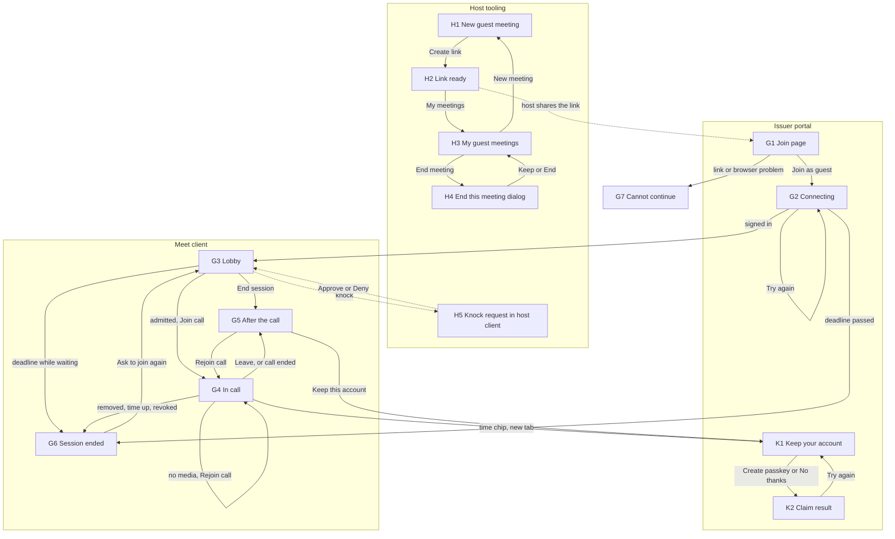
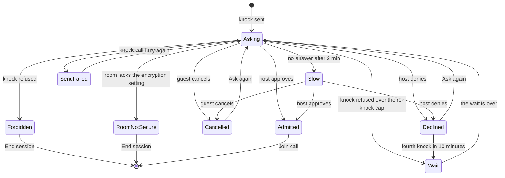
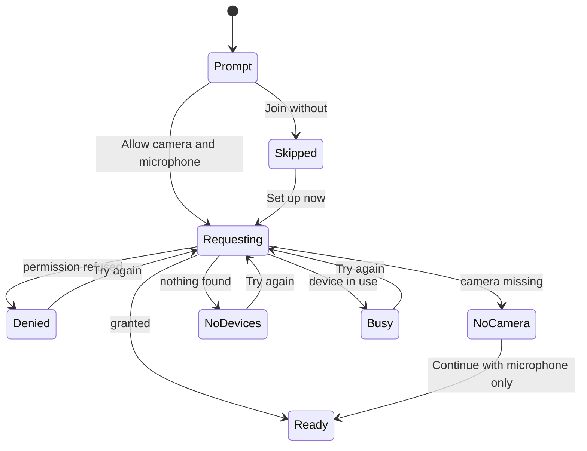

# Guest portal 06: onboarding wireframes

**Status:** DRAFT design document, concept level. Nothing here is implemented, and the wireframes are layout sketches, not a visual design.
**Scope:** requirement R8. The screens, copy, states and errors of the guest onboarding journey, and of the host tooling that creates
the invite, from "host creates a link" to "guest keeps or loses the account". It builds on the flow model (`01-flow-model.md`) and the
client document (`03-element-meet-client.md`). The claim ceremony is specified in `05-claim-flow.md` and its screen-state inventory is used exactly (section 7). The security limits are in `04-security-and-limits.md`, which this document follows
(per-guest links, name rules, notice content, quotas, recording flag). 04 and 05 agree on every point these screens draw, including the claim made during a call (section 1.2, row F9 of section 9).
**Baseline:** siwx-oidc `origin/main` at `3547bd2` (2026-09-30). Citations `path:line` are against that commit. Upstream citations use the
prefixes of document 03 (`ew:` Element Web, `ec:` Element Call) and `syn:` for Synapse v1.161.0.
**Companion file:** [`wireframes/index.html`](wireframes/index.html), a self-contained clickable gallery of the same screens (no network
access needed, open it from disk in any browser).

## 0. Summary

1. **Fourteen screens on three origins** (plus the existing login page, H0). Host tooling (H1 to H5), the issuer portal (join page, connecting, claim) and the Meet client
   (lobby, call, end screens). The issuer hosts everything that touches the invite secret or the claim, because the guest session cookie
   (`__Host-guest_session`, `SameSite=Lax`, `Path=/`) lives on the issuer origin (01 section 5.2). The client hosts everything that needs camera and microphone, because those permissions are per origin.
2. **The happy path is four taps for the guest and two for the host** (section 4), plus typing two names. A naive flow needs seven.
3. **Consequences for the other documents** (section 9): the join page needs a non-burning `peek` call to learn the e-mail policy and
   the session length (now `POST /guest/peek` in 01 section 4.2); the browser capability check must run before redeem because redeem burns a
   single-use link; invite links are shown once, so the host list cannot offer "copy link"; device check and waiting room are one screen with
   two independent zones, owned by the client with Element Call's own lobby skipped (D14); and the host gets no notification of a knock by
   default. A non-allowed account sees a refusal state instead of the host form (D5).
4. **Every person sees the guest label.** The guest page shows the exact string others will see ("Alex Example (Guest)"). The suffix is seeded by siwx-oidc and kept by the Synapse policy module (04 GP-SEC-19, 02 GP-SYN-08), never applied by a client.
5. **The claim screens follow 05 exactly** (seventeen states on two screens, six-point trust statement, "Keep this account" and "Delete everything now", one e-mail choice that defaults to remove, D13). The claim opens in a new tab so a live call is never left, and the account stays limited (D3).
6. **What was removed** is listed in section 4: a separate landing page, the separate device-check screen, the Element Call lobby, a host e-mail toggle, QR codes, an existing-room picker, and the "how many people" number (replaced by one private note per link, as 04 requires).
7. **Every terminal state has an exit, and the failure states of 02 and 03 are drawn** (GP-UX-13, GP-UX-14): a lobby that can always be left with "End session", a connecting screen that times out into "Try again", a room that is not set up for guests, a guest nobody can see or hear (rejoin), a callback error, and a kept account whose call tab was signed out.

## 1. How to read this document

### 1.1 Conventions

| Item | Meaning |
|---|---|
| **Issuer** | siwx-oidc origin, example `id.example.org` (static pages served by siwx-oidc). |
| **Client** | the guest-facing web application, example `meet.example.org` (document 03). |
| **Host tool** | the page where a host creates and ends invites, example `meet.example.org/host` (open decision 4). |
| Wireframe legend | `[[ Label ]]` primary (accent) button, `[ Label ]` secondary button, `<Label>` text link, `(o)` and `( )` radio, `(v)` success check, `(!)` problem icon, `~` spinner, `////` image or video placeholder, `>` collapsed disclosure, `[logo]` logo slot. Mobile frames are 40 columns wide. A desktop frame is drawn only where the layout really differs, because on a wide screen every other screen is the same centered card as the existing login page (`js/ui/src/App.svelte:743-744`). |
| Screen and state ids | `G3` is a screen, `G3:admitted` a state of it. The gallery uses the same ids. |
| `D<n>` | A cross-document decision of the [decisions log of the overview](00-overview.md#7-decisions-log) (for example D5 deny-by-default hosting, D13 e-mail kept at claim only on opt-in, D14 lobby ownership). Each stays open for the maintainers; a screen that follows one says so. The steps of 01 section 4 are lettered A to C, W (waiting room and call) and E, and are cited as "01 step W2". |
| Visual language | The guest screens reuse the existing login card: 400 px card, 20 px radius on a light gray page, bold 22 px title, muted 14 px subtitle, 12 px radius full-width buttons, orange primary, red-tinted error block, small legal footer (`js/ui/src/App.svelte:697-744, 814-816, 892-893, 1046`). Only the accent is orange; everything else is grayscale. The gallery uses a system font stack because it may not load webfonts. |
| Times in copy | Running countdowns (`1 h 52 min left`) are relative durations computed from the server deadline (01 `GET /guest/context`). A locale-formatted clock time ("14:32") appears only where the guest decides: G5, K1 and K2 CL-07, as 05 does (open decision 13). |

### 1.2 Status of the sibling documents

| Document | Status | What this file follows | Affected screens |
|---|---|---|---|
| 01 flow model | complete, reconciled with the cross-document decisions D1 to D21 | routes (including `POST /guest/peek` and the 403 `not_a_host` of `GET /guest/invites`), states, errors, single-use links in batches (D6), deny-by-default hosting (D5) | all |
| 02 Synapse validation | complete | display name carries a fixed suffix (GP-SYN-08); knock is not notified by Matrix | G1 label line, H5 |
| 03 client | complete | the client owns the waiting room with Element Call's lobby skipped (D14, 03 section 4.1) and mounts the call only when its own membership is `join` (GP-CLI-14); device check before the call; end screen carries the claim offer | G3 to G6 |
| 04 security and limits | complete | per-guest single-use links with private notes, link ceiling 72 hours, quotas, name and script rules, `(Guest)` suffix, notice content, `recording_expected`, consent checkbox kept, claim gated on admission with per-device token revocation, e-mail kept at claim only on the guest's opt-in (D13) | all |
| 05 claim flow | complete | screen-state inventory `CL-01` to `CL-07` and `CL-E1` to `CL-E10`, entry points E1 to E4 (E3 included, gated by `claim_allowed`), the six-point trust statement, "Keep this account" and "Delete everything now" | G1 resume, G4, G5, K1, K2 |

04 and 05 agree on the claim: a claim made during a call signs the call tab out (per-device revocation, 04 GP-SEC-36, 05 GP-CLM-11), so the
in-call entry warns the guest and the guest signs in with the passkey to rejoin; the join page's resume screen offers the claim only when the
server's `claim_allowed` is true, which includes the admission read (05 CP-11, GP-CLM-04). If a sibling later contradicts a screen, the sibling
wins and the screen is redrawn.

## 2. Design rules

Each rule carries weight for trust, privacy or correctness of what the guest is told. "Enforcement point" names the component; the test is what
would fail if the rule were broken.

| ID | Requirement | Rationale | Enforcement point | Test |
|---|---|---|---|---|
| GP-UX-01 | The browser capability check (secure context, `RTCPeerConnection`, `getUserMedia`, WebAssembly, `indexedDB`, `crypto.subtle`) runs on G1 **before** any redeem call. A failing browser sees G7:unsupported and nothing is minted. | Redeem burns a single-use link (01 open decision 15) and cookies do not cross browser contexts (01 section 8), so a guest in a mail app's built-in browser would lose the link without ever reaching a call. | join page script (issuer), repeated as a guard in the client | strip `RTCPeerConnection` in a test browser: no `POST /guest/redeem` is sent, G7:unsupported shows |
| GP-UX-02 | The guest sees, before submitting, the exact name others will see, including the guest suffix (default " (Guest)", 04 GP-SEC-19). The suffix is seeded by the server and kept by the policy module (02 GP-SYN-08, 04 GP-SEC-20), so the client only previews it. | A guest label that only the client draws can be removed by a modified client, and a host reading a knock must be able to tell a guest from a colleague with the same name. | siwx-oidc seed plus policy module; preview on G1 | host's knock bar and every call tile show the suffix; editing the client bundle does not remove it |
| GP-UX-03 | The notice names the operator, the purpose, the recipients (the host and the operator), the retention and the residues, says that closing the page is not withdrawal, and sits on the same screen as the action. Consent is an explicit tick (04 keeps the checkbox); pressing the button alone is an operator option (open decision 2). | Consent must be given at the point of collection (GP-FLOW-20, 04 GP-SEC-61, GP-SEC-63, GP-SEC-65); a notice behind a link is not read. | join page, `POST /guest/redeem` records `consent {version, variant, at}` | submit with no consent flag: 422; the notice, the tick and the button are reachable on a 360 px wide phone without leaving the page |
| GP-UX-04 | The remaining session time is visible from the lobby to the end, counts from the moment of redeem (so waiting for the host costs time), warns at 10 and at 2 minutes, and has no "extend" action. The only way to keep the account is to claim it. | The deadline is a hard stop (GP-FLOW-12, GP-FLOW-13); a guest cut off mid-sentence with no warning is the worst outcome of the design. | client timers from the server deadline | fake clock: warnings fire at the two thresholds, call ends at the deadline with G6:time-up |
| GP-UX-05 | Irreversible actions confirm once: "End meeting" and "Revoke link" (host), "End session" on the client end screen and "Delete everything now" on the claim page (guest; one label per page, the same `POST /guest/end`, D18). "Leave call" never confirms. | Ending a meeting deletes other people's accounts; leaving is always safe (01 client contract C4). | client and host tool | one-tap misfire on each destructive control changes nothing |
| GP-UX-06 | Copy never reveals more than the server disclosed. Before the secret verifies, every link problem is the same "This link isn't valid"; state-specific wording appears only after it verifies (GP-FLOW-24, 04 GP-SEC-13), including for the `peek` call. | No invite-state oracle for someone who only knows the invite id. | `peek` and `redeem` responses, join page | wrong secret on an expired, used and revoked invite gives one identical response and identical copy |
| GP-UX-07 | Copy promises deletion, never secrecy. It does not claim end-to-end encryption, privacy from the operator, or "nobody can see". | The operator holds the means to act as the guest and serves the client (04 section 4.4; 01 HK-7; 03 section 4.2). Over-claiming is a trust failure. | copy catalogue | read the copy deck for claims of encryption, privacy or security: the only mentions are the https requirement on G7 and the statement on K1 that earlier encrypted messages do not carry over to other devices |
| GP-UX-08 | The device check never blocks joining. Only the host's admission gates the Join button. | Element Call gives no feedback when media fails (03 section 4.5), so the client must explain, but a guest with no camera must still be able to listen. | client lobby | deny permissions: Join call still enables after admission, joining muted |
| GP-UX-09 | The invite link is shown once (at creation) and is never listed again. | Only a hash of the secret is stored (01 A5, GP-FLOW-01). | host tool | the list endpoint and the list screen carry no link |
| GP-UX-10 | The claim never navigates away from a live call: it opens in a new tab (05 GP-CLM-19), and its page loads as a static shell that reads its state by script (05 section 4.2). | Leaving the call tab drops the call (saving the passkey signs that tab out anyway, 05 GP-CLM-11, but the guest decides when). The guest cookie is `SameSite=Lax` and travels on a cross-site top-level navigation (01 section 5.2, Unverified in a browser), so the page does not rely on how the browser treats the navigation: it loads without the cookie and then reads its state by script. | client link, issuer claim page | open K1 from G4 on a differently-sited client origin: the page loads and finds the guest |
| GP-UX-11 | Accessibility baseline, WCAG 2.2 AA as the target: every control is a real button, link or input with a visible label; touch targets at least 44 px; text and control contrast at least 4.5:1 in both themes; status changes go to an `aria-live="polite"` region; the countdown is announced only at thresholds, never every second; nothing relies on color alone; spinners stop under `prefers-reduced-motion`; focus moves to the new screen title on every state change. | A guest cannot be assumed to have any assistive setup or patience. | client and issuer pages | automated axe run per state in the gallery pattern, plus one manual screen reader pass on G1 and G3 |
| GP-UX-12 | All copy lives in one message catalogue, one full sentence per key (no concatenation), sentence case, verbs on buttons, no exclamation marks, no dashes, relative durations for countdowns (a locale-formatted clock time only where the guest decides, open decision 13), and the name fields are labelled by meaning (given and family name), not by position. | Translation and review need the strings in one place; concatenated sentences break in other languages. | client and issuer build | catalogue lint: no key is a fragment, no key has a dash character |
| GP-UX-13 | Every state a guest or host can be stuck in ends in an exit: a retry that re-enters through the cookie, a link to the next screen, "End session" while a guest record is live (every lobby state, the end screen), "Sign out" in the host tool, or "Close" on the claim pages. The only states without an action are those where nothing is left to leave (G7 link problems, G6 `time-up`), and their copy says what to do next. A state that waits on another party has a timeout that ends in a retry (G2 `timeout`), and asking again after a deny is bounded by the re-knock cap of 01 GP-FLOW-33, which the lobby shows as a wait line (G3 `wait`). | A guest with a live account and no exit can only close the tab, which is not withdrawal (04 GP-SEC-65); a spinner with no timeout is a dead end; an unbounded "Ask again" is a knock flood (the module is the control, the screen is the mirror). | client, issuer pages, policy module for the cap | walk the state table of every screen: each state lists an exit; G2 `working` reaches `timeout` after 60 s; G3 `forbidden` offers End session; H1 `not-allowed` offers Sign out; K2 `CL-E1`, `CL-E2` and `CL-E4` offer Close; a fourth knock in 10 minutes shows G3 `wait` |
| GP-UX-14 | Every failure that 02 and 03 specify for the client has a screen state, so the requirement is testable as drawn: the room without encryption (`room-not-secure`, 03 GP-CLI-12), the guest nobody can see or hear (`no-media` with a rejoin, 02 GP-E2EE-03), the hand-off that never ends (`timeout`) and the hand-off that fails (`callback-error`, 01 C5). | A requirement whose failure has no screen is a requirement nobody tested: the lobby and call screens are where the gate of GP-CLI-12 and the recovery of GP-E2EE-03 meet the guest. | client | remove `m.room.encryption` from the fixture room: G3 `room-not-secure` shows and no call component mounts; drop the first key message in the harness: G4 `no-media` shows and Rejoin call recovers; stall the callback: G2 `timeout`; answer `access_denied` at the callback: G2 `callback-error` |

## 3. Screen inventory and journey

### 3.1 Inventory

| Id | Screen | Origin | Entry condition | Exit |
|---|---|---|---|---|
| H0 | Sign in (the existing login page, unchanged) | Issuer | host opens the host tool with no session | H1 after the normal OIDC return |
| H1 | New guest meeting | Host tool | signed in and on the operator's host list, which is deny by default (D5, GP-FLOW-10). Any other account sees the refusal state `H1:not-allowed` instead of the form | H2, or Sign out from `not-allowed` |
| H2 | Link ready | Host tool | create succeeded | H3, the room in the host's own client, or leave |
| H3 | My guest meetings | Host tool | from H2 or the tool's entry | H4, H1 |
| H4 | End this meeting? (dialog over H3) | Host tool | host chooses End meeting | H3 |
| H5 | Knock request (host's own client, upstream UI) | Host client (Element Web) | a guest knocked | Approve or Deny |
| G1 | Join page: check, name form, resume | Issuer, `/guest/join/<invite_id>#<secret>` | guest opens the link | G2, G7 |
| G2 | Connecting (continue, sign-in, code exchange) | Issuer, then Client | after G1 or "Continue as" | G3, G6, Try again (from `lost-session`, `unavailable`, `timeout`, `callback-error`) |
| G3 | Lobby: admission zone and device zone | Client | guest signed in | G4, G5 (End session, from every state), G6 |
| G4 | In call | Client | admitted, guest pressed Join call | G5, G6, K1 (new tab), G4 again (Rejoin call from `no-media`) |
| G5 | After the call | Client | Leave, or every other participant left | G4 (rejoin), K1, end |
| G6 | Session ended | Client for `time-up` and `removed`, issuer page `/guest/ended` for `closed` and `closed-kept` | deadline reached, tokens revoked, removed by host | G3 (`removed`), passkey sign-in (`closed-kept`, and the text link of `closed`), none (`time-up`: nothing is left to leave) |
| G7 | Cannot continue | Issuer (Client for the browser guard) | link problem, guest mode off, rate limit, service down, unsupported browser | retry, or none |
| K1 | Keep this account (states CL-01 to CL-05, from 05) | Issuer, `/guest/claim` | G4 time chip, G5 card, or G1 resume link | K2 |
| K2 | Claim outcome (states CL-06, CL-07, CL-E1 to CL-E10, from 05) | Issuer | passkey ceremony finished, declined or failed | K1 (retry), G5, Sign in, Close (`CL-E1`, `CL-E2`, `CL-E4`, `CL-06`), or end |

### 3.2 Journey map



The lobby is two independent state machines on one screen. The device zone never blocks anything (GP-UX-08); only admission gates Join.





## 4. Tap budget and what was removed

| Step | Guest | Taps |
|---|---|---|
| Open the link, type first and last name (and e-mail only if the operator requires it) | typing | 0 |
| G1 tick the consent box (04 keeps the checkbox) | tap | 1 |
| G1 Join as guest | press | 1 |
| G2 sign-in hops | none | 0 |
| G3 Allow camera and microphone (the browser then asks once more) | press | 1 |
| G3 wait for the host | none | 0 |
| G3 Join call (also the user gesture that audio autoplay needs) | press | 1 |
| **Happy path to the call** | | **4** |
| Leave | press | 1 |

The host needs two taps to hand out a link (Create link, Copy link) and one to admit (Approve, upstream UI). A straightforward build of the same
journey (landing page, form, consent checkbox, device-check screen, ask-to-join screen, Element Call lobby, join) costs seven taps and three page loads more. Without the checkbox (the operator option of open decision 2) it is three.

"Question every requirement" applied to every field and step. What was deleted or merged, and why:

| Removed or merged | Reason |
|---|---|
| Separate landing page before the form | The `peek` call (open decision 1) lets G1 show the meeting, the host and the right fields at once. One fewer page, and errors appear before the guest types. |
| "Is this you?" confirmation after the name | The live "Others will see you as" line does the same job without a screen. |
| Step indicators and progress bars | Four taps do not need a progress bar. |
| Separate device-check and waiting screens | One lobby: the knock is sent on arrival so the host can admit while the guest sets up devices, and the zones are independent (GP-UX-08). |
| The Element Call lobby (second preview) | The guest already previewed in G3 and pressed Join call. The client joins the room, waits until its own membership is `join`, then mounts the call, which starts directly: `skipLobby` is true (D14, 03 section 4.1 and GP-CLI-14). It skips only that device lobby, never the host's admission. |
| Speaker test, sound test, noise options | Not needed to join; the call window keeps its own controls. |
| Avatar picker and any profile field other than the two names and the e-mail | The account is ephemeral; initials are drawn by the client. |
| E-mail toggle for the host | R2 makes the e-mail policy an operator setting; the host sees it read-only. |
| Host choice of waiting room | Always on: the knock gate is the only control against a leaked link (02 section 4). |
| Existing-room picker and room id field in the host tool | The tool creates a fresh room from the audited template (01 section 4.3); binding an existing room stays API-only (open decision 16). |
| QR code for the link | Guests receive the link in a message; a QR adds a screen and a scanning path that bypasses the in-app browser check. |
| Copy-link action in the meetings list | Links are shown once (GP-UX-09). |
| A separate message for names that look like an account address | 04's character rule already refuses `@`, `:` and `#`, so one "characters" message covers it. |
| Numeric max-guests field and "several people" choice | Replaced by one private note per link, which is what makes per-person links and per-person revocation possible (04 GP-SEC-10). The stepper survives only in the operator-enabled open-link variant. |
| Language picker | The browser language selects the catalogue (GP-UX-12). |
| "Extend my session" | Does not exist: the deadline only moves earlier (GP-FLOW-12). Claiming is the only way to keep the account. |
| Second device hand-over | Not supported in v1 (01 section 8); the copy says nothing about it. |

## 5. Host screens

The host is a signed-in user on the operator's host list (deny by default, D5, 01 GP-FLOW-10) with invite power in the room the tool creates. Everything on these screens runs with the host's own access
token (01 A2). Where the host tool lives is open decision 4; the wireframes assume a dedicated static route with the ordinary sign-in (H0) and a
second, non-guest OIDC client, so the guest client stays free of room lists and host features (03 GP-CLI-08).

### 5.1 H0 Sign in

The existing login page (`js/ui/src/App.svelte:468-682`), unchanged. The host tool starts the ordinary authorization flow when it has no
token. No wireframe, no new copy.

### 5.2 H1 New guest meeting

**Origin:** host tool. **Entry:** signed in and on the operator's host list, which is deny by default (D5, 04 GP-SEC-01, GP-SEC-06); any other account sees the refusal state below. **Exit:** H2, or Sign out from the refusal state. **Desktop variant:** none (the card is centered, as on the login page).

```text
+--------------------------------------+
| meet.example.org/host           [H1] |
+--------------------------------------+
|  [logo]                              |
|                                      |
|  New guest meeting                   |
|  Create one link for each guest.     |
|  Each link works once.               |
|                                      |
|  Meeting name                        |
|  +--------------------------------+  |
|  | Weekly sync                    |  |
|  +--------------------------------+  |
|  Guests see this name when they ask  |
|  to join.                            |
|                                      |
|  Guest 1: who is this link for?      |
|  (optional)                          |
|  +--------------------------------+  |
|  | Alex                           |  |
|  +--------------------------------+  |
|  Only you see this note. Up to 40    |
|  characters.                         |
|  [       Add another guest        ]  |
|  Each link works once. Up to 10      |
|  guests per meeting, set by your     |
|  operator.                           |
|                                      |
|  > More options                      |
|                                      |
|  - - - - - - - - - - - - - - - - -   |
|  Waiting room: always on             |
|  E-mail: optional (set by operator)  |
|  - - - - - - - - - - - - - - - - -   |
|                                      |
|  [[         Create link          ]]  |
+--------------------------------------+
```

**Design decision taken from 04 (D6).** Links are single-use and recipient-bound by default: a host who needs several guests creates one link per guest in one call and labels each with a private note (04 GP-SEC-10). That is why the form asks "who is this link for" and not
"how many people". It gives attribution and per-person revocation, and a forwarded link is a burned link. The reusable open link exists only where the operator enables it (`guest_allow_open_links`), is capped at 10 people and 24 hours, always needs the host to admit every guest, and is shown as the state `open-links`. Whether v1 ships it at all is the maintainers' call, and single-use first is recommended (open decision 12).

**Refusal state (D5).** Hosting is deny by default (04 GP-SEC-01), so most signed-in accounts are not hosts. The tool asks `GET /guest/invites` on load, and a 403 `not_a_host` (01 section 4.2) replaces the form with the screen below: a non-allowed user learns it at once and is never asked to fill a form that cannot succeed. A create that answers the same 403 (the allow-list changed meanwhile) shows the same screen.

```text
+--------------------------------------+
| meet.example.org/host           [H1] |
+--------------------------------------+
|  [logo]                              |
|                                      |
|  Guest meetings aren't enabled       |
|  for your account                    |
|                                      |
|  Your operator decides who can       |
|  invite guests. Ask your operator    |
|  to add your account.                |
|                                      |
|  <Sign out>                          |
+--------------------------------------+
```

**Copy (exact)**

| Element | Text |
|---|---|
| Refusal state (`not-allowed`) | Title: Guest meetings aren't enabled for your account. Body: Your operator decides who can invite guests. Ask your operator to add your account. Text link: Sign out (ends this host session, so another account can sign in; GP-UX-13). No button: there is nothing else to do from here |
| Title | New guest meeting |
| Subtitle | Create one link for each guest. Each link works once. |
| Field: meeting name | Meeting name. Helper: Guests see this name when they ask to join. Do not put secrets in it. |
| Field: guest note (one per link) | Guest 1: who is this link for? (optional). Helper on the first: Only you see this note. Up to 40 characters. |
| Buttons | Add another guest (becomes Remove last guest once a second row exists). Helper: Each link works once. Up to 10 guests per meeting, set by your operator. |
| Disclosure | More options |
| Option: link validity | Link valid for: 1 hour, 24 hours (default), 72 hours |
| Option: session length | Guest session lasts: 1 hour, 2 hours (default), 4 hours. Helper: Guests are signed out and deleted after this time, even during a call. |
| Option: recording flag | checkbox: This meeting may be recorded or transcribed. Guests are told before they join. |
| Read-only line | Waiting room: always on. You let each guest in. |
| Read-only line | E-mail: optional (set by your operator). Variants: required (set by your operator); not collected (set by your operator) |
| Button | Create link (Create 2 links, and so on, when there are several rows) |
| Open-links variant (operator option) | Who can use the link: One link per person / One link for several people. Up to 3 people. Maximum 10, set by your operator. Open links last at most 24 hours. |

**What the host sets, and where it goes** (01 section 4.2 `POST /guest/invites`, amended by 04)

| Control | API field | Default | Limit | Why this control exists |
|---|---|---|---|---|
| Meeting name | room name at room creation | "Meeting" | 1 to 60 characters, trimmed | The guest sees it before admission; the host recognises the room. Visible to anyone who redeems a link (04 GP-SEC-15: inserted as text, never as HTML). |
| (none: room binding) | `room_id` | a new room the tool creates with the host's own token from the audited template (04 GP-SEC-28, which is the union of 01 section 4.3 with 02 section 4) | n/a | The room is bound by construction, so the host cannot pick an unsafe room. |
| Guest rows | `count` and one private label per link, `kind: single` | one row | up to `guest_max_guests` (default 10); label at most 40 characters | One link per person: attribution, per-person revocation, no forwarding amplification (04 GP-SEC-10). |
| Open-links variant | `kind: open`, `max_guests` | not shown | only with `guest_allow_open_links`; at most 10 people and 24 hours | Webinar style use, off by default. |
| Link valid for | `expires_in` | 24 hours | 1 hour to 72 hours (04 GP-SEC-11, 01 `guest_invite_ttl_secs`) | A leaked link should die on its own. Behind "More options" because most hosts never change it. |
| Guest session lasts | `session_secs` | 2 hours | minimum 10 minutes, ceiling 4 hours (04 GP-SEC-33); a host may choose any value between the minimum and the ceiling (the select offers three of them, and the ceiling is above the 2 hour default, so the host may also lengthen) | The hard stop of the account (R5). |
| Recording flag | `recording_expected`, frozen at mint | off | none | It changes what the guest consents to and is shown on G1 (04 GP-SEC-61). The design cannot police whether an agent joins (04 GP-SEC-64). |
| E-mail line | none, frozen from operator `guest_email` at mint | operator | read-only | R2: operator-enforced, not a host choice. |
| Waiting room line | none, the room join rule is `knock` | always | not a setting | The knock gate is the only control against a leaked link. |

**Inputs and validation**

| Field | Rule | Message |
|---|---|---|
| Meeting name | required after trimming, 1 to 60 characters | Enter a meeting name. / Use 60 characters or fewer. |
| Guest note | optional, at most 40 characters, shown only to this host | Use 40 characters or fewer. |
| Number of guests | bounded by the Add button, which disables at the operator ceiling | none |

**States**

| State | Trigger | What the screen shows |
|---|---|---|
| `default` | page load | as drawn: one guest row |
| `two-guests` | Add another guest | a second row; the button reads "Create 2 links" |
| `options-open` | host opens More options | the two selects and the recording checkbox |
| `open-links` | operator enabled reusable links | the segmented control and stepper replace the guest rows; link validity offers 1 hour and 24 hours only |
| `email-required-info` | operator policy is `required` | the read-only line reads "E-mail: required (set by your operator)" |
| `submitting` | Create pressed | fields disabled, button reads "Creating room and link..." (or "links") |
| `not-allowed` | 403 `not_a_host` on load or at create: not on the host list (deny by default, D5), or the token of a guest, a claimed-restricted account or an admin (04 GP-SEC-01, GP-SEC-06) | the form is replaced by the refusal screen drawn above: Guest meetings aren't enabled for your account. Your operator decides who can invite guests. Ask your operator to add your account. Text link: Sign out. |
| `switched-off` | 503: `guest_enabled` false, or the kill switch (04 GP-SEC-48) | Guest meetings are switched off on this service. |
| `host-limit` | per-host quota: active invites, live guests, invites per hour (04 GP-SEC-02) | You have reached the limit of active guest meetings. End one to create another. |
| `capacity` | global live-guest cap or daily mint ceiling, or the cleanup brake (04 GP-SEC-02, GP-SEC-03) | Guest meetings are at capacity right now. Try again later. |
| `unavailable` | Synapse or Redis error during room creation or mint | We couldn't create the meeting room. Try again in a moment. |
| `signed-out` | 401, token expired | You were signed out. Sign in again to continue. Button: Sign in. |
| `rate-limited` | proxy 429 | Too many requests. Wait a minute, then try again. |

**Accessibility and i18n.** Each guest row is an input with its own visible label; "Add another guest" moves focus to the new input. The open-links segmented control is a radio group with a selected state that is not color alone; the stepper buttons carry labels and the count is typeable.
The disclosure is a real `<details>`-style control with `aria-expanded`. Durations in the selects are translated strings, not computed. The room name and the notes are user text and are not translated. "Create 2 links" needs plural forms in the message catalogue.

### 5.3 H2 Link ready

**Origin:** host tool. **Entry:** create succeeded. **Exit:** H3, the room, or the host leaves. **Desktop variant:** none.

```text
+--------------------------------------+
| meet.example.org/host           [H2] |
+--------------------------------------+
|  Your link is ready                  |
|                                      |
|  Alex                                |
|  +--------------------------------+  |
|  | id.example.org/guest/join/     |  |
|  | 7f3a...#gi_Xk9...              |  |
|  +--------------------------------+  |
|  [[          Copy link           ]]  |
|  [             Share              ]  |
|                                      |
|  +--------------------------------+  |
|  | Shown once. Only a fingerprint |  |
|  | of each link is stored, so it  |  |
|  | cannot be shown again. Lost    |  |
|  | one? Revoke it in My guest     |  |
|  | meetings and create a new one. |  |
|  +--------------------------------+  |
|                                      |
|  Each link works once. Link valid    |
|  for 24 hours. Guest session 2       |
|  hours.                              |
|  Send each link only to the person   |
|  it is for. Anyone with a link can   |
|  ask to join. Guests type their own  |
|  name, so check it matches who you   |
|  invited.                            |
|                                      |
|  [       Open meeting room        ]  |
|  <My meetings>                       |
+--------------------------------------+
```

**Copy (exact)**

| Element | Text |
|---|---|
| Title | Your link is ready (Your links are ready when there are several) |
| Per link | the host's note as a label, the link in a box (`https://id.example.org/guest/join/7f3a...#gi_Xk9...`, monospace, middle truncated, selectable), button Copy link (becomes "Copied") |
| Extra | Share (phones that support the share sheet) |
| Note | Shown once. Only a fingerprint of each link is stored, so it cannot be shown again. Lost one? Revoke it in My guest meetings and create a new one. |
| Summary | Each link works once. Link valid for 24 hours. Guest session 2 hours. |
| Advice | Send each link only to the person it is for. Anyone with a link can ask to join. Guests type their own name, so check it matches who you invited. |
| Secondary | Open meeting room (button), My meetings (link) |

**Why these lines.** The secret exists only in this response (01 A5), so the screen must say so and must not offer the link later (GP-UX-09). The advice about names is the host's main mitigation against a forwarded link: admission is a decision on the typed name, and the typed name is not verified
(04 AC-03 and GP-SEC-18 also refuse names that look like the host's own or like a reserved word).

**States**

| State | Trigger | What the screen shows |
|---|---|---|
| `default` | create succeeded for one guest | as drawn |
| `several` | create succeeded for several guests | one labelled row per link |
| `copied` | clipboard write succeeded | the button reads "Copied" for three seconds, announced in the live region |
| `copy-failed` | clipboard blocked | the link box is selected and an error block reads: Couldn't copy automatically. Select the link and copy it. |

**Accessibility and i18n.** Each link is a real read-only text field so it can be selected on any device. "Copied" is announced politely. The share button is hidden, not disabled, where the platform has no share sheet. Title and summary need plural forms.

### 5.4 H3 My guest meetings

**Origin:** host tool. **Entry:** from H2 or the tool's home. A non-allowed account never reaches H3: the tool sends it to `H1:not-allowed`. **Exit:** H4, H1. **Desktop variant:** yes, a table on wide screens, cards on phones.

```text
+--------------------------------------+
| meet.example.org/host           [H3] |
+--------------------------------------+
|  My guest meetings                   |
|  [          New meeting           ]  |
|                                      |
|  Weekly sync                         |
|  [          End meeting           ]  |
|  - - - - - - - - - - - - - - - - -   |
|  Alex                          [Used]|
|  Joined as Alex Example (Guest),     |
|  alex@example.org (typed by the      |
|  guest, not verified). Link expires  |
|  in 23 h.                            |
|  [             Revoke             ]  |
|  - - - - - - - - - - - - - - - - -   |
|  Sam                       [Not used]|
|  Link expires in 23 h.               |
|  [             Revoke             ]  |
|  - - - - - - - - - - - - - - - - -   |
|  (more meetings below)               |
+--------------------------------------+
```

```text
+------------------------------------------------------------------------------------------+
| meet.example.org/host                                                               [H3] |
+------------------------------------------------------------------------------------------+
|  My guest meetings                                                     [ New meeting ]   |
|                                                                                          |
|  +---------------+------+----------+----------------------+---------+-----------------+  |
|  | Meeting       | For  | Status   | Guest                | Expires |                 |  |
|  +---------------+------+----------+----------------------+---------+-----------------+  |
|  | Weekly sync   |      |          |                      |         | [ End meeting ] |  |
|  |               | Alex | Used     | Alex Example (Guest) | in 23 h | [ Revoke ]      |  |
|  |               | Sam  | Not used |                      | in 23 h | [ Revoke ]      |  |
|  | Design review |      |          |                      |         | [ End meeting ] |  |
|  |               | Jo   | Expired  | Jo Example (Guest)   | 3 h ago | [ Revoke ]      |  |
|  +---------------+------+----------+----------------------+---------+-----------------+  |
+------------------------------------------------------------------------------------------+
```

**Copy (exact).** Title: My guest meetings. Button: New meeting. Per meeting: its name and End meeting. Per link: the host's note, a status chip (Not used, Used, Expired, Revoked), the guest line "Joined as Alex Example (Guest), alex@example.org (typed by the guest, not verified)", "Link expires in 23 h", and Revoke.
Empty: No guest meetings yet. Error: We couldn't load your meetings. Button: Try again. Desktop columns: Meeting, For, Status, Guest, Expires, (actions).

**How a row maps to the invite** (01 section 6.1; 04 GP-SEC-10 and GP-SEC-14): Not used is `active` with no redemption, Used is a single-use link that was redeemed, Expired is `expired`, Revoked is `revoked`. The list is `GET /guest/invites` and, per 04 GP-SEC-26, may show the redeemed name and the e-mail to the creating host only;
it never shows another host's links and never shows a link itself. Revoke works on a link at any time before it is revoked, including a used or expired one, because revoking also removes the guest behind it (04 abuse test for GP-SEC-14). End meeting revokes every link of the meeting (01 GP-FLOW-11). The row shows one redemption per link, so there is no "Guests 1 of 3" counter any more.

**States**

| State | What the screen shows |
|---|---|
| `list` | as drawn |
| `loading` | three gray skeleton rows, `aria-busy` |
| `empty` | No guest meetings yet. and a New meeting button |
| `error` | We couldn't load your meetings. and a Try again button |

**Accessibility and i18n.** On desktop the list is a real table with column headers; on phones each meeting is a labelled group and each link a row. Status is text, never color alone. Relative times come from a formatter, not a concatenation. The e-mail is shown as text, never as a mailto link, because it is unverified.

### 5.5 H4 End this meeting? and Revoke this link? (dialogs)

**Origin:** host tool. **Entry:** End meeting or Revoke on H3. **Exit:** H3.

```text
+--------------------------------------+
| meet.example.org/host           [H4] |
+--------------------------------------+
|  My guest meetings   (dimmed page)   |
|                                      |
|  +--------------------------------+  |
|  | End this meeting?              |  |
|  |                                |  |
|  | The links stop working. Guests |  |
|  | are signed out and their guest |  |
|  | accounts are deleted. Their    |  |
|  | call window can take a few     |  |
|  | minutes to close.              |  |
|  |                                |  |
|  | Tip: end the call in your      |  |
|  | meeting room first, so nobody  |  |
|  | stays connected.               |  |
|  |                                |  |
|  | [ End meeting ]                |  |
|  | [ Keep meeting ]               |  |
|  +--------------------------------+  |
+--------------------------------------+
```

**Copy (exact)**

| Dialog | Title | Body | Buttons |
|---|---|---|---|
| End meeting | End this meeting? | The links stop working. Guests are signed out and their guest accounts are deleted. Their call window can take a few minutes to close. Tip: end the call in your meeting room first, so nobody stays connected. | End meeting (destructive), Keep meeting |
| Revoke link | Revoke this link? | The link stops working. If the guest already joined, their guest account is deleted. | Revoke link (destructive), Keep link |

**Why the tip.** `POST /guest/invites/{invite_id}/end` revokes the invite and sets every guest's deadline to now (GP-FLOW-11), but nothing in lk-jwt 0.7.0 removes a participant from the media server (01 section 7.5, open decision 12; 04 GP-SEC-31 relies on mandatory encryption and
a short media token instead), so a connected guest's media can outlive the account for a short time. The tip is the v1 mitigation and should be deleted when an eject exists. The "few minutes" is the client-side detection bound of 03 section 3.6, not a promise about media.

**States.** `confirm` (End meeting, as drawn); `revoke` (Revoke this link?); `submitting` (the confirm button reads "Working..."); `done` (back on H3, the meeting's links show Revoked, toast "Meeting ended."); `revoked` (back on H3, toast "Link revoked.");
`error` (We couldn't end the meeting. Try again. If it keeps failing, guest sessions still end on their own deadline. The revoke dialog says "We couldn't revoke the link." in the same way).

**Accessibility.** A true modal dialog: focus moves to the title, is trapped, Escape equals Keep, focus returns to the control that opened it. The default focus is the Keep button.

### 5.6 H5 Knock request (the host's own client)

**Origin:** the host's own client, for example Element Web at `chat.example.org`. **Entry:** a guest knocked. **Exit:** Approve or Deny. **Design status:** upstream
UI, not designed here. Drawn so the guest label and the notification gap are visible.

```text
+----------------------------------------------------------------------------+
| chat.example.org                                                      [H5] |
+----------------------------------------------------------------------------+
|  Weekly sync                                        (host's own client)    |
|  - - - - - - - - - - - - - - - - - - - - - - - - - - - - - - - - - - - -   |
|  +----------------------------------------------------------------------+  |
|  | (AE)  Asking to join                            [ Deny ] [ Approve ] |  |
|  |       Alex Example (Guest) (@xxxx:example.org)                       |  |
|  +----------------------------------------------------------------------+  |
|  (room view and call controls: upstream, not designed here)                |
+----------------------------------------------------------------------------+
```

**What upstream shows.** `RoomKnocksBar` renders the heading "Asking to join" (one) or "N people asking to join", the requester's display name followed by the MXID, and the buttons
Deny and Approve (`ew:apps/web/src/components/views/rooms/RoomKnocksBar.tsx:92-131`, strings `ew:apps/web/src/i18n/strings/en_EN.json:2014-2016`, `action|deny`, `action|approve`), behind the
`feature_ask_to_join` labs flag (01 prerequisite P9). Approve is an invite from the host and Deny is a kick (01 section 4.4).

**What this design adds.** Only the guest suffix on the display name, applied by the policy module (GP-UX-02). The host therefore reads "Alex Example (Guest)" and can see that a
name typed by a stranger is not a colleague.

**Gap: the host is not told.** Synapse's default push rule for member events has empty actions (`syn:rust/src/push/base_rules.rs:121-129`), so a knock raises no notification; the bar
is visible only while the host looks at that room (02 section 2, row 5a'). The mitigation proposed in open decision 5 is that the host tool, which creates the room, also installs one
per-room push rule for knock events. A user-defined override rule is evaluated before the default member-event rule (`syn:rust/src/push/mod.rs:529-546`, the default sits in the append list
at `base_rules.rs:72`), so the rule would win; whether Element Web then raises a notification has not been run here.

**States.** `one`; `several` (heading "3 people asking to join", one line each); `admitted` (request disappears, the guest's client moves to G3:admitted); `declined` (request disappears, G3:declined);
`silent` (the room is open with no bar and no notification, the gap case).

**Accessibility and i18n.** Upstream's. The guest's typed name can be any script and any direction; the suffix is stored text, so it is not translated per viewer (open decision 6).

## 6. Guest screens

### 6.1 G1 Join page

**Origin:** issuer, `/guest/join/<invite_id>#<secret>` (01 B1, B2). **Entry:** the guest opens the link. **Exit:** G2 (redeem succeeded), G7 (problem). **Desktop variant:** none.

The page does four things in order, and the guest sees at most one of them at a time: (1) capability check (GP-UX-01), (2) a non-burning **`peek`** with the secret from the fragment, which
answers only after the secret verified (GP-UX-06) with the facts the form needs, (3) an offer to resume if a valid `__Host-guest_session` cookie exists (01 section 8), (4) the form.
Why `peek` exists: 01 freezes `email_policy` and `session_secs` on the invite, but `GET /guest/join/<invite_id>` returns the same static shell for every id, so without a secret-checked lookup the form
cannot know whether the e-mail field is optional, required or absent, or how long the session lasts. Discovering a required e-mail only from the 422 after submit would
make the guest type twice. `peek` is `POST /guest/peek` in 01 section 4.2: it changes no state (so prefetchers cannot burn a link), takes the secret in the body (CORS and logs, GP-FLOW-25), and shares the proxy limit of `GET /guest/join/*` (P6).
It returns: state, e-mail policy, session length, consent version, recording flag. It returns no host-controlled text (04 GP-SEC-15): before redeem the page names neither a host nor a meeting, and the meeting name first appears in the lobby (G3), from `GET /guest/context`.

```text
+--------------------------------------+
| id.example.org/guest/join       [G1] |
+--------------------------------------+
|  [logo]                              |
|                                      |
|  Join the call as a guest            |
|  You have been invited to a video    |
|  call.                               |
|                                      |
|  First name                          |
|  +--------------------------------+  |
|  | Alex                           |  |
|  +--------------------------------+  |
|  Last name                           |
|  +--------------------------------+  |
|  | Example                        |  |
|  +--------------------------------+  |
|  Others will see you as:             |
|  Alex Example (Guest)                |
|                                      |
|  E-mail (optional)                   |
|  +--------------------------------+  |
|  | alex@example.org               |  |
|  +--------------------------------+  |
|  We use it to contact you about      |
|  this meeting. The host and the      |
|  operator can see it. It is deleted  |
|  with your guest account, unless you |
|  choose to keep it when you keep     |
|  the account.                        |
|                                      |
|  How guest access works              |
|  - No account needed. Example        |
|    Operator creates a temporary      |
|    guest account for you.            |
|  - The host decides whether to let   |
|    you in. The host and the operator |
|    can see your name and e-mail      |
|    address.                          |
|  - Your guest account and your       |
|    details are deleted when the      |
|    session ends, at the latest 2     |
|    hours after you join. Closing     |
|    this page does not end it. After  |
|    the call, choose End session to   |
|    end it sooner.                    |
|  - You send no messages, so none are |
|    left behind. Other people in the  |
|    call may have seen or recorded it,|
|    and server logs are kept for up to|
|    14 days.                          |
|                                      |
|  [x] I agree to the Terms of Use and |
|      the Privacy Policy              |
|  [[        Join as guest         ]]  |
+--------------------------------------+
```

The `resume` state replaces the form:

```text
+--------------------------------------+
| id.example.org/guest/join       [G1] |
+--------------------------------------+
|  [logo]                              |
|                                      |
|  Welcome back                        |
|  You already joined this meeting as  |
|  Alex Example (Guest). Your guest    |
|  session has 1 h 12 min left.        |
|                                      |
|  [[   Continue as Alex Example   ]]  |
|  <Keep this account>                 |
+--------------------------------------+
```

The link "Keep this account" is 05 entry E3. It is drawn only when `GET /guest/resume` says `claim_allowed`, which the server computes including the admission read (05 CP-11, GP-CLM-04), so a guest whom the host has not admitted is not offered a claim that would be refused. Without it the screen is the same minus the link.

**Copy (exact)**

| Element | Text |
|---|---|
| Title | Join the call as a guest |
| Subtitle | You have been invited to a video call. (Operator text only: no host name and no meeting name before redeem, 04 GP-SEC-15, open decision 7.) |
| Field labels | First name. Last name. E-mail (optional). Required variant: E-mail. Off variant: no field. |
| E-mail helper (04 GP-SEC-61, GP-SEC-26, D13) | We use it to contact you about this meeting. The host and the operator can see it. It is deleted with your guest account, unless you choose to keep it when you keep the account. |
| Label preview (04 GP-SEC-19) | Others will see you as: Alex Example (Guest). Before typing: Others will see you as: Your name (Guest). The suffix is the operator's configurable text, default " (Guest)" |
| Notice title | How guest access works |
| Notice items (04 GP-SEC-61, GP-SEC-63, GP-SEC-65) | No account needed. Example Operator creates a temporary guest account for you. / The host decides whether to let you in. The host and the operator can see your name and e-mail address. / Your guest account and your details are deleted when the session ends, at the latest 2 hours after you join. Closing this page does not end it. After the call, choose End session to end it sooner. / You send no messages, so none are left behind. Other people in the call may have seen or recorded it, and server logs are kept for up to 14 days. |
| Recording variant (04 GP-SEC-61) | above the consent line, a bordered row: This meeting may be recorded or transcribed. Shown only when the host set the flag on the invite. |
| Consent (04 section 7 keeps the checkbox) | checkbox: I agree to the Terms of Use and the Privacy Policy (links from `op_tos_uri` and `op_policy_uri`, `src/config.rs:213-218`; omitted when unset, as the login page does, `js/ui/src/App.svelte:671-676`). The button stays disabled until it is ticked |
| Button | Join as guest |
| Resume (state `resume`) | Title: Welcome back. Line: You already joined this meeting as Alex Example (Guest). Your guest session has 1 h 12 min left. Button: Continue as Alex Example. Text link, only when `claim_allowed`: Keep this account |
| Button-consent variant (operator option, open decision 2) | no checkbox; under the button: By choosing Join as guest you agree to the Terms of Use and the Privacy Policy. |

The operator name ("Example Operator") and the retention figure ("14 days", the longest log default of 04 GP-SEC-47 and GP-SEC-62) are operator configuration, not hard-coded (04 GP-SEC-61, GP-SEC-62). The "2 hours" comes from the invite's `session_secs` through `peek`, never hard-coded. The session counts from the moment of redeem, so the notice says "after you join" and the lobby shows the remaining time. The notice is longer than the first draft because 04 requires it to name the operator, the recipients, the retention and the residues at the point of collection, and to say that closing the tab is not withdrawal.

**Inputs and validation.** The server is authoritative (04 GP-SEC-16 to GP-SEC-18, which replace 01 GP-FLOW-09, and 01 section 9); the page mirrors the rules so most errors never reach the server.

| Field | Rule | Message (exact) |
|---|---|---|
| First name | required after trimming; NFC-normalised; inner spaces collapsed; 1 to 40 characters; letters, combining marks, space, hyphen and apostrophe only (a period only after a single-letter initial); no digits, symbols, emoji, `@`, `:`, `#`, control or invisible characters (04 GP-SEC-16); one script per part (04 GP-SEC-17); not a reserved word, and not a lookalike of the inviting host's name (04 GP-SEC-18) | Enter your first name. / Use 40 characters or fewer. / Use letters, spaces, hyphens and apostrophes only. / Use letters from one alphabet in this name. / This name can't be used here. Enter your own name. |
| Last name | same rules | Enter your last name. / (the same four) |
| E-mail | per invite policy: optional, required or off; syntax check only, at most 254 characters, no verification (04 GP-SEC-22) | Enter your e-mail address. (required and empty) / Enter an e-mail address like name@example.org. |
| Consent | the checkbox (default) or the button (operator option) | Tick the box to continue. |

The character rule of 04 (GP-SEC-16) replaces the one of 01 (GP-FLOW-09) and removes both "looks like an account address" and "invisible characters" as separate cases: `@`, `:` and `#` are simply not allowed, so the earlier message about account addresses is deleted. The "reserved or lookalike" message is deliberately vague, so it does not reveal the host's own name or the list.

The e-mail is self-asserted and unverified (01 section 9); the copy never implies the host or the service checked it. Autofill hints: `given-name`, `family-name`, `email`. The two name fields are required because R2 asks for both; 04's character and script rules refuse digits and mixed scripts, which may refuse some real names (04 open decision 12);
whether a single-name person may leave the second empty is open decision 8.

**States**

| State | Trigger | What the screen shows |
|---|---|---|
| `checking` | page load | spinner and "Checking your link..." (capability check plus `peek`, usually under a second) |
| `ready` | peek ok | as drawn, with the consent checkbox |
| `email-required` | policy `required` | label "E-mail", same helper |
| `email-off` | policy `off` | no e-mail field, no helper |
| `recording` | recording flag on | the recording row above the consent line |
| `button-consent` | operator option | no checkbox; the legal line sits under the button and pressing the button is the act |
| `submitting` | Join as guest pressed | fields read-only, button "Joining..." and disabled, status announced |
| `errors` | 422 or local validation | error block "Some details need attention. Check the fields marked below." and the field messages above |
| `network-error` | fetch failed | error block "We couldn't reach the service. Check your connection and try again." and a Try again button that keeps the typed values |
| `resume` | valid `__Host-guest_session` cookie for this invite | no form; title "Welcome back"; "You already joined this meeting as Alex Example (Guest). Your guest session has 1 h 12 min left."; button "Continue as Alex Example"; text link "Keep this account" (05 entry E3) only when `claim_allowed` is true, which includes the admission read, so 04 GP-SEC-35 is never tripped by the offer |
| link problems, unsupported browser, service down | see G7 | G7 replaces the page |

**Accessibility and i18n.** Every field has a programmatic label; helper and error text are tied with `aria-describedby`; on submit, focus moves to the first invalid field and the error block is announced. The live
label preview is `aria-live="polite"` but throttled to the end of typing. The notice is a list, not a dialog. The page carries `Referrer-Policy: no-referrer` and removes the fragment from the address bar only after redeem, so a reload before that still works (03 GP-CLI-10, 04 GP-SEC-09). Name order in the preview
follows the locale. Names accept any script, so the inputs use `dir="auto"`. The "(Guest)" suffix is data stored by the server, not a translated string (open decision 6).

### 6.2 G2 Connecting

**Origin:** issuer (`/guest/continue`, `/sign_in`), then the Client. **Entry:** after G1 or "Continue as". **Exit:** G3, G6, or Try again from every failure state. **Desktop variant:** none.

The guest passes through up to five redirects (Client start, `/authorize`, `/guest/continue`, `/sign_in`, Client callback, 01 steps C1 to C10) and must see one calm screen, styled identically on both origins.

```text
+--------------------------------------+
| id.example.org                  [G2] |
+--------------------------------------+
|  [logo]                              |
|                                      |
|            ~ ~ ~                     |
|                                      |
|  Setting up your guest access        |
|  This takes a few seconds.           |
+--------------------------------------+
```

The state `timeout` (the `callback-error` state has the same layout with its own words):

```text
+--------------------------------------+
| id.example.org                  [G2] |
+--------------------------------------+
|  (!)                                 |
|                                      |
|  This is taking too long             |
|  We couldn't finish setting up your  |
|  guest access. Your details are      |
|  saved, so you don't need to type    |
|  them again. If it keeps happening,  |
|  ask the host for a new link.        |
|  [[          Try again           ]]  |
+--------------------------------------+
```

**Copy (exact).** Working: title "Setting up your guest access", line "This takes a few seconds." After 10 seconds add: "This is taking longer than usual. Please keep this page open." After 60 seconds the screen stops waiting and becomes `timeout` (constants of this kind are client values with the server deadline as the only authority, open decision 14).

**States**

| State | Trigger | What the screen shows |
|---|---|---|
| `working` | hops in progress | as drawn |
| `slow` | more than 10 s | extra line above |
| `lost-session` | `/guest/continue` finds no `__Host-guest_session` (other browser context, cookies blocked, 01 section 8) | title "We lost your sign-in". "This can happen when a link opens inside another app. Open the link from your message again, this time in your browser. If it says the link was already used, ask the host for a new one." Button: Try again |
| `unavailable` | 503: Synapse unreachable at `reject_if_deactivated`, degraded resolution (GP-FLOW-08) | title "We can't connect you right now". "The service is busy or unavailable. Your details are saved, so you don't need to type them again." Button: Try again (re-enters through the cookie, no form) |
| `timeout` | the hops did not finish within 60 s of the start (a client constant) | title "This is taking too long". "We couldn't finish setting up your guest access. Your details are saved, so you don't need to type them again. If it keeps happening, ask the host for a new link." Button: Try again (re-enters through the cookie, no form). Terminal for this attempt: the spinner never waits for ever (GP-UX-13) |
| `callback-error` | the client's redirect URI received an OAuth error that is not `interaction_required` (`access_denied`, `temporarily_unavailable`, `server_error`), or the token exchange failed (a PKCE mismatch, `invalid_grant`) (01 C5) | title "We couldn't finish connecting you". "Something went wrong while signing you in. Wait a minute, then choose Try again. Your details are saved, so you don't need to type them again. If it keeps happening, ask the host for a new link." Button: Try again (re-enters through the cookie, no form). No error code is shown (GP-UX-12). `interaction_required` is a different case (no live guest session) and leads to the `/guest/ended` page of G6 |
| `time-up` | record past its deadline or `reaping` (01 section 8) | G6:time-up |

**Accessibility.** A single `role="status"` region; no auto-focus jumps between origins; the spinner stops under `prefers-reduced-motion` and the words carry the meaning.

### 6.3 G3 Lobby

**Origin:** Client. **Entry:** signed in with a guest session. **Exit:** G4 (Join call), G5 (End session, available in every state), G6 (deadline). **Desktop variant:** yes (two columns).

The client sends the knock on arrival so the host can admit while the guest sets up devices (01 step W2). The client owns this waiting room: Element Call's own device lobby is skipped (`skipLobby`, D14, 03 section 4.1), the client joins the room when the host's invite arrives, and it mounts the call only when its own membership is `join` (03 GP-CLI-14), so admission is always the host's decision and never a side effect of `skipLobby`. The screen is two independent zones: **admission** (what the host decides) and **devices** (what the browser allows). Only admission gates the Join
button (GP-UX-08). The camera and microphone permission is asked on this origin because permissions are per origin; asking on the issuer page would grant nothing here. Element Call gives no feedback on media errors (03 section 4.5), so the client
explains them itself.

```text
+--------------------------------------+
| meet.example.org                [G3] |
+--------------------------------------+
|  Weekly sync                         |
|  Guest session: 1 h 58 min left      |
|                                      |
|  Get ready to join                   |
|                                      |
|  ~ Asking the host to let you in     |
|  Keep this page open. You can check  |
|  your camera and microphone while    |
|  you wait.                           |
|  [         Cancel request         ]  |
|  - - - - - - - - - - - - - - - - -   |
|  Camera and microphone               |
|  Allow access so the others can see  |
|  and hear you. You can also join     |
|  without them.                       |
|  [[ Allow camera and microphone  ]]  |
|  <Join without camera and microphone>|
|  - - - - - - - - - - - - - - - - -   |
|  [      Join call (disabled)      ]  |
|  <End session>                       |
+--------------------------------------+
```

```text
+--------------------------------------+
| meet.example.org                [G3] |
+--------------------------------------+
|  Weekly sync                         |
|  Guest session: 1 h 52 min left      |
|                                      |
|  Get ready to join                   |
|                                      |
|  (v) The host let you in             |
|  Join when you are ready.            |
|  - - - - - - - - - - - - - - - - -   |
|  +--------------------------------+  |
|  |////////////////////////////////|  |
|  |////////////// AE //////////////|  |
|  |////////////////////////////////|  |
|  +--------------------------------+  |
|  Mic [########..........]            |
|  [ Camera on ][ Microphone on ]      |
|  > Change devices                    |
|  - - - - - - - - - - - - - - - - -   |
|  [[          Join call           ]]  |
|  You will join with camera on and    |
|  microphone on.                      |
|  <End session>                       |
+--------------------------------------+
```

```text
+----------------------------------------------------------------------------+
| meet.example.org                                                      [G3] |
+----------------------------------------------------------------------------+
|  Weekly sync                               Guest session: 1 h 52 min left  |
|                                                                            |
|  Get ready to join                                                         |
|                                                                            |
|  Camera and microphone                The host let you in                  |
|  +--------------------------------+   (v) Join when you are ready.         |
|  |////////////////////////////////|                                        |
|  |/////////////// AE /////////////|                                        |
|  |////////////////////////////////|                                        |
|  +--------------------------------+                                        |
|  Mic [########..........]             [[          Join call          ]]    |
|  [ Camera on ][ Microphone on ]       You will join with camera on         |
|  > Change devices                     and microphone on.                   |
|                                       <End session>                        |
+----------------------------------------------------------------------------+
```

**Copy (exact), admission zone**

| State | Trigger | Text and actions |
|---|---|---|
| `asking` | knock sent, no answer | spinner; "Asking the host to let you in"; "Keep this page open. You can check your camera and microphone while you wait."; button Cancel request |
| `slow` | no answer for 2 minutes (client interval, 01 contract C3) | "Still waiting for the host"; "The host may not have seen your request yet. You could message them outside this page."; button Cancel request |
| `admitted` | invite from the host arrived | check icon; "The host let you in"; "Join when you are ready."; Join call enabled; note "You will join with camera on and microphone on." or, when devices are skipped or blocked, "You will join with camera off and microphone off." |
| `declined` | the knock was answered with a kick | "The host did not let you in"; "You can ask up to 3 times in 10 minutes."; button Ask again |
| `cancelled` | guest retracted the knock | "Request cancelled"; "You can ask up to 3 times in 10 minutes."; button Ask again |
| `forbidden` | knock refused (banned, or the module refuses) | "You can't join this meeting"; "The host has blocked this request. Contact the host if you think this is a mistake."; no button besides the End session link (the record lives until its deadline, so the guest needs a way out, GP-UX-13) |
| `send-failed` | knock call failed | "We couldn't send your request"; button Try again |
| `wait` | the module refused the knock because the guest is over the re-knock cap of 01 GP-FLOW-33 and 02 GP-SYN-21 (3 knocks per room in 10 minutes), or Synapse's message limiter answered 429 with a retry time | "Please wait before asking again"; "You asked several times. You can ask again in 6 minutes."; button Ask again, disabled until the time has passed. The client shows the cap as a mirror; the module is the control |
| `room-not-secure` | the room's knock state or room state lacks `m.room.encryption` on arrival, or the live room lost it before the call component mounted (03 GP-CLI-12, the mount-time check) | "This meeting isn't ready for guests"; "The room is not set up for guest calls, so we did not connect you. Ask the host for a new link."; no Join and no Ask again: the knock is retracted if it was sent, and nothing is mounted. The copy does not use the word encryption: it states a refusal, not a guarantee (GP-UX-07) |
| `reconnecting` | sync lost while asking | `asking` plus a thin banner "Connection lost. Reconnecting..." |

In every state except `admitted` and `room-not-secure` (where nothing can be joined) the Join call button is drawn disabled below the zone so the gate is visible. Join call is also the user gesture that browsers require before call audio may play. Under it, in every state, sits the text link **End session**: it opens the inline confirmation of G5 (`confirm-delete`) and ends the guest record at once (`POST /guest/end`, 01 section 4.2). It is how withdrawal is one step from the lobby (04 GP-SEC-65), and the only exit of `forbidden` and `room-not-secure`.

**Copy (exact), devices zone**

| State | Trigger | Text and actions |
|---|---|---|
| `prompt` | before any request | "Camera and microphone"; "Allow access so the others can see and hear you. You can also join without them."; button Allow camera and microphone; text link Join without camera and microphone |
| `requesting` | permission dialog open | spinner; "Waiting for your browser..."; "Choose Allow in the browser prompt." |
| `ready` | tracks granted | preview (initials placeholder when the camera is off), microphone level bar, toggles "Camera on" and "Microphone on" (flip to "Camera off", "Microphone off"), disclosure "Change devices" with Camera, Microphone and Speaker selects (Speaker hidden where the browser cannot switch output) |
| `denied` | permission refused | error block "Camera and microphone are blocked"; "Your browser is blocking access for this site. Open the site settings from the lock icon in the address bar, allow Camera and Microphone, then choose Try again. You can also join without them and listen."; buttons Try again, Join without |
| `no-camera` | no video device, audio present | "No camera found"; "You can join with your microphone only."; button Continue with microphone only |
| `no-devices` | nothing found | "No camera or microphone found"; "You can join and listen. Connect a device and choose Try again."; buttons Try again, Join without |
| `busy` | device in use by another app | "Camera or microphone is in use"; "Another app or tab is using it. Close that app, then choose Try again."; button Try again |
| `skipped` | guest chose to join without | "Joining without camera and microphone"; "You can turn them on later in the call."; button Set up now |

Mapping of browser errors to states (standard `getUserMedia` error names, not exercised here): permission refused to `denied`, no matching device to `no-camera` or `no-devices`, device busy or hardware error to `busy`, and an insecure
context to G7:unsupported. A refused permission with a remembered "block" cannot be re-asked by the page, which is why the copy sends the guest to the site settings.

**Session strip.** "Guest session: 1 h 58 min left" sits above the title from the first moment the lobby shows, because waiting for the host consumes the session (GP-UX-04).

**Accessibility and i18n.** Two labelled regions, each with its own `aria-live` status, so a change in one does not re-read the other. The preview has a text alternative ("Your camera preview"), the level bar a textual value. Toggle buttons are `aria-pressed`.
On a phone the zones stack with admission first; on wide screens devices sit left and admission right so the Join button is next to the status it depends on. A screen lock can pause the sync on phones and delay the answer (03 test S6): the `asking`
copy says to keep the page open.

### 6.4 G4 In call

**Origin:** Client. **Entry:** admitted and Join call pressed. **Exit:** G5, G6, K1 in a new tab, G4 again (Rejoin call from `no-media`). **Desktop variant:** yes (wider grid, same header).

Element Call renders the call window and its own controls (03 section 4.1: `header: none`, `confineToRoom`). The client draws only the header row and its overlays.

```text
+--------------------------------------+
| meet.example.org                [G4] |
+--------------------------------------+
|  Weekly sync   (Guest)   [ Leave ]   |
|  [ 1 h 52 min left ]                 |
|                                      |
|  +--------------------------------+  |
|  |////////////////////////////////|  |
|  |///////// Sam Example //////////|  |
|  |////////////////////////////////|  |
|  +--------------------------------+  |
|  +--------------------------------+  |
|  |////////////////////////////////|  |
|  |// Alex Example (Guest), you ///|  |
|  |////////////////////////////////|  |
|  +--------------------------------+  |
|                                      |
|  (call window and controls: upstream)|
|  ( mic )   ( cam )   ( hang up )     |
+--------------------------------------+
```

```text
+--------------------------------------+
| meet.example.org                [G4] |
+--------------------------------------+
|  Weekly sync   (Guest)   [ Leave ]   |
|  [ 1 h 52 min left ]                 |
|  +--------------------------------+  |
|  | Your guest session ends in     |  |
|  | 1 h 52 min.                    |  |
|  |                                |  |
|  | Add a passkey to keep your     |  |
|  | account. It opens in a new     |  |
|  | tab. Saving the passkey signs  |  |
|  | this call out, and you sign in |  |
|  | with the passkey to rejoin.    |  |
|  |                                |  |
|  | [[ Keep this account ]]        |  |
|  +--------------------------------+  |
|                                      |
|  +--------------------------------+  |
|  |////////////////////////////////|  |
|  |///////// Sam Example //////////|  |
|  |////////////////////////////////|  |
|  +--------------------------------+  |
|  (call window continues below)       |
+--------------------------------------+
```

The state `no-media` (02 GP-E2EE-03):

```text
+--------------------------------------+
| meet.example.org                [G4] |
+--------------------------------------+
|  Weekly sync   (Guest)   [ Leave ]   |
|  [ 1 h 52 min left ]                 |
|  +--------------------------------+  |
|  | (!) Others may not be able to  |  |
|  | see or hear you.               |  |
|  | Rejoin the call to reconnect   |  |
|  | your camera and microphone.    |  |
|  |                                |  |
|  | [[ Rejoin call ]]              |  |
|  +--------------------------------+  |
|                                      |
|  (call window continues below)       |
+--------------------------------------+
```

```text
+----------------------------------------------------------------------------+
| meet.example.org                                                      [G4] |
+----------------------------------------------------------------------------+
|  Weekly sync      (Guest)     [ 1 h 52 min left ]                [ Leave ] |
|                                                                            |
|  +--------------------------------+   +--------------------------------+   |
|  |////////////////////////////////|   |////////////////////////////////|   |
|  |////////// Sam Example /////////|   |// Alex Example (Guest), you ///|   |
|  |////////////////////////////////|   |////////////////////////////////|   |
|  +--------------------------------+   +--------------------------------+   |
|                                                                            |
|  (call window and controls: upstream)    ( mic )   ( cam )   ( hang up )   |
+----------------------------------------------------------------------------+
```

**Copy (exact)**

| Element | Text |
|---|---|
| Header | meeting name; badge "Guest"; time chip "1 h 52 min left"; button Leave |
| Time chip popover (05 entry E1, quiet) | Your guest session ends in 1 h 52 min. Add a passkey to keep your account. It opens in a new tab. Saving the passkey signs this call out, and you sign in with the passkey to rejoin. Button: Keep this account |
| 10 minute toast | 10 minutes left in your guest session. Then your call ends and your guest account is deleted. Keeping the account signs this call out. Buttons: Keep this account, Dismiss |
| 2 minute banner | 2 minutes left. Your call will end and your guest account will be deleted. Button: Keep this account |
| Reconnecting banner | Connection lost. Trying to reconnect... |
| Alone banner | You are the only one here. Waiting for others to join. |
| No-media banner (02 GP-E2EE-03) | Others may not be able to see or hear you. Rejoin the call to reconnect your camera and microphone. Button: Rejoin call |

**States**

| State | Trigger | What the screen shows |
|---|---|---|
| `connecting` | Join call pressed | centered spinner and "Joining the call...". Behind it the client joins the room, waits until its own membership is `join`, mounts the call component (lobby skipped, 03 GP-CLI-14) and applies the device choices of G3 |
| `connected` | media up | as drawn |
| `popover` | time chip pressed | the popover, closes on Escape or outside press |
| `warn-10` | 10 minutes before the deadline | the toast, non-modal, dismissible |
| `warn-2` | 2 minutes before the deadline | the persistent banner |
| `reconnecting` | network or sync loss | the banner; the call window keeps its own reconnect state |
| `no-media` | the client's encryption layer reports that no media key was delivered within 15 s of joining, or another participant tells the guest (how Element Call exposes this is a spike item, 03 S1, Unverified). The guest can always do it by hand: Leave, then Rejoin call on G5 | the banner above the tiles. Rejoin call leaves the call and enters it again without leaving the room (01 contract C4), which is a membership change in the call and forces a new key rotation (02 GP-E2EE-03); the session clock keeps running |
| `alone` | the guest joined first and nobody else is in the call yet | the banner. Once someone else has been present and every other participant leaves, `autoLeaveWhenOthersLeft` moves the client to G5:ended (03 section 4.4); it does not fire for a guest who is alone from the start |

**Why the claim entry is a quiet chip and a popover, not a banner.** The claim opens a new tab and never navigates the call tab away (GP-UX-10, 05 GP-CLM-19). A permanent banner would compete with the call for a rarely used action; the time chip is
already on screen, is honest about the deadline and leads to the only thing a guest can do about it. The toasts at 10 and 2 minutes carry the same action when it matters. The claim is not offered once the deadline has passed or the session was ended (05 section 6.1), and 04 GP-SEC-35 refuses it before the guest was admitted, which the in-call entry satisfies by construction.

**Claim during a call (04 and 05 agree).** Saving the passkey revokes every pre-claim token device by device (04 GP-SEC-36, 05 GP-CLM-11), so the call tab is signed out as soon as the passkey is saved. The popover and the 10 minute toast therefore say so, and the guest signs in with the passkey and rejoins: the account is still a member of the room, so no new admission is needed. The entry always opens in a new tab (05 GP-CLM-19), so the call is never left by navigation, and the end screen (G5) works the same way.

**Accessibility and i18n.** The countdown text is not a live region; announcements fire only for the two thresholds and for reconnecting. The Leave button is the first control after the title in reading order and is at least 44 px. The badge reads "Guest" to a screen
reader, not just as color. The call window's own accessibility is upstream's.

### 6.5 G5 After the call

**Origin:** Client. **Entry:** the guest pressed Leave, or every other participant left. **Exit:** G4 (rejoin), K1, end. **Desktop variant:** none.

This is the end screen of 03 section 3.6 and the entry E2 of 05: it shows the deadline, offers "Keep this account" and "End session", and is **not** shown after the deadline, a host end or an "end session" (nothing is left to keep, 05 section 6.1). "End session" is the label of this client screen; the claim page calls the same `POST /guest/end` "Delete everything now" (D18, one label per page). Leaving the call does not leave the room (01 contract C4).

```text
+--------------------------------------+
| meet.example.org                [G5] |
+--------------------------------------+
|  You left the call                   |
|  You can rejoin while your guest     |
|  session lasts (1 h 12 min left).    |
|  [          Rejoin call           ]  |
|                                      |
|  +--------------------------------+  |
|  | Keep this account?             |  |
|  | Add a passkey and this limited |  |
|  | account stays after the call.  |  |
|  | It can join calls you are      |  |
|  | invited to, nothing more.      |  |
|  | Otherwise this guest account   |  |
|  | is deleted at 14:32.           |  |
|  |                                |  |
|  | [[ Keep this account ]]        |  |
|  +--------------------------------+  |
|                                      |
|  <End session>                       |
|  Deletes this guest account and      |
|  your details now. You can't rejoin  |
|  with this link afterwards.          |
+--------------------------------------+
```

**Copy (exact)**

| Element | Text |
|---|---|
| Title | You left the call (state `ended`: The call has ended) |
| Line | You can rejoin while your guest session lasts (1 h 12 min left). (hidden in `ended`) |
| Buttons | Rejoin call (hidden in `ended`) |
| Claim card (D3: no promise of a full account) | Keep this account? Add a passkey and this limited account stays after the call. It can join calls you are invited to, nothing more. Otherwise this guest account is deleted at 14:32. Button: Keep this account |
| End | text button End session (D18: the claim page labels the same action Delete everything now); helper: Deletes this guest account and your details now. You can't rejoin with this link afterwards. |

**States**

| State | Trigger | What the screen shows |
|---|---|---|
| `left` | Leave pressed | as drawn |
| `ended` | `allOthersLeft`, the client hung up | title "The call has ended", no Rejoin |
| `confirm-delete` | End session pressed here or from the lobby | inline: "End your session now? This guest account and your details are deleted, and you can't rejoin with this link." Buttons End session, Cancel |
| `deleting` | End session confirmed (from this screen, the lobby or the claim page), `POST /guest/end` sent | "Your guest account is being deleted". "You can close this page. To join again, ask the host for a new link." On the claim page (Delete everything now) the same words are shown on the issuer origin |

The deadline is shown as a locale-formatted clock time here ("14:32") because this is where the guest decides, and as a relative duration in the line above (05 section 6.1 shows the clock form).

**Accessibility and i18n.** The page moves focus to its title. The delete confirmation replaces the button in place and moves focus to Cancel. Time formats use the platform formatter.

### 6.6 G6 Session ended

**Origin:** the Client for `time-up` and `removed`; the issuer page `GET /guest/ended` for `closed` and `closed-kept` (see below). **Entry:** deadline reached, tokens revoked (host ended, operator action, refresh refused, a claim), or removed by the host. **Exit:** G3 for `removed`; passkey sign-in for `closed-kept` and, as a text link, for `closed`; none for `time-up`, where nothing is left to leave. **Desktop variant:** none.

The client can tell "removed" (a leave event by another sender) and "time is up" (its own clock against the deadline it learned from `GET /guest/context`), but it cannot tell a host end from any other revocation: both surface as `SessionLoggedOut`
after a refused refresh or a 401 (03 section 3.1, 3.6). Those two share one state on purpose (`closed`).

`closed` has two copies, because the same failure (a silent authorize that answers `interaction_required`, or a refused refresh) also happens to a guest who **kept** the account: the claim deleted the guest handle and revoked the call tab's tokens (05 GP-CLM-11), so the call tab fails exactly like a host end. The copy for an ended session ("your guest account is being deleted, ask the host for a new link") is false for a kept account. Which copy shows is decided by the state that `GET /guest/resume` reports for the browser's guest cookie: `claimed` gives `closed-kept`, anything else gives `closed`. The Meet client cannot read that route (it is cookie-authorised and same-origin only, 01 section 5.2), so the client hands the browser to the issuer page `GET /guest/ended` (01 section 4.2, C5), a static shell that reads the state by script, the same pattern as the claim shell (05 section 4.2). The same lookup already drives 05 `CL-E3`.

```text
+--------------------------------------+
| meet.example.org                [G6] |
+--------------------------------------+
|  (!)                                 |
|                                      |
|  Your guest session has ended        |
|  Guest sessions last 2 hours. Your   |
|  guest account is being deleted.     |
|  To join again, ask the host for a   |
|  new link.                           |
+--------------------------------------+
```

The state `closed-kept` (drawn on the issuer page):

```text
+--------------------------------------+
| id.example.org/guest/ended      [G6] |
+--------------------------------------+
|  (v)                                 |
|                                      |
|  You kept this account               |
|  Your call was signed out when you   |
|  saved your passkey. Sign in with    |
|  your passkey to rejoin the call.    |
|  [[  Sign in with your passkey   ]]  |
+--------------------------------------+
```

**Copy (exact)**

| State | Title | Body | Action |
|---|---|---|---|
| `time-up` | Your guest session has ended | Guest sessions last 2 hours. Your guest account is being deleted. To join again, ask the host for a new link. | none |
| `closed` | Your session was closed | The meeting ended or the host closed it. Your guest account is being deleted. To join again, ask the host for a new link. Kept this account? Sign in with your passkey. (Shown when `GET /guest/resume` reports anything but `claimed`, including no session. The text link stays because a claim deletes the handle (05 section 6.3), so the lookup cannot always see a kept account.) | text link: Sign in with your passkey |
| `closed-kept` | You kept this account | Your call was signed out when you saved your passkey. Sign in with your passkey to rejoin the call. You do not need to ask the host to let you in again. (Shown when `GET /guest/resume` reports `claimed`.) | button: Sign in with your passkey |
| `removed` | You were removed from the call | The host removed you from this call. Your guest session is still active for 1 h 12 min. | button: Ask to join again (to G3, a new knock) |

"Is being deleted" is deliberate: the reaper erases within seconds to minutes and retries if Synapse is down (01 section 7), so the page never says "has been deleted".

**Accessibility and i18n.** Calm, short, no blame wording. The title receives focus. The "Sign in with your passkey" link is the normal sign-in entry, not a new flow.

### 6.7 G7 Cannot continue

**Origin:** issuer for link and service problems, Client for the browser guard. **Entry:** any blocking problem before the call. **Exit:** retry, or none. **Desktop variant:** none.

All link-state wording appears only after the secret verified (GP-UX-06): before that, every problem is `invalid`.

```text
+--------------------------------------+
| id.example.org/guest/join       [G7] |
+--------------------------------------+
|  (!)                                 |
|                                      |
|  This link has expired               |
|  Ask the host for a new link.        |
+--------------------------------------+
```

```text
+--------------------------------------+
| id.example.org/guest/join       [G7] |
+--------------------------------------+
|  (!)                                 |
|                                      |
|  This browser can't join video calls |
|  Open the link in a current version  |
|  of Chrome, Edge, Firefox or         |
|  Safari. If you opened it from an    |
|  email or chat app, open it in your  |
|  browser instead.                    |
|  Needs: camera and microphone        |
|  access, a secure (https) connection.|
|  [           Copy link            ]  |
+--------------------------------------+
```

**Copy (exact)**

| State | Trigger | Title | Body | Action |
|---|---|---|---|---|
| `invalid` | unknown id, wrong or missing secret (for example a link cut at `#`) | This link isn't valid | Check that the whole link was copied, or ask the host for a new one. | none |
| `expired` | past `expires_at`, secret verified | This link has expired | Ask the host for a new link. | none |
| `used` | single-use link already redeemed, no resume cookie | This link has already been used | If you used it in another browser, open it there to continue. Otherwise ask the host for a new link. | none |
| `exhausted` | open link at `max_guests` | This link has reached its limit | It can't admit more guests. Ask the host for a new link. | none |
| `ended` | invite revoked | This meeting has ended | Ask the host if there will be another one. | none |
| `disabled` | `guest_enabled` false, routes answer 503 | Guest access isn't available | This service doesn't accept guests at the moment. Contact the host or the service operator. | none |
| `rate-limited` | proxy 429 (P6, 04 GP-SEC-04: 10 redeems per 10 minutes per address) | Too many attempts | Wait a few minutes, then try again. | Try again |
| `unavailable` | Redis or Synapse down at redeem (01 section 9), cleanup brake, global cap or daily mint ceiling (04 GP-SEC-02, GP-SEC-03) | We can't set this up right now | Try again in a moment. You won't need to type your details again. | Try again |
| `unsupported` | capability check failed (GP-UX-01) | This browser can't join video calls | Open the link in a current version of Chrome, Edge, Firefox or Safari. If you opened it from an email or chat app, open it in your browser instead. Needs: camera and microphone access, a secure (https) connection. | Copy link |

`disabled` and `rate-limited` are operator facts, not invite states, so they may show before the secret verified without creating an oracle. "Copy link" on `unsupported` copies the address including the fragment so the guest can paste it into another browser; nothing has been redeemed.
The `rate-limited` body comes from the page, not from the proxy, because the proxy's 429 body is plain text; the wording says "a few minutes" because the redeem limit of 04 is per ten minutes.

**Accessibility and i18n.** The problem icon has a text alternative and is not the only signal. The title receives focus and the page has a single `h1`. No technical error codes are shown; the support reference is optional text that the operator may add.

## 7. Claim screens (05 section 6.2, used exactly)

The claim ceremony is specified in `05-claim-flow.md`; its screen-state inventory (`CL-01` to `CL-07`, `CL-E1` to `CL-E10`) is used here without change and the same ids appear in the gallery. Two screens hold all of its states:
**K1 Keep this account** (CL-01 to CL-05, the way in) and **K2 Claim outcome** (CL-06, CL-07, CL-E1 to CL-E10, the way out). Both are static shells on the issuer origin at `/guest/claim` that load their state by script from `GET /guest/resume`
(05 section 4.2), so they work when the page was opened in a new tab from a differently sited client (GP-UX-10).

**Entry points** (05 section 6.1): E1 the time chip or a banner in the call (G4, new tab), E2 the end screen card (G5), E3 a link beside "Continue as" on the join page (G1 `resume`, drawn only when `claim_allowed`), E4 typed or bookmarked. The claim is not offered after "End session", the deadline or a host end.

### 7.1 K1 Keep this account

**Origin:** issuer, `/guest/claim`. **Desktop variant:** none (centered card). On a phone the two buttons sit in a sticky bar at the bottom, because the trust statement (GP-CLM-17) makes the page longer than one screen and the action must stay reachable.

```text
+--------------------------------------+
| id.example.org/guest/claim      [K1] |
+--------------------------------------+
|  [logo]                              |
|                                      |
|  Keep this account                   |
|  Your guest session ends in 1 h 12   |
|  min (at 14:32). Add a passkey to    |
|  keep this account.                  |
|                                      |
|  What you should know                |
|  - Your passkey is yours. We never   |
|    see its private part.             |
|  - We made this account's key and    |
|    destroy it when you keep the      |
|    account. We can't prove that no   |
|    copy ever existed, for example in |
|    an older backup.                  |
|  - We still run the sign-in service, |
|    so we can technically issue a     |
|    session for any account here,     |
|    yours included.                   |
|  - We keep your name. If you gave    |
|    an e-mail address, nobody has     |
|    verified it, and we delete it     |
|    unless you choose to keep it      |
|    below. A kept address is for      |
|    notices only: it never signs you  |
|    in or recovers the account.       |
|  - There is no recovery. If you lose |
|    the passkey and your device does  |
|    not sync it, the account is lost. |
|    You can't add a second passkey    |
|    yet.                              |
|  - The account stays limited: it can |
|    join calls you are invited to but |
|    cannot create rooms or invite     |
|    people until the operator changes |
|    that. Earlier encrypted messages  |
|    don't carry over to other devices.|
|                                      |
|  E-mail address                      |
|  ( ) Keep it on the account, for     |
|      notices only                    |
|  (o) Remove it                       |
|                                      |
|  [[        Create passkey        ]]  |
|  <No thanks>                         |
+--------------------------------------+
```

```text
+--------------------------------------+
| id.example.org/guest/claim      [K1] |
+--------------------------------------+
|  [logo]                              |
|                                      |
|            ~ ~ ~                     |
|                                      |
|  Follow the prompt on your device    |
|  Choose a passkey on this device,    |
|  or use your phone or tablet from    |
|  the same prompt.                    |
+--------------------------------------+
```

**Copy (exact).** The six points are the trust statement of 05 section 5.2 in the words the screen uses. They agree with the operator trust statement of 04 section 4.4 (the operator can issue sessions as the account, and encryption does not protect against the operator); the two statements are read against each other whenever either changes.

| # | Before the prompt (CL-02) | After success (CL-06) |
|---|---|---|
| 1 | Your passkey is yours. We never see its private part. | same |
| 2 | We made this account's key and destroy it when you keep the account. We can't prove that no copy ever existed, for example in an older backup. | We made this account's key and destroyed it just now. We can't prove that no copy ever existed, for example in an older backup. |
| 3 | We still run the sign-in service, so we can technically issue a session for any account here, yours included. | same |
| 4 | We keep your name. If you gave an e-mail address, nobody has verified it, and we delete it unless you choose to keep it below. A kept address is for notices only: it never signs you in or recovers the account. | We keep your name. If you gave an e-mail address, nobody has verified it. We deleted it unless you chose to keep it. A kept address is for notices only: it never signs you in or recovers the account. |
| 5 | There is no recovery. If you lose the passkey and your device does not sync it, the account is lost. You can't add a second passkey yet. | same |
| 6 | The account stays limited: it can join calls you are invited to but cannot create rooms or invite people until the operator changes that. Earlier encrypted messages don't carry over to other devices. | same |

| State (05) | Shown when | Copy and actions |
|---|---|---|
| CL-01 Loading | shell opened, `GET /guest/resume` in flight | spinner; "Checking your guest session..." |
| CL-02 Intro | record `active`, `claim_allowed` | title "Keep this account"; "Your guest session ends in 1 h 12 min (at 14:32). Add a passkey to keep this account."; heading "What you should know" and the six points; when `email_present` (05 `GET /guest/resume`), the choice "E-mail address: Keep it on the account, for notices only / Remove it" (default Remove, D13); buttons Create passkey, No thanks |
| CL-03 Starting | Create passkey pressed, `POST /guest/claim/start` | button reads "Preparing..." and is disabled; choice and link disabled |
| CL-04 Passkey prompt | browser dialog open | spinner; "Follow the prompt on your device"; "Choose a passkey on this device, or use your phone or tablet from the same prompt." No button: the browser dialog owns cancel |
| CL-05 Saving | attestation received, `POST /guest/claim/finish` sent once: the control that started it stays disabled while the request is in flight, and a 409 `claim_in_progress` that answers a duplicate is ignored while the page's own request is running (05 GP-CLM-06) | spinner; "Saving your passkey...". The answer decides the next state: 200 CL-06, 409 `lost_race` CL-E2, 409 `already_claimed` CL-E3, `claim_unavailable` CL-E4, 400 CL-E8, anything else (5xx, network, a `claim_in_progress` from an earlier call still running) CL-E9 |

**Inputs.** One radio pair (only when an e-mail exists, default Remove), sent with `finish` as `keep_email` (05 CL-02, D13): no answer, abandonment or reap means deletion. The passkey's name in the authenticator is the typed name (05 GP-CLM-15), never the DID, MXID or e-mail.

**Accessibility and i18n.** Focus moves to the title on each state change. The six points are a real list. The e-mail choice is a labelled radio group. The passkey prompt is the browser's; the page must not trap focus under it. "14:32" is formatted by the platform locale formatter. The page says nothing about biometrics being stored by us, because
it does not know what the authenticator uses.

### 7.2 K2 Claim outcome

**Origin:** issuer. **Desktop variant:** none.

```text
+--------------------------------------+
| id.example.org/guest/claim      [K2] |
+--------------------------------------+
|  (v)                                 |
|                                      |
|  You kept this account               |
|  Next time, sign in with your        |
|  passkey.                            |
|                                      |
|  What you should know                |
|  (the same six points, in the past   |
|  tense, for example: "We destroyed   |
|  the key just now.")                 |
|                                      |
|  [[       Back to the call       ]]  |
|  [             Close              ]  |
+--------------------------------------+
```

```text
+--------------------------------------+
| id.example.org/guest/claim      [K2] |
+--------------------------------------+
|  (!)                                 |
|                                      |
|  Your guest account will be deleted  |
|  Without a passkey, this guest       |
|  account and your details are        |
|  deleted at 14:32 (in 1 h 12 min).   |
|  You can still change your mind      |
|  until then.                         |
|  [       Keep this account        ]  |
|  <Delete everything now>             |
+--------------------------------------+
```

```text
+--------------------------------------+
| id.example.org/guest/claim      [K2] |
+--------------------------------------+
|  (!)                                 |
|                                      |
|  Nothing was changed                 |
|  You cancelled the passkey prompt.   |
|  [[          Try again           ]]  |
+--------------------------------------+
```

| State (05) | Shown when | Title | Body | Actions |
|---|---|---|---|---|
| CL-06 Done | finish returned 200 | You kept this account | Next time, sign in with your passkey. Then the six points, with point 2 in the past tense. | Back to the call (opens the Meet client, whose silent authorize now fails because the call session was revoked, so the client hands over to the issuer page that offers passkey sign-in, G6 `closed-kept`; 05 GP-CLM-11), Close |
| CL-07 Declined | No thanks pressed | Your guest account will be deleted | Without a passkey, this guest account and your details are deleted at 14:32 (in 1 h 12 min). You can still change your mind until then. | Keep this account (back to CL-02), text button Delete everything now. It calls `POST /guest/end` authorised by the `__Host-guest_session` cookie, which needs the `Origin` and `Sec-Fetch-Site` check of every cookie-authorised POST (a request with neither header is refused, 05 GP-CLM-25, D18, 01 section 4.2). Outcomes: 200 ends the session and shows the G5 `deleting` words on the issuer origin, 409 (the account was kept in another tab) shows CL-E3, a 5xx or a network failure shows CL-E9. The same action on the client end screen is labelled End session |
| CL-E1 No session | no or invalid cookie, or a cookie whose claimed marker has expired (10 minutes after a claim; `resume` then answers `no_session`) | We can't find your guest session | This browser does not hold your guest session. Claim in the browser you joined with. | Close |
| CL-E2 Ended | record `reaping`, deadline passed, or 409 `lost_race` | This session has ended | This session has ended, nothing was kept. If you just created a passkey, remove it from your device. | Close |
| CL-E3 Already kept | record `claimed`: 409 `already_claimed` to a duplicate finish or to a retry after a lost response (answered from the 10 minute `guest:claimed_handle` marker, 05 section 4.3), and a 409 from Delete everything now | You already keep this account | You already keep this account. Sign in with your passkey. | Sign in |
| CL-E4 Unavailable | `claim_allowed` false: keeping is switched off, or the claim cap is reached | Keeping accounts isn't available | Keeping guest accounts is not available right now. | Close |
| CL-E5 Unsupported | no `PublicKeyCredential` or no authenticator | This browser can't create passkeys | Try another browser, or use a phone through the passkey prompt. Your guest session stays as it is. | Back (to CL-02) |
| CL-E6 Cancelled | `NotAllowedError` | Nothing was changed | You cancelled the passkey prompt. | Try again (to CL-02) |
| CL-E7 Timed out | challenge older than 120 s | It took too long | The passkey prompt timed out. A phone prompt can be slow. Nothing was changed. | Try again (to CL-02) |
| CL-E8 Verification failed | finish returned 400 (an invalid attestation, or a credential id the service refuses, which answers the same way so the claim is no oracle for known ids, 05 GP-CLM-02) | We could not verify the passkey | Nothing was kept. Try again. If it keeps failing, contact the operator. | Try again (to CL-02) |
| CL-E9 Unavailable now | 503, a network failure, or a 409 `claim_in_progress` from an earlier finish that is still running | We can't reach the service | Try again in a moment. Nothing was kept yet. A retry after a finish whose result is unknown resolves to CL-E3 if that finish had committed. | Try again (to CL-02) |
| CL-E10 Rate limited | proxy 429 (04 GP-SEC-04: 10 per 10 minutes per address) | Too many attempts | Wait a few minutes, then try again. | Try again (to CL-02 later) |

The claim signs the call tab out (04 GP-SEC-36 and 05 GP-CLM-11 agree), so "Back to the call" leads the guest to passkey sign-in (through G6 `closed-kept`) and a rejoin without a new admission. "Close" closes the claim tab, which the client opened, so the call tab is never left by navigation; where the browser refuses to close a tab the page says "You can close this tab." (GP-UX-13). CL-E3 is the answer to a duplicate finish and to a retry after a response was lost (05 failures F8 and F14): the guest sees "already kept", never an error. The marker behind it lives 10 minutes; a reload of the claim page after that finds no session and shows CL-E1, and the guest signs in with the passkey. After a claim, a reload of the call tab fails the silent authorize with `interaction_required`; the client must offer passkey sign-in instead of "session ended" (05 section 6.3), which is why G6 has the `closed-kept` copy and why `closed` keeps
its "Sign in with your passkey" link.

## 8. Error and edge catalogue

One row per condition. "Where" is the screen and state in this document and in the gallery (the gallery's "Error and edge states" menu jumps to each).

| # | Condition | Detected by | Where | Wording (title. body) | Recovery |
|---|---|---|---|---|---|
| 1 | Link unknown, secret wrong or missing | `peek` or `redeem`, generic on purpose (GP-FLOW-24) | G7:invalid | This link isn't valid. Check that the whole link was copied, or ask the host for a new one. | ask the host |
| 2 | Link expired | `peek` or `redeem`, after the secret verified | G7:expired | This link has expired. Ask the host for a new link. | ask the host |
| 3 | Link exhausted: single-use already redeemed | same, no resume cookie | G7:used | This link has already been used. If you used it in another browser, open it there to continue. Otherwise ask the host for a new link. | other browser, or new link |
| 4 | Link exhausted: open link at its limit | same | G7:exhausted | This link has reached its limit. It can't admit more guests. Ask the host for a new link. | ask the host |
| 5 | Invite revoked, meeting ended (before joining) | same | G7:ended | This meeting has ended. Ask the host if there will be another one. | none |
| 6 | Guest mode disabled | guest routes answer 503 (`guest_enabled` false) | G7:disabled | Guest access isn't available. This service doesn't accept guests at the moment. Contact the host or the service operator. | none |
| 7 | Rate limited (guest) | proxy 429 on redeem, join or continue (P6, 04 GP-SEC-04) | G7:rate-limited | Too many attempts. Wait a few minutes, then try again. | Try again |
| 8 | Synapse or Redis unavailable at redeem, cleanup brake, global cap, daily mint ceiling | 503, no partial state (GP-FLOW-02, 04 GP-SEC-02, GP-SEC-03) | G7:unavailable | We can't set this up right now. Try again in a moment. You won't need to type your details again. | Try again |
| 9 | Synapse unavailable at sign-in | `reject_if_deactivated` 503, session burned (01 section 9) | G2:unavailable | We can't connect you right now. The service is busy or unavailable. Your details are saved, so you don't need to type them again. | Try again, via the cookie |
| 10 | E-mail enforced but empty | 422 `email_required`, mirrored locally | G1:errors | Enter your e-mail address. | type it |
| 11 | E-mail malformed | 422 `email_invalid`, mirrored locally | G1:errors | Enter an e-mail address like name@example.org. | fix it |
| 12 | Invalid name | 422 reason class, mirrored locally (04 GP-SEC-16 to GP-SEC-18) | G1:errors | Enter your first name. / Enter your last name. / Use 40 characters or fewer. / Use letters, spaces, hyphens and apostrophes only. / Use letters from one alphabet in this name. / This name can't be used here. Enter your own name. | fix it |
| 13 | Consent missing | 422, mirrored locally; the button stays disabled until the box is ticked | G1:errors | Tick the box to continue. | tick it |
| 14 | Network failure on submit | fetch rejected | G1:network-error | We couldn't reach the service. Check your connection and try again. | Try again, values kept |
| 15 | Unsupported browser | capability check, before any redeem (GP-UX-01) | G7:unsupported | This browser can't join video calls. Open the link in a current version of Chrome, Edge, Firefox or Safari. If you opened it from an email or chat app, open it in your browser instead. | another browser, Copy link |
| 16 | Flow split across browser contexts, or cookies blocked | `/guest/continue` finds no `__Host-guest_session` (01 section 8) | G2:lost-session | We lost your sign-in. This can happen when a link opens inside another app. Open the link from your message again, this time in your browser. If it says the link was already used, ask the host for a new one. | reopen, or new link |
| 17 | Resume after the deadline or while reaping | `/guest/continue` reads the record (01 section 8) | G6:time-up | Your guest session has ended. Guest sessions last 2 hours. Your guest account is being deleted. To join again, ask the host for a new link. | ask the host |
| 18 | Camera and microphone denied | permission refused | G3 devices `denied` | Camera and microphone are blocked. Your browser is blocking access for this site. Open the site settings from the lock icon in the address bar, allow Camera and Microphone, then choose Try again. You can also join without them and listen. | Try again, or Join without |
| 19 | No camera | no video device | G3 devices `no-camera` | No camera found. You can join with your microphone only. | Continue with microphone only |
| 20 | No camera or microphone | no devices | G3 devices `no-devices` | No camera or microphone found. You can join and listen. Connect a device and choose Try again. | Try again, or Join without |
| 21 | Device busy | hardware or in-use error | G3 devices `busy` | Camera or microphone is in use. Another app or tab is using it. Close that app, then choose Try again. | Try again |
| 22 | Knock could not be sent | knock call failed | G3 admission `send-failed` | We couldn't send your request. | Try again |
| 23 | Host declined | kick after a knock | G3 admission `declined` | The host did not let you in. You can ask up to 3 times in 10 minutes. | Ask again, or End session |
| 24 | Waiting-room timeout | 2 minute client interval | G3 admission `slow` | Still waiting for the host. The host may not have seen your request yet. You could message them outside this page. | Cancel request; the deadline is the hard stop |
| 25 | Blocked by the host | knock refused | G3 admission `forbidden` | You can't join this meeting. The host has blocked this request. Contact the host if you think this is a mistake. | End session |
| 26 | Removed by the host | leave event from another sender | G6:removed | You were removed from the call. The host removed you from this call. Your guest session is still active for 1 h 12 min. | Ask to join again |
| 27 | Deadline reached | client clock, refresh guard `invalid_grant` (GP-FLOW-13) | G6:time-up | Your guest session has ended. Guest sessions last 2 hours. Your guest account is being deleted. To join again, ask the host for a new link. | ask the host |
| 28 | Host ended the meeting, or token revoked mid-call | `SessionLoggedOut` from a 401 or refused refresh; indistinguishable (03 section 3.6); `GET /guest/resume` reports anything but `claimed` | G6:closed | Your session was closed. The meeting ended or the host closed it. Your guest account is being deleted. To join again, ask the host for a new link. Kept this account? Sign in with your passkey. | ask the host, or passkey sign-in |
| 29 | Connection lost in the call | sync or media loss | G4:reconnecting | Connection lost. Trying to reconnect... | automatic |
| 30 | Time running out | client timers at 10 and 2 minutes | G4:warn-10, G4:warn-2 | 10 minutes left in your guest session. Then your call ends and your guest account is deleted. Keeping the account signs this call out. / 2 minutes left. Your call will end and your guest account will be deleted. | Keep this account |
| 31 | Everyone else left | `allOthersLeft` (03 section 4.4) | G5:ended | The call has ended. | claim or delete |
| 32 | Claim: no session, ended, already kept, unavailable (off or cap reached), unsupported, cancelled, timed out, verification failed, service unreachable, rate limited | 05 section 6.2 | K2:CL-E1 to CL-E10 | see section 7.2 | per row |
| 33 | Host: not allowed (deny by default, D5) | 403 `not_a_host` on load or at mint: not on the host list, token of a guest or admin (04 GP-SEC-01, GP-SEC-06) | H1:not-allowed | Guest meetings aren't enabled for your account. Your operator decides who can invite guests. Ask your operator to add your account. | ask the operator |
| 34 | Host: guest meetings switched off | 503, or the kill switch (04 GP-SEC-48) | H1:switched-off | Guest meetings are switched off on this service. | none |
| 35 | Host: per-host quota reached | active invites, live guests or invites per hour (04 GP-SEC-02) | H1:host-limit | You have reached the limit of active guest meetings. End one to create another. | End a meeting |
| 36 | Host: service at capacity | global live-guest cap, daily mint ceiling, cleanup brake (04 GP-SEC-02, GP-SEC-03) | H1:capacity | Guest meetings are at capacity right now. Try again later. | wait |
| 37 | Host: room or links could not be created | Synapse or Redis error | H1:unavailable | We couldn't create the meeting room. Try again in a moment. | Try again |
| 38 | Host: signed out | 401 | H1:signed-out | You were signed out. Sign in again to continue. | Sign in |
| 39 | Host: rate limited | proxy 429 | H1:rate-limited | Too many requests. Wait a minute, then try again. | wait |
| 40 | Host: clipboard blocked | clipboard write rejected | H2:copy-failed | Couldn't copy automatically. Select the link and copy it. | select and copy |
| 41 | Host: list failed to load | network or 5xx | H3:error | We couldn't load your meetings. | Try again |
| 42 | Host: end meeting or revoke failed | network or 5xx | H4:error | We couldn't end the meeting. Try again. If it keeps failing, guest sessions still end on their own deadline. (Revoke: We couldn't revoke the link. followed by the same sentences.) | Try again |
| 43 | Host: knock unseen | no notification (default) | H5:silent | no wording, design gap (open decision 5) | host watches the room |
| 44 | Room not set up for guests | `m.room.encryption` missing in the knock state or in the live room before the mount (03 GP-CLI-12) | G3 admission `room-not-secure` | This meeting isn't ready for guests. The room is not set up for guest calls, so we did not connect you. Ask the host for a new link. | End session |
| 45 | Others cannot see or hear the guest | no media key delivered (02 GP-E2EE-03) | G4:no-media | Others may not be able to see or hear you. Rejoin the call to reconnect your camera and microphone. | Rejoin call |
| 46 | Connecting takes too long | client timer, 60 s | G2:timeout | This is taking too long. We couldn't finish setting up your guest access. Your details are saved, so you don't need to type them again. If it keeps happening, ask the host for a new link. | Try again |
| 47 | Callback error: an OAuth error that is not `interaction_required` (`access_denied`, `temporarily_unavailable`, `server_error`), or a failed token exchange (PKCE mismatch, `invalid_grant`) | the client's redirect URI or `/token` (01 C5) | G2:callback-error | We couldn't finish connecting you. Something went wrong while signing you in. Wait a minute, then choose Try again. Your details are saved, so you don't need to type them again. If it keeps happening, ask the host for a new link. | Try again |
| 48 | Kept the account, call signed out | `GET /guest/resume` reports `claimed` on the `/guest/ended` page | G6:closed-kept | You kept this account. Your call was signed out when you saved your passkey. Sign in with your passkey to rejoin the call. You do not need to ask the host to let you in again. | Sign in with your passkey |
| 49 | Asking again too often | the module refused the knock over the re-knock cap (01 GP-FLOW-33, 02 GP-SYN-21), or a 429 with a retry time | G3 admission `wait` | Please wait before asking again. You asked several times. You can ask again in 6 minutes. | wait, or End session |

## 9. Consequences for the other documents

| # | Consequence | Touches | Why it matters |
|---|---|---|---|
| F1 | The join form needs a **non-burning `peek`** (POST, secret in the body, answers only after the secret verified) to learn e-mail policy, session length, consent version and the recording flag, and no host-controlled text (04 GP-SEC-15). Resolved: 01 section 4.2 now lists `POST /guest/peek`, and the meeting name travels in `GET /guest/context` after redeem (01 section 4.1). | 01 sections 4.2 and 4.1 | Without it the e-mail field is wrongly labelled for `required` invites and errors arrive after typing. |
| F2 | **Capability check before redeem.** A single-use link burns at redeem (01 open decision 15) and cookies do not cross browser contexts (01 section 8). | 01, 03 | A mail app's built-in browser would destroy the link before any call. |
| F3 | **Invite links are shown once and there is one per guest** (04 GP-SEC-10), so the host list cannot offer "copy link", a lost link means revoking it and creating a new one, and the host creates N links in one call with a private note each. Resolved: 01 now describes single-use links created in batches (D6, GP-FLOW-27) and the reusable `open` link only behind `guest_allow_open_links`. | 01 A5, 01 section 4.1; 04 GP-SEC-10 | Design consequence for the host tool, stated to the host in H2. |
| F4 | **Lobby is one screen, knock on arrival, `skipLobby` true (D14).** Verified in Element Call 0.26.1: `skipLobby` skips only Element Call's device lobby and never admission; with no `preload` the component enters the RTC session as soon as it mounts (`ec:src/room/CallView.tsx:344-362`) and it checks no membership (`ec:component/index.tsx:291-343`), so the client mounts it only when its own membership is `join` (03 GP-CLI-14). With no vouching host media starts muted (`ec:src/state/initialMuteState.ts:31-39`), so the client vouches after its own device check (03 section 4.1). 03 now carries all of it. | 03 section 4.1, GP-CLI-14; 01 step W4 | Removes a second preview, keeps the admitted tap as the audio-autoplay gesture and makes the host's invite the only way into the call. Needs spike S1 of 03 to confirm. |
| F5 | **The host is not told of a knock** by default: the member-event push rule has empty actions. A per-room override rule installed by the host tool is the proposed fix and is unverified end to end. | 01 P9, 02 row 5a' | The waiting room only works if the host sees it. |
| F6 | **The guest label is server-side and fixed by 04** (default " (Guest)", operator-configurable, seeded by siwx-oidc and kept by the module, 04 GP-SEC-19 and GP-SEC-20, 02 GP-SYN-08). The page only previews it. The suffix is stored text and is not translated per viewer. | 02, 04 | Impersonation of a colleague's name is the main social risk of a link; 04 also refuses reserved words and host lookalikes (GP-SEC-18). |
| F7 | **Cookie.** The guest session cookie is `__Host-guest_session`, `Secure`, `HttpOnly`, `SameSite=Lax`, `Path=/` (D4, 01 GP-FLOW-32, 04 GP-SEC-41), so that the client's cross-site navigation to `/authorize` carries it. Nothing in the screens depends on the attribute choice, because every cookie-dependent page loads as a static shell and reads state by script. | 01, 03, 04, 05 | Listed so nobody redraws G2 for a flow the documents do not adopt. |
| F8 | **Claim restricts rather than lifts** (D3; 05 R-B, 04 GP-SEC-37; 02 GP-SYN-10 follows), so K1 says the account stays limited and the G5 claim card, G6 and K2 do not promise a full account. | 02, 04, 05 | The copy would otherwise over-promise. |
| F9 | **The claim entries are settled between 04 and 05.** (a) A claim made during a call revokes every pre-claim token device by device (04 GP-SEC-36, 05 GP-CLM-11), so the call tab is signed out: the in-call popover and the 10 minute toast warn, and the guest signs in with the passkey to rejoin. (b) The join page's resume screen offers the claim (05 entry E3) only when `claim_allowed` is true, which includes the admission read (05 CP-11, GP-CLM-04; 04 GP-SEC-35), so the page needs no guess about admission. | 04 GP-SEC-35, GP-SEC-36; 05 GP-CLM-04, GP-CLM-11, section 6.1 | The guest is never told the call continues when it does not, and never offered a claim the server would refuse. |
| F10 | **04's name rules refuse some real names** (digits, mixed scripts, anything outside letters, spaces, hyphens, apostrophes and initials) and reserve words such as "host" and "guest". The form cannot explain which rule fired without leaking the list, so the messages are short and the reserved message is deliberately vague. | 04 GP-SEC-16 to GP-SEC-18, open decision 12 | Operators should watch refusal counts before widening or narrowing the rules. |
| F11 | **One action, two labels (D18).** The claim page and the client end screen both call `POST /guest/end`; the claim page authorises it with the `__Host-guest_session` cookie (with the `Origin` and `Sec-Fetch-Site` check, 409 for a kept account), the client with its Bearer token. The claim page says "Delete everything now" (K2 CL-07), the client end screen and the lobby say "End session" (G5, G3), and the join-page notice says "End session" because it points the guest to the client end screen. | 01 section 4.2; 04 GP-SEC-61 and GP-SEC-65; 05 CL-07 | One label per page keeps both honest, and one endpoint keeps the behaviour identical. |
| F12 | **`closed` needs an issuer page.** The copy "your guest account is being deleted" is false for a kept account, and only the issuer origin can read `GET /guest/resume` with the cookie, so G6 `closed` and `closed-kept` are drawn by a static issuer page `GET /guest/ended`. | 01 sections 4.2 and 4.5; 03 GP-CLI-13; 04 proxy table | Without it the client would have to guess between two copies. |
| F13 | **Exits and the failure states of 02 and 03.** Every terminal state has an exit (GP-UX-13); the requirements with no screen got one (GP-UX-14: G3 `room-not-secure`, G4 `no-media`, G2 `timeout` and `callback-error`); the re-knock cap of 01 GP-FLOW-33 is drawn as G3 `wait`. | 01 (GP-FLOW-33), 02 (module knock cap), 03 (GP-CLI-12) | The failure of a gate (encryption, key delivery, the hand-off) must be visible to the guest, and an unbounded "Ask again" is a knock flood. |

## 10. The gallery

`wireframes/index.html` is one self-contained file: inline CSS and script, no fonts, no images, no network requests, light and dark through `prefers-color-scheme`. Open it from disk. It shows the same screens and ids as this document:
a phone frame and a desktop frame, the happy path as a stepper (host creates a link, guest joins, host admits, call, leave, claim), a per-screen state selector that lists exactly the states of this document (screen by screen, state by state) and an "Error and edge states" menu that jumps to each row of section 8 that has a screen. It is labelled as a wireframe on every view,
uses only placeholder names and `example.org` hosts, and implements nothing: the only checks are the field rules on G1, there is no network and no state survives a reload. Where a screen has a desktop layout of its own (H3, G3, G4) the desktop frame shows it; every other screen
renders the same centered card in both frames. A second, independent wireframe set (the waiting-room screens W1 to W7) is kept as reference in [reference/](reference/README.md); [08](08-consolidation-session.md) lines the two sets up.

## Validation status

Status words: Verified (read in source or fetched), Consistent with (agrees with a sibling document that carries the evidence), Unverified (web platform or product behaviour not exercised here).

| Claim | Evidence | Status |
|---|---|---|
| The existing login card is 400 px wide, 20 px radius, light gray page, bold 22 px title, orange primary, red-tinted error block | `js/ui/src/App.svelte:697-744, 814-816, 892-893, 1046` | Verified |
| The login footer links the operator's terms and policy only when configured, and says "By continuing you agree" | `js/ui/src/App.svelte:671-676` | Verified |
| The existing link-a-passkey success screen says "Passkey linked" and "You can use it to sign in next time without a wallet." | `js/ui/src/App.svelte:613-614` | Verified |
| Upstream knock bar: heading "Asking to join" or "N people asking to join", name plus MXID, buttons Deny and Approve | `ew:apps/web/src/components/views/rooms/RoomKnocksBar.tsx:92-131`, `ew:apps/web/src/i18n/strings/en_EN.json:2014-2016` | Verified |
| The knock bar sits behind the `feature_ask_to_join` flag | `ew:apps/web/src/RoomNotifs.ts:277`, `ew:apps/web/src/components/views/rooms/TextForEvent.tsx:156` (flag read); bar placement per 01 P9 | Verified (flag), Consistent with 01 (placement) |
| Default member-event push rule has empty actions and sits in the append list | `syn:rust/src/push/base_rules.rs:72,121-129` | Verified |
| A user-defined override rule is evaluated before the default member-event rule | `syn:rust/src/push/mod.rs:529-546` | Verified (code), Unverified (that a host-tool rule raises an Element Web notification) |
| `skipLobby` is an option of the Element Call component; it skips only the device lobby (with no `preload` the component enters the RTC session at mount), it is false for `JoinExistingCall`, and with no vouching host media starts muted | `ec:component/index.tsx:343`, `ec:src/room/CallView.tsx:344-362`, `ec:src/UrlParams.ts:394-398`, `ec:src/state/initialMuteState.ts:31-39`, `ec:component/host.ts:69-74, 174-175` | Verified (code), Unverified (effect for this flow, spike S1 of 03) |
| The Element Call component checks no membership and has no knock handling, so the client gates the mount on its own membership | `ec:component/index.tsx:291-343`; 03 GP-CLI-14 | Verified (code), Consistent with 03 |
| Element Call gives no feedback when camera or microphone access fails | `ec:src/room/LobbyView.tsx:162-168` via 03 section 4.5 | Consistent with 03 |
| A single-use link burns at redeem; `GET /guest/join` changes nothing; state-specific messages only after the secret verified | 01 section 4 B1 to B3, GP-FLOW-01, GP-FLOW-24, open decision 15 | Consistent with 01 |
| The e-mail policy is frozen onto the invite at mint and the join shell is identical for every id | 01 section 4.1 (`email_policy`), B1 | Consistent with 01 (this is why `POST /guest/peek` exists, F1) |
| The invite secret is shown once and never stored; the list carries counts and states only | 01 A5; 01 sections 4.2 and 6.1 | Consistent with 01 |
| End meeting is offered on expired links because ending still revokes guests | 01 section 6.1 (`Expired --> Revoked`) | Consistent with 01 |
| Guest deadline counts from redeem and only moves earlier | 01 GP-FLOW-12, GP-FLOW-13 | Consistent with 01 |
| A guest's display name carries a fixed suffix, default " (Guest)", seeded by siwx-oidc and kept by the module; a guest cannot rename itself | 02 GP-SYN-08; 04 GP-SEC-19, GP-SEC-20 | Consistent with 02 and 04 |
| Links are single-use and recipient-bound by default, created N at a time with a host note of at most 40 characters; open links only when enabled, at most 10 people and 24 hours | 04 GP-SEC-10 | Consistent with 04 |
| Link expiry default 24 hours, ceiling 72 hours; session default 2 hours, minimum 10 minutes, ceiling 4 hours | 04 GP-SEC-11, GP-SEC-33 | Consistent with 01 (`guest_invite_ttl_secs`, `guest_session_default_secs`, `guest_session_max_secs`) and 04 |
| Hosting is deny by default; a non-allowed account gets a refusal on load (403 `not_a_host`); per-host and global quotas and the cleanup brake exist | 04 GP-SEC-01, GP-SEC-02, GP-SEC-03; 01 section 4.2 (D5) | Consistent with 01 and 04 |
| Name character, script and reserved-word rules | 04 GP-SEC-16 to GP-SEC-18 | Consistent with 04 (supersedes 01 GP-FLOW-09) |
| The notice names operator, recipients, retention and residues, says closing the tab is not withdrawal, and adds a recording line when the host set `recording_expected` | 04 GP-SEC-61, GP-SEC-63, GP-SEC-65 | Consistent with 04 |
| The consent checkbox is kept | 04 section 7 ("Consent checkbox") | Consistent with 04 |
| The host can read the redeemed name and the e-mail of their own links | 04 GP-SEC-26 | Consistent with 04 |
| A claim needs admission and revokes pre-claim tokens per device; the resume screen offers it only when `claim_allowed` | 04 GP-SEC-35, GP-SEC-36; 05 GP-CLM-04, GP-CLM-11, section 6.1 | Consistent with 04 and 05 (F9) |
| Claim states, copy anchors and entry points | 05 section 6.1, 6.2 | Consistent with 05 (used exactly) |
| The claim screen asks once whether to keep the e-mail, default remove; no answer or abandonment means deletion | 05 CL-02, GP-CLM-05; 04 GP-SEC-26 (D13) | Consistent with 04 and 05 |
| Claimed accounts stay restricted; no second passkey; no recovery | 05 sections 5.3 and 5.2, open decisions 2 and 4 | Consistent with 05 |
| Camera and microphone permission is granted per origin | web platform rule (Permissions API is origin scoped) | Unverified (not exercised) |
| Mapping of `getUserMedia` errors to the device states | standard error names (`NotAllowedError`, `NotFoundError`, `NotReadableError`) | Unverified (not exercised) |
| A `SameSite=Lax` guest cookie is sent on a cross-site top-level GET and withheld on a cross-site POST, and the claim and continue pages load as static shells that do not depend on it | 01 section 5.2; 05 section 4.2; 03 spike S4 | Unverified (not tested in a browser) |
| Phones may pause the sync while locked, delaying admission | 03 test S6 | Unverified |
| A room without `m.room.encryption` is refused by the client and a guest nobody can see or hear recovers by leaving and rejoining the call | 03 GP-CLI-12, 02 GP-E2EE-03 | Consistent with 03 and 02 (Unverified: how Element Call exposes key delivery, spike S1 of 03) |
| `POST /guest/end` accepts the guest Bearer token or the `__Host-guest_session` cookie (the cookie path with the origin check, 409 for a kept account) | 01 section 4.2, GP-FLOW-25 (D18) | Consistent with 01 |
| `GET /guest/ended` is a static issuer shell that reads `GET /guest/resume` and draws `closed` or `closed-kept`; `claimed` stays answerable for 10 minutes after the claim deleted the handle | 01 section 4.2 and C5; 05 section 4.3 (`guest:claimed_handle`) | Consistent with 01 and 05 (after the marker expired the answer is `no_session` and the `closed` copy keeps its passkey link) |
| A duplicate or parallel claim finish answers 409 `claim_in_progress` or, after the commit, 409 `already_claimed`; the page sends finish once and shows CL-E3 for the second answer | 05 GP-CLM-06; 05 section 4.4 (F8, F14); 05 section 6.2 | Consistent with 05 |
| A guest may knock at most 3 times per room in 10 minutes, enforced by the policy module | 01 GP-FLOW-33 | Consistent with 01 (Unverified: the module's knock hook, 02) |
| In-app browsers often lack `getUserMedia` or isolate cookies | widely reported platform behaviour | Unverified (not tested; the capability check is written not to depend on user agent strings) |

## Open decisions

1. **Non-burning `peek`.** Recommendation adopted and now in 01 section 4.2: `POST /guest/peek` (secret in the body, no state change, answers only after the secret verified, the proxy limit of `GET /guest/join/*`). It returns state, e-mail policy, session length, consent version and the recording flag, and no host-controlled text. Alternative: no `peek`, e-mail policy learned from the 422, which makes the required-e-mail case type twice.
2. **Consent checkbox or button.** Recommendation: follow 04 and keep the checkbox (a bot must tick it, and the legal basis may be consent). The button-only variant stays drawn as `button-consent` for operators whose counsel agrees, and saves one tap (three instead of four). Decide with 04's owner.
3. **One lobby screen and `skipLobby` true (D14).** Recommendation: yes. Element Call's parameter was verified (it skips only its device lobby, never admission) and 03 section 4.1 and GP-CLI-14 now carry it, including the rule that the client mounts the call only when its own membership is `join`. It still needs spike S1 of 03. Alternative: keep Element Call's lobby and reduce G3 to a permission primer with no preview; the guest would meet two preview screens.
4. **Where the host tool lives.** Recommendation: a dedicated static route (here `meet.example.org/host`) with the ordinary sign-in and a second, non-guest client, creating the room through the client-server API with the host's token. Alternatives: an Element Web module (more coupling, upstream release cadence) or a page on the issuer (it would hold Matrix client code the issuer otherwise never has).
5. **Telling the host about a knock.** Recommendation, aligned with 01 open decision 19 and 04 GP-SEC-68: a waiting-guest notice in the host tool page that created the invites, fed by `GET /guest/invites` (the screens above do not draw it yet, a follow-up for the client owner), and in addition one per-room override push rule for knock events installed when the tool creates the room, with a spike to confirm that Element Web and mobile clients raise a notification. Alternatives: a bot message in the room (needs a service account and room keys) or nothing (host must watch the room).
6. **Guest label string.** Recommendation: take 04's default " (Guest)" and let operators localise it in configuration; it is stored text, so every viewer sees the same string.
7. **Show the host and meeting names on the join page.** Recommendation: no, not before redeem, which is what 04 GP-SEC-15 requires (operator text only before redeem). The page and the `peek` answer carry no host name and no meeting name, so a stolen host token cannot put text of its choosing on the issuer origin. The meeting name appears from the lobby on (G3), from `GET /guest/context`, inserted as text, never as HTML, and the host appears as a participant in the call. The cost is that a guest cannot compare the join page with who invited them. Alternative: show both after the secret verified, which needs the maintainers to grant an exception to GP-SEC-15.
8. **Second name required.** Recommendation: required in v1 because R2 asks for both names. Revisit for single-name cultures by allowing the second field to be empty, which needs a change to 01 GP-FLOW-09 and 04 GP-SEC-16.
9. **Recording checkbox placement.** Recommendation: a checkbox under "More options", default off, frozen on the invite, shown to the guest as "This meeting may be recorded or transcribed." The design cannot police whether an agent joins (04 GP-SEC-64); the checkbox only makes the notice truthful when one does.
10. **Claim during a call (F9).** Settled between 04 and 05: per-device revocation signs the call tab out, the popover warns, and the guest rejoins with the passkey with no new admission. Alternative that would keep the call alive: revoke only the devices other than the one in use, which needs a change to 04 GP-SEC-36 and 05 GP-CLM-11 and leaves a stolen token of the claiming device alive.
11. **Claim link on the resume screen (05 entry E3).** Recommendation: show it, only when `GET /guest/resume` reports `claim_allowed`, which includes the admission read (05 CP-11). Alternative: drop it and offer the claim only in the call and on the end screen.
12. **Open (reusable) links in the host tool.** Recommendation: ship per-guest links only, as 04 does; keep the `open-links` state drawn so an operator who enables `guest_allow_open_links` knows what the host sees.
13. **Clock times in copy.** Recommendation: relative durations for the running countdown, a locale-formatted clock time only where the guest decides (G5, K1, CL-07), as 05 does.
14. **Waiting and warning constants.** Recommendation: "still waiting" after 2 minutes, warnings at 10 and 2 minutes, the connecting screen giving up after 60 seconds, and the no-media banner after 15 seconds, as client constants with the server deadline as the only authority.
15. **End-meeting tip.** Recommendation: keep "end the call in your meeting room first" until the SFU can eject a participant (01 open decision 12); 04 GP-SEC-31 covers the gap with encryption and a short media token, which the guest never sees.
16. **Existing rooms in the host tool.** Recommendation: API only in v1; the tool always creates a fresh room from the audited template.
17. **End session on the guest's end screen and in the lobby.** Recommendation: keep it, labelled "End session" there and "Delete everything now" on the claim page (D18, one label per page). It is one `POST /guest/end` (Bearer token from the client, cookie from the claim page), it is the one-step withdrawal 04 GP-SEC-65 requires, and 05 already specifies the claim-page variant.
18. **Notice length.** Recommendation: keep the four items of 04 on the page for v1 and measure how many guests reach the button; a shorter notice with a details disclosure can follow if abandonment is high.
19. **Where G6 `closed` is drawn.** Recommendation: on a static issuer page `GET /guest/ended`, because only the issuer origin can read `GET /guest/resume` and the copy depends on it (F12 above). Alternative: a single neutral copy on the client that is true for both cases ("The meeting ended, the host closed it, or you kept this account. If you kept it, sign in with your passkey. Any guest account that was not kept is being deleted."), which needs no new route and no extra lookup, at the price of a vaguer screen.
20. **Re-knock cap.** Recommendation: 3 knocks per room in 10 minutes, enforced by the policy module and mirrored by G3 `wait` (01 GP-FLOW-33, 02 GP-SYN-21). Alternative: a client-only cap, which a modified client skips.
