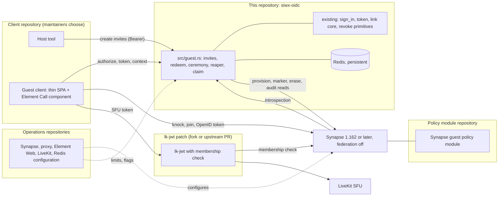
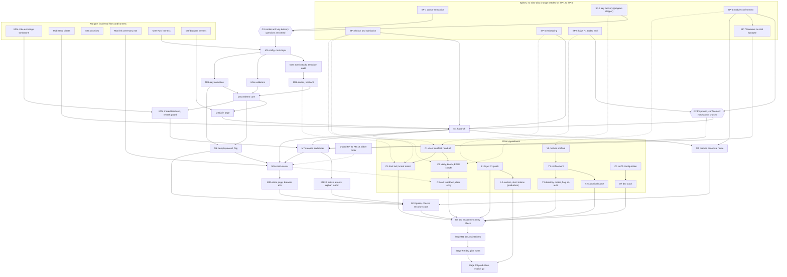

# Guest portal 07: implementation plan

**Status:** DRAFT design document. Nothing here is implemented, and nothing in this document changes code.
**Scope:** how to build the guest portal of [01](01-flow-model.md) to [06](06-wireframes.md) (the entry point of the set is [00-overview.md](00-overview.md)): workstreams and repositories, the spikes that run
before any guest code lands, small independently mergeable milestones in siwx-oidc, a traceability matrix from every requirement ID to a
milestone and a test, the rollout and operations plan, risks, the test environment, and one consolidated register of the open decisions of the
whole set. It is the last document of the set and owns no security or flow rule: it cites the IDs of the others (`GP-FLOW`, `GP-SYN`, `GP-CLI`,
`GP-SEC`, `GP-CLM`, plus `GP-E2EE` and `GP-UX`) and never restates them.
**Baseline:** siwx-oidc `origin/main` at `3547bd2` (2026-09-30). Every `path:line` is against that commit. Upstream facts were read from the
sources named in 02 and 03 (Synapse v1.161.0, lk-jwt-service 0.7.0, Element Call v0.26.1); the prefixes `ec:`, `ew:`, `sdk:` and `syn:` are those of 03.

**Conventions.** Sizes follow 03: S is up to 2 days, M up to 2 weeks, L more than 2 weeks, for one engineer who knows the code. They are relative
planning sizes, never commitments; this plan makes no calendar promise. Spike "time boxes" are ceilings after which the spike is called, not
estimates. `D<n>` names a decision of the decisions log in [00-overview.md](00-overview.md#7-decisions-log) (each stays an open decision for the maintainers). `SP-n` is a spike, `Gn` a gate (the screens of 06 are always written "screen G3" or "06 G3" in this document, because G1 to G3 are also gates),
`Mx` a milestone in this repository, `Y`, `L`, `C`, `O` are workstreams in other repositories (section 2) and `X` marks an item recorded as out of v1 scope (section 4.7). Owners are roles: siwx-oidc
maintainers, Synapse owner, lk-jwt owner, client owner, operator, product owner, data-protection owner, SDK key-lifecycle owner, host and agent operator. The word "claim" means the
passkey-link ceremony only (D1).

## 1. Summary

### 1.1 The architecture in one diagram

### 1.2 Ten lines

1. **One new module in this repository.** `src/guest.rs` (binary only) holds the invite API, redeem, the hand-off ceremony, the reaper and the claim. Everything
   else is reuse: Path A of `sign_in`, the link core of `src/webauthn.rs`, the revoke and erase primitives (01 section 5.3).
2. **The link targets the issuer.** The secret lives in the fragment, redeem writes Redis only (its one Synapse access is a best-effort read of the host's display name, GP-SEC-18), and the onboarding form and consent sit at the data
   controller (D4, GP-FLOW-01 to GP-FLOW-03).
3. **The hand-off is a stock OIDC code flow** with PKCE and `prompt=none` for one static public client, completed by the `__Host-guest_session` cookie.
   `sign_in` stays the only code-issuing site (GP-FLOW-06, GP-FLOW-07).
4. **Provisioning fails closed.** The Synapse `user_type` marker and the canonical name are written before the first token (D1, D8, GP-FLOW-26).
5. **The homeserver confines, the IdP does not.** The policy module (own repository, P4) confines marked users; lk-jwt checks membership (P1); the call room is an
   encrypted `knock` room created by the host's client and audited at mint (D7).
6. **Teardown is a fixed order** run by one in-process reaper that outlives the feature flag (D2, GP-FLOW-15, GP-FLOW-17).
7. **Claim is one compare-and-set** over the existing link core, which gains one refuse-overwrite rule (GP-CLM-02). A claimed account is permanent but stays confined (D3, GP-FLOW-16, GP-FLOW-30).
8. **The client is a thin custom SPA** (D10), adopted only if spikes SP-2 to SP-4 pass, with stated fallbacks.
9. **Everything ships dark.** `guest_enabled` defaults to false, dev comes first, and production needs P2 and the maintainers' explicit go (section 7).
10. **The order of work is cheap-and-fatal first.** Seven spikes, three gates, then small flag-off slices (M0 to M10), with the module, lk-jwt and client workstreams running in parallel.

### 1.3 Hard prerequisites and the other conditions

| Id | Condition | Gate | Verified by |
|---|---|---|---|
| P1 | lk-jwt membership enforcement (Synapse `msc4502_enabled` plus a small lk-jwt patch that calls the existing membership check on the routes Element Call actually uses). Hard dependency before any guest exists, on dev too. | Hard: before any guest exists, on dev too | SP-5, then ST-21 |
| P2 | SFU eviction and a short SFU token lifetime before production (lk-jwt kick PR or equivalent). The OpenID token lifetime is a Synapse constant (`synapse/rest/client/openid.py:72`) and is not configurable; P1 covers confidentiality for that half. | Before production only; dev accepts the one hour tail | L2, ST-21 on the production candidate |
| P3 | Synapse 1.162.0 or later before the module goes live, then re-read 02 against that version. Federation off for a guest deployment (a remote knock reaches no hook). | Before the module goes live. The default room version is 11 on 1.161 (`synapse/config/server.py:179`) and 1.162 flips it to 12, so the module is tested on v12 rooms first; on 1.161 keep `default_room_version: "11"`, for dev experiments only | O1, deployment check (M10) |
| P4 | the guest policy module (separate repository, licence path decided by the maintainers with counsel). | Before any guest exists; loaded with `user_types.extra_user_types` and an empty `auto_join_rooms` | SP-6, module tests, deployment check |
| P5 | Redis used for guests is persistent (AOF or equivalent), runs with `maxmemory-policy noeviction` (a volatile policy only if every guest key is persistent), is Redis 5 or later (`TIME` inside scripts whose effects are replicated) and is a single node (the scripts touch several keys) | Before any guest exists | startup warning (M1), deployment check |
| P6 | The reverse proxy rate-limits the guest routes and `POST /register` | Before dev enablement | deployment check (M10), ST-04 |
| P7 | ~~`io.inblock.guest` is added to the homeserver profile-field denylist.~~ SUPERSEDED (D1): the marker is the Synapse `user_type`, so no denylist entry exists | none | none |
| P8 | `block_non_admin_invites` stays off | Before dev enablement | deployment check |
| P9 | Element Web has `feature_ask_to_join` enabled for hosts | Before dev enablement (or the host tool replaces it, DR-17) | deployment check, SP-3 |

P1 to P4 are worded as in D11. [01 section 2](01-flow-model.md#2-requirements-recap-and-hard-prerequisites) is authoritative for P5 to P9; this table restates only their gate and how they are verified, and the P5 row adds the Redis conditions (eviction policy, version, single node) that the startup warning of M1 and the deployment check read.

### 1.4 Acceptance criterion

The program is done for v1 when, on a dev stack that meets P1, P3 to P6, P8 and P9, all of the following hold in one recorded run and are repeatable:

| # | Criterion | Proven by |
|---|---|---|
| A1 | A guest joins an end-to-end encrypted call from a single-use link, typing two names and ticking consent, with no account, wallet or passkey; a second redemption of the same link is refused | dev acceptance script, ST-09, ST-10, C2 device check |
| A2 | The guest sees and reaches nothing else: room creation, direct messages, invites, directory search, a knock on a foreign room, a message, a rename, an upload, an invite mint and a foreign-client token are each refused | ST-14, ST-18, ST-19, ST-24 on dev (level L) |
| A3 | After the call no live state remains: no guest record, handle, token, device or joined room; the Synapse account is erased; only the `erased:*` markers remain; the stale `m.call.member` entry is the accepted residue (D2) | ST-11, ST-22, ST-38, SP-7 repeated |
| A4 | A guest who links a passkey keeps the account (same DID, same MXID), signs in with the passkey on a fresh device, and remains restricted: room creation still refused, pre-claim refresh token refused | ST-25, ST-26, GP-CLM-22 |
| A5 | The kill switch drill and the written rollback (section 7) have been run on dev and recorded | drill record |
| A6 | Every named abuse test of 04 section 6.3 passes at its level, with no test skipped (`E2E_STRICT_SKIPS=1`, `SIWX_TEST_REQUIRE_REDIS=1`) | CI plus the dev-stack smoke script |
| A7 | The three e-mail policies behave as configured (R2): `off` collects no address, `optional` accepts a join without one, `required` refuses a join without a syntactically valid one. The address lives only in the guest record, is gone after the reap, and is gone after a claim unless the claimant chose to keep it (D13) | ST-15, ST-17, GP-CLM-05, GP-CLM-16 |
| A8 | The custodial key (R3) is derived, never stored and destroyed: no stored value or log line holds key material, every signature path refuses a guest DID, and the per-guest key value is gone after the reap and at the claim commit while the DID stays the same | ST-36, ST-37, ST-38, ST-40, ST-47 |

Production has its own entry checks (section 7.3). Meeting A1 to A8 is a precondition of asking for that go, never a substitute for it.

## 2. Workstreams and repositories

| Workstream | Repository | What lands | Owner role | Milestones |
|---|---|---|---|---|
| IdP | this repository (siwx-oidc) | `src/guest.rs`, config, routes, Redis scripts, reaper, claim, join and claim pages, OpenAPI, docs, tests, mock updates | siwx-oidc maintainers | M0a to M10 |
| Policy module | a new repository written against the Synapse module documentation (licence path is DR-35) | the confinement rules, canonical name, directory, media, host flag, admission re-audit; its own unit and live tests | Synapse owner | Y0 to Y3 |
| lk-jwt | a small fork or an upstream PR to lk-jwt-service | membership check on the three OpenID routes (P1); P2: SFU eviction and a short SFU token lifetime, configurable (lk-jwt PR 235 or equivalent) | lk-jwt owner | L1, L2 |
| Client | a new static-app repository chosen by the maintainers (AGPL-covered because it links Element Call, 03 open decision 8) | guest client (screens G3 to G6 of 06), host tool (H1 to H5), knock notice, claim entry points | client owner | C0 to C4 |
| Operations | the Synapse and Element Web deployment repository and the operator's private repositories | Synapse configuration, appservice registration, proxy limits, Redis persistence, Element Web flags, LiveKit hygiene, log retention, alert wiring, the dev stack | operator | O1 to O7 |
| Key lifecycle | the SDK (outside this program) | signed key links and rotation that would lift the single-passkey limit (D9, RR-16) | SDK key-lifecycle owner | none (dependency only) |
| Shared RP ID | siwx-oidc draft pull request 18 | per-credential `rp_id`; the claim must call the core so it works in either merge order (DR-33) | siwx-oidc maintainers | sequencing with M9 |

### 2.1 What lands in this repository, by area

| Area | Change | Milestones |
|---|---|---|
| `src/guest.rs` (new, binary only, declared in `src/main.rs` like `webauthn.rs`) | all guest handlers, the reaper, the claim | M1 to M9 |
| `src/guest_input.rs` (new, library crate, like `src/mxid.rs` and `src/alias.rs`) | pure name, e-mail and key-derivation functions so `tests/` can link vector tests | M1 (empty module), M3a, M3b |
| `src/config.rs`, `docs/configuration.md` | the guest keys of 01 section 10, through `config::figment()` only | M1 |
| `src/axum_lib.rs` | literal `.route("/guest/...")` registrations (so the OpenAPI coverage test sees them), guest route layer, reaper spawn and shutdown, startup refusals, siwx_user skip | M1, M2b, M3c, M4, M7b |
| `src/oidc.rs` | authorize marker branch, `sign_in` guest branch, `provision_synapse_device` guest parameter, refresh guard, code-exchange probe, signature-path refusal, guest flag | M0a, M4, M5, M6, M7a |
| `src/compat.rs`, `src/account.rs`, `src/device_auth.rs` | second refresh entry point guard, shared teardown function, signature-path refusal | M6, M7a |
| `src/webauthn.rs` | the link core (`link_finish`): set-if-absent writes of the credential and the link entry, an existing id refused before any write, the credential removed when the link write fails (GP-CLM-02); the claim reuses `link_start` and `link_finish` under its own challenge key | M9a |
| `src/db/mod.rs`, `src/db/redis.rs` | `guest:*` prefixes, `SessionEntry.guest_id`, Lua scripts, index-only revoke variants | M2b to M9 |
| `src/synapse_client.rs`, `e2e/synapse_mock.py` | admin reads (room members, room state, user list) and writes (`user_type`, display name), in the same change as the mock | M2a, M5, M8 |
| `js/ui/` or a new page set under `static/` | join page (screens G1, G7), continue landing, the ended page (screen G6 `closed` and `closed-kept`), claim page (screens K1, K2); script from the issuer origin only, no inline script (GP-SEC-43) | M3d, M4, M9b |
| `tests/`, `e2e/`, `scripts/` | new suites, harness additions, deployment check scripts | M0e, M0f, each milestone, M10 |
| `docs/`, `SECURITY.md`, `security/EXCEPTIONS.md` | operator guide, keyspace table, OpenAPI, residual risks | each milestone, M10 |

## 3. Spikes first

The spikes are ordered so that the cheapest, most likely fatal question is answered first, and so that a failure removes the most future work. SP-1 to SP-4 need
no siwx-oidc change at all: a headless did:key account from `siwx-oidc-auth`, the Element Call reference host (`ec:component/dev/session.ts`) and a stock Element Web host
are enough. The spikes are recorded in the pull request that closes them (and in 02 and 03 where they settle an "Unverified" row), never as undocumented local experiments.
A spike prototype is never merged.

### 3.1 The spikes

| Spike | Question | Setup | Time box | Go criterion | No-go and fallback | What a failure stops |
|---|---|---|---|---|---|---|
| SP-1 cookie semantics | Do the browser rules the hand-off relies on hold on the default same-site topology (client and issuer share a registrable domain, D19): `Sec-Fetch-Site` is `same-site` on the hand-off navigation and `cross-site` on a navigation from a third-party page, a Strict cookie is withheld on a cross-site redirect chain and sent on same-site script hops, a `__Host-` cookie cannot be planted from a sibling subdomain, `Origin` and `Sec-Fetch-Site` are present on the guest POSTs? For operators who choose `guest_client_topology` `cross-site`, is a Lax cookie also sent on a cross-site top-level `GET` (03 S4; 01 and 04 Unverified rows) | A 100 line static test server on two test hostnames under one registrable domain (the default) and a third under a different registrable domain (the cross-site fallback), no siwx-oidc code; Chrome, Firefox, Safari | 2 days | The same-site behaviours hold in the three browsers; the cross-site behaviour is recorded separately | The cross-site topology fails (Safari does not send Lax): `cross-site` is not offered in v1 and the same-site topology is required (03 S4 fallback). If the chain behaviour differs: the in-`/authorize` variant (01 open decision 17) | The shape of M4 only. Cheapest kill |
| SP-2 key delivery | Does an unverified, freshly created device receive per-participant call keys from a stock Element Web host in an encrypted room, with no cross-signing and no setup screen (GP-E2EE-01 to 03; 03 S1) | Headless account, reference host, encrypted `knock` room built to the template of 01 section 4.3 (power levels included), Element Web host | 3 days | Two-way audio and video, key to-device messages exchanged, host shows no block or warning for the device | Blocked by host or device policy: **the program stops at this gate.** There is no unencrypted fallback (D7, 03 gate table) | The entire program |
| SP-3 knock and admission | Can a just-provisioned user knock, be admitted by the host through the ordinary UI, and have the client join and mount the call only at membership `join` (D14, GP-CLI-14); does `skipLobby` true behave as 03 reads it (it skips only Element Call's device lobby, the component enters the RTC session as soon as it mounts); the push-rule ordering check of GP-SYN-20 (02 section 11): with the host away from the room, does a per-room override rule that matches knock events outrank the default `.m.rule.member_event` (empty actions), for Synapse's own evaluation (pushers, mobile) and for the js-sdk push processor (Element Web popups), recorded for each, and does the default rule alone let the knock-bar popup fire (06 open decision 5) | Same room, Element Web with `feature_ask_to_join`, component options from `ec:src/UrlParams.ts:383-423` | 3 days, runs with SP-2 | Knock, admit, join, then mount works; mounting at `knock`, `invite`, `leave` or `ban` is refused by the client and sends no `m.call.member`; the ordering result is recorded for both push evaluators and the notice channel is chosen | `skipLobby` misbehaves: keep Element Call's lobby and reduce screen G3 to a permission primer (03 open decision 12). No notification: a client notice or a bot (DR-17) | The host-notice design (C4) and the lobby choice (C2). M4 waits for the record (section 3.2); the program does not stop |
| SP-4 embedding | Does the Element Call component build and hold a call inside a thin client (03 S8, S1 call part, S2 refresh over three cycles, S7 reload) | Component from tag v0.26.1, js-sdk v43.0.0 | 5 days | Reproducible build, acceptable size, a 15 minute call with three refreshes and no `SessionLoggedOut`, clean rejoin on reload | Component fails: T2 (Element Call widget in an iframe in the same shell), re-run SP-2 against it (+3 days). T2 fails too: stock Element Web behind the same hand-off (03 gate table), the maintainers decide whether to accept its costs | The client choice (DR-41). The IdP slices M1 to M3d never wait on it; M4 does (section 3.2) |
| SP-5 P1 end to end | Does `msc4502_enabled` plus the lk-jwt patch refuse a non-member and serve a member with MAS-delegated tokens and real Element Call, including delayed-leave delegation | Dev Synapse 1.162 or later, appservice registration (the lk-jwt README key names do not match 1.161, 02 GP-SYN-01), patched lk-jwt, LiveKit with `auto_create: false` | 7 days | Non-member `get_token` and `sfu/get` answer 403, member answers a token; call works; delayed leave still works; the binding test of GP-SYN-01 passes (a fake userinfo server named in `matrix_server_name` receives no request and the call is refused, and a `sub` with another server part is refused) | The experimental pair does not work under delegated auth: an Element Call build that requests tokens through the client-server route plus an edge block (02 GP-SYN-01 item 3), or hold: no guest on any stack (P1 is hard) | Dev enablement and, through G2, M4 onward |
| SP-6 module confinement | Does mechanism M1 fix the canonical name (SY-1); does a full call work when a marked user may send only membership and call-member events (SY-2) | Dev Synapse 1.162 or later, module scaffold Y0, a marked user minted by script (MAS `provision_user`, then admin `PUT`), no siwx-oidc change | 7 days | SY-1 and SY-2 pass as written in 02 section 11 (SY-2 includes the refused fourth knock of GP-SYN-21) | SY-1: the first working fallback F-0, F-a or F-b, recorded (DR-05). SY-2: widen `guest_allowed_event_types` or change the template, recorded | The scope of M5 (name fallback) and of M2a (template revision), not the program |
| SP-7 teardown on a real Synapse | Do revoke, delete device, `delete_user` with erase, in that order with a call connected, leave no token, device or joined room; does the module let the `leave` through without a canonical row; do Synapse issues 19603 and 19721 bite (SY-3) | Same stack, scripted, no siwx-oidc change | 3 days, repeated as acceptance after M7b | The outcomes of 02 SY-3 | An explicit leave step, or a module fix (02 SY-3); a result on 19603 becomes a teardown assertion | M7b scope (an extra step), not the program |

SY-4 (marker fails closed) needs the siwx-oidc guest branch and is therefore the acceptance test of M5, not a spike.

### 3.2 Order and gates

| Gate | Needs | Releases | Why here |
|---|---|---|---|
| none | | M0a to M0f | Incidental fixes and test harness have value without guests (section 10) |
| G1 | SP-1 and SP-2 recorded as go (or a recorded fallback accepted by the maintainers) | M1 to M3d, M6 and M7a | No guest code is written before the two cheapest fatal questions (SP-1, SP-2) are answered. SP-3 and SP-4 do not gate it: their failures change the client and the host notice, never these IdP slices |
| G2 | SP-5 and SP-6 recorded; for M4 also SP-3 and SP-4 recorded (they gate the C workstreams C1 to C4 as well) | M4, M5, M7b, M8, M9a, M9b and the decision to enable on dev | The expensive, risky slices wait until P1 is proven, the confinement mechanism is chosen and the client variant (T1 or T2) is known, because M4 is tested against it; SP-7 must also be recorded before M7b merges |
| G3 | M1 to M9b merged, M10 done, O1 to O5 and O7 in place, SP-7 repeated | dev enablement (section 7.2, stage R1) | A recorded entry check, not a calendar date |

Sequence at the start, for one person per workstream: SP-1 and SP-2 first, then G1 and the IdP slices M1 to M3d. SP-3 runs beside SP-2, and SP-4, SP-5 and SP-6
run in parallel by their owners while those slices are built; M4 waits for SP-3, SP-4 and G2. M0a to M0f are small enough to run while the spikes do. If SP-2 fails,
the cost of the program is the spike and M0.

## 4. Milestones in this repository

Each milestone is one pull request (or two where stated), branched from and merged to `main` (no long-lived branches), Conventional Commits, flag off
(`guest_enabled` false) until dev enablement. A milestone is done only when its listed docs change in the same pull request. Rules that apply to **every**
milestone and are not repeated below:

| Rule | Source |
|---|---|
| Routes are registered as literal `.route("/guest/...")` calls in `src/axum_lib.rs` (handlers may live in `src/guest.rs`), with a `docs/api/openapi.yaml` entry in the same change. The coverage test parses only `.route(` calls in that file and panics on any other first-argument form, and a route added with `.nest` or `.merge` would be invisible to it and stay green | `tests/openapi_covers_every_route.rs:62-112`, AGENTS.md "Route documentation is enforced" |
| A new Synapse call updates `e2e/synapse_mock.py` in the same change and runs the drift check | AGENTS.md "The Synapse mock is a hand-kept mirror", `e2e/README.md` |
| Config only through `config::figment()`, `SIWXOIDC_` over `SIWEOIDC_`, a naming-contract test and a `docs/configuration.md` row per key | `src/config.rs:52-58`, AGENTS.md "Structure" |
| Every test asserts the positive case; skips are loud and switchable into failures (`SIWX_TEST_REQUIRE_REDIS`, `E2E_STRICT_SKIPS`) | AGENTS.md "A test must be able to fail" |
| Each new Rust e2e suite gets its own explicit step in job `rust-e2e-mock` (there is no glob) and a line in `e2e/run-all.sh`; new `SIWXOIDC_GUEST_*` knobs are added to `e2e/env.sh`, `e2e/up.sh` and both CI jobs; suites run with `--test-threads=1` | `.github/workflows/ci.yml:262-330`, `e2e/up.sh:77-86` |
| Logging follows the AGENTS.md table; the guest path logs only what GP-SEC-44 and GP-SEC-45 allow; clippy runs with `-Dwarnings`, so a function with more than seven parameters takes a struct | AGENTS.md "Logging conventions" |
| New crates pass the licence gates of job `image` (`scripts/third-party-notices.sh`, `js/ui/third-party-licenses.js`) and `cargo audit` against `.cargo/audit.toml` | AGENTS.md "Build and test" |
| Guest behaviour is reached only when a guest record or guest session exists; an ordinary user's path is byte-for-byte unchanged and its existing tests stay green | AGENTS.md "Sign-in gates" |

### 4.1 Milestone index

| Id | Title | Size | Needs | Gate |
|---|---|---|---|---|
| M0a | Code exchange refuses a tombstoned user | S | none | none |
| M0b | Static clients do not expire | S | none | none |
| M0c | Documentation corrections | S | none | none |
| M0d | End-to-end test of the existing link ceremony | M | none | none |
| M0e | Rust harness: multi-process and multi-instance suites | M | none | none |
| M0f | Browser harness: TLS, second origin, Firefox and WebKit | M | none | none |
| M1 | Config skeleton, guest route layer, flag off | M | M0e | G1 |
| M2a | Synapse admin reads and the room template audit | M | M1 | G1 |
| M2b | Invite store and host API | M | M2a | G1 |
| M3a | Name, e-mail and consent validators | M | M1 | G1 |
| M3b | Custodial key derivation | M | M1 | G1 |
| M3c | Peek, redeem, guest record, cookie (the mint core) | L | M2b, M3a, M3b | G1 |
| M3d | Join page, consent notice, capability check | M | M3c, M0f | G1 |
| M4 | Hand-off: authorize branch, continue, sign_in guest branch | L | M3d, M0b | G2, SP-3, SP-4 |
| M5 | Provisioning: marker and canonical name, fail closed, body-free Synapse logging | L | M4 | G2, SP-6 |
| M6 | Signature paths refuse guest DIDs, guest flag | S | M3b, M3c | G1 |
| M7a | Shared teardown, index-only revoke, refresh guard | M | M0a, M3c | G1 |
| M7b | Reaper and end routes | L | M7a, M4 | G2, SP-7 |
| M8 | Kill switch, audit events, orphan report | M | M7b | G2 |
| M9a | Claim server side: gate, routes, link-core rule, single-flight lock, compare-and-set, revocation | L | M0d, M4, M6, M7b | G2 |
| M9b | Claim page and claim browser tests | M | M9a | G2 |
| M10 | Operator guide, deployment check, security scope | M | M1 to M9b | G3 |

### 4.2 M0 group: incidental fixes and test harness (no guest concept, no gate)

**M0a. Code exchange refuses a tombstoned user.** Size S.
- Scope: in `token_authorization_code`, after the localpart is resolved (`src/oidc.rs:1453-1457`) and before any token is minted, call the trait's `probe_revocation` (`src/db/mod.rs:454`, the one place the fail-open policy lives, three-valued `RevocationState` at `:148`) with the code's device id, so that BOTH tombstones are read (the user tombstone and the device tombstone that a claim plants), exactly as the refresh paths do: a definite tombstone answers `invalid_grant` with status 400; an indeterminate probe answers a retryable 503 pre-mint, as `compat::refresh` does (`src/compat.rs:512-531`). After the token pair is minted, probe again and roll the pair back on a definite tombstone, as the refresh paths do (`src/oidc.rs:1029-1047`, where the post-mint probe keeps its documented fail-open rule on `Indeterminate`), so a claim or reap that lands between check and mint leaves no token. The code is already consumed by `try_consume_code` at that point, so the client restarts `/authorize`; that is the price of reading the localpart from the code entry. Preferred form: store a timestamp in the tombstone and refuse only a code whose `auth_time` precedes it, which matches the goal (a code minted before the teardown). Without the timestamp the change has one visible effect on ordinary users, to be stated in the docs: `logout_all` plants the 900 s user tombstone (`src/compat.rs:322-324`), so a user who signs out everywhere and signs in again within 15 minutes fails at `/token` (the code is consumed) instead of at the first refresh.
- IDs: GP-FLOW-14 (D12).
- Invariants kept: refresh rotation and its 60 s grace are untouched; revocation keys on `TokenMetadata.username`; tombstone TTLs stay at 900 s (`src/db/mod.rs:118`).
- Tests: a mock-stack case in `tests/e2e_race_teardown.rs` (mint a code, tear the user down, exchange: refused; plant a device tombstone as the claim will, exchange: refused; a tombstone that lands between check and mint rolls the pair back; exchange for another user: still works; in the timestamp form a fresh sign-in after `logout_all` succeeds); `sign_in_deactivation_order_tests` and the refresh race tests stay green.
- Docs: the tombstone paragraph of `docs/matrix-integration.md` (around line 320, including the `logout_all` effect) and the keyspace row of `docs/architecture.md:155`.
- Done when: the pre-teardown code is refused on both axes, the `logout_all` effect is documented or removed by the timestamp form, CI green. Needs nothing.

**M0b. Static clients do not expire.** Size S.
- Scope: `default_clients` are rewritten at every start through `set_client` with the 30 day lifetime (`src/axum_lib.rs:1305-1312`, `src/db/redis.rs:679-693`, `src/db/mod.rs:49`). Write static entries without a TTL and extend the TTL of a dynamic entry on successful use, so a server that runs for more than 30 days without a restart no longer answers `Unrecognised client id`. Also removes the hard logout that dynamically registered Element Web sessions hit today (03 open decision 11).
- IDs: GP-CLI-02 (server half; the proxy block of `/register` from the guest origin is O2).
- Invariants kept: refresh still does not consult the client entry (`src/oidc.rs:926-1085`); `/register` behaviour and its rate-limit-at-the-proxy convention are unchanged.
- Tests: a Redis-backed unit test that a static entry has no TTL and a dynamic entry's TTL is extended on use; a mock-stack check that the entry survives a simulated 31 days (TTL set by test) and `authorize` still resolves it.
- Docs: the "Clients" section of `docs/configuration.md:110-124`, the keyspace row of `docs/architecture.md:151`.
- Done when: 1000 sessions add no `clients/*` key and the entry has no expiry. Decision DR-21.

**M0c. Documentation corrections.** Size S.
- Scope: `docs/api/openapi.yaml:170-171` says `/authorize` issues the `siwx` cookie (the code sets `session`, `src/oidc.rs:1681`); the comment at `src/admin_token.rs:57-63` says Synapse may accept a token about two minutes past its own expiry (it enforces expiry per request; the cache delays only revocation, 02 C3).
- IDs: none. Invariant kept: "never infer token validity from Synapse" stays true for revocation.
- Tests: openapi coverage test. Docs: the two lines. Done when: both corrected in one `docs` commit.

**M0d. End-to-end test of the existing link ceremony.** Size M.
- Scope: a browser spec driving `/link/webauthn/start` and `/finish` with the CDP virtual authenticator (`e2e/browser/webauthn-helper.mjs`) for a wallet-signed session, then a passkey login that lands on the same DID. Pins the behaviour M9 reuses (05 gap G6).
- IDs: none (enabler of GP-CLM-22). Extends `src/webauthn.rs:866-983`, `src/axum_lib.rs:850-898`, `src/credential_identity.rs:60-86`, `js/ui/src/App.svelte:147-216`. No production code changes.
- Tests: the spec itself, able to fail (assert the link record and the resolved DID). Docs: `e2e/README.md` pieces table. Done when: green in `browser-e2e`.

**M0e. Rust harness for multi-process and multi-instance suites.** Size M.
- Scope: extract the process spawner of `tests/graceful_shutdown.rs:26-101` into `tests/support/mod.rs` (free port, health gate, kill on drop, per-test env, shared test signing key), add a `guest:*` reset helper with a drop guard that restores the kill switch, add a mock hook or a shared Redis database so two instances can use one mock (the mock introspects admin tokens at one base URL fixed at its start, `e2e/synapse_mock.py:296-322`), add test-only short deadline and reaper-tick config at the time the code exists (M1), sync `e2e/run-all.sh` with CI (it runs one of the eight Rust suites).
- IDs: none (enabler of ST-01, ST-02, ST-05, ST-07, ST-09, ST-22, ST-33, ST-35, ST-44). No production code, so no AGENTS.md invariant is touched; the mock-drift rule and the loud-skip rule apply to the helper itself.
- Tests: `graceful_shutdown.rs` ported onto the helper and still green. Docs: `e2e/README.md` and the AGENTS.md test list if the helper is named there. Done when: two instances share one Redis and one mock in a passing test.

**M0f. Browser harness: TLS, second origin, more browsers.** Size M.
- Scope: a small TLS terminator in `e2e/up.sh` and the CI job so `__Host-`, `Secure` and sibling-origin behaviour are exercised with real attributes, a second hostname under one registrable domain (Chromium host-resolver mapping), Firefox and WebKit projects in `e2e/browser/playwright.config.mjs:12-16` for the cookie and silent-redirect specs only (claim specs stay Chromium: the CDP authenticator is Chromium-only), `playwright install` for the added browsers (`ci.yml:444`).
- IDs: none (enabler of ST-10, ST-26, ST-27, ST-28, ST-29, ST-45 and the SP-1 follow-up). No production code, so no AGENTS.md invariant is touched.
- Tests: a smoke spec asserting cookie attributes round-trip over TLS on all three browsers. Docs: `e2e/README.md`. Done when: the smoke spec is green in CI on three browsers. Open decision PD-3 (TLS, browser scope).

### 4.3 M1 to M3: dark scaffolding and the mint path (after G1)

**M1. Config skeleton, guest route layer, flag off.** Size M. Needs M0e.
- Scope: all keys of 01 section 10 (among them `guest_client_id` and `guest_client_topology`, D19) with their defaults in `src/config.rs:144` and the defaults block at `:248`; startup refusals named in GP-SEC-51 (each missing item exits non-zero naming the item), GP-SEC-01 (empty host list; there is no opt-out, D17), GP-SEC-42 (https base URL and redirect URIs, localhost excepted) and `did:key` missing from `supported_did_methods` (the derived guest DID needs it); a Redis warning (GP-FLOW-23) when persistence is off or `maxmemory-policy` is not `noeviction` (where `CONFIG GET` is allowed; the deployment check asserts it otherwise, P5); `src/guest.rs` scaffold and the `mod` line in `src/main.rs`, and `src/guest_input.rs` declared as an empty module in `src/lib.rs` (filled by M3a and M3b); the guest route layer of security headers, JSON-only, `Origin` and `Sec-Fetch-Site` checks and a body cap of 4 KiB on every guest route except `POST /guest/claim/finish`, which carries the WebAuthn attestation and has its own cap of 16 KiB (a per-route setting of the layer; the route itself lands in M9a) (GP-SEC-39, GP-SEC-40, GP-SEC-04 application half), applied to a first set of static shells (`GET /guest/join/{invite_id}`, `GET /guest/continue`, `GET /guest/claim`) that answer 503 while `guest_enabled` is false and the same bytes for any id (GP-FLOW-01 partly, GP-SEC-43). The `guest:control` read helper (kill switch, used by every later route) lands here; the drill is M8.
- IDs (primary): GP-FLOW-25, GP-SEC-39, GP-SEC-40, GP-SEC-51. Secondary (primary elsewhere): GP-FLOW-23 (the warning; O3), GP-SEC-04 (body cap; O2), GP-SEC-42 (startup half; M4), GP-SEC-43 (the shells; M3d), and the startup halves of GP-SEC-01 and GP-FLOW-21.
- Extends: `src/config.rs:144-264`, the startup validation block in `src/axum_lib.rs:1225` onward, the router at `src/axum_lib.rs:1446`, the CORS layer at `:1568-1577` (guest routes add no CORS headers of their own; the global layer allows no credentials), `src/main.rs`.
- Invariants kept: config names and precedence (`config::tests`); standalone deployments degrade, never 500 (guest routes answer 503 without a Synapse client); SIGTERM handling; `/resolve` four fields untouched.
- Tests: config tests for every key (naming contract, precedence, defaults); a startup-refusal unit test per item (ST-35); a route-level test that headers are present, a form body and a request with neither `Origin` nor `Sec-Fetch-Site` are refused, and the shell is byte-identical for different ids (ST-27 and ST-28 first halves); the layer refuses a 5 KiB body on a guest route and accepts 15 KiB under the `claim/finish` setting; `openapi_covers_every_route` green with the new entries.
- Docs: `docs/configuration.md` (a "Guest portal" section, every key), `docs/api/openapi.yaml`, `docs/architecture.md` (placeholder for the keyspace), AGENTS.md (code-map rows for `src/guest.rs`, binary only, and `src/guest_input.rs`, **lib**). Done when: flag off changes nothing observable; flag on without a prerequisite exits non-zero.

**M2a. Synapse admin reads and the room template audit.** Size M. Needs M1.
- Scope: public `SynapseClient` methods for the room members read and the room state read through the private `admin_request` (`src/synapse_client.rs:445`; it retries once and is safe for idempotent calls only), each taking a room id that matches the room id grammar and is sent as one percent-encoded path segment (GP-SEC-07), both written body-free: they introduce the shared log helper (status and `errcode` only, no upstream text in the returned error) that M3c and M5 apply to the existing methods (GP-SEC-45); the template of 01 section 4.3 as a pure audit function with a reason class per violated item (GP-FLOW-28, GP-SEC-28, GP-E2EE-04 audit half), with the minimum room version taken from the single audit rule of D15 and power computed with the room-version rule (the creator and any `additional_creators` hold maximal power and are never read from `users`; `additional_creators` must be empty or a subset of `guest_hosts`; 01 section 4.3); the mock gets an in-memory room model with `__seed_room` and the two admin reads, nothing more (knock, invite and join stay at level L, PD-5).
- IDs (primary): GP-FLOW-28, GP-SYN-16 (audit half; the room is created by C4), GP-SEC-28. Secondary: GP-SEC-07 (room id grammar), GP-E2EE-04 (audit half), GP-SEC-45 (the helper).
- Extends: `src/synapse_client.rs:445-463`, `e2e/synapse_mock.py` (no room model today, PUT stub answers 410 at `:955`).
- Invariants kept: two credentials, two route families (the audit uses the minted admin token, not the MAS secret); `synapse_client` stays out of `lib.rs`; an `Err` from a read means "state unknown" and fails closed.
- Tests: unit vectors, one per template item (mint into a room missing each item in turn, ST-19 first half), each run for room versions 10, 11 and 12 (in v12 the creator is absent from `users`, the room id has no server part, and `additional_creators` is tried empty, a subset of `guest_hosts` and outside it; ST-06 and ST-19 carry the same three versions) and hostile room ids (`/`, `..`, `?`, `%2f`, newline: rejected before any upstream call, ST-06 first half); a mock case with a failing read. Docs: `docs/matrix-integration.md` (admin reads), `e2e/README.md`. Done when: every template row has a failing vector in each of the three room versions and the drift check passes. Template revisions from SP-6 (SY-2) are a data change here.

**M2b. Invite store and host API.** Size M. Needs M2a.
- Scope: `POST /guest/invites` (single-use links, `count` of them, labels), `GET /guest/invites`, `POST /guest/invites/{invite_id}/end`, `POST /guest/meetings/end`; host allow-list, guest-record and admin-token refusals, creator-only access, per-host quotas counted inside one Redis script, expiry clamps, invite id (96 bits) and secret (`gi_` plus 32 base62 characters, same generator as opaque tokens, `src/introspect.rs:35-41`) with only the SHA-256 stored; `kind: open` only behind `guest_allow_open_links`. The `guest:invite/`, `guest:by_host/` prefixes next to the others in `src/db/mod.rs`.
- IDs (primary): GP-FLOW-01, GP-FLOW-10, GP-FLOW-27, GP-SEC-01, GP-SEC-06, GP-SEC-07, GP-SEC-09, GP-SEC-10, GP-SEC-11, GP-CLM-20 (enforced here, proved at M9a). Secondary: GP-SEC-02 (host-scope quotas), GP-SEC-14 (revoke one link), GP-SEC-26 (host visibility). Ordering rule: the "caller has a guest record" check of GP-FLOW-10 and GP-SEC-06 needs only the key name `guest:acct/<localpart>` and a read helper that treats an absent `promoted_at` as not promoted, so M2b defines both and tests them with a planted record; M3c writes the records and M9a and the operator runbook set `promoted_at`. No stub is needed.
- Extends: the Bearer pattern of `userinfo` (`src/oidc.rs:3007-3040`), `src/admin_token.rs:116` (service DID `urn:siwx:service:admin`), `TokenMetadata` (`src/db/mod.rs:366-395`), `src/guest.rs`.
- Invariants kept: the DID keeps its exact case (host DID stored byte for byte); revocation keys on `TokenMetadata.username`; a dedicated scope is not possible, authorisation is by identity plus the room check (`src/oidc.rs:1464-1475`).
- Tests: ST-01, ST-05, ST-06 (IDOR: host B lists or ends host A's invite, 404), ST-09, ST-02 host ceilings at exactly their number and atomic under 50 concurrent calls (M0e helper), bulk create with labels, 72 hour clamp. Docs: OpenAPI for the four routes, `docs/configuration.md`, `docs/architecture.md` keyspace rows. Done when: a listed host in a template-clean mock room gets N links once, an unlisted or guest token gets 403 with nothing written.

**M3a. Name, e-mail and consent validators.** Size M (Unicode normalisation, the UAX 39 skeleton, script mixing, e-mail syntax and the consent input, plus two new crates with licence gates). Needs M1.
- Scope: pure functions in the library crate (`src/guest_input.rs`): name normalisation and the character, script and reserved-name rules of GP-SEC-16 to GP-SEC-18 (UAX 39 skeleton; new crates for Unicode normalisation and confusables), the syntax-only e-mail rule and the frozen policy of GP-SEC-21 to GP-SEC-23 and GP-SEC-25, the consent input. The host-lookalike check reads the host display name best effort at redeem and lives in M3c.
- IDs (primary): GP-SEC-16, GP-SEC-17, GP-SEC-18, GP-SEC-21, GP-SEC-22, GP-SEC-24 (no SMTP client enters the dependency tree). Secondary: GP-FLOW-09 (validation half), GP-SEC-23, GP-SEC-25.
- Extends: the pattern of `src/alias.rs` and `tests/localpart_vectors.rs` (non-ignored vector tests that run in job `build`). Invariants kept: `an_alias_never_contains_a_did` style vectors; word lists append-only.
- Tests: ST-13 (markup, DID shape, marker, zero width, bidi, digits, mixed script, reserved, lookalike), ST-15 syntax vectors. Docs: `docs/configuration.md` (`guest_reserved_names`, `guest_name_suffix`, `guest_email`). Done when: every vector of ST-13 and ST-15 passes and the licence gates pass for the new crates.

**M3b. Custodial key derivation.** Size M (HKDF, zeroisation, the redraw rule, the visibility tests, and the `sign_in` allow-list check that is still Unverified). Needs M1.
- Scope: `key_ref = {v, id}` from the OS CSPRNG, the HKDF seed from `guest_key_secret` and `key_ref.id`, the Ed25519 `did:key`, the localpart through `mxid::localpart_for` (`src/mxid.rs:147`) with a new redraw rule: when the derived localpart is all numeric the mint draws a fresh `key_ref` (the doc comment at `src/localpart.rs:203-214` treats that case, probability about 3e-9, as a hard error for ordinary accounts, which cannot redraw a DID), zeroisation, and no function that exposes the derived key outside its module. Nothing signs in v1.
- IDs (primary): GP-FLOW-31, GP-SEC-52, GP-SEC-53, GP-SEC-54, GP-SEC-55. Secondary: GP-SEC-59. Invariants kept: `mxid` stays pure (`sha2` only); a derived `did:key` must pass the `sign_in` allow-lists (`src/oidc.rs:2530-2538`), which is currently Unverified.
- Tests: ST-36 (ten thousand mints, unique DIDs, no key material in any value), ST-40 (Ed25519 and P-256 seeds give identical policy outcomes), a visibility test that the derive function has no public caller. Docs: `docs/identity-model.md` note on guest DIDs. Done when: the derived DID passes the real `sign_in` method checks in a test.

**M3c. Peek, redeem, guest record, cookie (the mint core).** Size L. Needs M2b, M3a, M3b.
- Scope: `POST /guest/peek` (non-burning, secret in the body, answers only after the secret verified; 06 F1, DR-45), `POST /guest/redeem` as one Redis script (quota and global checks, cleanup brake counting only records whose last teardown attempt failed or that sat in `reaping` for more than one tick, default threshold 2 x `guest_host_max_live_guests`, bounded `guest_count`, the record `guest:acct/<localpart>` in state `minted`, deadline from Redis `TIME`, `guest:due`, `guest:by_invite`, the handle entry), the `__Host-guest_session` Set-Cookie, the closed field list, the consent record, uniform answers for unknown id, wrong secret and malformed body, the host-lookalike read at redeem (best effort, through `read_profile`, which this milestone converts to the body-free helper of M2a because redeem is its first guest-path caller, with the ST-31 echo case for that call), and the guest-path logging rules. Redeem writes no Synapse state. The page that calls it is M3d.
- IDs (primary): GP-FLOW-02, GP-FLOW-03, GP-FLOW-04, GP-FLOW-05, GP-FLOW-12, GP-FLOW-19, GP-FLOW-20, GP-FLOW-24, GP-FLOW-32, GP-CLI-04, GP-SEC-02, GP-SEC-03, GP-SEC-08, GP-SEC-12, GP-SEC-13, GP-SEC-23, GP-SEC-25, GP-SEC-33, GP-SEC-41, GP-SEC-44, GP-SEC-60. Secondary: GP-FLOW-01 (prefetch test), GP-SYN-15 (the optional Synapse-side backstop is Y3), GP-SEC-45 (the `read_profile` row).
- Extends: `src/db/redis.rs:212-250` (the one existing Lua script, inside `revoke_device_tokens`, issued as raw `EVAL` so no extra crate is needed: follow that style), `src/axum_lib.rs:942-952` (cookie helper pattern), `src/oidc.rs:1681-1689` (session cookie attributes).
- Invariants kept: new accounts only through `/sign_in` (redeem writes no Synapse state); no fail-open; the request path is logged at `src/axum_lib.rs:1545`, hence the id in the path and the secret only in the fragment and body; Redis `TIME`, never an instance clock.
- Tests: ST-02 (global and daily ceilings, concurrent), ST-03 (brake with planted failed and stale `reaping` records; no trip when a full meeting is ended at once), ST-07 (an instance under `faketime`, or the clock-free `reap_before` path once M8 lands), ST-08 (byte-identical responses), ST-17, the `Set-Cookie` attribute assertion of ST-29 (as a header string; the round trip over TLS is run in M3d, which needs M0f), ST-31 (sentinel name, e-mail, secret and handle absent from logs), ST-41 (record dump holds only the closed field list), redeem with the Synapse mock down succeeds (GP-FLOW-03), crash after redeem leaves a record the reaper can find (GP-FLOW-05).
- Docs: OpenAPI for `peek` and `redeem`, `docs/architecture.md` keyspace (`guest:acct`, `guest:handle`, `guest:by_invite`, `guest:due`, `guest:quota`), `docs/configuration.md`. Done when: N concurrent redeems against `max_guests` mint exactly `max_guests`, and no handle appears in any key name.

**M3d. Join page, consent notice, capability check.** Size M. Needs M3c, M0f.
- Scope: the join page (screens G1 and G7) served from the issuer origin with script from `self` only (a plain static page set under `static/`, or a second entry of `js/ui/`; the existing login SPA and its build stay untouched), the browser capability check that runs before any redeem (GP-UX-01), the exact-name preview, the consent notice with the residue and withdrawal statements and the recording line when the invite carries it, `peek`-driven fields (e-mail policy, session length), and the page-hygiene rules (no inline script, text nodes only, nothing secret in any URL or storage).
- IDs (primary): GP-CLI-10, GP-SEC-15, GP-SEC-43, GP-SEC-61. Secondary: GP-SEC-63 (notice text), GP-SEC-12 (a scanner that executes script cannot submit). Appendix: GP-UX-01 to GP-UX-03, GP-UX-06, GP-UX-07, GP-UX-11, GP-UX-12 for the issuer pages.
- Extends: `js/ui/src/App.svelte:697-744` for the visual language only (the login card), `src/config.rs:213-218` (`op_tos_uri`, `op_policy_uri` links). Invariants kept: no host-controlled or URL-controlled text before redeem.
- Tests: ST-10 and ST-12 (browser: a script-executing scanner loads the full URL with its fragment and mints nothing; markup in labels and room names is escaped), ST-27 (headers, framing, an injected inline script blocked), ST-29 over TLS on three browsers (the cookie attributes round-trip and a cookie planted from a sibling subdomain is ignored), strip `RTCPeerConnection` in a test browser and assert no redeem request is sent (GP-UX-01), notice variants with and without the recording line (ST-41) and the residue and withdrawal statements in each variant (ST-48), an accessibility pass per state.
- Docs: the join page states in `docs/guest-portal.md` (M10 collects them). Done when: a guest on a phone-sized viewport completes screen G1 to the redirect on all three browsers.

### 4.4 M4 to M6: hand-off, provisioning, deny by record (M4 and M5 after G2, M6 after G1)

**M4. Hand-off.** Size L. Needs M3d, M0b; waits for G2, SP-3 and SP-4. Highest regression risk in the program: it touches `sign_in`.
- Scope: the marker branch of `authorize` (client id, redirect URI and `state` validated first exactly as today; live guest session lands on `/guest/continue`; marker without a live session answers `interaction_required` on the registered redirect URI and never renders the login page; with `guest_client_topology` `same-site`, the default (D19), a navigation whose `Sec-Fetch-Site` is `cross-site` is refused when the header is present; `prompt=none` without the marker refused as today); the handler passes the cookie and the `Sec-Fetch-Site` header to `authorize`, which takes only parsed params and the DB client today (`src/oidc.rs:1569-1572`); `SessionEntry.guest_id` as one `#[serde(default)]` field (`src/db/mod.rs:329-341`) so the raw-JSON writer in `src/webauthn.rs:834-862` still round-trips; `GET` and `POST /guest/continue` writing only `verified_did` and `guest_id`; the `sign_in` guest branch (the compare-and-set `minted` to `provisioning` before any Synapse call, repeatable for a retry, a refused CAS answering 401; localpart assertion and non-degraded resolution; `client_id == guest_client_id` and redirect allow-list re-check; the device id resolved before the write-ahead append (see below), device append before `upsert_device`, device cap, per-record hand-off rate, `siwx_user` skipped for a guest session); `GET /guest/context` and `GET /guest/resume`; `GET /guest/ended`, the static issuer page of the end screens (screen G6 `closed` and `closed-kept` of 06), whose script reads `GET /guest/resume` with the guest cookie and draws the copy for an ended session or, for a kept account, the copy that offers passkey sign-in (01 C5, GP-CLI-13); the static guest client entry. **The device id is resolved before the write-ahead append.** `resolve_device_id` runs inside `provision_synapse_device` today (`src/oidc.rs:2058-2063, 2214`), but the append to the record needs the id first, so `sign_in` resolves it, appends it, and hands it to `provision_synapse_device` as `proposed_device_id`; `sign_in` also refuses a client-proposed id that the record lists in `pre_claim_devices` (GP-FLOW-22, GP-CLM-26), tested here with a planted record because M9a writes the list. **The guest branch issues no code until M5**: the marker step answers 503 by construction.
- IDs (primary): GP-FLOW-06, GP-FLOW-07, GP-FLOW-08, GP-FLOW-22, GP-CLI-03, GP-SEC-05, GP-SEC-34, GP-SEC-42, GP-SEC-67, GP-CLM-23. Secondary: GP-CLM-14 (the `sign_in` half), GP-E2EE-02 (device id from the token scope), GP-SEC-42 startup half (M1), GP-CLM-26 (the refusal; M9a writes the list), GP-CLI-13 (the `/guest/ended` page; C3 is the client half).
- Extends: `src/oidc.rs:1569-1764` (authorize), `:1669` (the single `set_session` caller), `:1750-1763` (landing), `:2488-2753` (`sign_in`: one-shot flag `:2513-2520`, Path A `:2526-2551`, `reject_if_deactivated` `:2673`, redirect re-validation `:2682`, `resolve_identity_or_legacy` `:2706`, `provision_synapse_device` `:2707`, code mint `:2718-2731`), `src/axum_lib.rs:257-322` (handlers, `siwx_user`), `src/db/mod.rs:289-341`.
- Invariants kept: ceremonies never issue codes or tokens (`/guest/continue` writes the session only); `reject_if_deactivated` before `resolve_identity_or_legacy`; the fail-safe direction is LEGACY except for a guest session, where a mismatch or degraded resolution is a 503 before provisioning (GP-FLOW-08, the one bent invariant of this milestone); one device per sign-in, no recycling; the `session` cookie stays Strict and the script hop of `js/ui/src/App.svelte:186-188` is copied, not replaced.
- Tests: ST-24 (guest cookie for a foreign client or redirect: no code), ST-30, ST-44 (nine completions in a minute: at most three devices), each GP-FLOW-06 condition failing alone, marker request with no cookie gets `interaction_required`, no `codes/*` key after `/guest/continue`, the guest cookie cannot yield a code for a non-guest DID or client (GP-CLI-03), `sign_in_deactivation_order_tests` and `a_partial_probe_fault_fails_sign_in_closed_before_any_legacy_guess` unchanged and green, a marker navigation with `Sec-Fetch-Site: cross-site` refused on the `same-site` topology and accepted on `cross-site`, an absent header passing, a dynamic client with the guest redirect URI but another client id getting no code, browser: SP-1 semantics re-run against the real routes on three browsers (ST-28, ST-29); `GET /guest/ended` answers the same bytes to every caller and draws the kept-account copy for a planted `claimed` record and the ended copy otherwise; a proposed device id listed in a planted `pre_claim_devices` is refused before any Synapse call.
- Docs: OpenAPI for `continue`, `context`, `resume`, `ended` and the `authorize` description (marker scope, `interaction_required`), `docs/passkeys.md` and `docs/architecture.md` (sign-in flow), AGENTS.md: "Sign-in gates" (guest branch) and "Localparts and aliases" (the fail-safe direction is LEGACY except for a guest session, pinned by the GP-FLOW-08 tests; read-only lookups use the fallible `resolve_identity`, with the reason that a guest DID is new by construction and a legacy `did-pkh-` DID cannot hold a guest record; DR-67). Done when: a mock-stack run reaches the marker step for a redeemed guest and answers 503 there, and nothing changes for a non-guest.

**M5. Provisioning: marker and canonical name, fail closed, body-free Synapse logging.** Size L (an M-sized provisioning change plus the body-free logging path over fourteen `SynapseClient` methods that ordinary users share, with one test per row of the call table below). Needs M4; its name scope waits for SP-6.
- Scope: `provision_synapse_device` takes a guest parameter struct (it has seven parameters already, `src/oidc.rs:2203-2215`) and reports a failure instead of returning an `Option`; for a guest: fatal `provision_user` seeded with the canonical name instead of `alias_for(did)` (`:2218`, today a failure only logs, `:2239-2245`), confirm the account exists (`query_user`), admin `PUT` of `user_type = io.inblock.guest`, then a second admin `PUT` of the canonical name, then the record moves from `provisioning` to `active`; any failure answers 503 with no device and no code, and a state move refused after `provision_user` makes `sign_in` call `deactivate_user` with erase itself (idempotent). The name mechanism follows SP-6 (M1 of 02, or fallback F-0, F-a, F-b). New `SynapseClient` methods through `admin_request`, mock updated (the admin `PUT` route answers 410 on purpose today, `e2e/synapse_mock.py:490-498, 955-956`, as a tripwire against legacy admin routes: M5 replaces that stub by a handler that accepts only a modify of an existing user with `user_type` and display name, and keeps refusing creation). **Body-free logging (GP-SEC-45).** Nineteen sites in fourteen `SynapseClient` methods log an upstream body today, and all are shared with ordinary users. Every method of the call table below gets a body-free path that logs the status and the `errcode` only and puts no upstream text into the returned error. There is one shared helper and no mode switch for guests (04 section 7): ordinary users lose the Synapse message text in these lines too, and status plus `errcode` diagnose every case the current lines were written for. The helper is introduced in M2a, `read_profile` is converted in M3c (redeem is its first guest-path caller), and this milestone converts the remaining methods; every new method of M2a, M5 and M8 is body-free from the start. M7b and M9a assert the rows they own.
- IDs (primary): GP-FLOW-09, GP-FLOW-26, GP-SYN-07 (writer side), GP-SEC-19, GP-SEC-45, GP-SEC-66. Secondary: GP-SEC-20 (writer side; the freeze is Y2).
- Invariants kept or bent: two credentials, two route families; one provisioning call site; `io.inblock.did` publication stays best-effort; **bent for guest sessions only**: publication-never-fails-sign-in (the marker and name fail closed) and alias-written-once (the typed name is canonical and frozen by the module, D8; DR-67); the marker write never creates the user (PR 20241).
- Tests: ST-43 and SY-4 (mock refuses the marker write: no device, no code, record stays `provisioning`, retry heals, an abandoned account is reaped), the race "reaper tick between `provision_user` and the marker write" (no unmarked account survives), a mock without the account attempts no marker write, the ST-31 echo case once per row of the call table below (a mock error carrying the sentinel name reaches no log and no returned error), ST-14 on dev (level L, needs the module), `h11_first_signin_seeds_displayname_with_the_alias_never_the_did` unchanged for ordinary users.
- Docs: `docs/matrix-integration.md` (guest provisioning, `user_types.extra_user_types`, empty `auto_join_rooms`), `docs/identity-model.md` (canonical name), OpenAPI unchanged, AGENTS.md: the "Publication and the Synapse client" invariants (one call site, best-effort, never fails sign-in: except for a guest session, where the marker and name write fail closed) and "Localparts and aliases" (the alias is written once: except the canonical name of a guest, frozen by the module), with the pins ST-43 and SY-4 (DR-67). Done when: a redeemed guest completes a full mock-stack hand-off with marker and name written before the first token, and no Synapse call of the table below logs or returns an upstream body.

Calls covered by GP-SEC-45 (the table of 04 section 3.8, one test per row). Paths: R redeem, S `sign_in` guest branch, P reaper, C claim, A the `/account` page that a claimed guest can use. The helper is shared by every caller, so ordinary users also lose the upstream message text in these log lines (status and `errcode` remain).

| Method (`src/synapse_client.rs`) | Reached from | Body logged today at | Converted in | Also asserted in |
|---|---|---|---|---|
| `read_profile` | R, S | 994, 1006 | M3c | M5 (S path) |
| `provision_user` | S | 485 | M5 | |
| `upsert_device` | S | 521 | M5 | |
| `update_device_display_name` | S | 557 | M5 | |
| `localpart_status` and `is_localpart_available` | S, C | 748, 792, and the message text of their errors | M5 | M9a (C path) |
| `query_user` | S, C, P | 864 | M5 | M7b (P path), M9a (C path) |
| `publish_did_field` with the `has_profile_row` probe | S | 1355, 1370, 1385, 1401 | M5 | |
| `allow_cross_signing_reset` | S, A | 581 | M5 | |
| `delete_device` | P, A | 1109 | M5 | M7b (P path) |
| `deactivate_user` | P, A | 1165 | M5 | M7b (P path) |
| `list_devices`, `get_device` | A | 1041 | M5 | |
| `reactivate_user` | A | 1204 | M5 | |
| `has_cross_signing_keys` | A | 631 | M5 | |
| `read_did_field` | the public `/resolve`, not a guest path (the helper is shared) | 1560 | M5 | |
| new: `user_type` and display name `PUT`, room members read, room state read, user list read | S, C, host audit, P, orphan scan | none yet | body-free from the start (M2a, M5, M8) | |

**M6. Signature paths refuse guest DIDs, guest flag.** Size S. Needs M3b, M3c. Must be merged before dev enablement.
- Scope: one helper (does a guest record, any state, exist for `localpart_for(did)`), called at the four signature sites: Path B of `sign_in` (`src/oidc.rs:2552-2628`, verify at `:2599`), account re-auth (`src/account.rs:868`), device approval (`src/device_auth.rs:985`) and the `siwx` cookie check that opens `link_start` (`src/oidc.rs:1956-2025`, verify at `:2007`, handler `src/axum_lib.rs:850-880`); the `io.inblock.guest: true` flag in ID token and userinfo, omitted never `null` and never `false`, following the `io.inblock.mxid` pattern (`src/oidc.rs:2879-2960`).
- IDs (primary): GP-SEC-56, GP-SEC-58, GP-SEC-59. Secondary: GP-FLOW-31.
- Invariants kept: `userinfo` claim omitted never `null`, in JSON and signed-JWT variants alike; the DID keeps its case; a passkey login is Path A and is unaffected.
- Tests: ST-37 (a valid CAIP-122 signature with a guest key refused on all four paths, before, during and after claim, and after promotion), ST-39 (flag present for unclaimed and claimed-restricted, absent for ordinary and promoted), ST-40, a legacy-account vector (a grandfathered `did-pkh-` account: the helper answers no guest record and all four paths behave as before). Docs: `docs/identity-model.md`, `docs/api/openapi.yaml` (userinfo). Done when: each path has a failing-first test.

### 4.5 M7 to M8: teardown and operations

**M7a. Shared teardown, index-only revoke, refresh guard.** Size M. Needs M0a, M3c.
- Scope: extract the sequence of the erase action (`src/account.rs:662-750`) into one function the reaper and the user action share, adding the per-device `delete_device` step (`src/synapse_client.rs:1089`); index-only revoke variants so the reaper never pays a `KEYS token/*` scan per guest (today both primitives finish with one, `src/db/redis.rs:115-126, 247-251, 653-674`), with at most one sweep per tick, used only by the reaper (the claim keeps `revoke_device_tokens` with its scan, because the token index is advisory and a refresh racing the claim can leave a token the index misses, GP-SEC-36); the refresh guard at both entry points (the pre-mint checks at `src/oidc.rs:976-986` and `src/compat.rs:523-531`; the post-mint probes at `src/oidc.rs:1029-1047` and `src/compat.rs:633` keep their documented fail-open rule) refusing with `invalid_grant` 400 for a guest record that is `reaping`, past its deadline, or under the kill switch (a refusal is a 4xx); a guard read error answers 5xx so that the client retries, and never passes; a `claimed` record passes.
- IDs (primary): GP-FLOW-13, GP-CLI-05. Secondary: GP-SEC-32 (the guard and device-deletion layers), GP-FLOW-15 (shared function), GP-SYN-09.
- Invariants kept: `logout_all` never deactivates and `/oauth2/revoke` never deletes a device (`src/compat.rs:228-236, 272-284`); `purge_identity` is never called by the reaper; the user action's observable behaviour is unchanged.
- Tests: the existing `e2e_account_management`, `e2e_session_teardown` and `e2e_race_teardown` suites unchanged and green (the refactor is behaviour-pinned); new: refresh after the deadline refused with the reaper stopped, a refusal is a 4xx and a failing guard read is a 5xx that never passes, a claimed record refreshes (ST-22 first half). Docs: `docs/matrix-integration.md` (teardown order), `docs/architecture.md` (index variants). Done when: the refactor diff touches no assertion of an existing test.

**M7b. Reaper and end routes.** Size L. Needs M7a, M4; SP-7 recorded.
- Scope: the reaper as one in-process loop, the first background task in the binary, spawned in `axum_lib::main` before `axum::serve` and stopped by the same shutdown future (`src/axum_lib.rs:1581-1616`); due ZSET, per-record lease, backoff to the configured cap, the `reaping` compare-and-set that refuses a `claimed` record, the order of D2 (mark, tombstone and revoke, delete devices, markers then `delete_user` with erase, destroy `key_ref` and personal fields last), `query_user` first (404 is a value there, `src/synapse_client.rs:843`) except for a record in `provisioning`, which means "the account may exist": the reaper waits one lease for an in-flight `sign_in` and then always erases, with no `query_user` shortcut; `reaped` only after Synapse confirms, the credential sweep by `webauthn:by_did` (never `KEYS`), `erased:*` markers (`src/account.rs:787-803`, `src/db/redis.rs:317`); `POST /guest/end` (the guest Bearer or the `__Host-guest_session` cookie; the cookie path takes the `Origin` and `Sec-Fetch-Site` check and answers 409 for a claimed account, D18); host end and end-meeting deadlines handled; the reaper's Synapse calls (the P rows of the GP-SEC-45 table of M5: `query_user`, `delete_device`, `deactivate_user`) use the body-free path of M5; runs whenever records exist, regardless of `guest_enabled`.
- IDs (primary): GP-FLOW-11, GP-FLOW-15, GP-FLOW-17, GP-FLOW-18, GP-SYN-09 (siwx side), GP-SEC-14, GP-SEC-26, GP-SEC-32, GP-SEC-49, GP-SEC-57, GP-SEC-65, GP-CLM-07, GP-CLM-25. Secondary: GP-FLOW-16 (reaper side; it must expose the compare-and-set that M9a reuses), GP-FLOW-19 (deletion at reap).
- Invariants kept: graceful shutdown (the loop stops on the signal; pinned by an extension of `tests/graceful_shutdown.rs`); revocation keys on the localpart; erasure markers before Synapse; introspection remains the authority; `reactivate_user` cannot revive a reaped guest.
- Tests: ST-11, ST-22, ST-33 (flag off with an overdue record: reaped), ST-42 (end session reaps within one tick and clears cookie and storage; a cookie-only end with no Bearer reaps, a cross-site cookie POST is refused, a claimed account answers 409; GP-CLM-25: a cookie request with a foreign `Origin` or with neither `Origin` nor `Sec-Fetch-Site` is refused and ends nothing, a Bearer request from the Meet origin still works), ST-31 echo case for the three reaper calls, ST-03 recovery, two instances one Redis: one reaps and none double-erases, SIGTERM with a slow `delete_user` in flight (exit 0, no half-erased record, the next instance resumes), Synapse down at steps 3 and 4 (tokens already dead, record stays `reaping`, brake engages), the 15 minute `error` event, the dev-stack assertion of SP-7 repeated (no joined room, no device, old token refused at once).
- Docs: `docs/matrix-integration.md`, `docs/architecture.md` (`guest:lease`, `guest:due`), OpenAPI for `end`, AGENTS.md (the first background task and its shutdown rule, DR-67). Done when: a redeemed and provisioned guest is gone within one tick of its deadline with Synapse up, and within retry with Synapse down.

**M8. Kill switch, audit events, orphan report.** Size M. Needs M7b.
- Scope: `guest:control` (`disabled`, `reap_before`) and `guest:banned_hosts` read by every guest route, the refresh guard and the reaper tick, no HTTP endpoint; the audit events and the alert conditions of GP-SEC-46 as structured log events; the report-only orphan scan (admin user list with `not_user_type` set to the empty string, matching `io.inblock.guest` itself; never erases).
- IDs (primary): GP-SEC-46, GP-SEC-48, GP-SEC-50. Secondary: GP-FLOW-13, GP-FLOW-17, GP-SEC-32 (the epoch layer).
- Extends: a new `SynapseClient` read for the admin user list (mock route added), the logging conventions of AGENTS.md. Invariants kept: no HTTP admin endpoint (no new surface, GP-SEC-48); never log tokens, cookies, names, e-mail or key material; two credentials, two route families (the scan uses the minted admin token); the scan never erases.
- Tests: ST-22 second half (`reap_before` reaps with Synapse down), ST-05 (kill switch blocks mint), ST-32 (each alert condition produces its event), ST-34 (deleted record: the scan reports and erases nothing, L level). Docs: operator guide section on the kill switch and the events (completed in M10). Done when: `disabled` refuses redeem, continue, resume and guest refresh within one tick.

### 4.6 M9 and M10

**M9a. Claim server side.** Size L (may land as two pull requests: start and gate, then finish with the commit and the revocation). Needs M0d, M4, M6, M7b; sequencing with shared-RP-ID pull request 18 is free if the claim calls the core (DR-33).
- Scope: `POST /guest/claim/start` and `/finish` authorised by the guest cookie only (never a Bearer), the gate of CP-01 to CP-06, CP-11, CP-12 (record `active`, deadline by Redis `TIME`, `reject_if_new_identity` then `reject_if_deactivated`, admission read through the M2a room-members method, claim cap; the Synapse calls of the gate use the body-free path of M5, its C rows), `wa::link_start` and `wa::link_finish` under a server-derived `claim_` challenge key, with the one change to the shared core that the claim needs: `link_finish` writes the credential and the link entry set-if-absent, refuses an id that already has either one before it writes anything, and removes the credential it wrote when its own link write fails (GP-CLM-02; the wallet link route has the same overwrite defect today and gains the same protection), the Lua compare-and-set `active` to `claimed` that also deletes `key_ref.id` and deletes the e-mail unless the finish request carried `keep_email` true (D13, DR-11), a single-flight lock per handle (`SET NX claim_lock/<h(handle)> EX 30` at finish, 409 while held), the uniform `verify_failed` answer for a refused id (05 F15), compensation only of the credential this call verified and wrote (id from `LinkFinishResponse.credential_id`, its `webauthn:link/<id>` entry carrying the guest DID) and never on a challenge-not-found or pre-verification error, `POST /guest/claim/finish` under its own 16 KiB body cap (it carries the WebAuthn attestation, exempt from the 4 KiB guest cap of M1), per-device revocation (`revoke_device_tokens` with its scan, not the index-only variant) with the crash-safe `guest:claim_revoke` set finished by the reaper tick, `siwx_user` set at the commit, the 10 minute `guest:claimed_handle` marker written by the commit (the localpart only, read by `GET /guest/resume` and the claim routes only, so a duplicate or a retry answers `already_claimed` and a reload within 10 minutes reads `claimed`, GP-CLM-18), the revoked device ids kept as `pre_claim_devices` (GP-CLM-26), erase of a claimed account deletes the record, `claim_allowed` in `resume`, the device append conditional on `active`.
- IDs (primary): GP-FLOW-16, GP-FLOW-30, GP-SYN-10 (siwx side), GP-SEC-35, GP-SEC-36, GP-SEC-37, GP-SEC-38, GP-CLM-01 to GP-CLM-06, GP-CLM-08 to GP-CLM-16, GP-CLM-18, GP-CLM-21, GP-CLM-26. Secondary: GP-CLM-20 (proved here), GP-CLM-23 (raced here), GP-CLM-24 (contract).
- Extends (the core gains the refuse-overwrite rule of GP-CLM-02): `src/webauthn.rs:866-983` and `:35` (120 s challenge), gates at `src/webauthn.rs:374-425`, `src/credential_identity.rs:60-86`, `src/account.rs:691-750` (erase must also delete the record), `src/db/redis.rs:212` (`revoke_device_tokens`, an inherent method).
- Invariants kept: the link namespace has one writer (`link_finish`); never `revoke_all_user_tokens` (its 900 s user tombstone would lock the claimant out, `src/db/redis.rs:281-295`); no Synapse write; enumeration safety (the routes take no identifier); `purge_identity` unknown to the claim.
- Tests: ST-25, ST-26, ST-38, concurrent claim and reap N times (exactly one outcome), a hand-off racing a claim (GP-CLM-23), the compensation cases F4 to F8 and F10 of 05 section 4.4 and the rows F14 and F15 (CP-13), a duplicate finish in parallel (the second is refused and the first credential survives), a finish with a pre-existing credential id (refused, the old entry untouched), `resume` within 10 minutes of the commit (`claimed`) and after them (`no_session`), a passkey login that proposes a pre-claim device id after 900 s (refused; a login with no id or a fresh one is accepted, an ordinary account's proposed id is unaffected, GP-CLM-26), a worst-case credential id (1023 bytes) and a packed attestation under the 16 KiB cap with 17 KiB refused, the ST-31 echo case for the claim's Synapse calls (`query_user`, `localpart_status`, the room-members read), the claim on the RP branch leaves a `webauthn:rp_id` record (GP-CLM-02), Bearer-only start answers 401, the existing wallet link still works, GP-CLM-09 asserted field by field (DID, localpart, MXID, `io.inblock.did`, display name, device rows unchanged).
- Docs: OpenAPI for the claim routes, `docs/passkeys.md` (claim, the single-passkey limit and the refuse-overwrite rule of the link core), `docs/architecture.md` (`guest:claimed`, `guest:claim_revoke`, `guest:claimed_handle`). Done when: A4 of the acceptance criterion passes on the mock stack.

**M9b. Claim page and claim browser tests.** Size M. Needs M9a.
- Scope: the claim page (K1, K2; states CL-01 to CL-07 and CL-E1 to CL-E10 of 05 section 6.2) served from the issuer origin, the trust statement before the prompt and on success (GP-CLM-17), "Delete everything now" on CL-07 through `POST /guest/end` with the guest cookie (D18), the new-tab entry contract with the client (C3), and the Chromium end-to-end spec with the CDP virtual authenticator.
- IDs (primary): GP-CLM-17, GP-CLM-22. Secondary: GP-CLM-19 (primary C3), GP-CLM-13 (the page is on the issuer origin), GP-CLI-13 (the kept-account branch of `/guest/ended`).
- Extends: `e2e/browser/webauthn-helper.mjs`, the M0d spec. Invariants kept: the shell is static and reads its state by script, so it loads when reached by a cross-site navigation.
- Tests: GP-CLM-22 (claim, a later passkey login on the same DID and MXID, a cancelled ceremony, a lost race against the reaper, a retry after a lost response, the pre-claim refresh token refused), copy present on CL-02 and CL-06, a reload of `/guest/ended` within 10 minutes of the claim draws the kept-account copy with passkey sign-in and after 10 minutes the ended copy, "Delete everything now" from the claim page ends the session with the cookie alone, an accessibility pass. It must be able to fail (AGENTS.md).
- Docs: the claim screens in `docs/guest-portal.md`. Done when: the spec is green in `browser-e2e`.

**M10. Operator guide, deployment check, security scope.** Size M. Needs M1 to M9; G3.
- Scope: an operator guide page (`docs/guest-portal.md`, linked from `docs/README.md`) holding the prerequisite checklist P1 to P9 (P7 is superseded), the configuration walk-through, the kill switch and rollback runbook, the retention and residue statements (GP-SEC-47, GP-SEC-62, GP-SEC-63, GP-SEC-64), the promotion contract and the operator answers to the data-protection questions; `scripts/check-guest-posture.sh` (GP-SEC-30, modelled on `scripts/check-auth-metadata.sh`: `PASS:`, `FAIL:` and `WARN:` lines, exit 0 or 1) with a mock self-test in CI so the checker can fail; `scripts/check-guest-proxy.sh` for ST-04, which walks every row of the proxy table of 04 section 3.1 (the join and `peek` bucket, redeem, the hand-off and `resume` bucket that `GET /guest/ended` shares, the claim routes, `POST /guest/invites` and `POST /guest/end`, `GET /guest/invites`, the host end routes `POST /guest/invites/{invite_id}/end` and `POST /guest/meetings/end`, `GET /guest/context`, `POST /register` and the media upload routes); the dev-stack smoke script for the level-L tests (ST-14, ST-18, ST-21, ST-34, SP-7 repeated); the guest flow added to `SECURITY.md` scope and the residual risks of 04 section 6.2 to `security/EXCEPTIONS.md` (DR-55); the design documents 01 to 07 marked as built with the as-built deltas.
- IDs (primary): GP-FLOW-21, GP-SEC-30, GP-SEC-63, GP-SEC-64 (the checklist half; the agent-side half is outside this program, section 6.3), GP-CLM-24 (the promotion runbook drill). Secondary: GP-SEC-47, GP-SEC-62 (primary O6; ST-46), GP-SYN-03, GP-SYN-12 (primary O1), GP-CLM-13 (checks `rp_origin`).
- Invariants kept: the scripts print no token or secret (admin token from the environment, never echoed; `CONFIRM_DESTRUCTIVE` gates anything that changes state), and no production code changes.
- Tests: ST-20 (the posture script as a guest and as an operator, against a seeded bad and good posture), ST-04, ST-46 (the checklist lines for log retention, `user_ips_max_age` and backup rotation), ST-48 (the operator guide carries the residue list and the requirement that a recording agent announces itself). Docs: this is the docs milestone. Done when: a fresh operator can reach the acceptance criterion from the guide alone.

### 4.7 Workstreams outside this repository

| Id | Content | Covers | Needs | Size |
|---|---|---|---|---|
| Y0 | Module repository, licence decision, scaffold, test harness, spike SP-6 | (none; enabler of Y1 to Y3) | DR-35 | M |
| Y1 | Marker-keyed confinement: no room creation, aliases, publication or invites; invites only into flagged rooms; knock, join and state writes only in flagged rooms; `leave` always allowed; deny non-state events except membership and call-member state; the re-knock cap (3 knocks per marked user and room in 10 minutes, module-private counter); deny by default for marked users, no effect on unmarked | GP-SYN-02, GP-SYN-04, GP-SYN-05, GP-SYN-06, GP-SYN-17, GP-SYN-18, GP-SYN-21, GP-FLOW-33, GP-SEC-27 | Y0, SP-6 | M |
| Y2 | Canonical name and profile confinement per SP-6 result, deletion of the canonical-name row and of the knock counter rows at deactivation | GP-SYN-08 | Y1, SP-6 | M |
| Y3 | Directory hide, pre-store media refusal, host flag allow-list, admission re-audit of the template (vectors for room versions 10, 11 and 12), optional registration backstop | GP-SYN-11, GP-SYN-13, GP-SYN-14, GP-SYN-15, GP-SYN-19, GP-SEC-29 | Y1 | M |
| L1 | Membership check on `/get_token`, `/sfu/get` and the delayed-leave route, bound to the configured homeserver name (the binding test with a fake userinfo server), appservice registration and configuration | GP-SYN-01, GP-CLI-07 | SP-5 | M |
| L2 | SFU eviction of an ended participant and a configurable, short LiveKit token lifetime; production only | GP-SEC-31 | L1 | L |
| C0 | Spikes SP-2, SP-3, SP-4 in the client repository | (none; gates GP-CLI-11) | none | M |
| C1 | Scaffold, silent OIDC hand-off (`prompt=none`, routing scope), context, session handling, the `callback-error` screen, hand-over to the issuer page `GET /guest/ended`, pinned build | GP-CLI-01, GP-CLI-08, GP-CLI-11 | M4, SP-4 | M |
| C2 | Lobby, knock on arrival, join on invite, mount only at membership `join`, device check, encryption check, key delivery wait | GP-CLI-09, GP-CLI-12, GP-CLI-14; GP-E2EE-01, GP-E2EE-03, GP-UX-08, GP-UX-14 | C1, SP-2, SP-3 | L |
| C3 | Call mount, teardown and end screens, countdown, claim entry points (new tab) | GP-CLI-06, GP-CLI-13, GP-CLM-19; GP-UX-04, GP-UX-10, GP-UX-13 | C2, M9a | M |
| C4 | Host tool (H1 to H5), room creation from the template with a neutral name, knock notice | GP-FLOW-29, GP-SYN-20, GP-SEC-68 (GP-SYN-16 creation half) | C1, M2b, SP-3, DR-17 | L |
| O1 | Synapse: version, `user_types.extra_user_types`, empty `auto_join_rooms`, federation off, `max_event_delay_duration`, `rc_joins_per_room`, MSC4263 flag, appservice registration, profile lockdown pair unset, `block_non_admin_invites` off | GP-SYN-03, GP-SYN-12; P3, P4, P8 | none | M |
| O2 | Reverse proxy: per-route limits of 04 section 3.1, `/register` limit and block from the guest origin, CORS header strip (siwx-oidc sets `Access-Control-Allow-Origin: *` itself, `docs/configuration.md:265-296`) | P6, GP-SEC-04 (proxy half), GP-CLI-02 (proxy half) | none | S |
| O3 | Redis for the guest deployment: persistence, `maxmemory-policy noeviction`, Redis 5 or later, a single node | GP-FLOW-23; P5 | none | S |
| O4 | Element Web: `feature_ask_to_join` on, `element_call.guest_spa_url` unset | P9, GP-SEC-30 | none | S |
| O5 | LiveKit: `room.auto_create: false`, API and Twirp endpoints not public | GP-SEC-31 (hygiene) | none | S |
| O6 | Log retention and alert wiring | GP-SEC-46 (wiring), GP-SEC-47, GP-SEC-62 | M8 | S |
| O7 | The dev stack for acceptance (Synapse, module, patched lk-jwt, LiveKit, Element Web, the client, this repository's build) | acceptance A1 to A8 | O1 to O5 | M |
| X1 | **Out of v1 scope:** agent-side recording behaviour (a recording agent announces itself in the room and deletes or hands over its output). Reason: agent behaviour lives outside this repository and the design cannot police agent presence (04 GP-SEC-64, NG-06); M10 carries only the checklist half. Owner role: host and agent operator | GP-SEC-64 (agent half) | a maintainers' decision to run a recording agent | not planned |
| X2 | **Out of v1 scope:** an operator bot for the knock notice (service account, power level 50, a non-`m.notice` message type, a room credential and room keys). Reason: the client notice of C4 is the recommendation (DR-17) and a bot adds a credential and key handling to an encrypted room. Owner role if chosen: client owner with the operator | bot variant of GP-FLOW-29, GP-SYN-20, GP-SEC-68 | DR-17 decided for a bot | not planned (choosing it adds a workstream) |

## 5. Dependency graph

Critical path (dependencies and sizes, one person per workstream): SP-2, G1, M1, M2a, M2b, M3c, M3d, M4, M5, M7b, M9a, M9b, M10, G3. Only SP-2 of the spikes sits on it
(3 days). The others finish inside the time M1 to M3d take, unless an owner starts late: SP-3 (3 days) and SP-4 (5 days) gate M4 and the C workstreams, and SP-5 and SP-6
(7 days each, the longest spikes) gate G2, so M4 starts at the latest of M3d, SP-3, SP-4 and G2. The two long poles that run beside the path are the module (SP-6, Y0 to
Y3) and lk-jwt (SP-5, L1, and L2 for production). M0a to M0f, M3a, M3b, M6 and M7a are off the critical path and can fill gaps. If SP-2 fails, nothing after M0 is spent.

## 6. Traceability matrix

Every ID of the five series (`GP-FLOW`, `GP-SYN`, `GP-CLI`, `GP-SEC`, `GP-CLM`) that a table row of documents 01 to 06 defines appears below exactly once; the check is one `grep` over the
table rows whose first cell is a `GP-<series>-<nn>` ID, compared with the first column (section 6.3). "Milestone" is the single
place where the enforcing code, configuration or guidance lands. "Also" lists milestones, workstreams or spikes that test, assert or depend on it. "Test" is the `ST-nn` of
04 section 6.3 when one names the ID, else the test text of the defining row, shortened. Sources are `document:line` of the first table row that starts with the ID.

### 6.1 The matrix

| ID | Requirement in short | Milestone | Also | Test | Source |
|---|---|---|---|---|---|
| GP-FLOW-01 | Invite is public id plus fragment secret; only its hash stored; GET join stateless | M2b | M3c | Prefetch leaves guest_count unchanged; secret absent from logs | 01:874 |
| GP-FLOW-02 | Redeem is the only minting event, atomic in one Redis script | M3c | M2b | N concurrent redeems against max_guests and each quota ceiling | 01:875 |
| GP-FLOW-03 | Redeem writes no Synapse state and needs no Synapse call to succeed (its one Synapse access is the best effort host name read of GP-SEC-18); accounts are created only in sign_in | M3c | M4, M5 | Redeem with Synapse mock down succeeds and skips the lookalike rule; the mock records no write and no provision_user | 01:876 |
| GP-FLOW-04 | Guest is identified by record, state and Synapse marker, never key type or name | M3c | M5, M6, Y1 | Did key and did pkh behave identically; marker unchanged after claim | 01:877 |
| GP-FLOW-05 | Guest record and due entry are written before any Synapse call | M3c | M7b | Crash injection after redeem, before sign in | 01:878 |
| GP-FLOW-06 | Marker request reaches /guest/continue only with a live guest session, else interaction_required | M4 |   | Each condition failing separately; no cookie gets interaction_required | 01:879 |
| GP-FLOW-07 | /guest/continue writes only verified_did and guest_id into the session, issues no code | M4 |   | Session after the call; no codes key | 01:880 |
| GP-FLOW-08 | Guest sign_in needs a matching localpart and non degraded identity, else 503 | M4 | M5 | Synapse fault between the two probes | 01:881 |
| GP-FLOW-09 | Typed name is the canonical display name, written at first provision, frozen by the module; a marked user's member events keep only membership and the canonical displayname | M5 | M3a, Y2 | Alias vectors; rename before knocking leaves room visible name canonical; a knock reason and extra keys are dropped | 01:882 |
| GP-FLOW-10 | Minting needs a live non admin non guest Bearer, listed host (no opt out), invite power, template | M2b | M2a, M3c | Unlisted host, wrong room, weak room, guest token, empty list | 01:883 |
| GP-FLOW-11 | Host revokes one link or ends the meeting; deadlines only move earlier; claimed skipped | M7b | M2b | End then redeem refused; guests reaped; claimed account survives | 01:884 |
| GP-FLOW-12 | Guest deadline is minted_at plus session_secs on Redis TIME, bounded, never extended | M3c | M2b | Deadline arithmetic, ceiling, skewed clocks | 01:885 |
| GP-FLOW-13 | Refresh is refused for reaping, overdue or killed guests as invalid_grant; claimed passes; a guard read error is a 5xx | M7a | M8 | Refresh after deadline; a guard read error is a 5xx that never passes; claimed account refreshes | 01:886 |
| GP-FLOW-14 | Code exchange probes both tombstones with the code's device id, rechecks after the mint and rolls back | M0a |   | Code, teardown, exchange refused; code, claim, exchange refused; claim or reap between check and mint leaves no token; logout_all then a fresh sign in completes | 01:887 |
| GP-FLOW-15 | Teardown order: mark reaping, tombstone and revoke, delete devices, erase, destroy keys and record | M7b | M7a | Synapse mock down: refresh refused; devices deleted before delete_user | 01:888 |
| GP-FLOW-16 | Claim and reap exclude each other through one Lua CAS; reaper never touches claimed | M9a | M7b | Concurrent claim and reap; passkey sign in straight after claim works | 01:889 |
| GP-FLOW-17 | Reaper is one in process loop with durable state, running even with guest_enabled off | M7b | M1, M8 | Two reapers; SIGTERM test; flag off with an overdue record | 01:890 |
| GP-FLOW-18 | A record becomes reaped only after Synapse confirms the erase; a provisioning record is always erased | M7b |   | Synapse returns 503 | 01:891 |
| GP-FLOW-19 | E-mail lives only in the guest record, never Synapse or logs, deleted at reap | M3c | M3a, M7b | Policy required with empty e-mail refused | 01:892 |
| GP-FLOW-20 | Redeem refuses without consent and records consent version, variant and time | M3c | M3a | 422 without consent | 01:893 |
| GP-FLOW-21 | Enabling guests asserts prerequisites P1, P3 to P6, P8, P9, and P2 before production | M10 | L1, L2, O1, O2, O3, O4 | Checklist in the deployment guide | 01:894 |
| GP-FLOW-22 | Resume works only from the same browser via cookie while the record is minted, provisioning or active; fresh device each time, capped, the device append needs state active; sign_in refuses a pre claim device id before any Synapse call | M4 |   | Resume after reap refused; two resumes, two devices; ninth refused; resume racing a claim refused or revoked; pre claim device id refused | 01:895 |
| GP-FLOW-23 | Redis for guest deployments is persistent | O3 | M1, M10 | Startup warning when persistence is off | 01:896 |
| GP-FLOW-24 | State specific error messages appear only after the secret is verified | M3c |   | Wrong secret on each state gives one response | 01:897 |
| GP-FLOW-25 | State changing guest routes are JSON POST only and check Origin and Sec-Fetch-Site | M1 | SP-1 | Preflight test; cross site and sibling origin attempts have no effect | 01:898 |
| GP-FLOW-26 | Guest sign_in fences minted to provisioning, then writes marker, then canonical name, by admin PUT, failing closed with 503 | M5 | SP-6 | Mock refusing marker write: no code, no device; retry recovers | 01:899 |
| GP-FLOW-27 | Single use is default; open links are opt in, capped, short, knock admitted; batches | M2b |   | Default refuses open; batch of N gives N invites; clamps hold | 01:900 |
| GP-FLOW-28 | Room template with encryption, knock, federate false and a restrictive events_default is required at mint and re audited at admission | M2a | M2b, Y3 | Mint into room missing each item; weaken room, then admit: refused | 01:901 |
| GP-FLOW-29 | Every knock becomes visible to the host outside Matrix push | C4 | M2b | Knock, then the notice appears without the room being open | 01:902 |
| GP-FLOW-30 | Claimed guest is permanent but confined; promotion is an operator act only | M9a | Y1, M5 | After claim marker unchanged, room creation refused; old refresh refused | 01:903 |
| GP-FLOW-31 | Guest key is derived, never stored, unused in v1, destroyed at reap and claim | M3b | M6, M7b, M9a | Signature refused on each path; no key_ref after reap or claim | 01:904 |
| GP-FLOW-32 | Guest cookie is __Host, Secure, HttpOnly, Lax, Path /, no Domain; handle hashed | M3c | SP-1 | Set-Cookie attributes asserted; sibling planted cookie ignored; no handle in keys | 01:905 |
| GP-FLOW-33 | A guest knocks at most 3 times per room in 10 minutes; the policy module enforces it and the client mirrors it with a wait line | Y1 | C2, SP-6 | Four knocks in 10 minutes with a modified client: the fourth is refused; after the window a knock passes; the lobby shows the wait line | 01:906 |
| GP-SYN-01 | lk-jwt checks room membership, bound to the configured homeserver name, before any guest exists, on dev too (P1) | L1 | SP-5, M10 | Non member get_token returns 403; member gets a token; a fake userinfo server gets no request and the call is refused | 02:80 |
| GP-SYN-02 | A guest policy module keyed on the marker is loaded (P4) | Y1 | Y0, SP-6, O1 | Create room, invite, knock refused for marked user; unmarked unaffected | 02:81 |
| GP-SYN-03 | auto_join_rooms is empty on a homeserver that provisions guests | O1 | M10 | Posture script of GP-SEC-30 (M10) against the target homeserver, not a siwx-oidc test | 02:82 |
| GP-SYN-04 | Guests cannot create rooms, aliases, publications or invites; nobody invites a marked user into an unflagged room, admins included | Y1 |   | Refusal codes on each call; an admin invite into an unflagged room is refused | 02:221 |
| GP-SYN-05 | Guests are confined to flagged rooms; leave is always allowed | Y1 | SP-6 | Knock on unflagged room refused; leave is allowed | 02:222 |
| GP-SYN-06 | Guest state writes are limited to own membership and own call member keys | Y1 | SP-6 | Guest overwriting another participant's call member key refused | 02:223 |
| GP-SYN-07 | Marker user_type io.inblock.guest is the only marker, written before first token, fail closed (the record stays provisioning) | M5 | Y1, M9a | Guest token cannot change it; claim leaves it; failed write no token | 02:628 |
| GP-SYN-08 | Canonical name fixed by admin write at mint; member events of a marked user keep only membership and the canonical displayname | Y2 | M5, SP-6 | Rename before knock, after admission, per room: visible values stay canonical; knock reason and extra keys dropped | 02:224 |
| GP-SYN-09 | Teardown at Synapse revokes tokens, deletes each device, erases; every guest token carries a device scope; no call state cleanup | M7b | M7a, SP-7 | After teardown no rooms, no device, every old token refused; a token without a device scope is not issued | 02:630 |
| GP-SYN-10 | Claim completes before teardown; claimed flag read before delete_user; claim writes no Synapse state | M9a | M7b | Failed claim does not erase; after claim module still refuses room creation | 02:631 |
| GP-SYN-11 | Guests are hidden from, and given, an empty user directory | Y3 |   | Directory search as a guest and as a host | 02:225 |
| GP-SYN-12 | No federation for guest deployments; call rooms use m.federate false (P3) | O1 | M2a, M10 | Knock on a remote room fails | 02:633 |
| GP-SYN-13 | A marked user's upload is refused before the body is stored; storage is bounded by deployment controls (low max_upload_size, proxy rate limit and body cap, sweep) | Y3 |   | Guest upload refused, no new file; with the module removed the sweep finds the leftover file | 02:226 |
| GP-SYN-14 | Only listed hosts may set io.inblock.guest_room; module list contains guest_hosts | Y3 | M2a, M2b | Non listed admin attempt refused | 02:227 |
| GP-SYN-15 | Account creation is bounded in siwx-oidc, with an optional Synapse backstop | Y3 | M3c | Burst of redemptions stops at the limit | 02:228 |
| GP-SYN-16 | Call room has a neutral name, no topic and no avatar | M2a | C4 | Summary call without a token shows nothing revealing | 02:637 |
| GP-SYN-17 | Module denies by default for marked users, never affects unmarked ones; leave always allowed | Y1 | SP-6 | Unmarked: every callback allows; marked: unlisted action refused | 02:229 |
| GP-SYN-18 | Marked users send no non state events except own membership and call member state; member events carry no free text | Y1 | SP-6 | Message, encrypted event, reaction, redaction refused; full call connects | 02:230 |
| GP-SYN-19 | Invites of marked users are re audited against the room template at admission, admins included | Y3 | M2a | Weaken room after mint, admit knocker: invite refused, also for a server admin; room versions 10, 11 and 12 | 02:231 |
| GP-SYN-20 | A host visible notice exists for each knock | C4 |   | Knock while host is away from the room: a notice is produced; SP-3 records whether the override push rule outranks the default for both evaluators | 02:232 |
| GP-SYN-21 | Re knock cap: a marked user may knock on one room at most 3 times in 10 minutes, counted in module private state | Y1 | SP-6 | Fourth knock refused, count unchanged; after the window a knock passes; leave allowed over the cap; counter rows gone after deactivation | 02:233 |
| GP-CLI-01 | Guest client never sees, stores or derives a signing key | C1 | M3b, M6 | Inspect bundle, storage, network of a full session for key material | 03:555 |
| GP-CLI-02 | No guest calls to /register; one static public client that never expires | M0b | O2, C1, M1 | 1000 guest sessions add zero clients keys; entry exists after 31 days | 03:556 |
| GP-CLI-03 | Guest branch of /authorize gives a code only to a bound guest, client, redirect (and, same site, no cross site navigation) | M4 | M3c, SP-1 | Guest cookie gets no code for a non guest DID or client | 03:557 |
| GP-CLI-04 | Guest cookie is __Host, Lax, HttpOnly; state changing guest routes are same origin POST | M3c | M1, SP-1 | Browser matrix, same and cross domain; cross site POST refused | 03:558 |
| GP-CLI-05 | Access tokens stay 300 s; session cap enforced by refusing refresh and revoking | M7a | M4 | Session older than cap: refresh gives invalid_grant; tombstoned user cannot refresh | 03:559 |
| GP-CLI-06 | Client unmounts the call, clears storage and shows the end screen after hang up; hands over to /guest/ended after logout; UX only | C3 |   | Revoke mid call: end screen within 150 s, storage empty | 03:560 |
| GP-CLI-07 | Hard dependency: lk-jwt checks membership and the SFU evicts a deactivated guest | L1 | L2, SP-5 | Deactivate mid call: participant gone in seconds; old OpenID token refused | 03:561 |
| GP-CLI-08 | Room id comes from the server invite; client has no room list or composer | C1 | M4, Y1 | Edit URL and storage by hand; client still joins only invited room | 03:562 |
| GP-CLI-09 | Client runs a device check first and never starts cross signing or verification | C2 |   | Deny camera, deny both, unplug devices: readable message, muted join | 03:563 |
| GP-CLI-10 | Client never sees the invite secret; fragment removed after redeem on issuer origin | M3d | M3c | Search bundle, storage, network for the secret; inspect logs and Referer | 03:564 |
| GP-CLI-11 | Pin Element Call commit, js sdk, livekit client; publish source; adopt after S1, S8 | C1 | C0, SP-4 | Reproducible build from lock file; licence and source link; S1, S8 recorded | 03:565 |
| GP-CLI-12 | Client refuses to join a room lacking m.room.encryption: lobby state room-not-secure, End session as exit | C2 | M2a, SP-2 | Point client at an unencrypted room: no join, readable message | 03:566 |
| GP-CLI-13 | On interaction_required or a 4xx refresh the client hands over to /guest/ended, never a login page; other hand-off errors show callback-error | C3 | C1, M4, M9a | Clear cookie: end screen. Claim, reload: passkey sign in offered | 03:567 |
| GP-CLI-14 | Client mounts the call component only when its own membership is join | C2 | SP-3, C1 | Mount attempts at knock, invite, leave, ban and unknown room: not mounted, no m.call.member sent; mounts once after join; unmounts when kicked | 03:568 |
| GP-SEC-01 | Hosting is deny by default with no opt out: non empty guest_hosts, else startup refuses | M2b | M1 | ST-01 | 04:337 |
| GP-SEC-02 | Quotas are counted inside the same Redis script as the state change | M3c | M2b | ST-02 | 04:338 |
| GP-SEC-03 | Stuck teardown records (failed last attempt or over one tick in reaping) brake minting with 503 | M3c | M7b | ST-03 | 04:339 |
| GP-SEC-04 | Proxy rate limits per route plus an application body cap of 4 KiB (16 KiB on claim finish) | O2 | M1, M9a, M10 | ST-04 | 04:340 |
| GP-SEC-05 | Devices per guest are capped, counted on the record before any Synapse device | M4 |   | ST-02 | 04:341 |
| GP-SEC-06 | Minting authority is narrow: no admin, guest, unpromoted claimed, unlisted or killed callers | M2b | M3c, M8 | ST-05 | 04:342 |
| GP-SEC-07 | Invite endpoint is not a confused deputy: encoded room id, fixed errors, creator only | M2b | M2a | ST-06 | 04:343 |
| GP-SEC-08 | Deadlines are computed and compared with Redis TIME | M3c | M7b | ST-07 | 04:344 |
| GP-SEC-09 | Invite id is random, secret has about 190 bits, only its hash is stored | M2b | M3c | ST-08 | 04:394 |
| GP-SEC-10 | Links are single use by default; reusable links are an explicit, capped opt in | M2b | M3c | ST-09 | 04:395 |
| GP-SEC-11 | Invite expiry defaults to 24 h with a 72 h ceiling | M2b |   | ST-09 | 04:396 |
| GP-SEC-12 | A link scanner cannot burn or mint; redeem needs typed input | M3c | M3d | ST-10 | 04:397 |
| GP-SEC-13 | No oracle: unknown id, wrong secret and bad body answer identically | M3c |   | ST-08 | 04:398 |
| GP-SEC-14 | Host revokes one link or ends the meeting; the kill switch revokes everything | M7b | M2b, M8 | ST-11 | 04:399 |
| GP-SEC-15 | No host or URL controlled text before redeem; later host text inserted as text | M3d | M3c | ST-12 | 04:400 |
| GP-SEC-16 | Name character policy: NFC, 1 to 40 letters, no digits, symbols or controls | M3a |   | ST-13 | 04:406 |
| GP-SEC-17 | Name script policy: one script per part under UAX 39 Highly Restrictive | M3a |   | ST-13 | 04:407 |
| GP-SEC-18 | Reserved and lookalike names are refused by skeleton, including the host's name | M3a | M3c | ST-13 | 04:408 |
| GP-SEC-19 | Display name is seeded with an operator suffix tag the guest cannot remove | M5 | Y2, M1 | ST-14 | 04:409 |
| GP-SEC-20 | Name and avatar are frozen from a source the guest cannot write | Y2 | M5, SP-6 | ST-14 | 04:410 |
| GP-SEC-21 | E-mail policy optional, required or off is frozen on the invite, enforced server side | M3a | M2b, M3c | ST-15 | 04:417 |
| GP-SEC-22 | E-mail is syntax checked only, with no DNS or SMTP lookup | M3a |   | ST-15 | 04:418 |
| GP-SEC-23 | E-mail is unverified and never in tokens, profile, 3PID, logs or authentication | M3c | M5, M6 | ST-15 | 04:419 |
| GP-SEC-24 | No outbound mail in v1 | M3a | M10 | ST-16 | 04:420 |
| GP-SEC-25 | No e-mail uniqueness or enumeration; the same address may repeat | M3c |   | ST-17 | 04:421 |
| GP-SEC-26 | E-mail is kept only in the guest record, deleted at reap and at claim commit unless keep_email is true | M7b | M2b, M9a | ST-17 | 04:422 |
| GP-SEC-27 | Guests send no non state events by default, claimed accounts included | Y1 | SP-4, SP-6 | ST-18 | 04:461 |
| GP-SEC-28 | Room template union is enforced at mint, with mandatory encryption | M2a | M2b, C4, Y3 | ST-19 | 04:462 |
| GP-SEC-29 | Room is re audited at admission by the module's invite hook | Y3 | M2a | ST-19 | 04:463 |
| GP-SEC-30 | Deployment posture is asserted and a deployment check reads what it can | M10 | O1, O4, L1 | ST-20 | 04:464 |
| GP-SEC-31 | Media tail: membership check, encrypted room, SFU eviction and a short SFU token lifetime | L2 | L1, O5, SP-5 | ST-21 | 04:465 |
| GP-SEC-32 | Deadline is enforced in four independent layers | M7b | M7a, M8 | ST-22 | 04:472 |
| GP-SEC-33 | Session lifetime bounds and a monotone deadline; access tokens stay 300 s | M3c | M1, M2b | ST-23 | 04:473 |
| GP-SEC-34 | A guest session yields tokens only for the guest client and exact redirect URI | M4 | M0b | ST-24 | 04:474 |
| GP-SEC-35 | Claim is gated on admission, deadline, account state and a claim cap | M9a | M2a | ST-25 | 04:475 |
| GP-SEC-36 | Claim revokes every pre claim token per device, survives a crash, keeps the ids as pre_claim_devices | M9a | M7a, M7b | ST-25 | 04:476 |
| GP-SEC-37 | Claim does not lift confinement; promotion is an operator action | M9a | Y1, SP-6 | ST-25 | 04:477 |
| GP-SEC-38 | Claim authority is the guest cookie on the issuer origin, never Bearer; the cookie also authorises POST /guest/end | M9a |   | ST-26 | 04:478 |
| GP-SEC-39 | Security headers on every guest page and route, set in the application | M1 |   | ST-27 | 04:500 |
| GP-SEC-40 | State changing guest routes take JSON only; cookie authorised ones also check Origin and Sec-Fetch-Site | M1 | SP-1 | ST-28 | 04:501 |
| GP-SEC-41 | Attributes of the __Host-guest_session cookie; Redis key holds only the handle hash | M3c | SP-1 | ST-29 | 04:502 |
| GP-SEC-42 | No open redirect; https only; fixed client URL and exact redirect allow list | M4 | M1, M3c | ST-30 | 04:503 |
| GP-SEC-43 | Guest pages load only same origin script and keep secrets out of URL, storage | M3d | M1 | ST-27 | 04:504 |
| GP-SEC-44 | Guest log lines carry ids, states and counts only, never names, e-mail or secrets | M3c | M4, M7b, M9a | ST-31 | 04:510 |
| GP-SEC-45 | Guest path never logs request or upstream bodies: one body free log shape (status, errcode) for every SynapseClient call | M5 | M2a, M3c, M7b, M9a | ST-31 | 04:511 |
| GP-SEC-46 | Audit events and alert conditions for mints, refusals, reaps, claims, controls | M8 |   | ST-32 | 04:512 |
| GP-SEC-47 | Retention guidance for proxy and application logs, not enforced by code | O6 | M10 | ST-46 | 04:513 |
| GP-SEC-48 | Kill switch is three Redis values, live without restart or Synapse, no HTTP endpoint | M8 |   | ST-05, ST-22 | 04:540 |
| GP-SEC-49 | Reaper runs whenever guest records exist, regardless of guest_enabled | M7b | M1 | ST-33 | 04:541 |
| GP-SEC-50 | Orphan reconciliation is report only and never erases | M8 |   | ST-34 | 04:542 |
| GP-SEC-51 | Startup refusals for missing secrets, endpoints, host list, weak key or non https | M1 |   | ST-35 | 04:543 |
| GP-SEC-52 | Guest key is generated fresh per guest from a random seed reference | M3b |   | ST-36 | 04:587 |
| GP-SEC-53 | Key is derived on demand and never stored; the record holds only key_ref | M3b |   | ST-36 | 04:588 |
| GP-SEC-54 | Guest key signs nothing in v1; any future use needs a written requirement | M3b | M6 | ST-47 | 04:589 |
| GP-SEC-55 | Forbidden key uses are prevented by construction: no caller outside the deriving module | M3b |   | ST-47 | 04:590 |
| GP-SEC-56 | Every signature based path refuses a guest DID by record, at all stages | M6 |   | ST-37 | 04:591 |
| GP-SEC-57 | Key value is destroyed at reap and in the claim commit; DID never changes | M7b | M9a | ST-38 | 04:592 |
| GP-SEC-58 | Explicit io.inblock.guest flag in ID token and userinfo, derived from the record | M6 |   | ST-39 | 04:593 |
| GP-SEC-59 | Policy never branches on DID method or curve | M6 | Y1 | ST-40 | 04:594 |
| GP-SEC-60 | Guest record holds a closed field list and nothing else | M3c | M9a | ST-41 | 04:665 |
| GP-SEC-61 | Consent notice names operator, purpose, retention, withdrawal, residues; record stores version, variant, time | M3d | M3c | ST-41 | 04:666 |
| GP-SEC-62 | Retention defaults for records, logs, Synapse IP data and Redis backups | O6 | O1, O3, M7b, M10 | ST-46 | 04:667 |
| GP-SEC-63 | Residues are documented in the guide and stated plainly in the guest notice | M10 | M3c | ST-48 | 04:699 |
| GP-SEC-64 | An agent in a guest room is separate processing with its own notice; unenforced | M10 |   | ST-48 | 04:705 |
| GP-SEC-65 | Withdrawal is one action: POST /guest/end, End session on the client, Delete everything now on the claim page | M7b | C3, M9a | ST-42 | 04:706 |
| GP-SEC-66 | Enforcing marker is written fail closed, only by the mint path | M5 | Y1 | ST-43 | 04:411 |
| GP-SEC-67 | Silent hand off is rate limited per guest record, default 3 per minute | M4 |   | ST-44 | 04:479 |
| GP-SEC-68 | Pending knock is visible to the host with canonical name only, no e-mail | C4 |   | ST-45 | 04:466 |
| GP-CLM-01 | Claim is authorized only by the guest session cookie, never Bearer or invite secret | M9a |   | Bearer only start 401; invite secret only 401; cross guest cookie refused | 05:650 |
| GP-CLM-02 | Claim calls link_start and link_finish, whose core gains a refuse overwrite rule, and never writes webauthn keys itself | M9a | M0d | RP branch claim leaves an rp_id record; no other writer found; link_finish with an existing id refused, entries unchanged | 05:651 |
| GP-CLM-03 | Claim challenge key is claim_ plus cookie handle hash; finish routes stay apart | M9a |   | Start claim, call /link/webauthn/finish: No link challenge found | 05:652 |
| GP-CLM-04 | Claim start and finish need live active record, deadline, admission, gates; probe failure 503 | M9a | M2a | Each precondition failing alone; Synapse fault gives 503; removed guest refused | 05:653 |
| GP-CLM-05 | Commit is one Lua compare and set, active to claimed, destroying key_ref and e-mail unless keep_email is true | M9a | M7b | Concurrent claim and reap N times: one outcome; no key_ref; no e-mail unless keep_email is true | 05:654 |
| GP-CLM-06 | Finish is single flight (claim_lock, 409 claim_in_progress); credential write precedes the compare and set; a failure deletes only the credential this call verified and wrote | M9a |   | Two parallel finishes: one 200, one 409; an existing credential id refused; fail the link write or the CAS: no credential remains | 05:655 |
| GP-CLM-07 | Teardown of an unclaimed guest deletes all credentials under its DID without keyspace scan | M7b | M9a | Plant orphan, reap: credential gone, no KEYS issued | 05:656 |
| GP-CLM-08 | Claim makes no Synapse write and never changes the marker; only promotion does | M9a | M5, Y1 | After claim marker unchanged; module still refuses room creation | 05:657 |
| GP-CLM-09 | Claim leaves DID, localpart, MXID, io.inblock.did, display name and device rows untouched | M9a |   | Compare before and after | 05:658 |
| GP-CLM-10 | Claim destroys key_ref in the compare and set; nothing signs; guest DID refused | M9a | M6, M3b | No key_ref after claim; no signing call during claim | 05:659 |
| GP-CLM-11 | Claim revokes each recorded device's tokens, crash safe, never all; ids kept as pre_claim_devices; end routes skip claimed | M9a | M7a, M7b | Pre claim refresh token refused, also after crash; passkey sign in works | 05:660 |
| GP-CLM-12 | Claim routes: static GET shell plus JSON POSTs on issuer origin, origin checked | M9a | M1, SP-1 | Preflight, cross site, sibling origin tests; request with neither header refused | 05:661 |
| GP-CLM-13 | Claim page is served from the issuer origin, inside the RP ID and rp_origin | M9a | M10 | Registration succeeds on the issuer origin | 05:662 |
| GP-CLM-14 | siwx_user cookie is set at claim commit, not at an unclaimed guest sign in | M9a | M4 | Guest sign in sets no siwx_user; claim sets it | 05:663 |
| GP-CLM-15 | Passkey name given to link_start is the typed name, never DID, MXID or e-mail | M9a |   | Creation options carry the typed name | 05:664 |
| GP-CLM-16 | Claim keeps and deletes exactly what 5.6 lists; erasing a claimed account deletes record | M9a |   | Erase a claimed account: no guest acct keys remain; claim count drops | 05:665 |
| GP-CLM-17 | Claim page shows trust statement, says no recovery and one passkey, never e-mail recovery | M9b | M9a | Text present on CL-02 and CL-06 | 05:666 |
| GP-CLM-18 | Claim start is idempotent, finish is terminal, a second claim answers 409 already_claimed; resume answers claimed for 10 minutes | M9a |   | Retry after a dropped finish response | 05:667 |
| GP-CLM-19 | In call claim entry opens a new tab and warns the call ends | C3 | M9b | Manual test in the client suite | 05:668 |
| GP-CLM-20 | A claimed restricted account cannot host or mint invites until promoted | M2b | M9a | Claimed token refused; after promotion and guest_hosts entry, accepted | 05:669 |
| GP-CLM-21 | Claim commit emits one info event without name or e-mail; proxy limits cover claims | M9a | M8, O2 | Log assertion | 05:670 |
| GP-CLM-22 | Virtual authenticator e2e covers claim, later passkey login, cancel, reaper race, retry, old refresh | M9b | M0d | The test, and it must be able to fail | 05:671 |
| GP-CLM-23 | Device id append is conditional on state active, in the claim CAS script | M4 | M5, M9a | Race hand off against claim N times: every surviving token is revoked | 05:672 |
| GP-CLM-24 | Promotion is an operator act in fixed order; claim, key type, config never promote | M10 | M9a | Promote: marker absent, promoted_at set, record present, signature refused | 05:673 |
| GP-CLM-25 | POST /guest/end accepts the guest Bearer token or the guest cookie (cookie path origin checked); both answer 409 for a claimed account | M7b | M9b, M1, C3 | Cookie only ends an unclaimed guest; foreign origin or no headers refused; claimed 409; Bearer from the Meet origin works | 05:674 |
| GP-CLM-26 | The commit keeps the claim's device ids as pre_claim_devices; sign_in refuses a proposed pre claim device id | M9a | M4, M5 | Claim, wait past 900 s, passkey login proposing a pre claim id refused; a fresh id accepted; an ordinary account unaffected | 05:675 |

### 6.2 Coverage by milestone

The count is the number of IDs whose primary milestone it is. M0c, M0d, M0e, M0f, Y0, C0, O4, O5 and O7 carry no primary ID by design: they are documentation, test
harness, spikes, configuration or stack work that other rows rely on.

| Milestone or workstream | Primary IDs | Count |
|---|---|---|
| M0a | GP-FLOW-14 | 1 |
| M0b | GP-CLI-02 | 1 |
| M1 | GP-FLOW-25, GP-SEC-39, GP-SEC-40, GP-SEC-51 | 4 |
| M2a | GP-FLOW-28, GP-SYN-16, GP-SEC-28 | 3 |
| M2b | GP-FLOW-01, GP-FLOW-10, GP-FLOW-27, GP-SEC-01, GP-SEC-06, GP-SEC-07, GP-SEC-09, GP-SEC-10, GP-SEC-11, GP-CLM-20 | 10 |
| M3a | GP-SEC-16, GP-SEC-17, GP-SEC-18, GP-SEC-21, GP-SEC-22, GP-SEC-24 | 6 |
| M3b | GP-FLOW-31, GP-SEC-52, GP-SEC-53, GP-SEC-54, GP-SEC-55 | 5 |
| M3c | GP-FLOW-02, GP-FLOW-03, GP-FLOW-04, GP-FLOW-05, GP-FLOW-12, GP-FLOW-19, GP-FLOW-20, GP-FLOW-24, GP-FLOW-32, GP-CLI-04, GP-SEC-02, GP-SEC-03, GP-SEC-08, GP-SEC-12, GP-SEC-13, GP-SEC-23, GP-SEC-25, GP-SEC-33, GP-SEC-41, GP-SEC-44, GP-SEC-60 | 21 |
| M3d | GP-CLI-10, GP-SEC-15, GP-SEC-43, GP-SEC-61 | 4 |
| M4 | GP-FLOW-06, GP-FLOW-07, GP-FLOW-08, GP-FLOW-22, GP-CLI-03, GP-SEC-05, GP-SEC-34, GP-SEC-42, GP-SEC-67, GP-CLM-23 | 10 |
| M5 | GP-FLOW-09, GP-FLOW-26, GP-SYN-07, GP-SEC-19, GP-SEC-45, GP-SEC-66 | 6 |
| M6 | GP-SEC-56, GP-SEC-58, GP-SEC-59 | 3 |
| M7a | GP-FLOW-13, GP-CLI-05 | 2 |
| M7b | GP-FLOW-11, GP-FLOW-15, GP-FLOW-17, GP-FLOW-18, GP-SYN-09, GP-SEC-14, GP-SEC-26, GP-SEC-32, GP-SEC-49, GP-SEC-57, GP-SEC-65, GP-CLM-07, GP-CLM-25 | 13 |
| M8 | GP-SEC-46, GP-SEC-48, GP-SEC-50 | 3 |
| M9a | GP-FLOW-16, GP-FLOW-30, GP-SYN-10, GP-SEC-35, GP-SEC-36, GP-SEC-37, GP-SEC-38, GP-CLM-01, GP-CLM-02, GP-CLM-03, GP-CLM-04, GP-CLM-05, GP-CLM-06, GP-CLM-08, GP-CLM-09, GP-CLM-10, GP-CLM-11, GP-CLM-12, GP-CLM-13, GP-CLM-14, GP-CLM-15, GP-CLM-16, GP-CLM-18, GP-CLM-21, GP-CLM-26 | 25 |
| M9b | GP-CLM-17, GP-CLM-22 | 2 |
| M10 | GP-FLOW-21, GP-SEC-30, GP-SEC-63, GP-SEC-64, GP-CLM-24 | 5 |
| Y1 | GP-FLOW-33, GP-SYN-02, GP-SYN-04, GP-SYN-05, GP-SYN-06, GP-SYN-17, GP-SYN-18, GP-SYN-21, GP-SEC-27 | 9 |
| Y2 | GP-SYN-08, GP-SEC-20 | 2 |
| Y3 | GP-SYN-11, GP-SYN-13, GP-SYN-14, GP-SYN-15, GP-SYN-19, GP-SEC-29 | 6 |
| L1 | GP-SYN-01, GP-CLI-07 | 2 |
| L2 | GP-SEC-31 | 1 |
| C1 | GP-CLI-01, GP-CLI-08, GP-CLI-11 | 3 |
| C2 | GP-CLI-09, GP-CLI-12, GP-CLI-14 | 3 |
| C3 | GP-CLI-06, GP-CLI-13, GP-CLM-19 | 3 |
| C4 | GP-FLOW-29, GP-SYN-20, GP-SEC-68 | 3 |
| O1 | GP-SYN-03, GP-SYN-12 | 2 |
| O2 | GP-SEC-04 | 1 |
| O3 | GP-FLOW-23 | 1 |
| O6 | GP-SEC-47, GP-SEC-62 | 2 |
| Total | | 162 |

### 6.3 Gaps and placements that need a decision

Every ID has exactly one milestone. The placements and caveats that need a decision:

| Topic | Detail | Resolution in this plan |
|---|---|---|
| Defining rows and references | Every `GP-*` ID that a document references is defined by a table row in one of 01 to 06 | re-run the check of the section 6.1 intro whenever the set changes |
| Enforcement outside this repository | 38 IDs have a primary in Y, L, C or O. They are proved by tests in other repositories or by the deployment check (M10) | each appears with its workstream in section 4.7; the level-L tests run from the dev-stack smoke script (section 8.3) |
| GP-SEC-64 agent side | The recording agent must announce itself in the room and delete or hand over its output. No v1 workstream owns it, because agent behaviour is outside this repository (04 NG-06, GP-SEC-64) | M10 carries the checklist item; the agent-side half is row X1 of section 4.7, out of v1 scope, owner role: host and agent operator |
| GP-SYN-20, GP-FLOW-29, GP-SEC-68 bot variant | If the maintainers choose an operator bot for the knock notice instead of the client notice (DR-17), a service account, a power level of 50, a non-`m.notice` message type and a room credential are needed, and no workstream covers them | row X2 of section 4.7, out of v1 scope; the recommendation is the client notice first. Choosing the bot adds a workstream |
| GP-SYN-03 test | siwx-oidc does not read the Synapse configuration, so no siwx-oidc test can assert `auto_join_rooms` | the test is the posture script of M10 (GP-SEC-30, run against the target homeserver) and the dev-stack smoke run |
| Competing placements | about thirty IDs could sit in two milestones (for example GP-FLOW-16, claim and reap share one compare-and-set; GP-SEC-42, startup half and redirect check; GP-CLM-14, skip at sign-in and set at claim) | the placement that holds the positive half wins and the other milestone is listed under "Also"; M7b must expose the reaper's compare-and-set so M9a reuses it |
| Milestone size | M3c and M9 would each hold more than 25 primary IDs as single pull requests | split: M3c and M3d, M9a and M9b; M9a may itself land as two pull requests |

### 6.4 IDs whose test needs an addition, and what the plan adds

The ST table of 04 names only `GP-SEC` IDs. The IDs below have no automatic test in it, or a test that cannot fail as worded. The plan adds the test or states the manual drill.

| ID | Gap | Addition |
|---|---|---|
| GP-SEC-54, GP-SEC-55 | ST-47 is a source-text check, not a run: "no call site derives a guest seed outside the destruction path, and the derive function has no public caller" | a test in `tests/` in the style of `openapi_covers_every_route` that counts the call sites of the derive function and fails when a `pub` caller appears (M3b) |
| GP-SEC-63 | The residue statements are text in the notice and the guide | ST-48 asserts the residue sentences in every notice variant (M3d) and the guide checklist item (M10) |
| GP-CLM-09 | "Compare before and after" names no fields | M9a asserts DID, localpart, MXID, `io.inblock.did`, display name and device rows field by field |
| GP-CLI-11 | "Reproducible build" cannot fail on a wrong pin | the client repository asserts the lock file pins the Element Call commit, js-sdk v43.0.0 and livekit-client (C1) |
| GP-FLOW-21, GP-SEC-47, GP-SEC-62, GP-CLM-19, GP-CLM-24 | Checklist or manual tests by nature (ST-46 is the deployment checklist for GP-SEC-47 and GP-SEC-62) | recorded drills in the operator guide (M10), each with an owner and a date in the drill record; GP-CLM-19 is a manual test in the client suite (C3) |
| GP-SYN-03 | see 6.3 | deployment check |

### 6.5 Appendix: the `GP-E2EE` and `GP-UX` series

These two series are outside the five of the matrix above (defined in 02 and 06) and are placed here so that nothing is left unowned. Sources are given as in 6.1.

| ID | Milestone | Also | Test | Source |
|---|---|---|---|---|
| GP-E2EE-01 | C2 | SP-2 | host joined first, guest joins, both directions decrypt within 10 s | 02:380 |
| GP-E2EE-02 | M4 | C1 | `/keys/query` returns the device id that appears in `m.call.member` | 02:381 |
| GP-E2EE-03 | C2 | SP-2 | drop the first key message in a harness, assert recovery | 02:382 |
| GP-E2EE-04 | M2a | Y3, C2 | mint into an unencrypted room refused; invite into one refused; client refuses it | 02:383 |
| GP-UX-01 | M3d | C2 | strip `RTCPeerConnection`: no redeem sent | 06:66 |
| GP-UX-02 | M3d | M5, Y2 | host knock bar and call tiles show the suffix | 06:67 |
| GP-UX-03 | M3d | M3c | submit without consent: 422; notice reachable on 360 px | 06:68 |
| GP-UX-04 | C3 | none | fake clock: warnings at 10 and 2 minutes | 06:69 |
| GP-UX-05 | C4 | C3 | one-tap misfire on each destructive control changes nothing | 06:70 |
| GP-UX-06 | M3d | M3c | wrong secret on each invite state gives identical copy | 06:71 |
| GP-UX-07 | M3d | C3, M9b | copy review for encryption or privacy claims | 06:72 |
| GP-UX-08 | C2 | none | deny permissions: Join still enables after admission | 06:73 |
| GP-UX-09 | C4 | M2b | list endpoint and screen carry no link | 06:74 |
| GP-UX-10 | C3 | M9b | open K1 from G4 on a differently-sited origin | 06:75 |
| GP-UX-11 | M3d | C2, C3, C4, M9b | axe run per state, one manual screen reader pass | 06:76 |
| GP-UX-12 | M3d | C2, C3, C4, M9b | catalogue lint: no fragment keys, no dash characters | 06:77 |
| GP-UX-13 | C3 | C2, C4, M3d, M9b | walk the state table of every screen: each state lists an exit; G2 `working` reaches `timeout` after 60 s; K2 `CL-E1`, `CL-E2` and `CL-E4` offer Close; a fourth knock in 10 minutes shows G3 `wait` | 06:78 |
| GP-UX-14 | C2 | C1, SP-2, SP-4 | remove `m.room.encryption` from the fixture room: `room-not-secure` shows and no call mounts; drop the first key message: `no-media` shows and Rejoin recovers; stall the callback: `timeout`; answer `access_denied`: `callback-error` | 06:79 |

## 7. Rollout and operations

### 7.1 Principles

1. **Everything ships dark.** Every milestone merges with `guest_enabled` false. Until enablement the guest routes answer 503, the keys `guest:*` are inert, and the only code that runs for an ordinary user is unchanged (the guest branch of `sign_in` is reached only with a guest session).
2. **Dev first, always.** No stage is skipped and no stage starts without its recorded entry checks. The spikes of section 3 run on dev before the code exists.
3. **Quotas start below the defaults** and are raised by the operator after observation windows, never the other way round (04 GP-SEC-02).
4. **Cleanup outlives the feature.** Switching the flag off never stops the reaper (GP-FLOW-17, GP-SEC-49), so a rollback cannot orphan live guests.
5. **Nothing reaches production without the maintainers' explicit go.** This plan contains no deployment step. Contributors, agents and CI never deploy; the go is recorded in writing in the tracking issue together with the evidence list of section 7.3.

### 7.2 Staged promotion

| Stage | Where | Entry checks | Exit checks |
|---|---|---|---|
| R0 merge | `main`, flag off | The milestone's definition of done (section 4); CI green in `build`, `image`, `rust-e2e-mock` and `browser-e2e`; docs changed in the same pull request; the ordinary-user regression set unchanged (`sign_in_deactivation_order_tests`, the refresh and teardown suites) | Merged; no assertion of an existing test was edited to make it pass |
| R1 dev, maintainers only (gate G3) | Dev stack | M1 to M10 merged; O1 to O5 and O7 in place; SP-1 to SP-7 recorded with their outcomes; P1, P3 to P6, P8, P9 verified by the posture script on dev; `guest_key_secret` set and distinct from the MAS secret; quotas set below the defaults (for example a global cap of 10 and a daily ceiling of 50); alert wiring (O6) proven with one synthetic alert | Acceptance A1 to A8 recorded; a 24 hour soak with no record in `reaping` older than 15 minutes, an empty orphan report, refusals only in expected classes; the kill switch drill and the rollback rehearsal of sections 7.4 and 7.5 recorded |
| R2 dev, pilot hosts | Dev stack | R1 exit; the notice text and the retention settings approved by the data-protection owner; `guest_hosts` holds only named pilot hosts; proxy limits (O2) as in 04 section 3.1 | The maintainers' agreed number of real meetings with no unexplained orphan and no report of cross-room reach; alert thresholds tuned; every level-L abuse test re-run after each upgrade of Synapse, lk-jwt, Element Call or the module; the upgrade checklist (runbook R-09) executed once |
| R3 production | Production stack | Section 7.3 | A monitored soak at low quotas; quotas raised in steps only after a clean observation window each |

### 7.3 Production entry checks (additional to R2)

All of the following hold and each is recorded as evidence, then the maintainers give an explicit go:

| # | Check | Why |
|---|---|---|
| 1 | P2 is met: L2 is deployed and ST-21 shows eviction of a connected ex-guest and a short SFU token lifetime on the production candidate | The one hour tail is accepted on dev only (D11) |
| 2 | P1, P3 and P4 hold on the production stack with the same Synapse, lk-jwt, Element Call and module versions that soaked on dev | Experimental upstream pieces are pinned, never floating (RR-11) |
| 3 | The homeserver serving guests has federation off. If the intended production homeserver federates, a dedicated unfederated homeserver or a federation change is decided first (DR-37) | A remote knock reaches no module hook (GP-SYN-12) |
| 4 | The written rollback of 7.4 was rehearsed on dev in the current release cycle, and the kill switch drill of 7.5 ran on the production candidate configuration | A control that was never exercised is not a control |
| 5 | `SECURITY.md` names the guest flow and `security/EXCEPTIONS.md` lists the residual risks of 04 section 6.2 as reviewable entries (DR-55) | Reports and audits must find the surface |
| 6 | The operator guide is published and a fresh operator reaches A1 to A8 from it | M10 done-when |
| 7 | The maintainers accept in writing the consequences they own: claimed accounts pin the module (risk 7), one Synapse row per guest for ever (RR-08), the stale call entry (D2), a claimed account cannot add a second passkey (D9, RR-16) | Decisions, not defaults |
| 8 | Monitoring of section 7.6 is live on production and a synthetic alert reached its owner | The quotas only help if somebody is told when they bite |

### 7.4 The written rollback

Each level is a complete stop on its own; go down the list only as far as needed. Every level is reversible except the last two lines.

| Level | Action | Effect | Check |
|---|---|---|---|
| 1 Pause | Set `guest:control` to `disabled` | Redeem, continue, resume and guest refresh refuse within one reaper tick (15 s); no restart, no Synapse needed | ST-05 style probe |
| 2 Reap | Set `reap_before` to now | Every unclaimed guest is due at once and is torn down, tokens first, even with Synapse down | `guest:due` drains; no `reaping` older than 15 minutes |
| 3 Disable | `guest_enabled` false and restart | Minting, hand-off and resume stop at configuration level; the reaper keeps running for any remaining record | record count reaches zero |
| 4 Verify | Probe Redis and run the orphan report | No unclaimed record, no `reaping`, no marked Synapse user without a record; the claimed list is reviewed | report empty |
| 5 Detach | Only when no marked user remains (claimed ones promoted by the operator or erased through `/account`): unload the module, remove the appservice registration, restore federation | The homeserver is back to its pre-guest configuration | checklist |
| 6 Revert | Redeploy the previous image | The `guest:*` keys stay in Redis, inert; new config keys default off | health and sign-in smoke |

What a rollback does not undo: consumed localparts and the Synapse `users` rows, the `erased:*` markers, historical member events, and anything a participant recorded. A marked account that still exists when the module is unloaded becomes unconfined (the marker then means nothing), which is why level 5 comes only after level 4.

### 7.5 The kill switch drill

Run before R1 exit, before R3 entry, after every upgrade of siwx-oidc, Synapse or the module, and quarterly. The drill is recorded with date, steps, observed times and the verdict.

| Step | Action | Expected |
|---|---|---|
| 1 | With two live guests, set `disabled` | Redeem, continue and resume answer with the fixed reason class; a guest refresh answers `invalid_grant` 400; all within one tick |
| 2 | Clear `disabled`; set `reap_before` to now with Synapse stopped | Both guests lose siwx-oidc tokens at once (introspection inactive); records sit in `reaping`; the brake engages after the configured count |
| 3 | Start Synapse | Devices deleted, accounts erased, records `reaped`, key material and personal fields destroyed, the brake releases |
| 4 | Add a host to `guest:banned_hosts` | That host's invites are refused and its live guests are due now |
| 5 | Clear everything; mint and join one guest | The system is back to normal; the drill record is filed |

### 7.6 Monitoring and alerting

siwx-oidc has no metrics endpoint today (verified: no `/metrics` route and no metrics crate), and 04 GP-SEC-46 specifies structured log events with alert conditions for the operator to wire. The signals below therefore come from those events, from three read-only Redis probes and from two Synapse reads. Whether to add a metrics endpoint is PD-6.

| Signal | Source | Alert | Action | Owner |
|---|---|---|---|---|
| Mint rate | `guest_minted` events per minute; Redis daily counter | daily mints at 80 percent of `guest_daily_mint_max` (GP-SEC-46) | find the host; ban it with `guest:banned_hosts`; consider a stolen host token | operator |
| Active guests | live count in the quota script; `ZCARD guest:due` | live guests at 80 percent of `guest_global_max_active` | check for stuck records; raise the cap only with measured SFU capacity | operator |
| Reaper lag | score of the oldest entry in `guest:due` against now; age of the oldest `reaping` record | oldest `reaping` over 15 minutes (`error` event, GP-SEC-46) | check Synapse reachability and the class of the failing call; the brake is engaged at the same threshold | siwx-oidc maintainers, operator |
| Teardown failures | `guest_reap` events with outcome and attempts | repeated failure of one record | read the reason class (response bodies are never logged, GP-SEC-45); Synapse health | operator |
| Orphan users by marker | orphan scan report (weekly by default) | any non-zero count | investigate Redis loss or a half-created account; never erase automatically (GP-SEC-50) | siwx-oidc maintainers |
| Refusals | `guest_refused` events by reason class | more than 50 in a minute | attack or misconfiguration; compare with proxy 429s | operator |
| Claimed accounts | `SCARD guest:claimed` against `guest_max_claimed` | 80 percent of the cap | decide the promotion policy or the cap (risk 7) | maintainers |
| Kill switch state | `guest_control_changed` events | any change | confirm intent, file the drill or incident record | operator |
| Module health | Synapse logs: exceptions in `check_event_allowed` (fail closed) and spam-checker callbacks | any exception | a module bug denies actions; fix before re-enabling | Synapse owner |
| Media | LiveKit participants per guest room against `guest_max_guests` | above the cap | host removal; lk-jwt PR 235 style eviction when available | lk-jwt owner |
| Edge | proxy 429 and 413 counts on guest routes | sustained | confirm the limits of 04 section 3.1 | operator |

### 7.7 Runbook outline

The operator guide (M10) holds one page per entry. Entries: R-01 guests cannot join (flag, kill switch, brake, quota, Synapse, Redis, in that order); R-02 reaping backlog; R-03 suspected stolen host token; R-04 abuse through an open link; R-05 Redis loss or restore from a snapshot; R-06 orphan report is not empty; R-07 data-subject request (a claimed account erases itself through `/account`; an unclaimed guest uses "End session"); R-08 promotion of a claimed account in the fixed order of GP-CLM-24; R-09 the upgrade checklist (pin Synapse, lk-jwt, Element Call and module versions, re-run the level-L suite, retest P1); R-10 rotation of `guest_key_secret` (bump the version, keep the previous secret for old records); R-11 module outage or removal (fail-closed behaviour, level 5 of the rollback); R-12 retention tasks (`user_ips_max_age`, backup rotation, log retention, GP-SEC-62).

## 8. Risks and the test environment

### 8.1 Top ten risks

| # | Risk | Tied to | Mitigation |
|---|---|---|---|
| 1 | An unverified new device receives no call keys, or the host blocks it, so the encrypted call does not work | GP-E2EE-01, GP-E2EE-03, SP-2 | SP-2 is the first functional spike and stops the program; there is no unencrypted fallback (D7) |
| 2 | P1 cannot be met or drifts: `msc4502_enabled` is experimental, the lk-jwt API moved after v0.7.0 (PR 241), MSC4502 and MSC4512 are open, Synapse PR 20241 changes admin creation | GP-SYN-01, SP-5, RR-11 | Prove it in SP-5 before M4; pin every version; carry the lk-jwt patch; the upgrade checklist R-09 re-tests P1; fallback in 02 (client-server token route plus edge block), else hold |
| 3 | The Element Call component is experimental and unpublished | GP-CLI-11, SP-4 | Pin the commit and js-sdk v43.0.0; fallback T2 (iframe widget), then stock Element Web behind the same hand-off |
| 4 | Name and profile confinement cannot be enforced by the module | GP-SYN-08, SP-6, DR-05 | Fallbacks F-0, F-a, F-b of 02; if none holds, v1 does not claim name confinement and says so |
| 5 | The guest branch regresses sign-in for ordinary users, or issues a code without the marker | AGENTS.md "Sign-in gates", M4, M5 | M4 issues no code until M5 (marker step answers 503); the branch is reachable only with `guest_id` in the session; pinned gate-order tests unchanged; two-maintainer review of M4 and M5 |
| 6 | The reaper leaves live accounts, or erases a claimed one | GP-FLOW-16, GP-FLOW-18, GP-SEC-49, GP-SEC-50 | One compare-and-set shared by claim and reap; `query_user` before `delete_user`; report-only orphan scan; the kill switch and `reap_before` work with Synapse down; chaos tests in M7b and M9a |
| 7 | Claimed accounts keep the marker for ever, so the module can never be unloaded, and every guest costs one Synapse row for ever | D3, RR-08, GP-SEC-35 | The claim cap; the promotion contract; rollback level 5 requires promotion or erasure first; the maintainers accept this in writing at R3 |
| 8 | The intended production homeserver federates, but a remote knock reaches no module hook | P3, GP-SYN-12, DR-37 | Decide a dedicated unfederated homeserver or a federation change before R3; deployment check reads it |
| 9 | The one hour media and OpenID tail after teardown | P2, GP-SEC-31, RR-01 | Mandatory E2EE and key rotation on leave; P1 makes the old OpenID token mint nothing once the account left the room; L2 is a production gate |
| 10 | False greens: the mock has no room model, knock or module, and skipped tests pass | AGENTS.md "A test must be able to fail", ST-14, ST-18, ST-21, ST-34 | Keep the mock to admin reads (PD-5); run the level-L suite from the dev-stack smoke script with `E2E_STRICT_SKIPS=1` at every gate; the drift check after every `synapse_client.rs` change |

### 8.2 Test environment: what exists and what is missing

Gap analysis of the test environment against `e2e/`, `tests/` and `.github/workflows/ci.yml` (nothing was run; runtimes are unmeasured).

| Level | Exists today | Missing | Added by |
|---|---|---|---|
| U unit and vector | unit tests in `src/`, non-ignored vector suites in job `build` (`tests/localpart_vectors.rs`), Redis tests through `src/test_support.rs` with loud skips | nothing structural; one Lua test per guest script, in the style of the existing one at `src/db/redis.rs:212-250` | M3a, M3b, M2b, M3c |
| M mock-stack e2e | 8 named suites in job `rust-e2e-mock`, one siwx-oidc process, one mock, `--test-threads=1`, race tests with barriers (`tests/e2e_race_teardown.rs`) | mock: admin `PUT` of users (answers 410 today at `e2e/synapse_mock.py:955`), `user_type`, admin user list with `not_user_type`, room model with the two admin reads, `503` and echo fault modes, faultable `provision_user` and `upsert_device`, an ordered call log; harness: per-test process spawner, two instances sharing one Redis and one mock, a shared test signing key, test-only short deadlines; `run-all.sh` runs one of the eight suites | M0e, M2a, M5, M8 |
| B browser e2e | 27 specs in Chromium, the CDP virtual authenticator helper, Redis reads from a spec | TLS terminator, a second origin under one registrable domain, Firefox and WebKit projects for the cookie specs, cookie attribute assertions, framing and header specs, the link-scanner spec | M0f, M3d, M4, M9b |
| L live Synapse, module, lk-jwt, LiveKit, Element | `e2e/element/` (22 specs, needs the operations repository, not run in CI, no LiveKit or module reference), the `e2e_*_live` suites | everything for the guest stack in one place | O7 (stack), M10 (`scripts/dev-stack-guest-smoke.sh`), module repository CI |
| D deployment check | `scripts/check-auth-metadata.sh` pattern (`PASS:`, `FAIL:`, `WARN:`, exit 0 or 1) | posture script (GP-SEC-30), proxy script (ST-04), a mock self-test so the checker can fail | M10 |

Tests every milestone must keep green: `tests/openapi_covers_every_route.rs` (routes registered as literal `.route(` calls, section 4), the `config::tests` naming and precedence tests, the mock drift check, clippy with `-Dwarnings`, fmt, the image licence gates.

Runtime budget targets (unmeasured): under 5 minutes added to `rust-e2e-mock` and under 3 minutes to `browser-e2e`. Wall-clock waits are avoided by the clock-free `reap_before` path and test-only short deadlines; a SIGTERM-with-in-flight test costs about 2 seconds.

### 8.3 Tests that cannot run in CI, and their home

| Tests | Why not in CI | Home |
|---|---|---|
| ST-14, ST-18, ST-19 (second half), ST-21, ST-25 (confinement part), ST-34; SY-1 to SY-4 | Need a real Synapse 1.162 or later with the module and real room state | `scripts/dev-stack-guest-smoke.sh` in this repository (gated by `CONFIRM_DESTRUCTIVE`, `E2E_STRICT_SKIPS=1`), run at G2, G3 and each upgrade; module unit tests in the module repository |
| S1 to S3, S5, S7, S8 | Need Element Call, LiveKit, lk-jwt and real browsers | a job in the operations repository's compose stack, in the style of `e2e/element/` |
| S4 in Safari, S6 (phones), the screen reader pass | Real devices and real Safari | manual, recorded at G1 and R2; WebKit in Playwright stands in for CI |
| ST-04 | Needs the real proxy | `scripts/check-guest-proxy.sh` against a deployment |
| The live suites that already exist | Real, patched Synapse | unchanged, manual (AGENTS.md) |

## 9. Decisions register

Every item of the `## Open decisions` sections of documents 01 to 06 is consolidated here, de-duplicated (112 source items in rows DR-01 to DR-77). "Source" names the document and the number of the item, for example `04.10` is open decision 10 of document 04; comparing the numbered items of those sections with the Source column by script shows that every item appears in the rows that cover it. "Status" is `Recommendation adopted (D<n>)` when a decision of the [decisions log](00-overview.md#7-decisions-log) settles the position in the document set. Each of those stays open for the maintainers to overrule, and a late overrule costs what the "If decided late" column says. Rows DR-67 to DR-70 record decisions D16, D18, D19 and D20 (their Source names the decision and the section that carries it, and the numbered items that repeat it: 01.22 for D16, 01.21 and 03.14 for D19, 03.13 for D20; D18 has no numbered item). D17 is carried by DR-12 and D21 by DR-59 and DR-45.

| Id | Question | Recommendation | If decided late | Who decides | Blocks | Status | Source |
|---|---|---|---|---|---|---|---|
| DR-01 | Link target: issuer or client origin | The issuer (`/guest/join/<invite_id>#<secret>`): the secret never reaches the client and consent is at the data controller | The join page, consent location and client are rebuilt | maintainers, client owner | M3d, C1 | Recommendation adopted (D4) | 01.1, 03.3 |
| DR-02 | Routing marker of the hand-off | Provisional scope `urn:io.inblock:guest`, routing only, not advertised, sent with `prompt=none` | The name is baked into `authorize` and the client; a rename needs a dual-read period | maintainers | M4, C1 | Recommendation adopted (D4) | 01.2 |
| DR-03 | Hand-off shape: ceremony hop, or completion inside `/authorize` | The ceremony hop: `sign_in` stays the only code-issuing site with its pinned gate order. The in-`/authorize` variant removes the hop at the price of a second issuing site | M4 is the riskiest slice; switching after it starts redoes it. SP-1 may force the change | maintainers, client owner | M4 | Open (D4 fixes cookie and flow, not this shape) | 01.17, 03.2 |
| DR-04 | Guest cookie attributes | `__Host-guest_session`, Secure, HttpOnly, SameSite=Lax, `Path=/`, plus the `Origin` and `Sec-Fetch-Site` checks | If SP-1 shows a browser differs, hosting and the cookie rule change | maintainers | M3c, M4 | Recommendation adopted (D4); browser behaviour Unverified until SP-1 | 04.10, 05.12 |
| DR-05 | Name and profile confinement: mechanism and fallback | Mechanism M1 of 02 proven by SP-6, else F-0, F-a or F-b; the maintainers decide whether F-b's residual is acceptable on a shared homeserver and whether refusing digits and mixed scripts costs too many real names | M5 cannot fix its name write; late means a rewritten mint path | maintainers, Synapse owner | M5, Y2 | Recommendation adopted (D8); the fallback choice is open | 01.3, 02.13, 04.12 |
| DR-06 | The Synapse marker: name and meaning | `user_type` value `io.inblock.guest`, meaning "confined identity", never cleared by a claim. Renaming the value is cheap only before anything ships | After the first guest a rename is a data migration on Synapse | maintainers | M5, Y1, O1 | Recommendation adopted (D1); a rename of the value is open | 01.5, 02.3, 05.3 |
| DR-07 | Reaper placement | One in-process loop with durable Redis state. The alternative, an operator-timer endpoint, makes R5 depend on a cron | M7b changes shape | siwx-oidc maintainers | M7b | Open | 01.4 |
| DR-08 | Post-call claim by e-mail, mailer, two-phase teardown | Not in v1: claim while the account is `active`, including on the end screen | A mailer is a new security review (GP-SEC-24) and two-phase teardown reshapes M7b and M9a | product owner, maintainers | M7b, M9a | Open | 01.6 |
| DR-09 | A claim code or hand-over secret for another device | Not in v1: a hand-over secret has its own theft surface | A new secret and route in M4 and M9a | product owner | M9a | Open | 05.10 |
| DR-10 | E-mail purpose, default and retention | Purpose: host contact and the optional claim. Default `optional` (R2); operators advised `off` unless the host needs it. Deleted at reap (`guest_email_retention_secs` 0) | Notice text, consent record and record handling change | data-protection owner, product owner | M3a, M3c, M3d | Open | 01.7, 04.15 |
| DR-11 | E-mail at claim | D13: kept only on explicit opt-in (asked once on CL-02, default remove, no answer or abandonment means delete). Documents 01, 04, 05 and 06 say the same; the commit script takes a `keep_email` input | The commit script, the claim page choice and the retention rows disagree | data-protection owner, maintainers | M9a, M9b | Recommendation adopted (D13) | 04.19, 05.6 |
| DR-12 | Who may host | Deny by default: `guest_hosts` (localparts or DIDs, never key structure) plus the invite-power check. An opt-out that lets any account that can sign in host is rejected (D17): it restores the state D5 was written to remove, because siwx-oidc opens an account to any valid proof. Open: whether an attested host claim joins the allow-list later | Adding an opt-out after a release would be additive and removing one a breaking config change, which is why it is not in v1 | maintainers | M1, M2b | Recommendation adopted (D5, D17); open for the maintainers | 01.8, 04.1 |
| DR-13 | Link kind, lifetime, and whether v1 ships reusable links | Single-use, recipient-bound, bulk create; `open` only behind `guest_allow_open_links`, capped, knock always on; expiry ceiling 72 hours; recommendation: do not ship `open` in v1 | Invite states and the host screens are reworked | maintainers | M2b, C4 | Recommendation adopted (D6); shipping `open` is open | 01.15, 04.2, 06.12 |
| DR-14 | Room template, audit strictness, who creates the room, room version policy | `enforce`; the host's own client creates the room; the template of 01 section 4.3 including `events_default`; the minimum room version named once as audit policy (D15) | The audit function and the host tool must agree; late means recreating rooms | maintainers, Synapse owner | M2a, C4 | Recommendation adopted (D7, D15) | 01.9 |
| DR-15 | Knock or direct invite on redemption | Knock: a leaked link would otherwise admit anyone | Reverts to invite on redeem: no waiting room | maintainers | M4, C2 | Recommendation adopted (D7) | 02.1 |
| DR-16 | Encrypted call room mandatory | Mandatory at audit, at admission and in the client; state that the operator is not excluded | Audit, module and client checks are built on it | maintainers | M2a, Y3, C2 | Recommendation adopted (D7) | 02.15, 03.5 |
| DR-17 | How the host learns of a knock | A client notice in the host tool plus the host list of `GET /guest/invites` first (a per-room override push rule is proposed in 06 and needs SP-3); a bot only if operators ask | The waiting room goes unseen; C4 scope and possibly a new workstream | client owner, product owner | C4 | Open | 01.19, 02.14, 06.5 |
| DR-18 | Last-participant auto-end | Not in v1; add a LiveKit webhook receiver later | Needs a LiveKit key in siwx-oidc or a poll | maintainers | none in v1 | Open | 01.10 |
| DR-19 | Refresh hard stop | Add the guard at both refresh entry points, so the deadline holds while the reaper is down (GP-FLOW-13) | M7a scope | siwx-oidc maintainers | M7a | Open (effectively settled by GP-FLOW-13) | 01.11 |
| DR-20 | SFU eviction and a short SFU token lifetime; the one hour tail | P2 is a production gate: eviction and a LiveKit token of about 10 minutes; dev accepts the tail | Production entry is blocked | lk-jwt owner, maintainers | L2, R3 | Recommendation adopted (D11) | 01.12, 02.6, 04.8 |
| DR-21 | Non-expiring static client; TTL extended on use for all clients | Yes: M0b fixes the guest client and removes a 30 day hard logout for every client | Guest flows fail after 30 days of uptime | siwx-oidc maintainers | M0b, M4 | Open | 01.13, 03.4, 03.11 |
| DR-22 | Code-exchange tombstone check as its own change | Yes, M0a | none | siwx-oidc maintainers | M0a | Recommendation adopted (D12) | 01.14 |
| DR-23 | Redis persistence check | A startup warning plus the deployment checklist (P5) | P5 stays unverified | operator | M1, M10 | Open | 01.16 |
| DR-24 | Claim in v1 | Yes, in the smallest form, switchable with `guest_claim_enabled`; fallback: fresh registration and a new invite | Removing it deletes M9a, M9b and four routes | product owner, maintainers | M9a, M9b | Open | 05.1 |
| DR-25 | What a claim does to confinement | The marker and confinement stay; promotion is an operator act | The claim becomes an open registration path if reversed | maintainers | M9a, Y1 | Recommendation adopted (D3) | 02.11, 04.3, 05.2 |
| DR-26 | An operator promotion tool in v1 | None: the documented contract in the fixed order of GP-CLM-24 and the existing admin API | A tool adds a privileged route and UI | maintainers | M10 | Open | 02.11, 05.8 |
| DR-27 | A claim made during a call | Per-device revocation ends the call tab (D3); offer the claim on the end screen and from a quiet chip that opens a new tab with a warning. Alternatives: keep pre-claim tokens alive (a stolen refresh token would live up to 90 days), or revoke only the other devices (changes GP-SEC-36) | C3 copy and the M9a revocation | maintainers, client owner | M9a, C3 | Open (06 flags the wording) | 01.18, 05.5, 05.15, 06.10 |
| DR-28 | A claim link on the join page's resume screen | Show it only when `claim_allowed` is true (it includes the admission read), as 05 specifies (entry E3); 06 G1 `resume` and the gallery draw it the same way | Dropping it is a copy change in M3d and M9b only | client owner | M3d, M9b | Recommendation adopted (05 and 06 agree); open for the maintainers | 05.9, 06.11 |
| DR-29 | Custodial key form | Derived from `guest_key_secret` and a per-guest random value, Ed25519, `key_ref` only, destroyed at reap and at the claim commit | M3b and M9a are built on it | maintainers | M3b, M9a | Recommendation adopted (D9) | 04.4, 05.4 |
| DR-30 | Signature paths and the guest flag | Every signature path refuses a guest DID for life, by record; `io.inblock.guest: true` in the tokens of marked accounts | A path left open makes a stored or re-derived key usable | maintainers | M6 | Recommendation adopted (D9) | 04.5 |
| DR-31 | When `siwx_user` is set | At the claim commit, never for an unclaimed guest | A stale mapping announces a dead MXID on the login page | siwx-oidc maintainers | M4, M9a | Open | 05.7 |
| DR-32 | A second passkey for a claimed account | Leave to the key-lifecycle roadmap; state the limit on screen | A lost passkey loses the account | SDK key-lifecycle owner | none in v1 | Open (known limitation, D9) | 05.11 |
| DR-33 | Order against the shared-RP-ID pull request | Either order works if the claim calls the core; if the claim lands first it must not assume the current `link_finish` signature | A rebase of M9a | siwx-oidc maintainers | M9a | Open | 05.13 |
| DR-34 | Call-state cleanup at teardown | None in v1 (the stale `m.call.member` entry is accepted; host-side "left" display); the confined cleanup is a v1.1 option | Adds a privileged primitive to M7b | maintainers | M7b | Recommendation adopted (D2) | 02.12, 04.6 |
| DR-35 | Licence path of the policy module | A separate repository written against the Synapse module documentation; the maintainers decide the licence with counsel | Y0 cannot publish; copied upstream code makes files AGPL | maintainers with counsel | Y0 | Open | 02.4, 04.20 |
| DR-36 | How P1 is delivered | Patch lk-jwt now and carry it as a small fork or an upstream PR; delete it when Element Call uses the client-server token route; dev first, production with a written rollback | P1 blocks all guests | lk-jwt owner | L1, SP-5 | Open | 02.5 |
| DR-37 | Federation posture of a guest deployment | None: a remote knock reaches no module hook, so the guest homeserver is unfederated | R3 entry; may need a dedicated homeserver (a different design from DR-70: an unfederated homeserver for everything, not a second one for guests) | operator, maintainers | O1, R3 | Open (P3) | 02.7 |
| DR-38 | Synapse version | 1.162.0 or later before the module goes live, then re-read 02 against it; test the module on v12 rooms first, and on 1.161 keep `default_room_version: "11"` for dev experiments only | The default room version is 11 on 1.161 (`synapse/config/server.py:179`) and `check_event_allowed` crashes only on rooms created as v12 (Synapse PR 19768, fixed in 1.162.0, which also makes 12 the default). Late means the module goes live untested on v12 rooms | Synapse owner | O1, Y1 | Recommendation adopted (D11) | 02.8 |
| DR-39 | The profile lockdown pair | Leave both unset | Enabling both breaks the shipped DID verifier | operator | O1 | Open | 02.9 |
| DR-40 | Who may set the guest-room flag | A module host list that contains `guest_hosts` | Any room admin could open a room to guests | Synapse owner | Y3 | Open | 02.2 |
| DR-41 | The guest client shell | The thin client with the Element Call component, gated by SP-2 to SP-4, with fallbacks T2 then stock Element Web | C1 to C3 are built on it | client owner | C0, C1 | Recommendation adopted (D10) | 02.10, 03.1 |
| DR-42 | Public name | "Element Meet" is a working name only; use "guest portal" publicly; a trademark-neutral name is the maintainers' | Strings and branding rework | product owner | M3d, C1 | Recommendation adopted (D10); the name is open | 03.9 |
| DR-43 | Pin strategy and fallback | Pin the component commit and js-sdk v43.0.0; T2 if S1 or S8 fails because of the component | An unpinned build breaks on upstream moves | client owner | C1 | Recommendation adopted (D10) | 03.10 |
| DR-44 | Licence posture of the client | AGPL-3.0, since it links an AGPL component; a legal read before any closed distribution | Distribution terms | maintainers with counsel | C1 | Open | 03.8 |
| DR-45 | A non-burning `peek` | Add it: POST, secret in the body, no state change, answers only after the secret verified, returns no host-controlled text (D21), behind the P6 limit | The required-e-mail case is typed twice and errors arrive late | siwx-oidc maintainers, client owner | M3c, M3d | Open | 06.1 |
| DR-46 | Consent: checkbox or button | Keep the checkbox (04 section 7); the button-only variant stays drawn for operators whose counsel agrees | M3d screen and GP-FLOW-20 | data-protection owner | M3d | Open | 06.2 |
| DR-47 | Who owns the lobby: one client lobby screen and `skipLobby` | D14: the client's own lobby owns admission and the device check, the knock is mandatory, `skipLobby` is true only because the client mounts the call solely at membership `join` (GP-CLI-14); the alternative keeps Element Call's lobby and reduces screen G3 to a permission primer | C2 scope and the guest meets two preview screens | client owner | C2 | Recommendation adopted (D14) | 06.3, 03.12 |
| DR-48 | Where the host tool lives | A dedicated static route of the client app with ordinary sign-in and a second, non-guest client | C4 scope | client owner | C4 | Open | 06.4 |
| DR-49 | The event allow-list | Deny all non-state events; widen `guest_allowed_event_types` only knowingly; confirm with SP-6 (SY-2) | Y1 rules and the template | Synapse owner, maintainers | Y1 | Open | 04.7 |
| DR-50 | Device cap | Reinstate, default 8, with the per-record hand-off rate | M4 scope | siwx-oidc maintainers | M4 | Open | 04.9 |
| DR-51 | Security headers | Set them in the application on guest routes (M1); raise a separate change for the existing pages, which have none | The guest layer and the existing pages diverge | siwx-oidc maintainers | M1 | Open | 04.11 |
| DR-52 | Retention numbers | Proxy logs 7 days, application logs 14 days, `user_ips_max_age` 7 days where guests exist, backups rotated within 7 days; `user_ips_max_age` affects every user of the homeserver | Retention claims in the notice are false | operator, data-protection owner | O6, M10 | Open | 04.13 |
| DR-53 | Recording notice and its checkbox | `recording_expected` frozen on the invite; a checkbox under more options, default off; the design cannot police whether an agent joins | The notice variant and the host screen | data-protection owner, host | M2b, M3d, C4 | Open | 04.14, 06.9 |
| DR-54 | Consent log retention | Retain nothing (`guest_consent_log_retention_secs` 0) | The operator's basis may need proof | data-protection owner | M3c | Open | 04.16 |
| DR-55 | `SECURITY.md` scope and `security/EXCEPTIONS.md` | Add the guest flow and the residual risks of 04 section 6.2 as reviewable entries | R3 entry check 5 | maintainers | M10 | Open | 04.18 |
| DR-56 | Kill switch form | Three Redis values and no HTTP endpoint | M8 scope | maintainers | M8 | Open | 04.17 |
| DR-57 | P1 to P4 as hard gates | Hard gates in every document | Every milestone that enables anything | maintainers | G2, G3 | Recommendation adopted (D11) | 04.20, 05.14 |
| DR-58 | The guest label string | Default " (Guest)", operator-localisable, stored text so every viewer sees the same | Canonical name and module rewrite | product owner | M5 | Open | 06.6 |
| DR-59 | Host and meeting names on the join page | No: nothing host-controlled before redeem, `peek` returns none (04 GP-SEC-15); the meeting name reaches the client after redeem through `GET /guest/context` and the host shows up in the call. Alternative: show both after the secret verified, which needs an exception to GP-SEC-15 | A guest cannot compare the page with who invited them; adding the names later is a `peek` field and a page change, and the invite record keeps no `host_display_name` until then | product owner, data-protection owner | M3c, M3d | Recommendation adopted (D21); open for the maintainers | 06.7 |
| DR-60 | Second name required | Required in v1 (R2); revisit for single-name cultures (changes GP-FLOW-09 and GP-SEC-16) | M3a rules | product owner | M3a | Open | 06.8 |
| DR-61 | Clock times in copy, waiting and warning constants, notice length | Relative durations except where the guest decides; "still waiting" after 2 minutes, warnings at 10 and 2 minutes; the four-item notice kept and measured | Copy and client constants | client owner | M3d, C2, C3 | Open | 06.13, 06.14, 06.18 |
| DR-62 | The end-meeting tip | Keep "end the call in your meeting room first" until the SFU can eject a participant | Host screen copy | client owner | C4 | Open | 06.15 |
| DR-63 | Existing rooms in the host tool | API only in v1; the tool always creates a fresh room from the template | C4 scope | client owner | C4 | Open | 06.16 |
| DR-64 | "End session" on the guest's end screen and in the lobby | Keep it, labelled "End session" there and "Delete everything now" on the claim page (D18): one `POST /guest/end`, the withdrawal of GP-SEC-65 | C3 scope | client owner | C3 | Open | 06.17 |
| DR-65 | Reload behaviour: in-memory crypto or IndexedDB | In-memory for the first spike; decide after S7 | New device per reload | client owner | C2, SP-4 | Open | 03.6 |
| DR-66 | `autoLeaveWhenOthersLeft` for guests | True, with a server-side waiting-room timeout owned by the flow | Client behaviour at call end | client owner | C3 | Open | 03.7 |
| DR-67 | AGENTS.md invariants bent for guest sessions | Bend three invariants for guest sessions only, and say so in AGENTS.md where each is pinned: the fail-safe direction is LEGACY (a guest session with a mismatched or degraded resolution answers 503 instead), publication never fails sign-in (the marker and canonical name writes fail closed), the alias is written once (the canonical name is written at mint and frozen by the module). Add the read-only rule with its reason: lookups use the fallible `resolve_identity`, and the guest helper keyed on `localpart_for(did)` is safe because a guest DID is new by construction and a legacy `did-pkh-` DID cannot hold a guest record. The reaper is also the first background task. The text changes ride with the milestones that bend the rules: M1 (code-map rows for `src/guest.rs` and `src/guest_input.rs`), M4, M5 and M7b | The invariants and their pins drift from the code, and a maintainer meets behaviour AGENTS.md forbids | maintainers | M1, M4, M5, M7b | Recommendation adopted (D16); open for the maintainers | 01.22, D16 (01 5.5) |
| DR-68 | Authority of `POST /guest/end` | The guest Bearer token or the `__Host-guest_session` cookie (D18). The cookie path takes the `Origin` and `Sec-Fetch-Site` check of every cookie-authorised POST and answers 409 for a claimed account. The claim page has no Bearer token, so "Delete everything now" (claim page) and "End session" (client end screen) are two labels for one endpoint | Without the cookie path the claim page cannot do what it draws; M7b and M9b change | siwx-oidc maintainers | M7b, M9b | Recommendation adopted (D18); open for the maintainers | D18 (01 4.2) |
| DR-69 | Topology of client and issuer | Same-site by default (D19): the client and the issuer share a registrable domain (for example `id.example.org` and `meet.example.org`), `guest_client_topology` `same-site`. The marker branch of `/authorize` then refuses a navigation whose `Sec-Fetch-Site` is `cross-site` when the header is present, which removes third-party-page device burning (GP-SEC-67) instead of only bounding it. `cross-site` stays a value for operators who cannot share a domain, and there `SameSite=Lax` is the only protection | A late change adds a second topology to test (SP-1) and a header check to M4 | maintainers, operator | M4, C1, SP-1 | Recommendation adopted (D19); open for the maintainers | 01.21, 03.14, D19 (01 5.2) |
| DR-70 | A dedicated guest homeserver | Not adopted (D20). A second homeserver that delegates to the same siwx-oidc, with federation restricted and the main SFU, is evaluated in 03 section 2. Reasons against: a remote knock reaches no module hook, the claim needs the account on the main homeserver, and two deployments have to be run. If the maintainers prefer it, it removes the directory, profile and storage confinement work (GP-SYN-11, GP-SYN-13, GP-SYN-08) | Choosing it late drops part of Y2 and Y3 and adds a second deployment and a claim that must reach the main homeserver | maintainers, operator | Y0, O1 | Not adopted; open for the maintainers (D20) | 03.13, D20 (03 2) |
| DR-71 | Re-entry of a claimed guest | State the limit in v1: a claimed guest re-enters through a host invite of the account by MXID (the Matrix half); the invite link that redeems onto an existing claimed record is deferred and designed together with the key-lifecycle roadmap | The link half adds a signed-in branch to the redeem script of M3c and a new abuse case (a link that targets a permanent account) | product owner, maintainers | M3c, M9a | Open | 01.20, 05.16 |
| DR-72 | Re-knock cap | 3 knocks per guest and room in any 10 minutes, enforced by the policy module (GP-SYN-21) and mirrored by the client as the G3 `wait` line; alternative: a client-only cap, which a modified client skips | The module rule, the lobby copy and the SY-2 test are built on it | maintainers, Synapse owner | Y1, C2 | Open | 01.23, 06.20 |
| DR-73 | Where G6 `closed` is drawn | On the static issuer page `GET /guest/ended`, because only the issuer origin can read `GET /guest/resume` and the copy depends on it; alternative: one neutral client copy that is true for both cases, which needs no route and is vaguer | The route and the proxy row go away, or are added late to M4 and M10 | client owner | M4, C3 | Open | 06.19 |
| DR-74 | Report the lk-jwt request-binding defect upstream | Yes, through the project's private security reporting route, because taking the subject from the server that the request names exists in stock v0.7.0 regardless of guests; carry the binding rule in the patch meanwhile (GP-SYN-01) | The defect stays open for every deployment of lk-jwt | maintainers | L1 | Open | 02.16 |
| DR-75 | Presence for guest deployments | Leave presence as it is in v1 and accept the free-text `status_msg` as the one text channel left to a guest; turn presence off only on a homeserver dedicated to the guest portal | The text channel stays until Synapse offers a hook | operator | O1 | Open | 02.17 |
| DR-76 | The refuse-overwrite rule in the shared link core | Yes: set-if-absent writes inside `link_finish`, which also protects the wallet link route; no complete alternative exists, because a check in the claim handler cannot see the verified id | The claim compensation becomes destructive and M9a cannot ship as designed | siwx-oidc maintainers | M9a | Open | 05.17 |
| DR-77 | Claim slot on deactivation | A deactivation without erase keeps the slot and only erase releases it; alternative: release on deactivation and count a reactivation as a new claim, which adds a check to the reactivation action | The cap can be exceeded by reactivations, or the reactivation action grows a check | siwx-oidc maintainers | M9a | Open | 05.18 |

## 10. Incidental findings (D12)

Existing defects and gaps that the design touches. None belongs to the guest design; each lands as its own small change, and the owning documents keep their mention.

| # | Issue | Evidence | Suggested home | Size |
|---|---|---|---|---|
| I-1 | Code exchange consults no tombstone, for any user: a code minted before a teardown yields tokens after it | `src/oidc.rs:1331-1543` holds no revocation probe; the probes are in refresh (`src/oidc.rs:976-986`) | Small PR `fix(oidc)`: M0a | S |
| I-2 | Static `default_clients` and dynamic clients expire 30 days after the last write or restart; Element Web sessions registered dynamically hit a hard logout | `src/axum_lib.rs:1305-1312`, `src/db/redis.rs:686-691`, `src/db/mod.rs:49` | Small PR `fix(clients)`: M0b | S |
| I-3 | The OpenAPI text for `/authorize` says it issues the `siwx` cookie, the code sets `session` | `docs/api/openapi.yaml:170-171`, `src/oidc.rs:1681` | `docs(api)` commit: M0c | S |
| I-4 | The comment on the introspection cache says Synapse may accept a token about two minutes past its own expiry; Synapse enforces expiry per request and the cache delays only revocation | `src/admin_token.rs:57-63` against `synapse/api/auth/mas.py:90-101` | Same commit as I-3 | S |
| I-5 | siwx-oidc sets no security headers on any page | no hit for the usual header names in `src/` or `static/` | Issue first (the login SPA may need inline-script allowances), then a PR for the existing pages; the guest layer of M1 is separate | M |
| I-6 | The link-passkey ceremony has no end-to-end test | `tests/account_linking_dual_write.rs:18-24`; no spec drives `/link/webauthn` | Test-only PR: M0d | M |
| I-7 | `limit_profile_requests_to_users_who_share_rooms` is inert without `require_auth_for_profile_requests`, and enabling both breaks the shipped DID verifier | 02 C4 | Note in `docs/matrix-integration.md` and the deployment repository's documentation: O1 | S |
| I-8 | `block_non_admin_invites` also blocks a host admitting a knock (accept is an invite) | `synapse/handlers/room_member.py:906-912` | Same documentation change and a deployment check line (M10) | S |
| I-9 | Element Call's own `createRoom` uses `state_default: 0` and `events_default: 0` and no join-rules entry, so a joined guest could rewrite join rules and post | `ec/src/utils/matrix.ts:227-260` | The audit (M2a) and the host tool (C4) carry the defence; a short upstream issue is for the maintainers to file | S |
| I-10 | `e2e/run-all.sh` runs one of the eight Rust e2e suites CI runs, and the `e2e/README.md` pieces table lists two suites and one spec | `e2e/run-all.sh:15-16`, `ci.yml:262-330` | `chore(e2e)` PR; folded into M0e | S |
| I-11 | The lk-jwt README appservice example uses key names that Synapse 1.161 does not read | 02 GP-SYN-01 | An upstream documentation issue, raised by whoever runs SP-5 | S |
| I-12 | CI Redis runs with persistence off while `e2e/up.sh` runs it on | `ci.yml:37-44`, `e2e/up.sh:24-26` | Noted in M0e; matters only for the persistence-warning test | S |
| I-13 | The dynamic `POST /register` has no in-process limit and is an existing Redis growth path | `src/oidc.rs:2762-2811`, 03 section 3.2 | Proxy rule in O2, consistent with AGENTS.md (rate limiting belongs in the proxy) | S |

## Validation status

Verified means read in the worktree at the baseline commit (or in the named upstream clone) while writing this document. Claims taken from documents 01 to 06 are marked as such.

| Claim | Evidence | Status |
|---|---|---|
| The line anchors this plan cites for `authorize`, `sign_in`, `token_authorization_code`, `provision_synapse_device`, `verify_siwx_cookie` | `src/oidc.rs:1569, 2488, 1331, 2203, 1956` (function starts) | Verified |
| Code exchange consults no tombstone, revocation or deactivation probe | `src/oidc.rs:1331-1543` (no `tombstone`, `deactivated` or `revoked` hit inside the function); `CodeEntry.localpart` supplies the username at `:1453-1457` | Verified |
| Both refresh paths probe device revocation and user deactivation before minting (`oidc::token_refresh` directly at `:976-986`, `compat::refresh` through `probe_revocation` at `:523-531`), and again after minting with a documented fail-open rule; `probe_revocation` is the trait's single place for that policy | `src/oidc.rs:976-986, 1029-1047`, `src/compat.rs:512-531, 633`, `src/db/mod.rs:148-177, 454` | Verified |
| A first-sign-in `provision_user` failure is only logged; `provision_synapse_device` already takes seven parameters | `src/oidc.rs:2239-2245`, `:2203-2215` | Verified |
| Static `default_clients` are written through `set_client` with the 30 day lifetime on every start | `src/axum_lib.rs:1305-1312`, `src/db/redis.rs:679-693`, `src/db/mod.rs:49` | Verified |
| `SessionEntry` fields added after the first release carry `#[serde(default)]`, so one more optional field round-trips | `src/db/mod.rs:329-341` | Verified |
| The global CORS layer allows any origin, GET, POST and OPTIONS and sends no credentials header | `src/axum_lib.rs:1569-1577` | Verified |
| `shutdown_signal` exists and `axum::serve` uses it; no non-test `tokio::spawn` exists (every hit lies after the `#[cfg(test)]` line of its file) | `src/axum_lib.rs:1581-1616`; hit and `#[cfg(test)]` lines of `src/account.rs`, `localpart.rs`, `did_assertion.rs`, `resolve.rs`, `webauthn.rs`, `synapse_client.rs`, `oidc.rs` compared | Verified |
| siwx-oidc has no metrics endpoint and no metrics crate | grep for `metrics` in `src/*.rs` and `Cargo.toml`: no hit | Verified (absence) |
| The OpenAPI coverage test reads only literal `.route(` calls in `src/axum_lib.rs`, resolves `oidc::NAME_PATH` constants and panics on any other form; a route added by `.nest` or `.merge` is invisible to it | `tests/openapi_covers_every_route.rs:62-112` | Verified |
| Four code paths accept a signature by the DID key | `src/oidc.rs:2007, 2599`, `src/account.rs:868`, `src/device_auth.rs:985` | Verified |
| `revoke_device_tokens` is an inherent method of `RedisClient`, not of the `DBClient` trait; the erase action's sequence sits at `src/account.rs:662-750` | `src/db/redis.rs:212`, `src/db/mod.rs:411`, `src/account.rs:655-750` | Verified |
| `SynapseClient::admin_request` is private, re-mints and retries once; `query_user`, `delete_device` and `deactivate_user` exist | `src/synapse_client.rs:445-463, 843, 1089, 1145` | Verified |
| Nineteen sites in fourteen `SynapseClient` methods log an upstream body, all shared with ordinary users; ten of the methods are reachable from `sign_in`, the reaper or the claim | `src/synapse_client.rs:485, 521, 557, 581, 748, 792, 864, 994, 1006, 1109, 1165, 1355, 1370, 1385, 1401` on the guest path; `:631, 1041, 1204, 1560` are off it; callers in `provision_synapse_device` (`src/oidc.rs:2203` onward), `reject_if_deactivated` (`src/webauthn.rs:400`) and `resolve_identity` (`src/localpart.rs:235, 267`) | Verified |
| The default room version is 11 on Synapse 1.161, and a read of `default_room_version` sits at `:612` | `synapse/config/server.py:179, 612`; `rust/src/room_versions.rs:300-308` (v12 creator power and room ids as hashes) | Verified |
| `e2e/run-all.sh` has 25 lines and runs one Rust e2e suite (line 16); `docs/configuration.md` has 296 lines and its CORS section starts at line 265; the all-numeric localpart case is a hard error in the doc comment at `src/localpart.rs:203-214`, so the redraw of M3b is a new rule | `e2e/run-all.sh:15-16`, `docs/configuration.md:265-296`, `src/localpart.rs:203-214` | Verified |
| `TIME` inside a Redis script followed by a write needs effects replication, which is the default from Redis 5 | Redis release notes, not re-read here | Unverified (P5) |
| `default_clients`, the Clients documentation, the keyspace table and the tombstone paragraphs are where this plan says they are | `docs/configuration.md:110-124`, `docs/architecture.md:141-166`, `docs/matrix-integration.md` (tombstone text at about line 320 and 539) | Verified |
| The mock answers the admin user `PUT` with a 410 "ported away" stub on purpose, has no room model, and offers only the fault modes `500` and `timeout` | `e2e/synapse_mock.py:490-498, 955-956`, `:184-186, 471-479` | Verified (spot checks; the inventory is section 8.2) |
| CI runs named suite steps with no glob, one siwx-oidc process and one mock, and installs Chromium only | `.github/workflows/ci.yml:190-219, 262-330, 444`, `e2e/browser/playwright.config.mjs:12-16` | Verified (workflow and Playwright configuration read) |
| Upstream spot checks: the `msc4502_enabled` flag, `user_type` applied last in the admin modify request, the device-row check in `mas.py`, `is_user_joined` called at two sites of lk-jwt and a one hour LiveKit token, an empty-action member-event push rule, the `skipLobby` preset values | `synapse/config/experimental.py:207`, `synapse/rest/admin/users.py:470-471`, `synapse/api/auth/mas.py:396-406`, `lk-jwt/src/handler.rs:1016, 1121, 70`, `rust/src/push/base_rules.rs:120-132`, `ec/src/UrlParams.ts:383-423` | Verified (existence; the line numbers of 02 are otherwise relied on) |
| The requirement set: 162 IDs in the five series, each with exactly one milestone; the matrix lists every defining row of 01 to 06 | a `grep` over the table rows of 01 to 06 whose first cell is a `GP-<series>-<nn>` ID, compared with the first column of section 6.1 | Verified |
| Every open decision of 01 to 06 is in the register | comparison of the numbered items under each `## Open decisions` with the Source column of section 9 | Verified |
| Synapse behaviours, upstream issue states and MSC states cited through 02 and 03 (for example PR 20241, issues 19603 and 19721, MSC4502 and MSC4512) | not re-fetched here | Unverified (relied on from 02 and 03, dated 2026-09-30) |
| The derived Ed25519 guest `did:key` passes the `sign_in` allow-lists | no code exists | Unverified (M3b test) |
| Browser semantics: Lax on a cross-site top-level GET, Strict withheld on a cross-site redirect chain, `__Host-` planting, `Sec-Fetch-Site` presence | nothing run | Unverified (SP-1) |
| `msc4502_enabled` with an appservice token works under delegated auth with real Element Call | nothing run | Unverified (SP-5) |
| An unverified new device receives call keys from a stock Element Web host | nothing run | Unverified (SP-2) |
| Mechanism M1 of 02 (canonical name), a call under the confinement module, teardown order with a call connected | nothing run | Unverified (SP-6, SP-7) |
| Runtime and size of each new CI step, `faketime` against the CI binary, `CONFIG SET` on the CI Redis, cookies shared across ports on Firefox and WebKit | nothing run | Unverified (M0e, M0f) |
| Sizes S, M and L | judgment against the scale of 03, no measurement | Unverified (planning sizes only) |

## Open decisions

The full list of decisions of the whole set, with recommendations and consequences, is the register of section 9 (DR-01 to DR-77). The decisions below are plan-level: they
concern how this plan is executed, not what the product does.

1. **PD-1. Gate placement (section 3.2).** Recommendation: M0a to M0f at any time; M1 to M3d, M6 and M7a only after G1 (SP-1 and SP-2); M4 only after G2 and after SP-3 and SP-4; M5, M7b and M9a only after G2 (SP-5, SP-6, and SP-7 before M7b). Consequence of a looser gate: guest code that is wasted if SP-2 or SP-5 fails. Who: maintainers.
2. **PD-2. Client and host-tool repository.** Recommendation: one new static-app repository for the guest client and the host tool, AGPL (DR-44), owned by the client workstream. Consequence of deciding late: C0 has no home and SP-4 results are not preserved. Who: maintainers.
3. **PD-3. Browser harness scope.** Recommendation: a TLS terminator in `e2e/up.sh` and CI, and Firefox and WebKit projects for the cookie and silent-redirect specs only; claim specs stay Chromium (the CDP virtual authenticator is Chromium-only). Consequence: without TLS the `__Host-` and `Secure` tests run on the plain-HTTP relaxation and prove nothing. Who: siwx-oidc maintainers.
4. **PD-4. Redis isolation for guest tests.** Recommendation: one shared Redis database, an explicit `guest:*` reset helper and a kill-switch drop guard, because two-instance tests need a single database (the mock introspects at one base URL); try per-test databases only for single-instance suites after verifying they are database-scoped. Who: siwx-oidc maintainers.
5. **PD-5. Mock room model depth.** Recommendation: the two admin reads only; never implement knock, invite or join in the mock (level L covers them). Consequence of going deeper: a second, drifting implementation of Synapse. Who: siwx-oidc maintainers.
6. **PD-6. Metrics.** Recommendation: log-derived signals and three Redis probes for v1 (section 7.6); add a metrics endpoint only if the operator's pipeline cannot derive the signals from events. Consequence: a new route and dependency in the identity service. Who: siwx-oidc maintainers, operator.
7. **PD-7. New dependencies.** Recommendation: accept crates for Unicode normalisation and confusables (name rules), HKDF and zeroisation and a runtime Ed25519 dependency (key derivation) once each passes the licence gates and `cargo audit`; no SMTP client (GP-SEC-24). Who: siwx-oidc maintainers.
8. **PD-8. Home of the level-L tests.** Recommendation: `scripts/dev-stack-guest-smoke.sh` in this repository, run at every gate and upgrade, plus a job in the operations repository for the call stack; module tests in the module repository. Who: maintainers, operator.
9. **PD-9. Who runs the spikes and owns the dev stack.** Recommendation: the client owner runs SP-2 to SP-4, the lk-jwt owner SP-5, the Synapse owner SP-6 and SP-7, the siwx-oidc maintainers SP-1; the operator owns O7. Consequence: the spikes have no owner and G1 never closes. Who: maintainers.
10. **PD-10. Operator guide location.** Recommendation: `docs/guest-portal.md`, linked from `docs/README.md`, with the design documents kept under `docs/design/guest-portal/` and marked as built with deltas at M10. Who: siwx-oidc maintainers.
11. **PD-11. Production entry parameters.** Recommendation: the maintainers set the pilot size of R2, the soak durations and the initial production quotas before R2 starts, and record them with the go (section 7.3). Who: maintainers.
