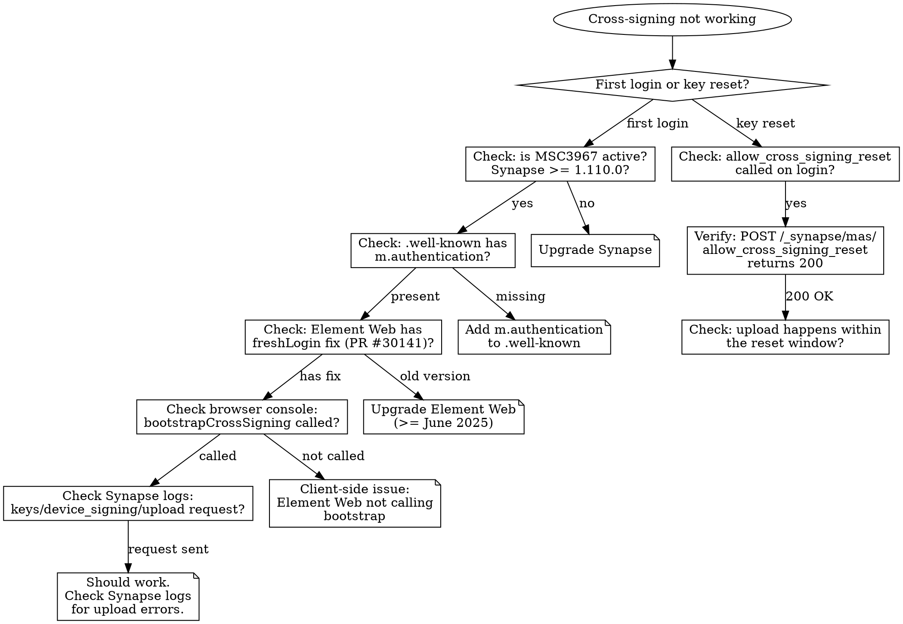

# Cross-Signing Bootstrap and Debug

Expert reference for Matrix cross-signing in the siwx-oidc + Synapse + Element Web stack.

## Key Fact: UIA is NOT the Blocker

MAS contains zero cross-signing code. First-time cross-signing key upload is
handled by Synapse via MSC3967 (stable since spec v1.11, Synapse v1.110.0).
No UIA is required for first-time upload, regardless of OIDC provider.

The old explanation ("MAS has a tightly integrated UIA bridge") is wrong.

## Architecture: Three Mechanisms

```
First-time setup (MSC3967):
  Any OIDC provider --> Element Web --> POST keys/device_signing/upload
  Synapse: is_cross_signing_setup=false? --> skip UIA --> upload succeeds

Key reset (admin API, already implemented):
  siwx-oidc --> POST /_synapse/mas/allow_cross_signing_reset
  Synapse: sets updatable_without_uia_before_ms --> next upload allowed

Key reset (spec-compliant, MSC4312 m.oauth):
  Element Web --> POST keys/device_signing/upload --> 401 m.oauth
  --> redirect to account_management_url?action=org.matrix.cross_signing_reset
  --> user confirms --> siwx-oidc calls allow_cross_signing_reset --> retry
```

| Mechanism | Scope | Spec Status | siwx-oidc Status |
|-----------|-------|-------------|------------------|
| MSC3967: No UIA for first upload | Initial setup | Stable (v1.11) | Works automatically |
| `/_synapse/mas/allow_cross_signing_reset` | Key reset | Synapse admin API | Implemented |
| MSC4312: `m.oauth` UIA stage | Key reset (spec) | Stable (v1.17) | Implemented (`/account` page) |
| MSC4191: Account management discovery | UX deep-linking | Stable (v1.18) | Implemented (OIDC discovery) |

## Diagnostic Flowchart



## Debugging Steps

### Step 1: Verify Synapse version supports MSC3967

```bash
# On the Matrix server
docker exec synapse python -c "import synapse; print(synapse.__version__)"
# Needs >= 1.110.0 for stable MSC3967
```

### Step 2: Verify .well-known includes m.authentication

```bash
curl -s https://YOUR_MATRIX_DOMAIN/.well-known/matrix/client | jq .
# Must contain:
# "m.authentication": {
#   "issuer": "https://YOUR_SIWX_OIDC_URL",
#   "account": "https://YOUR_SIWX_OIDC_URL/account"  (optional, for MSC4191)
# }
```

If missing, add it to the `.well-known` served by your reverse proxy or Synapse.

### Step 3: Verify Element Web version includes freshLogin fix

Element Web PR #30141 (merged June 17, 2025) fixed a bug where OIDC delegate
logins were treated as session restorations (`freshLogin=false`), skipping the
post-login cross-signing bootstrap entirely.

```bash
# Check Element Web version in browser console
document.querySelector('meta[name="application-name"]')?.content
# Or check the deployed container image tag
```

### Step 4: Check browser console during login

Open browser DevTools before logging in. After OIDC login completes, look for:

```
# Good signs:
"bootstrapCrossSigning" in console output
POST /_matrix/client/v3/keys/device_signing/upload (200 OK)

# Bad signs:
No bootstrapCrossSigning call at all --> Element Web client-side issue
POST keys/device_signing/upload returns 401 --> MSC3967 not active
"UIA not supported with MSC3861" error --> Synapse config issue
```

### Step 5: Check Synapse logs

```bash
docker logs synapse 2>&1 | grep -i "cross.signing\|device_signing\|upload"
# Look for:
# - "Uploading cross-signing keys" (success)
# - "has no master cross-signing key" (no keys yet, MSC3967 should allow upload)
# - UIA-related errors
```

### Step 6: Verify allow_cross_signing_reset works (for key reset)

```bash
# Test the admin API directly
curl -X POST https://SYNAPSE_URL/_synapse/mas/allow_cross_signing_reset \
  -H "Authorization: Bearer ADMIN_TOKEN" \
  -H "Content-Type: application/json" \
  -d '{"localpart": "USERNAME"}'
# Should return 200
```

### Step 7: Check Redis for cross-signing state

```bash
# List stored credentials (passkey users)
redis-cli KEYS 'webauthn:credential/*'

# Check if sessions have verified_did
redis-cli KEYS 'sessions/*'
```

## QR Code Login (Element X) Specific

QR code login (MSC4108) has an additional requirement beyond cross-signing
key existence: the approving device must have cross-signing private keys
in Secure Backup so it can transfer them to the new device via the
rendezvous channel.

**Failure mode:** Device approval succeeds, tokens are issued, but Element X
shows a login failure after ~30-60s. This means the rendezvous timed out
because Element Web had no cross-signing keys to transfer.

**Diagnostic:**
1. Check if approving user has cross-signing keys: `has_cross_signing_keys`
   in siwx-oidc logs (the pre-flight check on device approval page)
2. Check if Secure Backup is set up in Element Web: Settings > Security &
   Privacy > Secure Backup status
3. If no Secure Backup: user must set it up before QR login works

**The pre-flight warning** on the device approval page already covers this
case. It checks `has_cross_signing_keys` via Synapse's keys/query API and
warns the user if no master key exists.

## siwx-oidc Code Reference

| Function | File | Purpose |
|----------|------|---------|
| `allow_cross_signing_reset` | `src/synapse_client.rs` | Calls `/_synapse/mas/allow_cross_signing_reset` |
| `has_cross_signing_keys` | `src/synapse_client.rs` | Queries `/_matrix/client/v3/keys/query` for master key |
| `provision_synapse_device` | `src/oidc.rs` | Replacement mode: deletes old device, creates new, calls allow_cross_signing_reset |
| `provision_synapse_device_additive` | `src/oidc.rs` | Additive mode (device code): preserves devices, calls allow_cross_signing_reset |
| `check_cross_signing` | `src/device_auth.rs` | Pre-flight check on device approval page |
| `account_page` | `src/account.rs` | MSC4191 account management page (HTML) |
| `account_wallet` | `src/account.rs` | Wallet re-auth + cross-signing reset (MSC4312) |
| `account_passkey_finish` | `src/account.rs` | Passkey re-auth + cross-signing reset (MSC4312) |

## Spec References

| Spec | Title | Relevance |
|------|-------|-----------|
| MSC3967 | No UIA for first cross-signing upload | Why first-time bootstrap works without UIA |
| MSC3861 | Delegated OIDC auth | How siwx-oidc integrates with Synapse |
| MSC4312 | Cross-signing reset in OAuth world | `m.oauth` UIA stage for key reset |
| MSC4191 | Account management deep-linking | `account_management_uri` in OIDC discovery |
| MSC2965 | OIDC discovery for Matrix | `m.authentication` in .well-known |
| MSC4108 | QR code login | Rendezvous protocol for Element X |

## Common Mistakes

| Mistake | Reality |
|---------|---------|
| "UIA is the blocker" | MSC3967 removes UIA for first-time upload. UIA only matters for key RESET. |
| "MAS has special cross-signing code" | MAS contains zero cross-signing code. It's all Synapse-side. |
| "Need to implement UIA bridge" | First-time bootstrap needs no UIA at all. Reset is handled by admin API. |
| "Cross-signing keys are E2EE secrets the server can't generate" | True, but irrelevant. The CLIENT generates and uploads them. The question is whether the upload endpoint requires UIA. |
| "Element Web falls back to manual Secure Backup" | Element Web had a freshLogin bug (PR #30141). With the fix, auto-bootstrap works. |
